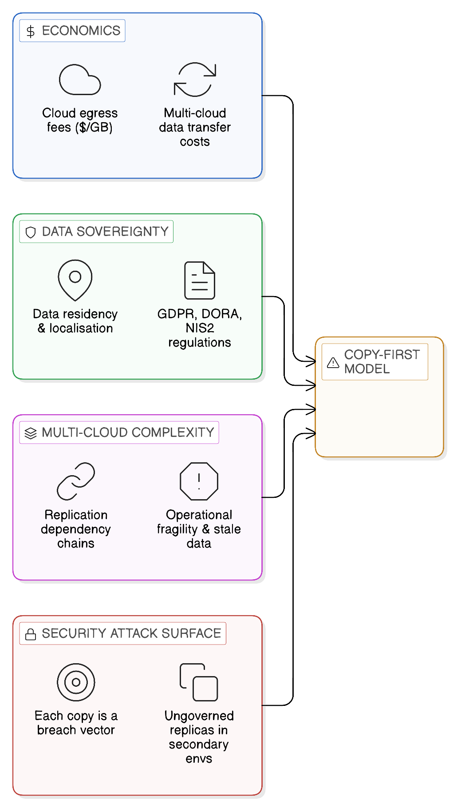
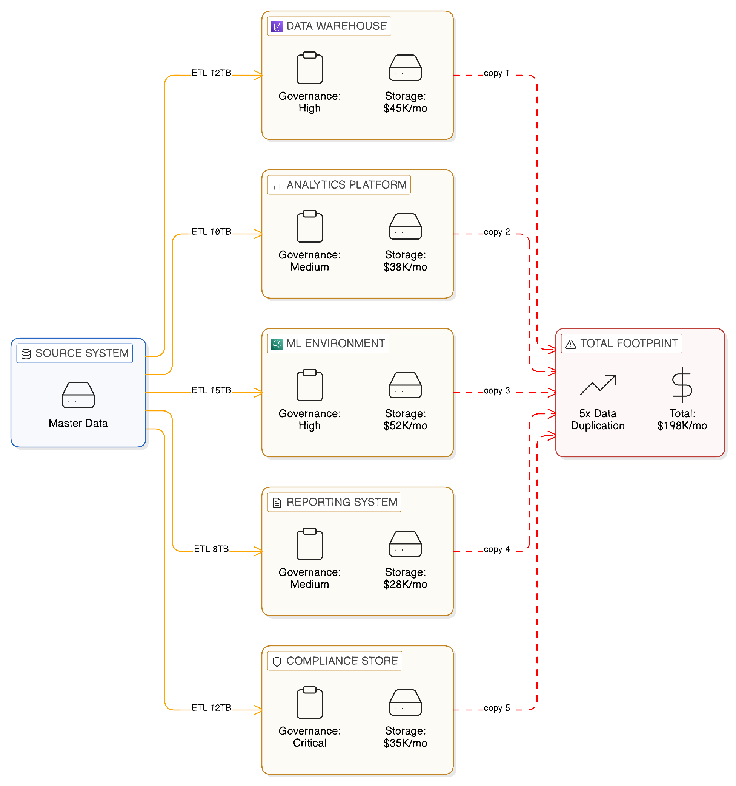
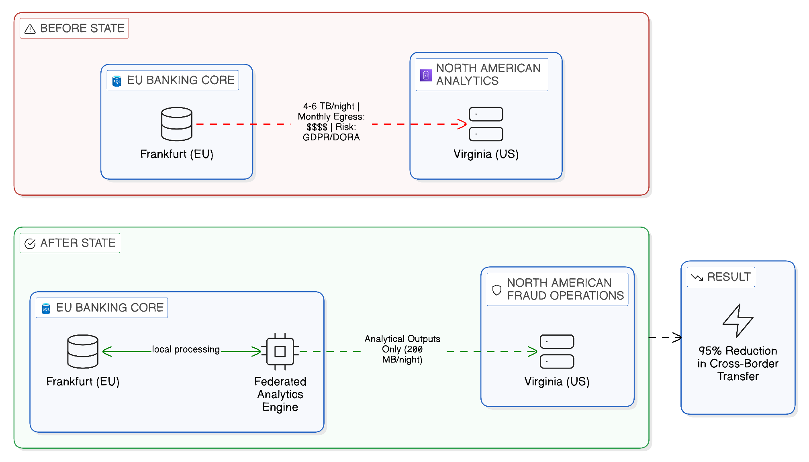
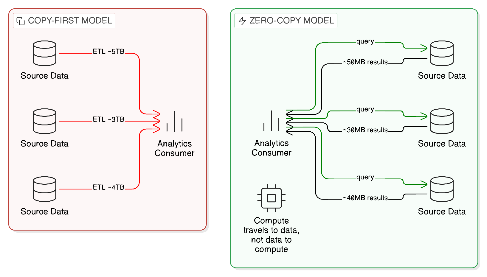
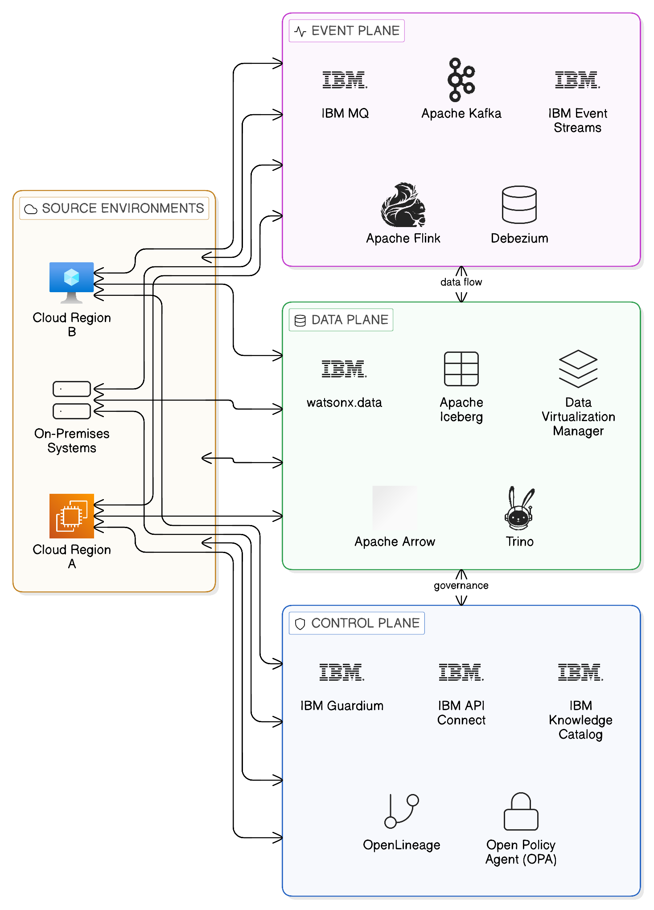

# Chapter 1 --- The Zero-Copy Necessity in a Fragmented Digital World

The transition into the mid-2020s has exposed a fundamental flaw in traditional enterprise architecture: the assumption that to make data useful, it must first be moved. For more than two decades, integration has been synonymous with replication, with organisations relying on complex ETL (Extract, Transform, Load) pipelines, API-driven copying, and nightly batch synchronisations to feed their data warehouses and analytics engines. This model worked tolerably well in an era of centralised infrastructure, where data volumes were manageable, cloud providers were few and their pricing predictable, and regulators were content to accept geographic proximity as a proxy for genuine data control. None of those conditions holds today, and the consequent failure of the copy-first model is not a marginal inefficiency to be optimised at the edges. It is a structural incompatibility between a mode of integration conceived for a different world and the multi-cloud, multi-jurisdictional, AI-driven enterprise that has emerged in its place.

The nature of this incompatibility is worth stating precisely at the outset, because it shapes every architectural recommendation in the chapters that follow. When an enterprise moves data from a source system to an analytical repository --- whether through a nightly batch job, a streaming pipeline, or an API-driven extraction --- it creates an additional copy of that data. Each copy is a liability. It must be stored, consuming infrastructure capacity and incurring cost. It must be kept current, consuming engineering effort and introducing latency between the state of the source and the state of the copy. It must be governed, consuming compliance resource and creating the conditions for inadvertent policy breach. And it must be secured, expanding the attack surface that the enterprise's security function must defend. In a world of modest data volumes, few regulatory constraints, and limited cloud geography, these liabilities were manageable. In the world of 2026, they have become the dominant cost and risk of operating a modern enterprise data estate.

Zero-Copy Integration (ZCI) is the architectural response to this condition. It is not a product, a vendor category, or a passing technical fashion; it is a discipline --- a set of principles and patterns that guide the design of enterprise integration towards an architecture in which data accessed rather than replicated, in which computation travels to the data rather than data travelling to the computation, and in which every movement of data that does occur is deliberate, governed, and proportionate to a specific business justification. This chapter establishes the case for that discipline: the economic pressures, regulatory imperatives, and operational realities that make Zero-Copy Integration not merely preferable but necessary for enterprises operating at the scale and complexity of the mid-2020s.

## 1.1 The Structural Failure of the Copy-First Model

The copy-first integration model did not arise from carelessness or poor architectural judgement. It arose from a set of practical constraints that were entirely reasonable at the time. Querying data across distributed systems was slow, unreliable, and technically complex in the 1990s and early 2000s. The dominant analytical tools of that era --- relational data warehouses, OLAP cubes, business intelligence platforms --- were designed to work with data that had been extracted, cleaned, and consolidated into a single physical repository. The economics of storage and computation favoured centralisation. And the regulatory environment, whilst not absent, was considerably less demanding in its requirements for data localisation, residency control, and cross-border transfer governance.

In this context, the ETL pipeline was not a symptom of poor architecture; it was the appropriate engineering response to a coherent set of technical and economic constraints. The problem is that those constraints have changed fundamentally, whilst the integration patterns they produced have not. Enterprises that built their analytical and integration infrastructure on copy-first foundations in the 2000s and 2010s now find themselves operating architectures that are structurally misaligned with the environment in which they must function.

The misalignment manifests across four interconnected dimensions: the economics of data movement in a multi-cloud environment; the jurisdictional complexity of data sovereignty regulation; the operational fragility of architectures that depend on synchronised replicas; and the security implications of a distributed estate of data copies. Each of these dimensions is examined in the sections that follow. Together, they constitute the case for architectural change.

*Figure 1.1: The four structural forces that make the copy-first integration model untenable in the mid-2020s enterprise.*

### 1.1.1 The Economics of Data Movement at Scale

The financial costs of the copy-first model have been present since its inception, but they were for many years sufficiently modest to be treated as a cost of doing business rather than a strategic liability. The shift to public cloud infrastructure changed this calculus materially. Cloud providers charge for data that leaves their infrastructure --- egress fees --- and those charges, which appear modest on a per-gigabyte basis, compound rapidly when applied to the volumes of data that modern enterprises move across cloud boundaries to support their analytical and integration workflows.

*Figure 1.2: Data proliferation under the copy-first model — each integration destination receives and retains its own full copy of source data, multiplying storage, governance, and security costs.*

The mechanics of egress cost accumulation are worth understanding in detail, because they are often invisible to the senior leaders who must ultimately address them. Cloud providers typically charge zero for ingress --- data entering their infrastructure --- but apply tiered charges for egress: data leaving their infrastructure, either to the public internet, to another cloud provider, or in some cases to another region within the same provider. These charges typically range from $0.05 to $0.09 per gigabyte for standard internet egress, with some reduction available at volume, and from $0.01 to $0.08 per gigabyte for inter-region transfer within the same provider. Cross-provider transfer is charged at the full egress rate by the sending provider and occasionally also by the receiving provider.

Applied to the data volumes that characterise a typical enterprise integration estate --- terabytes of transaction data replicated nightly, gigabytes of customer records synchronised continuously, log streams mirrored across environments for compliance --- these per-gigabyte charges accumulate to figures that are no longer negligible. An enterprise replicating ten terabytes of operational data nightly across cloud providers will encounter egress charges alone in the region of $36,000 to $58,000 per month, before accounting for the storage costs of maintaining the replicated datasets at the destination, the compute costs of the ETL processing, or the engineering costs of building and maintaining the pipelines that perform the replication. When those ancillary costs are included, the total cost of a significant replication workload frequently exceeds six figures monthly, and for data-intensive enterprises in financial services, healthcare, or retail, seven-figure annual integration tax is not uncommon.

The experience of GlobalBank, a composite drawn from engagements with several major multinational financial institutions, illustrates the dynamics of this cost accumulation with particular clarity. GlobalBank had hosted its core banking platform and primary transaction processing infrastructure in the European Union, where its principal regulatory obligations and its largest customer base were concentrated. Its fraud analytics capability, however, had been built in a North American cloud region, attracted by the availability of specialist machine learning infrastructure and the lower compute costs that North American cloud pricing offered at the time of the analytics platform's initial build. The integration between these two environments was implemented through a nightly replication pipeline that extracted between four and six terabytes of transaction logs from the European platform and transmitted them to the North American analytics environment.

The immediate trigger for architectural review was an egress invoice that reached six figures in a single month, driven by a period of elevated transaction volumes during a market volatility event. But the financial exposure was only one dimension of a problem that had been developing since the analytics platform was first built. The regulatory risk was equally pressing: the cross-border transfer of transaction data containing customer identifiers from EU-regulated systems to North American infrastructure had become the subject of scrutiny by the bank's prudential regulator, which was questioning whether the transfer satisfied the adequacy requirements for personal data transfers under GDPR, and whether the concentration of analytical processing in a single non-European cloud region was consistent with the operational resilience requirements then being introduced under DORA. The architecture that had been economically attractive in 2019 had become both financially costly and regulatorily exposed by 2024.

The zero-copy alternative that GlobalBank's architects developed eliminated the nightly replication pipeline entirely. Instead, fraud analytics workloads were restructured to execute in the European cloud environment, co-located with the transaction data they consumed, using a federated query architecture that enabled the analytics models to access transaction data in place without physical extraction. Only the outputs of the analytics process --- fraud scores, alert indicators, model performance metrics --- were transmitted to the North American environment for operational use by the fraud management function. The volume of outbound data was reduced from the four-to-six terabytes of the nightly replication to a few hundred megabytes of analytical outputs, a reduction of more than 95 per cent in the data crossing the cloud boundary, with a commensurate reduction in egress costs and a material improvement in the regulatory defensibility of the architecture.

*Figure 1.3: GlobalBank's architectural transformation — from a nightly 4–6 TB cross-border replication pipeline to a federated analytics model that moves only analytical outputs (≈200 MB) across the cloud boundary, achieving a 95% reduction in data egress.*

The HealthChain case offers a parallel illustration from the healthcare sector. HealthChain, a national healthcare network operating across multiple clinical environments, had attempted to implement a unified clinical research platform by synchronising Electronic Medical Records (EMR) data from its clinical systems to a research cloud environment. The rationale was sound: researchers needed access to a representative dataset spanning the full patient population, and centralisation appeared to be the most straightforward route to providing it. In practice, the architecture encountered two insurmountable problems simultaneously. The first was financial: medical imaging data, which formed a substantial component of the clinical records, is extremely large in volume, and as imaging volumes grew with the network's clinical activity, the egress costs of synchronising imaging data to the research cloud grew faster than any forecast had anticipated. The second was legal: the personal health information (PHI) contained within the clinical records was subject to residency requirements in several of the jurisdictions in which HealthChain operated that made its transfer to a research cloud environment legally impermissible without the individual consent of each affected patient --- consent that was neither practical to obtain nor proportionate to the research purposes for which it was sought. The synchronisation programme was suspended after eighteen months, with considerable sunk cost and no production capability to show for it.

The zero-copy alternative that eventually replaced the failed centralisation approach is described in more detail in the chapters addressing sector-specific patterns. In outline, it involves a federated research architecture in which analytical queries are submitted to a central query orchestration layer and executed in distributed fashion against locally-held clinical data, returning only aggregated, anonymised results rather than patient-level records. The imaging data never leaves the clinical environment; the research capability consumes only the insights the data can produce, not the data itself.

RetailCo, a global retailer operating across more than thirty countries, encountered the egress problem in a form distinctive to the retail sector: the consumption of customer behavioural data by real-time personalisation systems. The personalisation capability had been built on a copy-intensive architecture in which customer behavioural signals --- browsing activity, purchase history, preference indicators --- were continuously replicated from regional operational systems to a central personalisation engine hosted in a primary cloud region. The personalisation engine consumed these signals to generate product recommendations that were then served back to customers across all regions. An analysis of the enterprise's cloud expenditure revealed that approximately 90 per cent of its cross-cloud data transfer was attributable to this replication flow: customer behavioural data moving from regional systems to the central personalisation engine, and recommendation results moving back. During peak trading periods --- major promotional events and the holiday trading season --- this traffic drove monthly egress costs into the multi-million-pound range, while simultaneously introducing latency into the personalisation cycle that degraded the relevance of recommendations served to customers in geographically distant regions.

The architectural reform that addressed RetailCo's position was a progressive disaggregation of the centralised personalisation model into a set of regional personalisation capabilities, each operating on locally-held behavioural data, with a central coordination layer that aggregated cross-regional signals at the level of model parameters rather than customer records. This federated personalisation architecture is architecturally analogous to the federated machine learning patterns described in [Chapter 5](05_chapter_zero_copy_data_layer): the computation moves to the data, rather than the data moving to the computation.

### 1.1.2 Jurisdictional Fragmentation and the Sovereignty Imperative

The economic pressures described above would be sufficient, on their own, to motivate a significant rethinking of enterprise integration architecture. But they interact with a second set of pressures --- the evolving landscape of data sovereignty regulation --- in ways that make the urgency of architectural change considerably greater than the economics alone would suggest.

Data sovereignty regulation has been developing for more than a decade, but the character of the requirements it imposes has changed fundamentally in recent years. The General Data Protection Regulation, which came into force across the European Union in 2018, established the principle that personal data relating to EU residents carries regulatory obligations that travel with it regardless of where it is processed. This was a significant development, but its implications for integration architecture were initially understood primarily in terms of data transfer agreements --- Standard Contractual Clauses, Binding Corporate Rules, and the various adequacy decisions that authorise transfers to specific non-EU jurisdictions. The practical effect was to add a legal compliance layer to the process of transferring data across borders, but not to fundamentally challenge the architectural model of centralised integration.

The regulatory environment of 2026 is materially different. Several converging developments have transformed data sovereignty from a compliance consideration into an architectural imperative. First, the Schrems II decision and its aftermath demonstrated that adequacy decisions and contractual mechanisms are legally fragile: they can be invalidated by judicial or regulatory action, leaving enterprises that depend on them exposed to sudden compliance failures. Second, regulators across multiple jurisdictions have moved beyond the question of where data is stored to demand control over where data is processed, who operates the processing infrastructure, under whose legal jurisdiction the operators are subject, and whether access to the data can be compelled by the authorities of that jurisdiction. Third, the Digital Operational Resilience Act (DORA) and the NIS2 Directive have introduced operational resilience requirements for financial institutions and critical infrastructure operators that interact with data sovereignty requirements in complex ways, creating a regulatory intersection that organisations are still working to navigate.

The practical consequence of this regulatory evolution is that enterprises can no longer treat the architecture of their integration estate as a purely technical decision. Every replication flow that crosses a jurisdictional boundary is a potential compliance risk. Every centralised data repository that consolidates data from multiple jurisdictions requires a legal basis that may not be sustainable. And every analytical workload that processes personal data from a jurisdiction in which processing restrictions apply must be designed to comply with those restrictions, regardless of where the analytical infrastructure is located.

EuroInsure, a pan-European insurance group operating across eight EU member states, encountered these constraints in their most direct form when attempting to implement a group-level Customer 360 capability. The strategic case for Customer 360 was straightforward: a unified view of each customer's policy holdings, claims history, and interactions across all national operations would enable more sophisticated risk modelling, more personalised customer service, and more effective cross-selling of products across national boundaries. The obvious architectural implementation was a central customer data repository into which each national operation would load standardised customer records, creating the unified dataset against which Customer 360 queries could be executed.

This architecture was rejected by EuroInsure's legal function before it reached detailed design. The specific data localisation requirements of three of the eight member states in which EuroInsure operated prohibited the transfer of customer personal data --- including policy and claims information --- to repositories hosted outside the national territory, regardless of whether those repositories were within the EU. A central repository, even one hosted in a core EU jurisdiction, could not receive data from these three national operations without breaching the local residency requirements. The legal function concluded that no contractual mechanism could cure this breach: the prohibition was statutory and could not be derogated by private agreement.

The zero-copy architecture that replaced the failed centralisation approach implements Customer 360 as a federated query rather than a physical consolidation. Each national operation maintains its customer data within the national territory, registered in a common governance catalogue but not replicated to any central repository. Customer 360 queries are submitted to a federated query layer that distributes execution to the national data stores, collects the results, applies the appropriate data masking and access controls for the requesting user's profile, and assembles a unified customer view dynamically. No customer data crosses a national boundary; only the query and the aggregated, access-controlled result traverse the federation layer. EuroInsure's legal function assessed this architecture as compliant with the data localisation requirements of all eight member states.

The GovSecure composite illustrates the same dynamics in the public sector context. National security and justice agencies in several jurisdictions operate under statutory frameworks that restrict the movement of citizen data to shared platforms, even within the national public sector. The intuitive response to this constraint is to accept the consequent fragmentation of analytical capability as an unfortunate but unavoidable regulatory cost. The zero-copy response is different: it accepts the constraint on data movement as architecturally given and designs an analytical capability that respects it. Federated access mechanisms allow the analytical and intelligence functions that require cross-agency data access to exercise that access through governed interfaces without requiring the underlying data to leave the system of record in which it is held. The data residency requirement is satisfied not by negotiating an exception but by eliminating the need for an exception.

In the life sciences sector, MedGlobal's experience with global clinical trials illustrates a further dimension of the sovereignty challenge: the interaction between GDPR in the European Economic Area and the distinct but equally demanding medical data protection frameworks of APAC jurisdictions. Clinical trial data involves highly sensitive personal health information that is subject to multiple layers of regulatory protection: data protection law, medical research governance frameworks, and in some cases sector-specific legislation governing the use of patient data for research purposes. MedGlobal had initially invested in a central research data lake intended to consolidate trial data from all participating jurisdictions, enabling global analysis and regulatory reporting across the entire trial dataset. The legal analysis that preceded the lake's deployment revealed that data from APAC trial sites could not be transferred to the European hosting environment under the medical data protection frameworks of the relevant jurisdictions, and that GDPR's provisions for research processing were themselves insufficient to authorise transfer without additional safeguards that the timeline and budget of the programme could not accommodate. The central lake was abandoned in favour of a sovereign research node architecture in which each jurisdiction maintains its trial data locally, participates in federated analyses through virtual views and aggregated result sets, and satisfies its local regulatory requirements without the need for cross-border data transfer.

### 1.1.3 Multi-Cloud Complexity and Architectural Fragility

The proliferation of cloud providers, cloud regions, and edge computing environments has introduced a third dimension of pressure on the copy-first model: the operational complexity and fragility that arise when an integration architecture that was designed for a single-cloud or two-cloud environment is extended across the multi-cloud estate that most large enterprises now operate.

The typical large enterprise of 2026 uses three or more public cloud providers, maintains significant on-premises infrastructure for latency-sensitive, cost-sensitive, or security-classified workloads, and increasingly operates edge computing environments in proximity to operational assets such as manufacturing equipment, retail locations, and clinical settings. Each of these environments has its own data platform characteristics, its own network topology, its own identity and access management infrastructure, and its own latency and bandwidth profile for inter-environment communication. Designing integration pipelines that replicate data reliably and consistently across this diversity of environments requires engineering effort and operational oversight that compounds geometrically with the number of environments and the number of replication flows connecting them.

The compound complexity problem is not merely an engineering inconvenience. It creates architectural fragility that manifests as operational risk. A replication pipeline that copies customer data from a primary cloud environment to a secondary analytics environment depends on the reliability of the network connection between them, the availability of the extraction process at the source, the availability of the loading process at the destination, and the consistency of the schema between source and destination. Any failure in any of these dependencies interrupts the replication flow and introduces inconsistency between the source and the copy. In an architecture with dozens of such replication flows, each with its own dependency chain, the probability that at least one flow is producing stale or inconsistent data at any given time approaches certainty. The operational effort required to monitor the health of these flows, detect inconsistencies, diagnose failures, and remediate them is considerable and grows with the complexity of the integration estate.

### 1.1.4 Security and the Attack Surface of Distributed Data

The fourth dimension of pressure on the copy-first model is perhaps the most fundamental, and yet it is frequently the last to receive explicit architectural attention. Every copy of sensitive data that exists in an enterprise is a potential point of compromise. This is not a theoretical risk: the history of significant data breaches consistently shows that the data exposed is not typically stolen from the primary system of record, which tends to be the most well-secured element of the enterprise's data infrastructure. It is stolen from the secondary copies --- the analytical environments, the data warehouses, the ETL staging tables, the operational caches --- where the data has been replicated for convenience and where the security investment is frequently lower, the access controls less rigorous, and the monitoring less comprehensive.

An enterprise that maintains a hundred replication flows, each creating a copy of some subset of its sensitive data, has created a hundred additional attack surfaces. The security function that is responsible for protecting those surfaces must do so with the same thoroughness that it applies to the primary systems of record, but typically with a lower initial security investment in those secondary environments and a much larger surface to cover. This is structurally unfavourable: the cost of adequately securing every secondary copy grows with the number of copies, whilst the marginal value of each additional copy tends to decline as the analytical estate matures and the primary copies become more capable.

The zero-copy architecture addresses this exposure directly. Data that does not move cannot be intercepted in transit. Data that is not replicated cannot be found in an unintended location. Data that is accessed through governed interfaces rather than held in secondary copies cannot be exposed by a breach of a replica that need not have existed. The security case for Zero-Copy Integration is not incidental to its economic and sovereignty case; it is structurally integrated with it, because the same architectural discipline that eliminates unnecessary data movement also eliminates the additional attack surface that such movement creates.

## 1.2 Defining the Zero-Copy Foundation

*Figure 1.4: The zero-copy contrast — in the copy-first model, terabytes of data travel to the consumer; in the zero-copy model, lightweight queries travel to the data and only results return.*

Zero-Copy Integration is an architectural discipline built on four foundational principles. Understanding these principles precisely is important, because Zero-Copy Integration is sometimes mischaracterised --- either as a claim that data never moves under any circumstances, which is neither accurate nor achievable, or as a synonym for data virtualisation, which captures only one dimension of the broader architectural approach.

The first principle is that data should remain at its source unless there is a specific, justified reason for it to move. This is a presumption against movement, not an absolute prohibition on movement. Mature Zero-Copy architectures include carefully designed and governed caches, snapshots, and temporary replicas where specific performance or continuity requirements cannot be satisfied by federated access alone. What they do not include is the default, unjustified, ungoverned replication of data across the integration estate that characterises the copy-first model.

The second principle is that integration should be implemented through federated access rather than replication wherever federated access can satisfy the requirements of the consuming application or workload. Federated access means that the consuming application queries the data in the system where it resides, through a governed interface, and receives the results of that query, without the data being physically transferred to the consumer's environment as a persistent copy. The governed interface enforces access controls, data masking, and policy compliance at the point of access, ensuring that the consumer receives only the data it is authorised to receive, in the form in which it is authorised to receive it.

The third principle is that resilience should be achieved through distributed design rather than through replication. In the copy-first model, resilience is frequently implemented by maintaining replicas of critical data in multiple locations, so that a failure at one location does not result in loss of access to the data. In the Zero-Copy model, resilience is achieved by designing the integration architecture so that workloads can continue to operate from locally available data when remote data is unavailable, and by ensuring that the failure of any single data source does not cascade into a failure of the entire integration estate. This requires architectural discipline in the design of dependency relationships, and it requires investment in the monitoring and observability capabilities that detect failures before they cascade, but it achieves resilience without the cost and governance burden of maintaining persistent replicas.

The fourth principle is that security is enhanced by minimising data movement. This principle follows directly from the security analysis above: the fewer copies of sensitive data that exist in the enterprise, the smaller the attack surface that the security function must defend, and the simpler the governance task of ensuring that appropriate controls are applied to every location in which sensitive data resides.

### 1.2.1 The Distinction Between Zero-Copy and Zero-Movement

A common source of misunderstanding about Zero-Copy Integration is the inference that it requires the complete elimination of all data movement. This inference is incorrect, and it is important to address it explicitly at the outset, both because it is a genuine source of confusion and because addressing it clarifies what the architecture actually requires.

Zero-Copy Integration does not prohibit data movement. It requires that data movement be justified, governed, and proportionate. There are legitimate architectural reasons to move data: seeding a local cache to meet latency requirements that federated access cannot satisfy; creating a time-bounded snapshot for a specific analytical purpose that requires point-in-time consistency; replicating event records to a durable log for replay and recovery purposes; and transferring aggregated outputs from one environment to another as part of a federated analytical workflow. All of these involve the movement of data, and all of them are compatible with Zero-Copy principles, provided that the movement is intentional, the copy's lifecycle is governed, and the copy is retired when it has served its purpose.

The copy-first model is distinguished from the Zero-Copy model not by whether data moves, but by the governance posture towards data movement. In the copy-first model, movement is the default: data is replicated because it is technically convenient to do so, and governance of the resulting copies is a secondary concern, applied retrospectively and incompletely. In the Zero-Copy model, movement is the exception: data is replicated only when a specific, documented justification supports the replication, the governance of the resulting copy is defined as part of its creation, and the copy's lifecycle is actively managed. This distinction of governance posture is what makes Zero-Copy Integration a genuine architectural discipline rather than merely a technical optimisation.

### 1.2.2 The Architectural Planes of Zero-Copy Integration

Zero-Copy Integration is implemented across three architectural planes, each of which addresses a distinct dimension of the integration challenge. These planes are described in detail in [Chapter 4](04_chapter_three_integration_planes); they are introduced here to provide the architectural context within which the specific capabilities and patterns described in subsequent chapters are situated.

The Data Plane is the layer at which data assets are made accessible through federated query and virtualisation mechanisms. It is where the principle of data remaining at its source is given technical expression: through query engines that push computation to the data, through virtualisation layers that present a unified view of distributed data assets, and through open table formats that enable diverse compute engines to operate on the same data without requiring it to be reformatted or replicated. The Data Plane is the subject of [Chapter 5](05_chapter_zero_copy_data_layer), which examines it in the depth that its architectural centrality demands.

The Event Plane is the layer at which changes in the state of data assets are propagated across the enterprise without replicating the underlying datasets. It implements the principle of moving events rather than data: when a customer record changes, an event describing that change is published to the Event Plane, and all systems that need to respond to the change do so by consuming the event, not by receiving a copy of the updated record. The Event Plane is the subject of [Chapter 7](07_chapter_zero_copy_event_layer), which examines the technical architecture of event streaming, the governance mechanisms that make event-driven integration sovereign and resilient, and the specific capabilities of the IBM Event Streams and IBM MQ platforms within this layer.

The Control Plane is the layer at which governance policy is defined and enforced across both the Data and Event Planes. It is the architectural expression of the proposition that integration without governance is not Zero-Copy Integration but merely ungoverned access: technically capable of accessing data in place, but without the policy enforcement mechanisms that give the architecture its compliance defensibility. The Control Plane encompasses the data catalogue, the access policy engine, the lineage tracking capability, and the API management infrastructure through which all access to data and events is mediated, recorded, and audited.

*Figure 1.5: The three planes of Zero-Copy Integration — the Data Plane for federated access, the Event Plane for change propagation, and the Control Plane for governance — applied across on-premises, cloud, and edge environments.*

### 1.2.3 The IBM and Open-Source Ecosystem

Achieving a zero-copy enterprise requires an architecture that is ecosystem-aligned rather than proprietary. The historical failure mode of enterprise integration platforms has been vendor lock-in: the adoption of a proprietary integration stack that delivers genuine capability in the short term but constrains the enterprise's architectural freedom in the long term and creates the conditions for the next generation of technical debt. Zero-Copy Integration is designed explicitly to avoid this failure mode, by building on open-source foundations that ensure portability, interoperability, and the ability to evolve the architecture as the technology landscape develops.

IBM's contribution to the Zero-Copy ecosystem is to provide the enterprise-grade management, governance, and operational management capabilities that transform open-source technologies from research tools into production-ready enterprise platforms. The open-source technologies --- Apache Iceberg, Trino, Apache Kafka, Open Policy Agent, OpenLineage --- provide the technical foundation. IBM's platforms provide the governance integration, the operational management, the security hardening, and the support assurance that production deployments of critical enterprise infrastructure require.

The following table illustrates how IBM's strategic product portfolio aligns with the open-source foundations across each integration plane.

| **Layer** | **IBM Strategic Platform** | **Open Source / Open Technology Foundation** |
|---|---|---|
| **Data Plane** | watsonx.data, Cloud Pak for Data, Data Virtualization Manager | Trino, Apache Iceberg, Apache Arrow, Delta Lake |
| **Event Plane** | IBM Event Streams, IBM MQ | Apache Kafka, Debezium, Apache Flink, Strimzi |
| **Control Plane** | IBM Knowledge Catalog, IBM Guardium, IBM API Connect, IBM DataPower Gateway | Open Policy Agent (OPA), OpenLineage, Kyverno, Apache Atlas |
| **Compute Plane** | Red Hat OpenShift, IBM Cloud Satellite | Kubernetes, Knative, Istio, Envoy |

This alignment is not incidental. The open-source technologies in the table above have been adopted as the foundations of the Zero-Copy architecture precisely because they are open: governed by community processes that prevent proprietary capture, portable across cloud and on-premises environments, and interoperable with the broadest possible range of data platforms and integration tools. The IBM platforms that sit above them add value through governance integration, operational management, and enterprise support without compromising the openness of the foundations on which they build.

## 1.3 The Zero-Copy Enterprise: What Changes and What Does Not

Having established the case for Zero-Copy Integration and the architectural principles on which it rests, it is useful to address directly what the adoption of ZCI requires of an enterprise, and what it does not. This is important because ZCI is sometimes presented --- by advocates and by sceptics --- in terms that overstate either its transformative ambition or its disruptive cost.

Zero-Copy Integration does not require the replacement of existing systems of record. The principle that data should remain at its source is, precisely, a principle of leaving data where it is. The existing operational systems --- the mainframe transaction platforms, the ERP applications, the operational databases --- are the sources that the Zero-Copy architecture accesses in place. Their replacement is not required; their modernisation to support governed access interfaces may be, and in some cases the appropriate modernisation is the implementation of an API façade that exposes the existing system's data through a governed interface without requiring any internal change to the system itself.

Zero-Copy Integration does not require the abandonment of all existing integration infrastructure. ETL pipelines that perform legitimate data transformation --- converting data from one format to another, enriching records with reference data, applying business rules that must be enforced consistently regardless of which system is consuming the data --- have a place in a mature Zero-Copy architecture. What Zero-Copy Integration challenges is not the ETL process itself, but the use of ETL to create persistent replicas of data for the purpose of making it available to consumers who could equally well access it through federated mechanisms.

What Zero-Copy Integration does require is a fundamental shift in the default architectural posture towards data movement: from movement as the first resort to movement as the justified exception. It requires investment in the governance infrastructure --- the data catalogue, the access policy framework, the lineage tracking capability --- that makes governed, in-place access possible and auditable. And it requires an organisational operating model in which the domain teams that own data take responsibility for making it accessible through governed interfaces, rather than delegating that responsibility to an integration team that implements the access through replication.

These are genuine requirements, and they are not trivial. But they are requirements of a different kind from the requirements of a wholesale platform replacement programme. The Zero-Copy transformation is incremental: it begins with the highest-cost or highest-risk replication flows and progressively extends the governed access model across the integration estate. Each step in the transformation delivers economic, compliance, and security benefits. The transformation need not be complete before value is realised, and the realisation of value at each step provides the business case for continuing the transformation at the next.

## 1.4 Towards the Agentic Enterprise

The architectural case for Zero-Copy Integration that this chapter has developed is grounded in the conditions of 2026: the egress economics, the sovereignty regulation, the multi-cloud complexity, and the security imperatives that make the copy-first model structurally untenable. But there is a further dimension of the case that points beyond the present to the immediate future of enterprise computing, and it is important to state it here because it shapes the architectural ambitions of the chapters that follow.

The emergence of large language models and autonomous AI agents as operational enterprise capabilities introduces a new category of demand on the integration architecture. AI agents --- systems that autonomously retrieve information, reason over it, and take actions in response to it --- require access to current, authoritative, and comprehensive data about the enterprise and its environment. If the data they access has been replicated into a centralised analytical repository, it is subject to all of the limitations of the copy-first model: it may be stale, reflecting the state of the source at the time of the last replication rather than the current state; it may be incomplete, because the replication process has not captured all relevant data sources; it may be ungoverned, because the access controls applied to the analytical repository are less comprehensive than those applied to the source systems; and it may be non-compliant with the data localisation requirements that apply to the personal data it contains.

An AI agent that operates on stale, incomplete, ungoverned, or non-compliant data is not a reliable enterprise capability. It is a liability: capable of producing confident but incorrect conclusions, of exposing sensitive data to unauthorised access, and of generating decisions that cannot be audited or defended under the AI governance frameworks that regulators are now beginning to apply. The consequences of AI agent failures are not merely technical; they are reputational, regulatory, and in some cases legal.

Zero-Copy Integration provides the architectural foundation for an agentic enterprise that avoids these liabilities. When AI agents access data through the governed interfaces of the Zero-Copy architecture --- the federated query layer, the event streams, the API façades --- they access current data, governed by the same policies that apply to human consumers of the same data, with every access recorded in the lineage system. The agent's access to sensitive data is constrained by the same access controls that apply to any other consumer of that data. Its queries are subject to the same jurisdiction-aware routing that ensures regulated data is processed in compliant environments. And the lineage record of its data access provides the audit trail that AI governance frameworks require.

This is the deeper purpose of Zero-Copy Integration: not merely to reduce egress costs or satisfy regulators, though it does both, but to create the data infrastructure on which a trustworthy, governed, and sovereign AI-enabled enterprise can operate. The architectural principles and patterns described in the chapters that follow are the means by which that infrastructure is built.

## 1.5 Summary and Architectural Imperatives

This chapter has established the structural case for Zero-Copy Integration by examining the four dimensions of pressure that make the copy-first model untenable: the economics of data movement in a multi-cloud environment; the jurisdictional complexity of data sovereignty regulation; the operational fragility of architectures that depend on synchronised replicas; and the security implications of a distributed estate of unmanaged data copies. It has defined Zero-Copy Integration as an architectural discipline --- not a product or a category --- built on four principles: data remains at its source by default; integration is implemented through governed federated access rather than replication; resilience is achieved through distributed design rather than redundant copies; and security is enhanced by minimising the data movement that creates unnecessary attack surface. And it has introduced the three architectural planes --- Data, Event, and Control --- through which the Zero-Copy discipline is given technical expression.

For the technology leader translating these principles into organisational action, the chapter's analysis yields several concrete imperatives. The first is to establish visibility: before any architectural transformation can be designed, the enterprise must understand the current state of its integration estate --- the replication flows that exist, the data volumes they move, the jurisdictional boundaries they cross, and the security controls that apply to the copies they create. Without this baseline, the business case for Zero-Copy transformation cannot be constructed, and the highest-priority targets for transformation cannot be identified.

The second imperative is to challenge the default posture. In most enterprises, the creation of a new integration flow defaults to replication unless there is a specific reason to do otherwise. Reversing this default --- requiring a justification for replication and treating federated access as the baseline expectation --- is an organisational change as much as a technical one, and it must be driven from architectural leadership.

The third imperative is to invest in governance infrastructure as a prerequisite for Zero-Copy capability. Federated access without governance is not Zero-Copy Integration; it is ungoverned access to data in place, which is in many respects worse than the copy-first model it replaces. The data catalogue, the access policy framework, and the lineage tracking capability that underpin the Control Plane are not optional enhancements to a Zero-Copy architecture; they are its precondition.

The following chapter examines the economics of data gravity and egress costs in greater analytical depth, providing the quantitative framework that technology leaders need to construct the board-level business case for Zero-Copy transformation.
