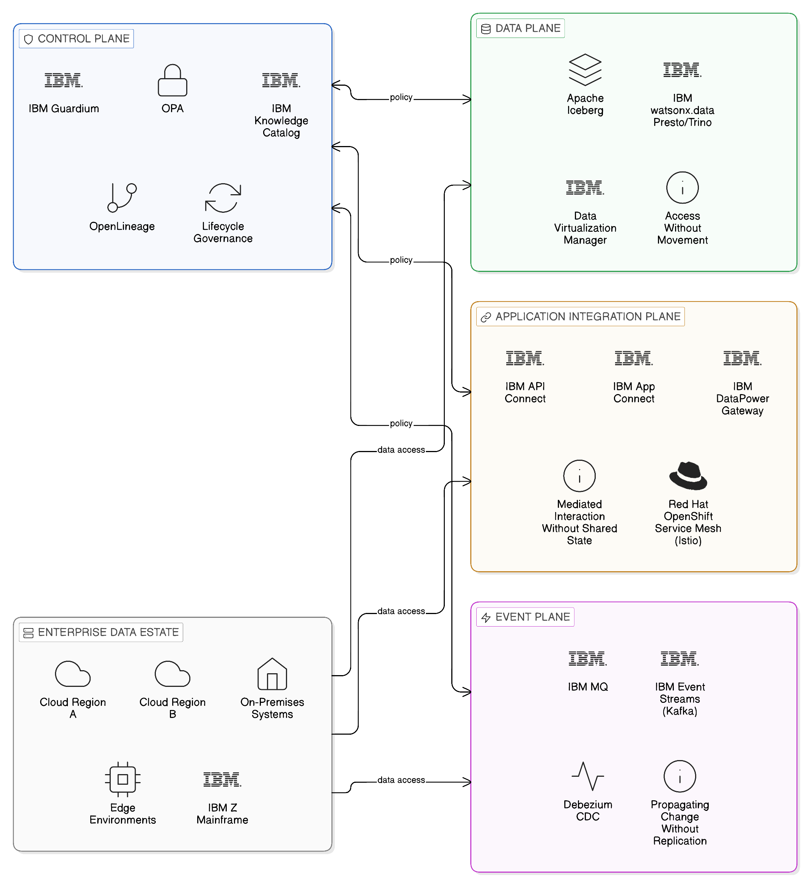
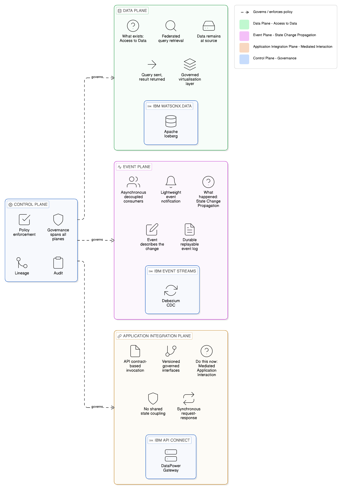
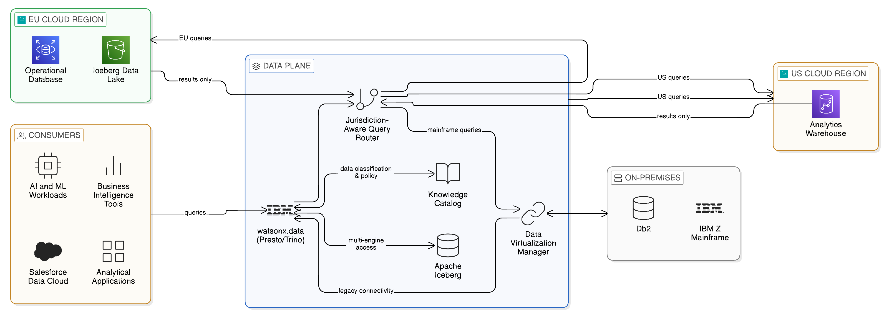
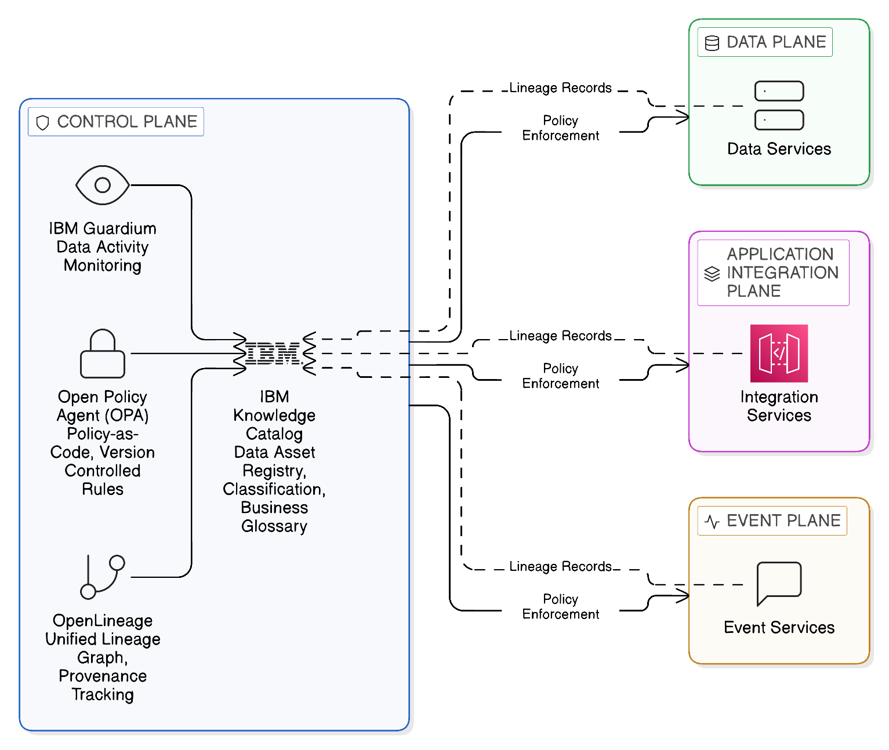
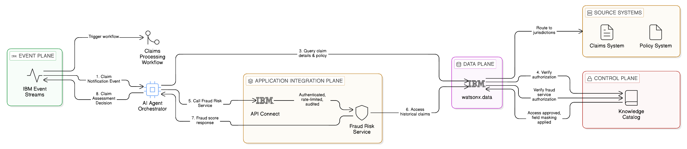

# Chapter 4 --- The Three Integration Planes of the Zero-Copy Enterprise

*Architectural Framework, Design Principles, and the Structural Logic of Governed, In-Place Integration*

*Figure 4.1: The three integration planes — Data, Application Integration, and Event — governed by the Control Plane and applied across the full enterprise data estate including on-premises, cloud, edge, and mainframe environments.*

The preceding chapters have established the case for Zero-Copy Integration from two perspectives: the economic and operational perspective of Chapter 2, which demonstrated that the copy-first model imposes an integration tax that grows with the scale and regulatory complexity of the enterprise; and the sovereignty and regulatory perspective of Chapter 3, which showed that the copy-first model is increasingly incompatible with the data governance requirements that the current regulatory environment imposes. Both arguments converge on the same conclusion: the enterprise that continues to build its integration architecture on the default assumption that data should be replicated to wherever it is needed will face compounding costs, increasing regulatory exposure, and a growing security burden that the alternative architecture — one that accesses data in place, governs that access through consistent policy, and propagates change through lightweight events rather than bulk transfers — avoids by design.

This chapter provides the architectural framework through which Zero-Copy Integration is given structural expression. It introduces and defines the three planes — the Data Plane, the Application Integration Plane, and the Event Plane — that together constitute the operational architecture of the Zero-Copy enterprise, and the Control Plane governance layer that spans all three. It explains the design logic that determines which integration requirements are addressed by which plane, the interactions between planes that make the architecture coherent as a whole, and the principles that guide the design of each plane in a manner that is consistent with the sovereignty, resilience, and economic objectives established in the preceding chapters.

The three-plane model is not a product category or a vendor framework. It is a conceptual architecture: a way of organising the thinking about enterprise integration that reflects the distinct nature of the integration problems each plane is designed to address, and that provides a principled basis for making the specific architectural decisions — about platform selection, deployment topology, governance mechanisms, and operational discipline — that a production Zero-Copy integration estate requires. The detailed treatment of each plane occupies the chapters that immediately follow; this chapter provides the framework within which those detailed treatments are situated and the architectural logic that connects them.

## 4.1 Why a Planar Architecture?

The architectural innovation of the three-plane model is not the introduction of new technologies; the technologies involved — federated query engines, API gateways, event streaming platforms, policy enforcement frameworks — are each well-established components of the modern enterprise integration landscape. The innovation is the explicit recognition that these technologies address fundamentally different categories of integration requirement, that conflating those categories produces architectural confusion and unnecessary complexity, and that separating them into distinct planes with distinct design principles, governance mechanisms, and operational disciplines produces an integration architecture that is more coherent, more governable, and more resilient than one in which all integration requirements are addressed through a single, undifferentiated layer.

The case for this separation rests on an observation about the nature of enterprise integration that is often overlooked in the technical literature but that shapes every significant architectural decision: integration problems differ not merely in their technical characteristics but in their temporal and semantic nature. Some integration problems are fundamentally about providing access to data that exists — the question of how a consumer can retrieve the current state of a dataset held in another system. Other integration problems are fundamentally about propagating change — the question of how a system that has changed its state communicates that change to the systems that depend on it. And a third category of integration problems is about mediating interaction between systems — the question of how one application requests a capability from another in a manner that is decoupled from the internal implementation of either.

These three categories are not merely different in degree; they are different in kind. They require different architectural approaches, different technology choices, different governance mechanisms, and different operational disciplines. An architecture that addresses all three through a single mechanism — whether that mechanism is batch ETL, real-time data replication, or an undifferentiated API layer — will inevitably provide a poor fit for at least one category and frequently for all three, because no single mechanism is well-suited to the distinct requirements of each. The three-plane model resolves this by providing an appropriate mechanism for each category: the Data Plane for access to existing data, the Event Plane for the propagation of change, and the Application Integration Plane for the mediation of inter-application interaction.

The Control Plane spans all three, providing the governance, policy enforcement, observability, and lifecycle management capabilities that make each operational plane governable in the context of the enterprise's sovereignty requirements, regulatory obligations, and security posture. It is not a fourth integration mechanism but the governance fabric that binds the other three into a coherent, auditable, and policy-compliant whole.

*Figure 4.2: The three fundamentally different categories of integration problem — access to existing data, state change propagation, and mediated application interaction — each requiring a distinct architectural approach, addressed by the Data, Event, and Application Integration Planes respectively.*

## 4.2 The Data Plane: Access Without Movement

The Data Plane is the architectural layer that addresses the category of integration requirement concerned with providing access to data that exists — the retrieval of current or historical data from the systems in which it is authoritatively held. In the copy-first model, this requirement is addressed by replication: the data is extracted from its source, transformed if necessary, and loaded into a repository from which consumers can retrieve it. The Data Plane of a Zero-Copy architecture addresses the same requirement through an entirely different mechanism: the data remains at its source, and consumers access it through governed interfaces that bring the query to the data rather than the data to the query.

### 4.2.1 The Architectural Principles of the Data Plane

The Data Plane is organised around three architectural principles that together define its contribution to the Zero-Copy enterprise. The first is data locality: data assets reside in the systems in which they originate and are governed, and are not replicated to secondary repositories for the purpose of making them accessible to consuming systems. The principle of data locality is not a prohibition on all replication — as Chapter 2 established, controlled and governed replication for specific operational purposes has a legitimate role in a mature Zero-Copy architecture — but it establishes a strong default against replication and a requirement that any departure from that default be explicitly justified against the governance and operational criteria of the enterprise.

The second principle is compute mobility: when data cannot or should not be moved to a consuming system, the computation that the consuming system needs to perform on that data is moved to the data instead. This inversion of the conventional data-movement model is the technical heart of the Data Plane. Rather than extracting data from a source system and loading it into an analytical environment where computation occurs, the Data Plane deploys computational workloads in proximity to the data they process — either by executing queries through a federation engine that pushes computation to the data source, or by deploying containerised application runtimes in the environment where the data resides, using the same portable runtime infrastructure that enables consistent application deployment across cloud and on-premises environments.

The third principle is governed virtualisation: the abstraction layer through which consuming systems access data in place must enforce the governance policies — access controls, data classification, field-level masking, jurisdictional routing, lineage recording — that the enterprise's sovereignty requirements and regulatory obligations demand. A Data Plane that provides uncontrolled access to data in place is not a Zero-Copy architecture in any meaningful sense; it is merely a different technical mechanism for creating the same ungoverned data exposure that the copy-first model produces. The governance controls of the Data Plane are not an optional enhancement; they are a structural requirement without which the architectural benefits of data locality cannot be realised in a compliance context.

### 4.2.2 Technologies of the Data Plane

The technological foundation of the Data Plane is the federated query engine: software that accepts queries expressed against a unified, virtual representation of the enterprise's data estate and translates them into sub-queries that execute against the specific underlying systems in which the relevant data resides. The federation engine handles the distribution of query execution across heterogeneous source systems — which may include relational databases, object storage platforms, mainframe data stores, NoSQL systems, and cloud-native data warehouses — and the combination of their results into a unified response that the consuming system receives as if it had queried a single, coherent data store.

Trino — formerly known as PrestoSQL, itself a development of the original Presto engine — is the open-source federated query engine that has emerged as the de facto standard for enterprise-scale query federation. Trino's architecture — a distributed MPP (massively parallel processing) query engine with a pluggable connector framework that supports a wide range of data source types — provides the technical foundation for Data Plane implementations across multiple platforms. Its open-source governance, managed by the Trino Software Foundation, ensures that the core engine is not subject to proprietary capture and that its evolution reflects the needs of the broad community of enterprises and platform providers that depend on it.

IBM watsonx.data, IBM's enterprise lakehouse platform, builds on Trino as its primary query federation engine, adding the enterprise-grade capabilities that production deployments of critical data infrastructure require: integrated governance through connection to IBM Knowledge Catalog, role-based access control at the level of individual tables and columns, workload management for the prioritisation of competing query workloads, and the operational tooling for monitoring and managing the performance and availability of federated query workloads across distributed source systems. The watsonx.data architecture is explicitly designed for the sovereign, multi-jurisdictional deployment topology that the Zero-Copy enterprise requires: regional Presto clusters can be deployed within specific jurisdictions on Red Hat OpenShift infrastructure, coordinated through a central metadata catalogue that maintains awareness of the location and classification of data assets without holding copies of the data itself.

Apache Iceberg, the open-source table format that has become the standard for open lakehouse implementations, plays a specific and important role in the Data Plane's ability to support multi-engine access without replication. Iceberg's design — metadata-driven, engine-agnostic, supporting time-travel queries and atomic schema evolution — enables multiple query engines to read from and write to the same data files without requiring those files to be duplicated into engine-specific formats. A dataset stored in Iceberg format can be accessed by watsonx.data's Presto engine, by Apache Spark running a machine learning workload, by Trino, and by external engines such as those of Salesforce Data Cloud or Snowflake, all reading the same underlying data files through a shared metadata layer. The governance implication is significant: one governed dataset satisfying many consumers, rather than one ungoverned copy for each consumer. IBM Data Virtualization Manager extends the reach of the Data Plane further, providing virtualisation access to data sources — including legacy mainframe datasets, packaged ERP applications, and operational databases — that do not natively support the open table formats and modern query protocols through which Trino-based federation operates.

*Figure 4.3: The Data Plane technical architecture — IBM watsonx.data's Presto/Trino federation engine routing queries to source systems across jurisdictions, with Apache Iceberg enabling multi-engine access and IBM Knowledge Catalog enforcing governance, so computation travels to data rather than data to consumers.*

### 4.2.3 The Data Plane in the Sovereignty Context

The Data Plane's contribution to the sovereignty architecture described in Chapter 3 is direct and structural. When data is accessed in place rather than replicated, the legal question of whether a data transfer has occurred — and therefore whether the transfer restrictions of GDPR, the data localisation requirements of national law, or the cross-border transfer provisions of DORA's third-party dependency framework apply — is answered differently. A federated query that executes at the source and returns an aggregated result does not, in general, constitute a transfer of the underlying personal data in the sense that data protection law addresses, provided that the result returned does not itself constitute personal data. This architectural property — the ability to derive insight from data without transferring the data itself — is the most fundamental technical expression of the sovereignty objective that the Zero-Copy approach pursues.

The jurisdiction-aware query routing capability that IBM watsonx.data provides, in combination with the data classification metadata maintained by IBM Knowledge Catalog, gives the Data Plane the ability to enforce jurisdictional constraints at query execution time: queries targeting datasets classified as subject to specific residency requirements are routed to regional query clusters operating within the required jurisdiction, ensuring that the computation occurs where the data is permitted to reside. This enforcement is automatic and policy-driven, not dependent on the consuming system's awareness of the jurisdictional constraints that apply to the data it is accessing.

## 4.3 The Application Integration Plane: Mediated Interaction Without Shared State

The Application Integration Plane addresses the second category of integration requirement: the mediation of direct interaction between applications. Where the Data Plane is concerned with access to data that exists, the Application Integration Plane is concerned with the request of capabilities — the invocation of one system's functions by another, the exchange of transactional messages between systems, and the orchestration of business processes that span multiple systems and services.

### 4.3.1 The Architectural Principles of the Application Integration Plane

The Application Integration Plane is organised around the principle of contract-based, decoupled interaction. Applications interact through published, versioned interfaces — API contracts — that define what capability is available, what inputs it accepts, what outputs it produces, and under what conditions it can be invoked. The application that provides the capability is responsible for fulfilling the contract; the application that consumes it is responsible for honouring the contract's interface specifications. Neither party has visibility of or dependency on the other's internal implementation.

This principle of contract-based decoupling is important for Zero-Copy Integration for a reason that goes beyond its familiar benefits of flexibility and maintainability. Shared-state integration — the pattern in which two applications maintain consistency by reading from and writing to a shared database — is the most direct and pervasive cause of data replication in the enterprise integration estate. When two applications must stay in sync, the temptation is to give them both access to the same data store, or to replicate data from one store to the other. Contract-based integration through the Application Integration Plane eliminates this temptation by providing a governed interface through which each application can access the data it needs from the system in which it authoritatively resides, without requiring a shared copy.

The second principle of the Application Integration Plane is lifecycle governance: every API interface exposed through the plane is registered, versioned, and governed as a managed asset of the enterprise's integration estate. The registration of APIs in the integration catalogue provides the visibility that the governance function requires to assess the enterprise's API exposure, to identify APIs that are accessing sensitive or regulated data, and to ensure that the access controls applied to those APIs are consistent with the data classification of the underlying data they expose. Lifecycle governance — the management of API versions, the deprecation of obsolete interfaces, and the migration of consumers from deprecated interfaces to their successors — is the mechanism through which the Application Integration Plane avoids the accumulation of the technical debt that unmanaged API proliferation produces.

The third principle is policy enforcement at the integration boundary. The API gateway that mediates access through the Application Integration Plane is the natural point at which the governance policies of the Control Plane are applied to application-to-application interactions: authentication and authorisation of consuming applications, rate limiting and throttling to protect producing systems from overload, content inspection and data masking to ensure that sensitive data is not inadvertently exposed to consuming applications that are not authorised to receive it, and logging and audit trail generation that feeds the lineage tracking infrastructure of the Control Plane.

### 4.3.2 Technologies of the Application Integration Plane

The Application Integration Plane encompasses two distinct technology categories that address different aspects of its integration function: API management platforms, which provide the lifecycle governance and runtime enforcement infrastructure for API-based integration; and integration runtime platforms, which provide the connectivity and transformation capabilities through which applications that do not natively speak modern API protocols can participate in the governed integration estate.

IBM API Connect provides the management and governance layer of the Application Integration Plane: the developer portal through which APIs are published and discovered, the API lifecycle management capability through which versions are managed and consumers notified of changes, the analytics through which API usage patterns and performance characteristics are monitored, and the policy management interface through which the Control Plane's governance policies are applied to API interactions. API Connect's deployment model — available as a fully managed service on IBM Cloud, as a self-managed deployment on Red Hat OpenShift, or as a component of IBM Cloud Pak for Integration — provides the deployment flexibility that the sovereign, multi-cloud enterprise requires: the API management infrastructure can be deployed in the jurisdiction where the APIs it governs are operating, without requiring API traffic or governance metadata to traverse cloud boundaries.

IBM DataPower Gateway provides the runtime policy enforcement infrastructure: the high-performance, purpose-built API gateway that enforces security policies, applies data masking and content filtering, manages authentication and authorisation, and records the audit trail of every API interaction. DataPower's security architecture — with FIPS 140-2 validated cryptography, hardware security module integration, and decades of deployment in the most demanding regulated environments in financial services, government, and healthcare — makes it the appropriate policy enforcement point for APIs that expose sensitive or regulated data. The combination of API Connect for lifecycle governance and DataPower Gateway for runtime enforcement provides the complete API management architecture that the Application Integration Plane requires.

IBM App Connect provides the integration runtime through which the Application Integration Plane reaches beyond modern API-capable systems to the legacy applications, packaged software platforms, and proprietary protocols that constitute a substantial proportion of the integration landscape in any large enterprise. App Connect's library of pre-built connectors — for SAP and Oracle ERP platforms, for IBM Z mainframe systems, for Salesforce and other major SaaS platforms, for messaging systems and file transfer protocols — provides the connectivity foundation through which legacy systems can participate in the governed API estate without requiring their internal implementation to be modified. This capability is architecturally significant for the Zero-Copy objective: it makes it possible to expose legacy systems' data through governed API interfaces — the API façade pattern described in Chapter 2 — without extracting that data into a modern data platform, preserving data locality whilst modernising the access mechanism.

The Red Hat OpenShift Service Mesh, built on the open-source Istio project, provides the service-to-service communication layer for application workloads deployed on OpenShift. The service mesh extends the governance capabilities of the Application Integration Plane into the internal communication of distributed applications: mutual TLS authentication between every pair of services, authorisation policies that restrict which services can communicate with which other services, distributed tracing that records the lineage of every inter-service interaction, and circuit breakers and retry logic that provide resilience to failures of individual services without cascading those failures across the application estate. These capabilities are particularly relevant to the Zero-Copy objective in the context of microservice architectures, where the proliferation of fine-grained services creates integration complexity that, without the discipline of a service mesh, frequently results in the informal replication of data between service instances as a shortcut to avoiding the latency of service-to-service calls.

### 4.3.3 The Application Integration Plane and API-First Design

The Application Integration Plane's architectural principle of contract-based interaction is the technical expression of a broader design discipline known as API-first: the requirement that every capability exposed by one system to another should be designed as an explicit, managed API contract before any implementation is written, and that the implementation should conform to the contract rather than the contract being derived from the implementation. This discipline is important for Zero-Copy Integration because it creates a cultural and procedural checkpoint at which the question of whether data sharing is necessary — and if so, in what form — is asked before the integration is built, rather than after the pattern of data replication has become embedded in the implementation.

An API-first discipline, applied consistently across the enterprise, progressively transforms the integration estate from one in which data replication is the default to one in which governed, contract-based access is the default. As each new integration requirement is addressed through an API contract rather than a replication pipeline, the overall density of governed integration — the proportion of the integration estate that is visible to, and controllable by, the governance function — increases. The legacy of undocumented, ungoverned replication flows does not disappear overnight; but each new integration built under API-first discipline reduces the incremental accumulation of that legacy, and the governed API catalogue becomes progressively more complete as a representation of the enterprise's integration estate.

## 4.4 The Event Plane: Propagating Change Without Replication

The Event Plane addresses the third category of integration requirement: the propagation of state changes across systems that need to respond to the occurrence of events in other parts of the enterprise. This is qualitatively different from the integration requirements addressed by the Data Plane and the Application Integration Plane. The Data Plane is concerned with answering the question "what is the current state of this data?"; the Application Integration Plane is concerned with mediating the interaction "do this for me, now"; the Event Plane is concerned with communicating the fact "something has happened, and you may need to respond."

This distinction in the nature of the integration requirement has profound implications for the appropriate architecture. The request-response pattern of the Application Integration Plane is synchronous: a consumer makes a request and waits for a response. This is appropriate when the consumer needs an answer before it can proceed, but it creates tight coupling between the consumer's availability and the producing system's availability — if the producer is unavailable, the consumer cannot proceed. The event pattern of the Event Plane is asynchronous: the producing system publishes an event describing what has happened, and consuming systems receive and respond to that event in their own time, without the producer waiting for a response. This asynchronous decoupling is architecturally significant for resilience: a system that responds to events can continue processing the events it has already received even when the producing system becomes temporarily unavailable, rather than failing synchronously at the point of each request.

### 4.4.1 The Architectural Principles of the Event Plane

The Event Plane is organised around three architectural principles that express the Zero-Copy philosophy in the context of state-change propagation. The first is event as notification, not replication: an event should describe what happened — the minimum information that consuming systems need to determine whether they need to respond, and what their initial response should be — without carrying with it a copy of the data from which the event originated. This principle directly limits the data movement that event-driven integration creates: a well-designed event contains a reference to the changed entity and the key attributes of the change, not the full current state of the entity. If a consuming system needs the full current state of the entity in order to process the event — for example, to update a local view that it maintains for its own operational purposes — it requests that state through the Data Plane's governed access mechanisms, not through the event payload itself.

The second principle is durable, replayable event log: events should be published to a persistent, ordered log that retains events for a configured retention period, enabling consuming systems to replay the event history from any point in that history. This principle provides a resilience capability that the Zero-Copy architecture relies upon in place of data replication: rather than maintaining a replica of a source system's data that can be used to reconstruct state after a failure, the consuming system can reconstruct its state by replaying the relevant portion of the event log. The event log serves as the authoritative record of what has happened, and the consuming system's current state is a function of the events it has processed from that log.

The third principle is jurisdictionally governed event routing: events that contain or reference regulated data must be routed and, where applicable, filtered or enriched in a manner that respects the jurisdictional constraints on the data they reference. An event that contains personal data — for example, a customer account update event that includes the customer's address — must be treated with the same jurisdictional awareness as a query against the customer data itself. The event routing infrastructure of the Event Plane must be capable of applying content-aware filtering — preventing events containing specific data categories from being routed to consuming systems in jurisdictions where those categories cannot lawfully be processed — and of sanitising event payloads to remove regulated data elements before cross-boundary routing, where the event's operational purpose can be served by the sanitised payload.

### 4.4.2 Technologies of the Event Plane

Apache Kafka has established itself as the dominant open-source event streaming platform for enterprise-scale event-driven architectures. Its architecture — a distributed, partitioned, replicated commit log with a consumer group model that enables multiple consuming applications to process the same event stream independently and at their own pace — provides the technical foundation for the Event Plane's durable, replayable event log. Kafka's design characteristics — high throughput, configurable retention, ordered delivery within partitions, and horizontal scalability — make it appropriate for the full range of event volumes that enterprise integration requires, from the high-velocity event streams of payment processing systems and IoT telemetry to the lower-volume but compliance-critical event streams of regulatory reporting systems.

IBM Event Streams is IBM's managed, enterprise distribution of Apache Kafka, deployed on Red Hat OpenShift and integrated with IBM Cloud Pak for Integration's unified governance and operational management capabilities. Event Streams provides the production-grade operational management — including configuration management, capacity planning, backup and recovery, and integration with IBM's enterprise support infrastructure — that mission-critical enterprise deployments of Kafka require. Its deployment on OpenShift provides the same geographic flexibility as the rest of the IBM platform: an Event Streams cluster can be deployed within a specific jurisdiction, with its event logs and operational metadata held within that jurisdiction's boundaries, satisfying the data residency requirements that apply to the events it processes.

IBM MQ, IBM's enterprise message broker, addresses the category of event and message delivery that requires guaranteed, transactional, exactly-once delivery semantics that Kafka's at-least-once delivery model does not natively provide. For integration patterns in which the loss or duplication of a single message would have material consequences — financial transaction notifications, regulated operational commands, clinical system alerts — IBM MQ's persistent messaging architecture, with its support for XA distributed transactions and its decades of operational heritage in the most demanding financial services and telecommunications environments, provides the delivery guarantees that Kafka alone cannot. The two platforms are complementary in the Event Plane architecture: Event Streams for high-volume, high-throughput event streaming where at-least-once delivery is acceptable; IBM MQ for lower-volume, high-value message exchange where exactly-once guaranteed delivery is required.

Debezium, the open-source Change Data Capture framework, provides the mechanism through which state changes in existing operational databases are captured and published to the Event Plane without requiring modification to the source applications. Debezium operates by reading the transaction logs of source databases — the internal record-keeping mechanism that databases use to implement their own transactional semantics — and publishing each committed transaction as an event to the configured Kafka topic. This log-based CDC approach is significantly less intrusive than trigger-based or polling-based change detection alternatives: it does not add load to the source database beyond the replication connection required to read its transaction log, and it captures changes with a completeness and ordering guarantee that polling-based approaches cannot match. For the legacy systems that form a substantial part of the enterprise integration estate, Debezium provides the path from the batch replication patterns of the copy-first architecture to the real-time event streaming of the Zero-Copy Event Plane, without requiring any modification to the source applications or databases.

### 4.4.3 Event-Driven Integration and the Zero-Copy Objective

The Event Plane's contribution to the Zero-Copy objective is twofold. The first contribution is the replacement of bulk replication with lightweight event notification as the primary mechanism for propagating state changes across the enterprise. As Chapter 2 established, the nightly batch replication of entire datasets between operational systems and analytical repositories is one of the primary drivers of the integration tax; the Event Plane eliminates the need for this replication by providing a mechanism through which consuming systems can receive immediate notification of the specific changes that are relevant to them, without receiving a copy of the entire dataset from which those changes originate.

The second contribution is the durable event log as a resilience mechanism that does not depend on data replication. A consuming system that has lost its state — through a failure, a disaster recovery invocation, or a planned migration — can reconstruct that state by replaying the relevant portion of the event log, rather than requesting a full data synchronisation from the producing system. This resilience capability is particularly valuable in a sovereign, multi-cloud architecture where the producing and consuming systems may be in different jurisdictions: the event log held within the consuming system's jurisdiction provides the replay capability without requiring a cross-boundary data transfer from the producing system's jurisdiction.

## 4.5 The Control Plane: Governance Across All Three Planes

The Control Plane is the governance layer that spans all three operational planes, providing the policy definition, policy enforcement, observability, and lifecycle management capabilities that make the Data Plane, the Application Integration Plane, and the Event Plane governable in the context of the enterprise's sovereignty requirements, regulatory obligations, and security posture. It is not an independent integration mechanism — it does not move data, mediate application interaction, or propagate events — but it is the architectural element without which the other three planes cannot function as a coherent, compliant, and auditable integration estate.

### 4.5.1 Policy Definition and Enforcement

The Control Plane's primary function is the definition and consistent enforcement of the governance policies that determine how data can be accessed, who can access it, under what conditions cross-boundary flows are permitted, and how the evidence of compliance with those policies is recorded. These policies must be defined once and applied consistently across all three operational planes: the same data classification that restricts direct database access to authorised users must also restrict API access to the same data, and must govern the content of events that reference the same data. Inconsistency in policy enforcement across planes creates the conditions for compliance failures in which data that is appropriately controlled in one context is inadvertently exposed through another.

Open Policy Agent, the Cloud Native Computing Foundation's policy framework, provides the technical mechanism through which policies are expressed as code — declarative policy rules that can be version-controlled, tested, and deployed as part of the enterprise's normal software delivery processes — and evaluated consistently across the enforcement points of all three operational planes. OPA's design as a general-purpose policy engine, applicable to any evaluation context, makes it appropriate as the common policy fabric of the Control Plane: the same OPA policy repository that enforces data access controls at the Data Plane's federation layer can also enforce authorisation policies at the Application Integration Plane's API gateway and content classification policies at the Event Plane's topic routing layer.

IBM Knowledge Catalog provides the data intelligence layer that makes OPA's policy enforcement meaningful: the catalogue of data assets and their classifications, the business glossary that defines the semantic meaning of data elements, the data quality assessments that inform policy decisions about which data sources are trustworthy for which purposes, and the lineage records that document the provenance of every data access, transformation, and event. Without the Knowledge Catalog's data intelligence, OPA's policy enforcement operates on identifiers — table names, API endpoint paths, event topic names — without understanding the sensitivity, classification, or regulatory status of the data those identifiers refer to. The integration of Knowledge Catalog with the OPA policy engine — the connection that ensures policy enforcement is informed by data classification — is the architectural detail that transforms technically capable access control into genuine, classification-aware data governance.

*Figure 4.4: The Control Plane governance fabric — OPA policy-as-code, IBM Knowledge Catalog classification, OpenLineage provenance tracking, and IBM Guardium activity monitoring working together to enforce consistent governance across all three operational planes.*

### 4.5.2 Lineage, Observability, and the Audit Trail

The Control Plane's second function is the maintenance of the comprehensive audit trail that the enterprise's governance and compliance requirements demand. Every significant data access through the Data Plane, every API call through the Application Integration Plane, and every event published through the Event Plane generates a record of what occurred, when, by whom, against what data, and with what result. This record — the data lineage of the enterprise's integration estate — is the evidence base on which regulatory compliance can be demonstrated, security incidents can be investigated, and the operational health of the integration estate can be monitored.

OpenLineage, the open standard for data lineage metadata, provides the interoperability layer through which lineage records generated by different tools — Trino's query execution records, API Connect's API access logs, Event Streams' topic publishing records — can be collected into a unified lineage graph that represents the provenance of data across the full integration estate. IBM Knowledge Catalog's integration with OpenLineage makes the lineage metadata that the catalogue collects compatible with the lineage records of the broader open-source ecosystem, enabling a complete, unified view of data provenance that spans the IBM platform components and the open-source tools that complement them.

IBM Guardium, IBM's enterprise data security and monitoring platform, extends the Control Plane's observability beyond the structured API and event interactions that the integration catalogue records to include the unmediated data access that occurs through direct database connections, administrative tools, and analytical workbench interfaces. Guardium's activity monitoring capability — which inspects database traffic in real time to identify access patterns that may indicate unauthorised access, policy violations, or data exfiltration attempts — provides the Control Plane with visibility into the data access that occurs outside the governed interfaces of the three operational planes, closing the observability gap that would otherwise allow ungoverned access to undermine the governance posture that the governed interfaces enforce.

### 4.5.3 The Control Plane and Sovereign Core

The relationship between the Control Plane and IBM's Sovereign Core framework, described in detail in Chapter 3, is one of mutual reinforcement. The Control Plane defines the governance policies and maintains the audit records that demonstrate sovereignty compliance; Sovereign Core provides the operational environment in which those policies are enforced and those records are maintained with the technical sovereignty guarantees that the most demanding regulatory requirements demand. A Control Plane deployed within a Sovereign Core environment — with its customer-operated operational authority, its in-boundary key management, and its localised telemetry — provides governance evidence that is not merely accurate but genuinely sovereign: produced and maintained within the jurisdictional boundary, under the enterprise's own operational authority, without dependency on the infrastructure provider's cooperation for its integrity or availability.

## 4.6 Interactions Between Planes: The Coherence of the Architecture

The three operational planes and the Control Plane that governs them are not independent components that happen to coexist in the same enterprise architecture; they are interdependent elements whose interactions constitute the coherence of the Zero-Copy integration estate. Understanding those interactions is important for the architect who must design the integration of a specific enterprise requirement across the planes, and for the technology leader who must understand why the architecture requires all four elements, not merely the individual components that each provides.

The most architecturally significant interaction is between the Event Plane and the Data Plane, and it expresses most clearly the Zero-Copy philosophy's treatment of events and data as distinct but complementary. When an event is published to the Event Plane — a customer record update, an order placement, a fraud alert — consuming systems receive notification of the event and use the event's content to determine whether they need access to the full current state of the entity the event describes. If they do, they access that state through the Data Plane's governed federation mechanism, not through the event payload. The event is a signal; the Data Plane is the channel through which the data referenced by that signal is accessed. This separation ensures that event payloads are kept to the minimum necessary for routing and initial response decisions, limiting the data movement that the Event Plane creates, and that all access to the full data is mediated through the Data Plane's access controls and audit trail.

The interaction between the Application Integration Plane and the Data Plane reflects the same principle. When an application service, responding to an API request from a consuming application, needs to retrieve data from the enterprise's data estate, it accesses that data through the Data Plane's federation mechanism rather than through a private database connection. This ensures that the access is subject to the same governance controls — data classification, field-level masking, jurisdictional routing, lineage recording — that apply to direct queries against the federation layer, and that the API response does not inadvertently expose data that the consuming application is not authorised to receive.

The Control Plane's interaction with all three operational planes ensures that the governance record of every integration activity is complete. A consumer that accesses data through the Data Plane, invokes an API through the Application Integration Plane, and responds to an event through the Event Plane has generated three distinct lineage records — one in each plane's governance log. The Control Plane aggregates these records into a unified lineage graph that represents the complete data flow of the consumer's activity, providing the end-to-end traceability that compliance functions require.

## 4.7 An Illustrative Interaction: Agentic AI Across the Three Planes

The practical significance of the three-plane architecture can be illustrated through the example of an AI agent performing a complex customer service function — a scenario that captures the interactions between planes in a context that is both realistic and increasingly common in regulated enterprises deploying AI at scale.

Consider an insurance customer service agent that has received a claim notification and must assess the claim, verify the customer's policy coverage, check the claims history for fraud indicators, and initiate the appropriate workflow response. This scenario involves each of the three planes in a sequence that demonstrates their complementary roles.

The claim notification arrives as an event on the Event Plane — a structured event containing the claim identifier, the customer identifier, the claim category, and the notification timestamp, but not the full content of the claim or the customer's full policy record. The event consumer — the AI agent's orchestration layer — receives the event and determines that it needs the full claim details and the customer's policy coverage information to assess the claim.

The agent invokes the Data Plane to retrieve the claim details and the customer's policy record. The Data Plane's federation engine routes the claim query to the claims management system in the jurisdiction where the claim was filed, and the policy query to the policy administration system in the jurisdiction where the customer's policy was issued. The Control Plane's policy engine verifies that the AI agent's authorisation profile permits access to both datasets, applies the field-level masking that prevents the agent from accessing personal data fields beyond those required for the claim assessment function, and records the access in the lineage system. The agent receives the data it needs, from the systems where it resides, subject to the governance controls appropriate to the sensitivity of that data.

The agent makes its initial assessment and determines that the claim requires a fraud risk check. It invokes the fraud risk assessment service through the Application Integration Plane — an API call that requests a fraud risk score for the specific claim, submitting the claim attributes as the request payload. The API gateway of the Application Integration Plane authenticates the agent, enforces rate limits that protect the fraud risk service from overload, records the API call in the audit log, and routes the request to the fraud risk service. The fraud risk service, in turn, accesses the customer's historical claims data and fraud indicator datasets through the Data Plane, under its own authorisation profile and with its own lineage records, and returns a risk score to the agent.

The agent's final action — initiating the claims processing workflow — is published as an event to the Event Plane: a structured event describing the assessment outcome and the workflow to be initiated, addressed to the claims processing system. The claims processing system receives the event, retrieves the full claim record through the Data Plane, and initiates the appropriate processing steps.

*Figure 4.5: An AI insurance claims agent orchestrating across all three planes — receiving a lightweight claim notification via the Event Plane, retrieving governed data via the Data Plane, invoking a fraud risk service via the Application Integration Plane — with the Control Plane recording a complete audit trail throughout.*

Throughout this sequence, no data has been replicated. The claim record remained in the claims management system; the policy record remained in the policy administration system; the fraud indicator data remained in its authoritative store. The AI agent accessed each dataset through the governed interfaces of the Data Plane, invoked the fraud risk service through the governed interfaces of the Application Integration Plane, and communicated its decisions through the Event Plane. The Control Plane recorded every data access, every API invocation, and every event publication in a unified lineage record that the compliance function can use to reconstruct, with complete fidelity, what the agent accessed, what it was told, and what it decided. This is the Zero-Copy enterprise operating at the level of capability and governance that the AI era demands.

## 4.8 Summary and Architectural Imperatives

This chapter has established the three-plane architectural framework through which Zero-Copy Integration is given structural expression, and the Control Plane governance layer that makes the architecture coherent and compliant. The Data Plane addresses integration requirements concerned with access to existing data, through federated query and governed virtualisation mechanisms that bring computation to the data rather than the data to the computation. The Application Integration Plane addresses integration requirements concerned with mediated interaction between applications, through API management, runtime policy enforcement, and integration connectivity that enable governed, contract-based access without shared-state coupling. The Event Plane addresses integration requirements concerned with the propagation of state changes, through durable, replayable event streaming that communicates what has happened without replicating the data from which events originate. The Control Plane spans all three, providing the policy definition, enforcement, lineage tracking, and observability that make the architecture governable, auditable, and defensible under regulatory scrutiny.

For the technology leader responsible for the enterprise's integration architecture, the three-plane model provides a framework for structured decision-making: each new integration requirement can be assessed against the model to determine which plane is the appropriate vehicle for addressing it, what governance controls must be applied, and what interactions with the other planes are implied. The framework does not eliminate the need for architectural judgement; it provides the conceptual vocabulary through which that judgement can be exercised with coherence and consistency.

The chapters that follow examine each plane in the depth that its architectural significance warrants. Chapter 5 examines the Data Plane: the technologies, design patterns, and governance mechanisms that implement federated, governed, in-place data access at enterprise scale. Chapter 6 examines the Application Integration Plane: API-first architecture, service mesh patterns, and the integration connectivity that makes the governed API estate comprehensive. Chapter 7 examines the Event Plane: event sourcing, event streaming, Change Data Capture, and the sovereign event topology patterns that replace bulk replication as the primary mechanism of state-change propagation. The Control Plane's governance capabilities are a thread woven through all three chapters, and are examined as a coherent whole in Chapter 9's treatment of the Integration Fabric.