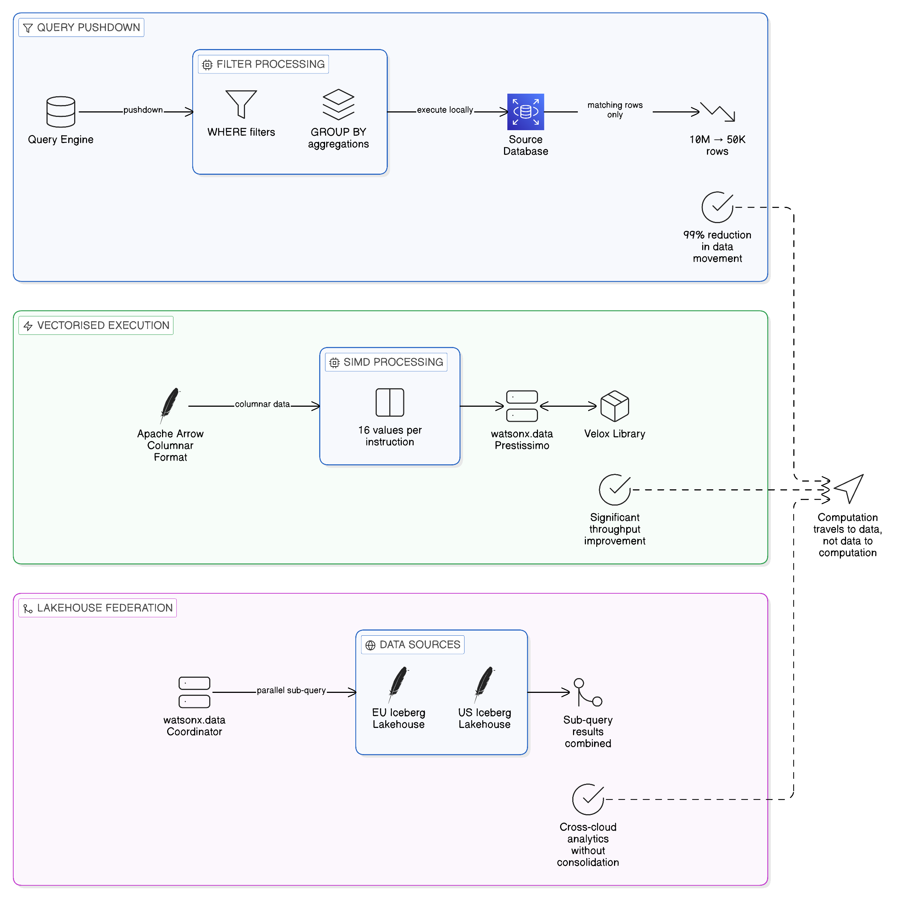
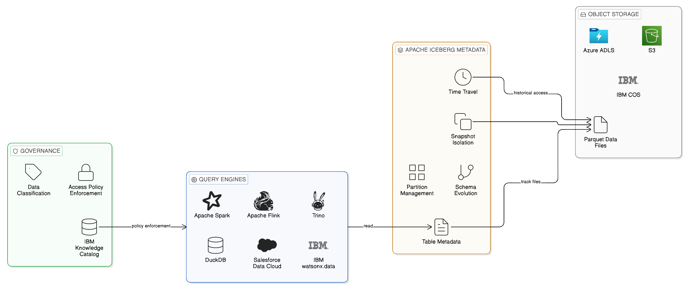
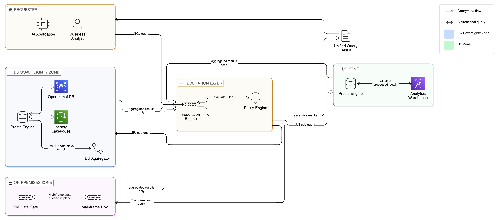
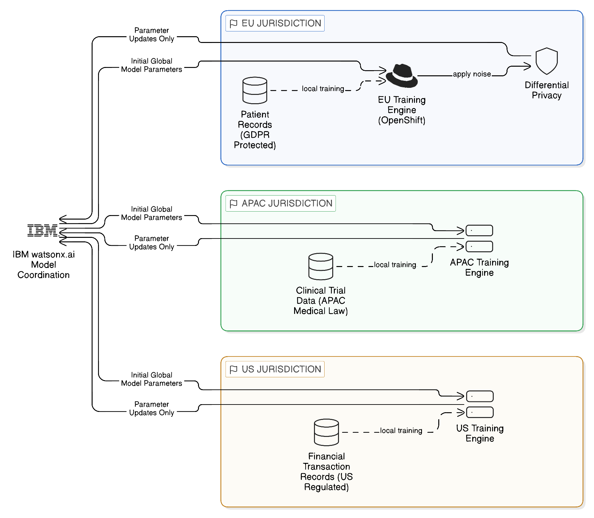
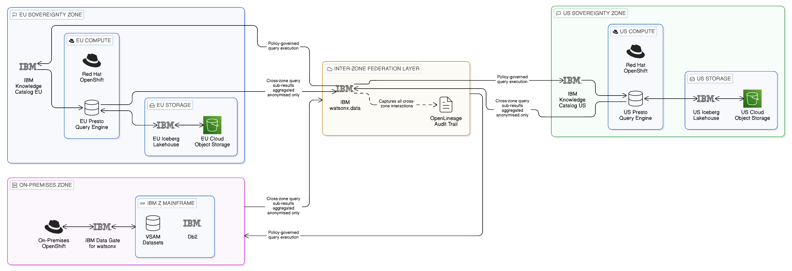

# Chapter 5 --- The Zero-Copy Data Layer

*In-Place Analytics, Federated Access, and the Architecture of Data Without Movement*

The preceding chapter established the three integration planes that together constitute the structural framework of a Zero-Copy Integration architecture. The Application Integration Plane mediates governed interaction between services through versioned API contracts and policy-enforced gateways; the Event Plane propagates state changes across the enterprise through durable, lightweight event streams rather than bulk data transfers; and the Data Plane — the subject of this chapter — provides access to data where it resides, through mechanisms of virtualisation and federation that eliminate the need for physical movement. It is to the Data Plane that this chapter turns in detail, examining not merely the technologies that implement it but the deeper architectural distinctions, design patterns, and operational considerations that determine whether a Zero-Copy data architecture delivers the outcomes that senior technology leaders require.

The Data Plane is, in many respects, the centrepiece of the Zero-Copy philosophy. It is where the most consequential architectural choices are made, where the tension between performance and sovereignty is most acutely felt, and where the gap between the ambition of the approach and the constraints of the real world must be navigated with the greatest care. Understanding the Data Plane in depth is therefore essential not only for the architects who will design it, but for the technology leaders who must make the strategic investments, organisational changes, and governance commitments that a genuine Zero-Copy data architecture demands.

This chapter is structured in eight sections. It opens by establishing the conceptual distinctions between data virtualisation, data federation, and the logical data warehouse that provide the vocabulary for everything that follows. It then examines the in-place compute patterns — pushdown, vectorisation, and lakehouse federation — that make federated data access performant at enterprise scale. The open-source foundations of the Data Plane are surveyed in depth: Trino, Apache Arrow, Apache Iceberg, and Delta Lake. IBM's enterprise contributions are then examined — watsonx.data, Data Virtualization Manager, and Cloud Pak for Data — with particular attention to the governance integration and sovereign deployment capabilities that distinguish enterprise platform from assembled open-source stack. Three architectural patterns are examined in detail: jurisdiction-aware queries, federated machine learning, and sovereign lakehouse design. The specific challenge of the mainframe data estate — one of the most significant and frequently underestimated dimensions of the Data Plane for large enterprises — is examined separately. The chapter then addresses resilience without replication, before closing with the data fabric synthesis and the architectural imperatives that the analysis yields.

## 5.1 Distinguishing Data Virtualisation, Data Federation, and the Logical Data Warehouse

A considerable portion of the confusion that surrounds the Zero-Copy Data Plane arises from the imprecision with which certain terms are used, sometimes interchangeably, in both vendor literature and practitioner discourse. Data virtualisation, data federation, and the logical data warehouse are related concepts, and all three play a role in a mature Zero-Copy architecture, but they are not synonymous. Distinguishing them clearly is a prerequisite for coherent architectural thinking.

Data virtualisation, in its most precise sense, refers to the creation of a virtual representation of data that abstracts the consumer from the physical characteristics of the underlying data store. A data virtualisation layer presents a defined schema — a set of virtual tables, views, or data objects — through which data can be queried and retrieved without the consumer having any knowledge of where the data physically resides, in what format it is stored, or how it is distributed across underlying systems. The virtualisation layer handles the translation of queries expressed against the virtual schema into sub-queries appropriate for each underlying source, executes those sub-queries, combines the results, and presents a unified response to the consumer. From the perspective of the consuming application or analyst, the experience is equivalent to querying a single, coherent data store.

The value of this abstraction is considerable. It decouples consumers from the specifics of underlying source systems, making it possible to evolve, replace, or augment those systems without requiring changes to the applications that consume data through the virtualisation layer. It also provides a natural enforcement point for data governance: policies governing who can access which data can be enforced consistently at the virtualisation layer, irrespective of the diversity of underlying sources. In a Zero-Copy context, data virtualisation is the mechanism through which the principle of keeping data in place is given practical effect — the consumer retrieves what it needs through the virtual layer without triggering physical data movement at the infrastructure level.

Data federation, whilst closely related to data virtualisation, carries a slightly different emphasis. Where data virtualisation focuses on the abstraction of the consumer from the physical characteristics of data, data federation focuses on the mechanics of executing queries across multiple physically distributed data sources and combining the results. A data federation capability must address the technical challenges of distributing query execution, handling the heterogeneity of source systems with different query interfaces and data models, optimising the routing of sub-queries to minimise data movement and maximise performance, and managing the complexity of joining or aggregating results from multiple sources. Practically speaking, most enterprise implementations of data virtualisation necessarily incorporate federation capabilities, and the terms are often used interchangeably. For the purposes of architectural precision, however, it is useful to understand virtualisation as the 'what' — a unified, abstracted view of data — and federation as the 'how' — the technical mechanism through which that unified view is constructed from distributed sources.

The logical data warehouse is a more encompassing architectural construct that builds upon both virtualisation and federation. The term was introduced to describe an approach to enterprise data architecture in which the data warehouse is conceived not as a physical repository into which all data is consolidated, but as a logical layer that provides a unified analytical view of the enterprise's data estate regardless of where that data physically resides. The logical data warehouse encompasses not merely the query federation capabilities of a virtualisation layer, but the broader ensemble of governance, cataloguing, semantic definition, and operational management that gives the enterprise's analytical capability its coherence. In a Zero-Copy architecture, the logical data warehouse represents the aspiration: a comprehensive, governed, unified view of enterprise data that does not require the physical consolidation of that data into a single repository.

These distinctions matter because they shape the architectural decisions that must be made in implementing a Zero-Copy Data Plane. An organisation that implements data virtualisation without the semantic richness and governance framework of a logical data warehouse risks creating a technically capable but ungoverned integration layer that proliferates access without enforcing accountability. Conversely, an organisation that invests in the governance and semantic infrastructure of a logical data warehouse without the performance optimisations and breadth of source coverage offered by modern federation engines may find that its Zero-Copy architecture is theoretically sound but practically constrained. The architecture that this chapter describes seeks to combine the technical sophistication of modern data federation with the governance rigour and semantic coherence of the logical data warehouse, implemented through a combination of open-source technologies and enterprise platforms that together provide the foundation for a resilient, sovereign Data Plane.

## 5.2 In-Place Compute Patterns: Pushdown, Vectorisation, and Lakehouse Federation

The practical performance of a Zero-Copy Data Plane depends critically on the manner in which computation is organised relative to data. The naive implementation of data federation — in which a central query engine retrieves raw data from each source system and performs all filtering, aggregation, and transformation in a central location — suffers from precisely the data movement problem that the Zero-Copy approach is intended to eliminate. If a query against a remote database requires transmitting millions of rows to a central processing node before filtering is applied, the architecture has created data movement as a side effect of query execution, even if it has avoided creating persistent data copies. The result is high network utilisation, significant latency, and the potential for egress costs that replicate the economic problems of conventional ETL pipelines in a more dynamic form.

The solution to this problem is query pushdown: the capability to transmit, to the underlying data source, not merely a request for data, but the computational logic that should be applied to that data before results are returned. In a well-implemented pushdown architecture, the query engine analyses the full query plan, identifies the predicates, filters, and aggregations that can be executed efficiently at the source, and transmits those operations to the source system for execution. Only the filtered, reduced, or aggregated results traverse the network to the central query engine, which performs any further operations — typically joins, final aggregations, or result ordering — that require access to data from multiple sources simultaneously. The effect is a dramatic reduction in data movement: rather than transmitting raw datasets across network boundaries, the architecture transmits query logic inward and results outward.

The degree to which pushdown can be exploited depends on the capabilities of the underlying source systems. A modern relational database with a rich SQL dialect and efficient predicate evaluation can typically support deep pushdown, executing complex filter and aggregation operations server-side before returning results. An object store accessed through a REST interface may support only basic predicate filtering, requiring more data to be transmitted to the query engine than would be necessary with a richer source capability. A legacy mainframe accessed through a traditional file interface may support no pushdown at all, requiring the federation engine to retrieve raw data and apply all computation centrally. A mature data federation architecture must therefore account for this heterogeneity, implementing pushdown as aggressively as the capabilities of each source system permit, whilst managing the data movement implications of sources where pushdown is limited.

Vectorised query execution represents a complementary performance optimisation that operates within the query engine rather than at the boundary with source systems. Conventional query processing operates on one row at a time, applying operations sequentially across the dataset. Vectorised execution, by contrast, operates on batches of values simultaneously, exploiting the Single Instruction, Multiple Data (SIMD) capabilities of modern processor architectures to apply the same operation to multiple data values in a single instruction cycle. The performance improvements from vectorised execution can be substantial, particularly for analytical workloads that apply the same operations to large datasets. The Apache Arrow columnar in-memory format, discussed further in Section 5.3, is designed specifically to support efficient vectorised processing, making it a natural complement to the federation architectures described in this chapter.

Lakehouse federation extends the in-place compute model to encompass the modern open lakehouse architecture, which has emerged as the dominant paradigm for large-scale analytical data storage in the mid-2020s. The lakehouse concept combines the low-cost, scalable storage of a data lake — typically implemented on cloud object storage such as Amazon S3, Azure Data Lake Storage, or IBM Cloud Object Storage — with the transactional capabilities, schema enforcement, and query performance characteristics of a traditional data warehouse. This combination is achieved through the use of open table formats, which impose structured metadata and transactional semantics on what is otherwise unstructured object storage, allowing multiple query engines to read and write the same data reliably and consistently.

*Figure 5.2: The three in-place compute patterns — query pushdown, vectorised execution with Apache Arrow, and lakehouse federation — each embodying the same principle: computation travels to the data, not data to the computation.*

In a Zero-Copy context, lakehouse federation provides the capability to execute analytical queries across data held in multiple lakehouse deployments, potentially spanning multiple cloud providers or on-premises environments, without physically consolidating those datasets. A query that requires data from a lakehouse deployed in a European cloud region and data from a lakehouse deployed in an on-premises environment can be executed through a federation layer that coordinates the sub-queries, ensures that the data from each source is processed within its respective environment, and combines only the results. The open table formats that underpin the lakehouse architecture — Apache Iceberg in particular — play a central role in making this federation practical: because both lakehouses speak the same table format language, the federation engine can reason about the structure of each source in a consistent manner, optimising query execution and pushdown without requiring bespoke adapters for each source.

## 5.3 The Open-Source Foundation: Trino, Apache Arrow, Apache Iceberg, and Delta Lake

The open-source ecosystem has, in the space of a decade, produced a set of technologies that together constitute a remarkably capable foundation for Zero-Copy data architecture. Understanding these technologies, their individual roles, and the manner in which they interact is essential for any architect seeking to design a Data Plane that is both technically credible and organisationally sustainable. The commitment to open standards and open-source implementations that characterises this ecosystem is not merely a commercial consideration, though the avoidance of proprietary lock-in is a genuine and important benefit. It reflects a broader recognition that the heterogeneity of enterprise data environments is permanent and structural, and that only an open, interoperable approach to data access can address it without creating new forms of dependency.

### 5.3.1 Trino and the Federated Query Engine

Trino, originally developed at Meta as the Presto project and subsequently evolved under its own governance foundation, is a distributed SQL query engine designed from the outset for the federated execution of analytical queries across heterogeneous data sources. Its architecture centres on a coordinator node that receives query requests, parses and optimises the query plan, and distributes query fragments to a cluster of worker nodes that execute sub-queries against the relevant data sources and return results for aggregation. This distributed architecture allows Trino to execute queries that span multiple sources simultaneously, with the degree of parallelism scaling with the size of the worker cluster.

Trino's connector architecture is the mechanism through which its federated capabilities are realised. Each connector provides the interface between Trino's query execution framework and a specific data source type. The catalogue of available connectors spans the breadth of enterprise data infrastructure: relational databases including PostgreSQL, MySQL, and IBM Db2; cloud data warehouses; object stores accessed through the Hive Metastore or the Iceberg table format; the Delta Lake format; Apache Kafka for streaming data; and a growing range of other sources. New connectors can be developed and integrated, allowing Trino to be extended to address source systems for which no connector yet exists. This extensibility is a significant practical advantage in enterprise environments where the data landscape includes legacy systems, proprietary platforms, and niche applications that standard tooling may not natively support.

The query optimisation capabilities of Trino are directly relevant to the pushdown patterns described in the preceding section. Trino's cost-based optimiser analyses the query plan and makes decisions about the routing of computation, the ordering of joins, and the use of pushdown to minimise data movement, based on statistics about the underlying data. Connector-specific pushdown implementations allow Trino to delegate predicate filtering, aggregation, and in some cases join execution to the underlying source, reducing the volume of data transmitted across network boundaries. The sophistication of this optimisation varies by connector and source capability, but the architectural intent is clear: computation should occur as close to the data as possible.

In the context of a sovereign, multi-cloud enterprise, Trino's ability to operate as a federated query engine across geographically distributed sources makes it a natural fit for the Zero-Copy Data Plane. A Trino deployment within a sovereign boundary can execute queries against data sources located within that boundary without transmitting raw data outside it. When queries require data from multiple jurisdictions, the architecture can be designed such that jurisdiction-specific Trino deployments handle the local computation, with only aggregated or anonymised results crossing the boundary. This pattern of jurisdictional pushdown, discussed further in Section 5.5, is one of the most powerful capabilities of a mature Zero-Copy Data Plane.

### 5.3.2 Apache Arrow: The Columnar Data Exchange Standard

Apache Arrow is a cross-language development platform for in-memory data processing that has achieved remarkable adoption across the analytical data ecosystem since its introduction in 2016. At its core, Arrow defines a language-independent columnar memory format for flat and hierarchical data, organised to enable efficient analytical processing on modern CPUs and GPUs. Data represented in Arrow format can be processed without serialisation and deserialisation overhead, shared between processes and language runtimes without copying, and manipulated using vectorised operations that exploit modern processor architectures.

The significance of Arrow for Zero-Copy data architecture extends beyond its in-memory processing capabilities. Arrow Flight, the RPC framework built on top of the Arrow format, provides a high-performance protocol for the exchange of Arrow-formatted data between systems over network connections. Where conventional data access protocols — JDBC, ODBC, and similar interfaces — involve serialising data into a format suitable for transmission and deserialising it at the receiving end, Arrow Flight transmits data in the columnar Arrow format directly, eliminating the overhead of serialisation and allowing the receiving system to process the data in its native form without further transformation. The performance improvement relative to conventional protocols can be substantial, particularly for large analytical workloads.

In a federated data architecture, Arrow Flight provides a compelling mechanism for the transmission of query results between federation components. A Trino deployment that retrieves results from a remote data source can transmit those results to a central coordination component using Arrow Flight, avoiding the serialisation overhead of conventional result transmission. AI and machine learning frameworks that consume data for model training — TensorFlow, PyTorch, and similar platforms — can receive data from a Zero-Copy data layer via Arrow Flight, consuming it in columnar form without the conversion overhead associated with conventional data loading pipelines. The integration of Arrow as a common data exchange format across the components of the Zero-Copy Data Plane represents a significant opportunity to reduce both latency and the ancillary data movement associated with format conversion.

### 5.3.3 Apache Iceberg: The Open Table Format for the Sovereign Lakehouse

*Figure 5.1: The sovereign lakehouse architecture — Apache Iceberg's metadata layer separates governance from storage, enabling any standards-compliant query engine (Trino, Spark, Flink, Salesforce Data Cloud) to read the same data files without replication, governed by IBM Knowledge Catalog.*

Apache Iceberg has, in a relatively short period, established itself as the de facto open table format for large-scale analytical data stored in cloud object storage. Its design addresses the fundamental limitations of the original Hive table format, which was developed at a time when object storage was significantly less capable than it has since become, and which consequently imposed architectural constraints that proved increasingly burdensome as data volumes and query complexity grew.

Iceberg's architecture separates the metadata management of a table — the tracking of which files constitute the current state of the table, the maintenance of partition information, and the recording of table schema evolution — from the underlying data files themselves. This separation enables several capabilities that are critical for enterprise data architectures. Snapshot isolation allows multiple queries to execute against a consistent point-in-time view of a table without blocking concurrent writes, providing the transactional integrity required for analytical workloads that must produce reproducible results. Schema evolution allows the structure of a table to change over time without requiring data migration or the rewriting of existing data files. Time travel enables queries to be executed against historical snapshots of a table, supporting the audit and lineage requirements of regulated industries.

For a Zero-Copy Data Plane, Iceberg's most significant property is its engine independence. Unlike proprietary table formats that are tied to a specific query engine, an Iceberg table can be read and written by any engine that implements the Iceberg specification. Trino, Apache Spark, Apache Flink, DuckDB, and a growing range of other engines can all interact with the same Iceberg table, each using the metadata management capabilities of the Iceberg specification to ensure that their respective operations are coordinated and consistent. This engine independence makes Iceberg the lingua franca of the modern open lakehouse: a common language in which data can be expressed that is understood by the full breadth of the analytical ecosystem.

In a sovereign, multi-cloud context, Iceberg's engine independence has a further strategic implication. Because an Iceberg table is not tied to any single cloud provider's proprietary format or storage service, data stored in Iceberg format can be queried by engines deployed on any cloud or on-premises platform that supports the format. This portability reduces the risk of being unable to access data because the cloud provider that hosts it has become commercially unviable, technically incompatible, or jurisdictionally unavailable. The data remains accessible through any standards-compliant engine, preserving the enterprise's operational flexibility and reinforcing its sovereignty over its data assets.

### 5.3.4 Delta Lake: A Complementary Open Format

Delta Lake, developed originally by Databricks and subsequently open-sourced through the Delta Lake project under the Linux Foundation, addresses broadly similar objectives to Apache Iceberg: providing transactional integrity, schema enforcement, and scalable metadata management for data stored in cloud object storage. The two formats have historically been associated with different vendor ecosystems — Iceberg with the broader Apache ecosystem and IBM's platforms, Delta with the Databricks and Apache Spark ecosystem — though the technical differences between the mature implementations of both formats have narrowed significantly.

The coexistence of Iceberg and Delta Lake in the enterprise landscape reflects the reality that data architecture decisions are not made in a vacuum: they are constrained by existing technology choices, vendor relationships, and the organisational investments that have already been made. Many enterprises will find themselves with significant volumes of data in Delta format, particularly where Databricks has been adopted for data engineering or machine learning workloads. A Zero-Copy Data Plane must therefore be capable of federating queries across both formats, treating each as a first-class source rather than requiring migration to a single canonical format.

The Apache XTable project, formerly known as OneTable, provides a mechanism for maintaining synchronised metadata representations of the same underlying data files in both Iceberg and Delta Lake formats, allowing query engines that natively support one format to access data that was written in the other. This capability reduces the pressure to standardise on a single table format, allowing enterprises to preserve existing investments whilst providing a consistent access layer across the full breadth of the data estate. In a pragmatic Zero-Copy architecture, the goal is not format purity but governed, federated access: the specific format in which any given dataset is stored is a secondary concern, provided that the access layer can reach it.

## 5.4 IBM's Approach to the Zero-Copy Data Layer

The open-source technologies described in the preceding section provide a powerful and flexible foundation for the Zero-Copy Data Plane. However, the translation of these technologies from open-source capabilities into enterprise-grade, production-ready implementations that meet the operational, governance, and support requirements of large organisations is a non-trivial undertaking. It is in this translation that IBM's contributions to the Zero-Copy Data Layer are most significant: not in displacing the open-source foundations, which are embraced rather than competed with, but in providing the enterprise hardening, governance integration, and operational management capabilities that transform those foundations into a deployable architecture.

The distinction between an open-source stack and an enterprise platform is worth stating precisely, because it is sometimes reduced to a question of support contracts and service level agreements — real considerations, but not the most architecturally significant ones. The more fundamental distinction is governance integration. An enterprise assembling the Data Plane from open-source components must separately address the questions of how the data accessed through those components is classified, who is authorised to access it, what jurisdictional constraints govern where it can be processed, and how the evidence of compliance with those constraints is recorded and maintained. These questions are not answered by Trino, Apache Iceberg, or Arrow; they require a separate governance infrastructure that must be designed, built, and integrated with each component of the data access layer. IBM's enterprise platforms provide this governance integration as a structural feature of the platform rather than as an afterthought, which is the architectural difference that matters most for the regulated enterprises at which this book is directed.

### 5.4.1 IBM watsonx.data: The Open Lakehouse Platform

IBM watsonx.data is IBM's open lakehouse platform, designed to provide a single, governed access point for analytical workloads across a heterogeneous data estate. Built on the Presto/Trino engine for query federation, Apache Iceberg as the open table format, and the broader Apache ecosystem, watsonx.data is architecturally aligned with the open-source foundations described in the preceding section rather than departing from them. Its value proposition relative to a self-assembled open-source stack lies in the enterprise-grade operational capabilities, governance integration, and breadth of source connectors that IBM has layered on top of these open-source foundations.

The federated query capabilities of watsonx.data allow organisations to execute analytical workloads across a range of data sources — IBM Db2, Netezza, Teradata, cloud object stores in multiple formats, and mainframe data exposed through IBM Data Gate for watsonx — without requiring the physical consolidation of that data into a central repository. The inclusion of IBM Data Gate for watsonx is particularly noteworthy in the context of large enterprises; its role as the bridge to the IBM Z mainframe data estate is examined in Section 5.6, but its significance at this point is structural: it extends the watsonx.data federation layer to encompass the data that, for many of the world's largest enterprises, is the most critical and the most constrained in terms of mobility. The mainframe can be queried in place through the same federation layer that serves cloud-hosted and on-premises analytical data, creating a genuinely unified view of the enterprise without compromising the integrity of the systems of record.

The Prestissimo engine, an extension of the Presto/Trino architecture that incorporates vectorised execution using the Velox library developed by Meta, provides performance improvements for certain classes of analytical workload that can be significant in scale. Vectorised execution, as discussed in Section 5.2, exploits the columnar processing capabilities of modern hardware to execute the same operation across multiple data values simultaneously, reducing the time required to process large datasets. For organisations running large analytical workloads through the watsonx.data federation layer, this performance capability can be the difference between a federation architecture that is practically viable for production use and one that remains confined to less time-sensitive workloads.

The governance integration between watsonx.data and IBM Knowledge Catalog is a structural feature of the platform that deserves particular attention. Data assets accessed through watsonx.data can be registered in Knowledge Catalog with their business definitions, data quality assessments, usage policies, and lineage records. When a user or application requests access to a federated data asset, the Knowledge Catalog policy engine evaluates the request against the applicable policies, considering the identity of the requestor, the classification of the data, and the jurisdiction in which the request originates, before permitting or denying access. This policy enforcement occurs at the point of access rather than being applied retrospectively, ensuring that the absence of physical data consolidation does not translate into an absence of governance. The resulting audit trail provides the regulatory evidence that compliance teams in financial services, healthcare, and public sector organisations require to demonstrate that data access has been appropriately controlled.

The integration of watsonx.data with IBM OpenPages, IBM's governance, risk, and compliance platform, extends the governance reach of the Data Plane into the regulatory workflow dimension. Where Knowledge Catalog manages the technical classification and policy enforcement of data access, OpenPages provides the business process layer: the workflows through which data access requests that require compliance assessment are reviewed and approved, the documentation of data processing activities required under GDPR's Article 30 records of processing obligations, and the audit management workflows through which regulatory examinations are managed. This combination — technical governance in Knowledge Catalog, business process governance in OpenPages, both connected to the same watsonx.data federation layer — provides the end-to-end data governance capability that regulated enterprises require, rather than the technical-only governance that the data platform alone can provide.

### 5.4.2 IBM Data Virtualization Manager: Enterprise-Grade Virtualisation

IBM Data Virtualization Manager, available as a component of IBM Cloud Pak for Data, provides enterprise data virtualisation capabilities that complement the lakehouse federation of watsonx.data. Where watsonx.data is optimised for large-scale analytical workloads against structured and semi-structured data in modern formats, Data Virtualization Manager is designed to provide a consistent, governed access layer across a broader range of source systems, including the legacy relational databases and enterprise applications that form a substantial portion of the data estate in most large organisations.

Data Virtualization Manager presents virtual views of data from heterogeneous sources through a unified SQL interface, handling the translation of queries, the optimisation of sub-query execution, and the combination of results in a manner that is transparent to the consuming application. This transparency is particularly valuable in environments where the data estate includes a mixture of modern cloud-hosted systems and legacy platforms with different query interfaces, data models, and performance characteristics. The consuming application interacts with a single, consistent interface regardless of this heterogeneity, insulated from the complexity of the underlying source landscape by the virtualisation layer.

The practical significance of this capability in a Zero-Copy context is that it provides a mechanism through which legacy source systems — systems that cannot be modified to support modern federation protocols, that are too critical to subject to the risk of migration, or that are the subject of regulatory obligations that constrain architectural change — can participate in the Zero-Copy Data Plane without requiring changes to those systems themselves. The virtualisation layer acts as the integration adapter, presenting the legacy system's data through a modern, governed interface whilst leaving the source system itself undisturbed.

### 5.4.3 IBM Cloud Pak for Data: The Unified Data and AI Platform

IBM Cloud Pak for Data provides the broader platform context within which Data Virtualization Manager, Knowledge Catalog, and other data management capabilities operate. As an integrated data and AI platform deployed on Red Hat OpenShift, Cloud Pak for Data provides the operational infrastructure, the service management capabilities, and the integration framework through which individual capabilities are composed into a coherent enterprise data platform.

The significance of the OpenShift deployment model for the Zero-Copy Data Plane should not be understated. By deploying the data platform on OpenShift rather than on cloud-provider-specific infrastructure, organisations ensure that the data access and governance capabilities of the platform are portable across cloud environments and on-premises infrastructure. A Cloud Pak for Data deployment on OpenShift running in a European data centre provides the same capabilities, the same governance integration, and the same operational model as a deployment running in a cloud region in North America or Asia Pacific. This portability is a direct enabler of the multi-cloud and sovereign deployment patterns described later in this chapter: the data platform travels with the data, operating consistently wherever the data must reside.

The IBM watsonx.governance capability within the Cloud Pak for Data platform provides an additional layer of AI-specific data governance that is becoming increasingly important as analytical and AI workloads are executed against the federated data estate. Where Knowledge Catalog governs the access to data assets by human users and application services, watsonx.governance extends that governance to the AI models and AI agents that consume data through the federation layer: tracking which data assets were used in the training of each model, monitoring the behaviour of models in production for bias, drift, and performance degradation, and providing the transparency and explainability documentation that the EU AI Act requires for high-risk AI system deployments. The integration of watsonx.governance with the watsonx.data federation layer means that the governance of AI data consumption is not a separate discipline from the governance of human and application data access; it is a consistent extension of the same governed access model, applied to AI consumers as it is applied to all others.

## 5.5 Architectural Patterns for the Zero-Copy Data Layer

The technologies described in the preceding sections — Trino-based query federation, Apache Iceberg as an open table format, Arrow for efficient data exchange, IBM watsonx.data as the enterprise lakehouse platform, and Data Virtualization Manager for broad source coverage — provide the building blocks of the Zero-Copy Data Layer. The way these building blocks are assembled into coherent architectural patterns is, however, what determines whether the resulting architecture actually delivers the outcomes of sovereignty, resilience, and cost efficiency that the Zero-Copy approach promises. Four patterns merit detailed examination: jurisdiction-aware queries, federated machine learning, sovereign lakehouse design, and the specific challenge of legacy and mainframe data access.

### 5.5.1 Jurisdiction-Aware Queries

*Figure 5.3: Jurisdiction-aware federated query execution — IBM watsonx.data decomposes a single query into jurisdiction-specific sub-queries routed to local Presto engines within each sovereignty zone, with only aggregated results crossing jurisdictional boundaries.*

The jurisdiction-aware query pattern addresses one of the most common and consequential challenges facing enterprises that operate across multiple regulatory environments: the need to execute analytical queries that span data held in different jurisdictions, subject to different regulatory constraints, without causing data to be transmitted across jurisdictional boundaries in a manner that violates the applicable legal requirements.

The naive approach to cross-jurisdictional queries — consolidating all relevant data in a single location before executing the query — is, in many regulated contexts, simply not permissible. Data that is subject to GDPR cannot be freely transmitted to a non-European country for processing without appropriate safeguards. Data classified as critical national information infrastructure in a sovereign computing environment may be prohibited from leaving the national boundary under any circumstances. Healthcare data subject to HIPAA in the United States, or equivalent frameworks in other jurisdictions, carries specific constraints on where it may be processed and by whom.

The jurisdiction-aware query pattern resolves this challenge through a combination of metadata-driven query routing, compute localisation, and result aggregation. When a query is submitted that spans data in multiple jurisdictions, the federation layer — operating under the governance policies maintained in IBM Knowledge Catalog — decomposes the query into jurisdiction-specific sub-queries. Each sub-query is routed to a query engine deployed within the relevant jurisdictional boundary, where it executes against the local data without transmitting raw data across the boundary. The results of each sub-query — which may themselves be subject to anonymisation or aggregation requirements before they are permitted to cross the boundary — are then transmitted to the requesting party and combined into a final result.

The technical implementation of this pattern requires careful attention to several considerations. The federation layer must maintain an accurate mapping of data assets to their jurisdictional classifications, which requires integration with the governance catalogue and a discipline of consistent metadata tagging across the data estate. The query decomposition logic must correctly identify which sub-queries can be safely executed in each jurisdiction, and must handle the case where a query cannot be legally decomposed in the requested form — for example, because a join between data from two jurisdictions would require transmitting raw personal data across a boundary, which is not permitted. The result combination must account for any transformations applied to results at the jurisdictional boundary, ensuring that the final result is coherent and accurate despite having been assembled from independently produced components. Finally, the audit trail produced by the federation layer must capture the jurisdictional routing decisions made for each query, providing the evidentiary record that regulatory compliance requires.

IBM Knowledge Catalog's policy engine, operating in conjunction with watsonx.data's federated query capabilities, provides the governance infrastructure for this pattern. Policies defined in the Catalog govern not merely which users can access which data, but the jurisdictional rules that apply to each data asset: where it may be processed, whether the raw data or only aggregated results may cross specific boundaries, and what anonymisation requirements apply. These policies are enforced at query execution time rather than being applied retrospectively, ensuring that the system cannot produce a result that violates the applicable jurisdictional constraints regardless of the formulation of the query.

### 5.5.2 Federated Machine Learning

The training and deployment of machine learning models presents a specific and particularly challenging instance of the general data sovereignty problem. Model training typically requires access to large volumes of data, and the quality of the resulting model is strongly correlated with the diversity and volume of the training dataset. This creates a tension with data sovereignty requirements: the data that would produce the best model is often precisely the data that is most constrained in terms of where it can be processed and by whom.

Federated machine learning — a family of techniques in which model training is distributed across multiple data locations, with only model parameters rather than raw training data being transmitted between locations — provides a principled resolution to this tension within the Zero-Copy architectural framework. In federated learning, a central coordination process initialises a model and distributes it to compute nodes deployed in each jurisdiction where training data resides. Each compute node trains the model locally on the data available within its jurisdiction, producing an updated set of model parameters that reflect the information in the local data. These parameter updates — which encode what the model has learned from the data, without exposing the data itself — are transmitted to the central coordinator, which aggregates the updates from all participating nodes into a new global model. This process iterates until the model converges to an acceptable level of performance.

The Zero-Copy character of this approach is evident: the raw training data never leaves the jurisdiction in which it resides. What crosses boundaries is model parameters — a compressed mathematical representation of the patterns learned from the data — rather than the data itself. For regulated industries in which patient records, financial transactions, or personal communications would otherwise need to be aggregated to a central training environment, federated learning provides a mechanism for training models of equivalent or comparable quality without the data movement and its associated regulatory implications.

IBM watsonx.ai, IBM's AI development and deployment platform within the watsonx family, provides the orchestration infrastructure for federated learning deployments in multi-cloud and sovereign environments. The ability to deploy model training workloads on Red Hat OpenShift, which provides a consistent operational environment across on-premises and cloud infrastructure, ensures that the federated training nodes can operate in any environment where the relevant data resides without requiring different deployment models for different jurisdictions. The governance integration provided by IBM Knowledge Catalog, combined with IBM watsonx.governance's model lifecycle management, ensures that the models produced by federated training are subject to appropriate oversight throughout their lifecycle — from the documentation of training data characteristics and jurisdictional provenance through to the monitoring of model behaviour in production and the management of model versioning and retirement that the AI Act's high-risk AI system requirements impose.

*Figure 5.4: Federated machine learning — IBM watsonx.ai coordinates model training across EU, APAC, and US jurisdiction nodes, each training locally on sovereign data and returning only mathematical parameter updates, never raw training data, to the central model coordinator.*

Differential privacy techniques can be applied to the parameter updates transmitted between federated training nodes, adding mathematically calibrated noise to the updates in a manner that preserves the aggregate learning signal whilst ensuring that the updates cannot be used to reconstruct the individual training examples from which they were derived. The application of differential privacy provides a further layer of protection against privacy attacks on the federated training process, and in certain regulatory contexts may be required as a condition of the regulatory approval that allows the training process to proceed. The intersection of federated learning, differential privacy, and the governance infrastructure of the watsonx platform provides a technically rigorous and regulatorily credible approach to training AI models in sovereign, multi-jurisdictional environments.

### 5.5.3 Sovereign Lakehouse Design

The sovereign lakehouse is the synthesis of the open lakehouse architecture with the sovereignty and resilience requirements of the Zero-Copy enterprise. It represents the aspirational end state of the Zero-Copy Data Layer: a unified, governed, analytical capability that spans the enterprise's data estate, operates within the jurisdictional boundaries that regulatory requirements impose, and provides resilience against the infrastructure failures, network disruptions, and geopolitical events that threaten data availability in a multi-cloud world.

The design of a sovereign lakehouse begins with the principle of jurisdictional decomposition: the enterprise's data estate is partitioned into sovereignty zones, each corresponding to a specific jurisdictional environment within which data may freely circulate. A sovereignty zone might correspond to an EU member state or to the EU as a whole under GDPR, to a specific cloud region designated as a national sovereign cloud environment, to an on-premises data centre operating within a classified government facility, or to any other boundary defined by regulatory, contractual, or security requirements. The boundaries between sovereignty zones are the critical structural features of the design: they determine where data may reside, where computation may occur, and what transformations are required before information crosses the boundary.

Within each sovereignty zone, the lakehouse architecture operates conventionally. Data is stored in open table formats — preferentially Apache Iceberg — on cloud object storage or on-premises object-compatible storage. Query engines, in an enterprise-hardened form, execute analytical workloads against the local data. Governance policies maintained in the local instance of IBM Knowledge Catalog control access within the zone and define the conditions under which information may be shared across zone boundaries. The local lakehouse is capable of independent operation: in the event of a disruption to the connections between zones, it continues to serve the analytical requirements of the applications and users within its zone without dependence on resources in other zones.

The inter-zone layer of the sovereign lakehouse architecture is where the Zero-Copy principles are most rigorously applied. Cross-zone queries are executed through the jurisdiction-aware query pattern described above, with the federation layer enforcing the policies that govern what information may cross each boundary and in what form. Data sharing between zones is implemented through controlled, policy-governed mechanisms rather than through unrestricted replication: a zone may share a specific view of a dataset with another zone, subject to defined access controls and audit logging, without exposing the full underlying dataset. This controlled sharing model provides the collaborative analytical capability that the business requires whilst preserving the sovereignty of each zone's data.

The resilience characteristics of the sovereign lakehouse are a direct consequence of its distributed design. Because each sovereignty zone is capable of independent operation, the failure of connections between zones does not render any zone unable to serve its local workloads. Applications running within a zone continue to access data and execute analytical queries regardless of the state of inter-zone connectivity. When connectivity is restored, the governance layer reconciles any access decisions made during the disconnection period against the applicable policies, ensuring that the audit trail remains complete and accurate. This design reflects the principle articulated in the earlier chapters of this book that resilience is not a feature added to an architecture but a property that emerges from architectural decisions made with resilience as a first-order concern.

*Figure 5.5: The sovereign lakehouse design — three independent sovereignty zones (EU cloud, US cloud, on-premises mainframe) each capable of autonomous operation, connected through a policy-governed inter-zone federation layer that permits only aggregated, compliant results to cross zone boundaries.*

The sovereign lakehouse also addresses the challenge of regulatory evolution: the progressive tightening of data sovereignty requirements that is the dominant trend in the global regulatory environment. Because the sovereignty boundaries of the architecture are defined as explicit, configurable structural elements rather than implicit assumptions embedded in infrastructure choices, they can be adjusted as regulatory requirements change. A zone that was previously permitted to share certain categories of data with another zone can be reconfigured to restrict that sharing in response to regulatory change, without requiring a redesign of the underlying data infrastructure. The governance policies enforced by IBM Knowledge Catalog can be updated to reflect the new requirements, and the policy enforcement at the federation layer ensures that those requirements are applied immediately and consistently across all access paths.

### 5.5.4 The Mainframe Data Estate: The Zero-Copy Challenge at the System of Record

No treatment of the Zero-Copy Data Layer is complete for the large enterprise without a direct engagement with the challenge of mainframe-hosted data. The IBM Z mainframe platform remains the system of record for the most critical, highest-volume, and most sensitive transactional data in many of the world's largest financial institutions, insurance groups, retailers, and public sector organisations. Core banking transaction ledgers, insurance policy and claims records, government citizen registers, large-scale payment processing logs — a substantial proportion of the world's most governed data resides on mainframe infrastructure, and it will continue to do so for the foreseeable future. The economics of mainframe operation for high-volume transactional workloads remain compelling, the operational risk of migrating mission-critical transaction processing to alternative platforms is significant, and the regulatory and audit certification associated with specific mainframe deployments creates constraints on architectural change that are not present in cloud-native environments.

The traditional response to the mainframe data integration challenge has been extraction: nightly or intra-day ETL processes that pull data from mainframe databases and files into distributed analytical environments, creating the copies and the associated governance, cost, and latency problems that the Zero-Copy architecture is designed to eliminate. This extraction approach is particularly problematic in the mainframe context because the volumes of data involved are often very large, the mainframe's I/O capacity for batch extraction is a shared resource that competes with live transactional workloads, and the lineage of the extracted data — its provenance from a specific mainframe system of record at a specific point in time — is frequently lost in the extraction and transformation process.

IBM Data Gate for watsonx, a component of the watsonx.data platform, directly addresses this challenge by providing a governed, real-time federation interface between the watsonx.data analytics layer and data held on IBM Z mainframe systems. Rather than extracting data from the mainframe and loading it into a separate analytical store, Data Gate provides a mechanism through which watsonx.data's Presto federation engine can execute queries against mainframe-hosted data — including data held in IBM Db2 for z/OS, IBM VSAM datasets, and IMS hierarchical databases — with the query executed as close to the data as the source system's capabilities permit. The result is a federation architecture in which the mainframe's data participates in the enterprise's analytical and AI workloads on the same governed, in-place basis as cloud-hosted and on-premises relational data.

The governance implications of this approach are significant. When mainframe data is accessed through the Data Gate federation interface, the access is governed by the same Knowledge Catalog policies that govern access to any other federated data source: the same data classification applies, the same access controls are enforced, and the same lineage record is generated. The analytical consumer of mainframe data does not experience a different governance regime from the consumer of cloud-hosted data; the governance model is unified at the federation layer, regardless of the diversity of the underlying systems. For regulated enterprises whose mainframe data is subject to the most stringent governance requirements, this unified governance is not merely convenient; it is a prerequisite for the defensibility of the Zero-Copy architecture under regulatory scrutiny.

The Secure Execution capability of the IBM Z platform, described in [Chapter 3](03_chapter_digital_sovereignty)'s treatment of confidential computing, provides a further dimension of the mainframe's contribution to the Data Plane: not merely as a data source to be accessed in place, but as a sovereign compute environment in which analytical workloads that process the most sensitive data can be executed with hardware-enforced isolation from the infrastructure operator. For enterprises that need to execute AI inference or analytical workloads against data that cannot be permitted to leave the mainframe environment under any circumstances, the deployment of those workloads on IBM Z using Secure Execution provides a Data Plane implementation in which computation literally travels to the data — within the hardware boundary of the mainframe itself.

## 5.6 Ensuring Resilience Without Replication: Caching, Snapshots, and Durable Logging

A question that arises consistently in discussions of the Zero-Copy Data Layer is whether, in eschewing data replication, the architecture compromises the resilience of data access. If data is held in a single source system rather than being replicated to multiple copies in multiple locations, does the unavailability of that source system render the data inaccessible? The concern is legitimate and must be addressed directly, because an architecture that sacrifices resilience in the name of sovereignty is not an architecture that will survive contact with the operational realities of large enterprise environments.

The resolution to this concern lies in a careful distinction between two very different forms of data replication. The first form — the creation of persistent, operational copies of datasets in multiple systems for the purpose of integration or analytics — is what the Zero-Copy approach seeks to eliminate. This form of replication is architecturally expensive, creates governance complexity, and does not in fact deliver the resilience it appears to promise, because a replicated dataset that diverges from its source due to pipeline failure is not a reliable fallback but an additional source of inconsistency. The second form — the creation of controlled, time-bounded snapshots or caches of specific datasets for the purpose of maintaining operational continuity during source system unavailability — is not only acceptable within the Zero-Copy framework but is explicitly part of its resilience design.

Result set caching provides a mechanism through which the results of frequently executed queries can be retained by the federation layer for a defined period, allowing subsequent requests for the same results to be served from the cache without re-executing the query against the source system. This form of caching is qualitatively different from the persistent data copies that the Zero-Copy approach seeks to eliminate: it is bounded in time, limited in scope to the results of specific queries rather than the full underlying dataset, and managed explicitly as a performance and resilience mechanism rather than arising from the accretion of integration decisions. When the source system is available, the cache is refreshed according to the freshness requirements of the consuming workloads; when the source system is unavailable, the cache provides continuity for workloads whose freshness requirements can tolerate the latency of the cached result.

Apache Iceberg's time travel and snapshot capabilities provide a complementary form of resilience at the lakehouse level. Because Iceberg maintains a history of table snapshots, it is possible to query the state of a table at any historical point within the retention window, even if the current state of the table is temporarily unavailable due to an ongoing write operation or a storage-layer disruption. This capability also supports the audit and compliance requirements of regulated industries: a query executed against a historical snapshot can reproduce exactly the results that would have been returned at a specific point in time, providing the reproducibility that regulatory review processes may require.

Durable logging of data access events through the Event Plane, discussed in greater depth in [Chapter 7](07_chapter_zero_copy_event_layer), provides a further resilience mechanism. By recording every significant data access event — query executions, schema changes, policy enforcement decisions — as durable, append-only event log entries, the architecture creates a complete, auditable history of data access that can be used both for regulatory compliance and for the reconstruction of system state following a disruptive event. In the context of the Zero-Copy Data Layer, this logging provides the evidentiary foundation for demonstrating that data sovereignty has been maintained even during periods of partial system unavailability, because the log records the decisions made during those periods and the governance policies under which they were made.

The combination of result caching, snapshot-based time travel, and durable event logging provides a resilience model for the Zero-Copy Data Layer that does not depend on persistent data replication. Data remains in its authorised location; access mechanisms provide continuity during disruptions; and the audit trail provides the evidence that both operational recovery and regulatory compliance require. This is resilience by design — built into the architecture at the level of pattern and principle, rather than added as an afterthought through the proliferation of copies that create as many problems as they solve.

## 5.7 From Data Plane to Data Fabric: The Emerging Integration of the Zero-Copy Data Layer

The technologies and patterns described in this chapter collectively constitute more than a set of technical mechanisms for executing queries across distributed data sources. When implemented with the governance integration and architectural coherence that the Zero-Copy approach demands, they constitute the foundation of a data fabric: a self-consistent, governed, federated data environment that provides the enterprise with a unified view of its data estate without requiring that data to be physically consolidated.

The term 'data fabric' has been used with sufficient latitude in recent years to have lost some of its analytical precision, but in the context of this book it carries a specific meaning. A data fabric is an architectural capability that makes data assets discoverable, accessible, and governable across the enterprise regardless of their physical location, technical format, or organisational ownership. It does not impose a single physical architecture on the data estate; rather, it provides a unified operational layer — encompassing cataloguing, governance, access, and lineage — through which the diversity of the underlying data landscape is managed coherently. The Zero-Copy Data Plane, implemented through the combination of watsonx.data, Data Virtualization Manager, Knowledge Catalog, watsonx.governance, and the open-source technologies described in this chapter, is the operational substance of this data fabric.

IBM's conception of the data fabric, as embodied in the Cloud Pak for Data platform and the watsonx family of products, reflects a consistent emphasis on openness and interoperability. The data fabric does not require that all data assets be migrated to IBM-managed infrastructure; it requires that all data assets be registered in a common governance catalogue, accessible through governed federation mechanisms, and subject to consistent policy enforcement. Data that remains in a non-IBM system — a Google BigQuery warehouse, an Azure Synapse environment, a Snowflake deployment — participates in the data fabric through the connector and virtualisation capabilities of the federation layer, subject to the same governance policies as data held in IBM-managed systems. This inclusive approach reflects the practical reality of the enterprise data landscape: an architecture that requires migration of all data to a proprietary platform is not an architecture that will be adopted at the scale required to deliver the benefits described in this book.

The journey from the current state — characterised by data silos, proliferating pipelines, and inconsistent governance — to the aspirational end state of the sovereign data fabric is not accomplished in a single step. It is a progressive architectural evolution, driven by specific business requirements and governed by the organisational capacity for change. The patterns and technologies described in this chapter provide the architectural vocabulary for that evolution: the means by which each step in the journey can be taken in a manner that is coherent with the overall direction, and that preserves the option to take the next step without requiring the previous step to be undone.

## 5.8 Summary and Architectural Imperatives

This chapter has examined the Zero-Copy Data Layer in depth, distinguishing the related but distinct concepts of data virtualisation, data federation, and the logical data warehouse; describing the in-place compute patterns that make federated data access performant at enterprise scale; surveying the open-source technologies — Trino, Apache Arrow, Apache Iceberg, and Delta Lake — that provide the open foundation of the Data Plane; and detailing IBM's enterprise-grade contributions through watsonx.data, Data Virtualization Manager, Cloud Pak for Data, and watsonx.governance. The chapter has further examined four critical architectural patterns — jurisdiction-aware queries, federated machine learning, sovereign lakehouse design, and the specific challenge of mainframe data estate access — and addressed the resilience implications of an architecture that does not depend on persistent data replication for its operational continuity.

For the technology leader translating these architectural principles into organisational action, several imperatives emerge from this analysis. The first is the centrality of governance: a data federation capability without a robust governance framework is not a Zero-Copy architecture but an ungoverned access layer that amplifies risk rather than reducing it. The investment in IBM Knowledge Catalog, integrated with watsonx.governance for AI workload governance and with IBM OpenPages for regulatory workflow, is not optional infrastructure but a prerequisite for the architectural approach. The second imperative is the embrace of open standards: a Zero-Copy Data Layer built on proprietary formats and interfaces creates the vendor dependencies that the architecture is intended to avoid. The commitment to Apache Iceberg, to Arrow, and to Trino as open, standards-based components is an architectural commitment to the sovereignty and portability of the data estate itself. The third imperative is the integration of resilience as a design principle rather than an afterthought: the caching, snapshotting, and durable logging capabilities described in this chapter must be designed into the architecture from the outset, not added in response to the first outage. The fourth, which the mainframe section of this chapter makes explicit, is that a Data Plane that does not reach the mainframe data estate is not a complete Data Plane for any large enterprise that holds its most critical data there: the governance aspiration of unified, in-place access must include the full extent of the enterprise's systems of record.

The Zero-Copy Data Layer described in this chapter is not a technology product that can be purchased and deployed. It is an architectural capability that must be built, governed, and evolved over time. The chapters that follow continue this architectural journey, examining the Application Integration Plane, the Event Plane, the security architecture, and the operational patterns that together complete the picture of the enterprise Zero-Copy Integration capability.
