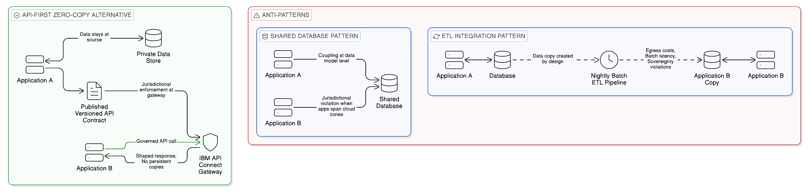
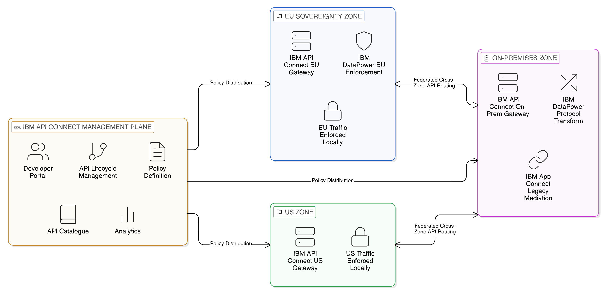
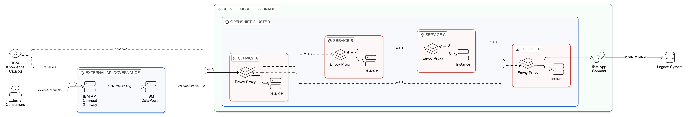
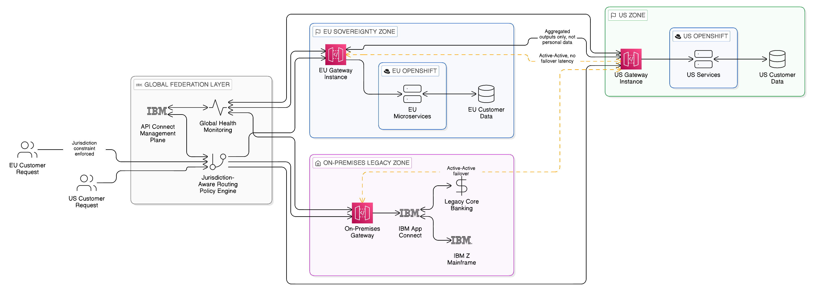
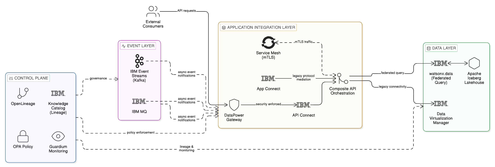

# Chapter 6: Multi-Cloud Resilient Application Integration

## API-First Architecture, Service Mesh Patterns, and the Zero-Copy Integration Fabric

---

The preceding chapter examined the Zero-Copy Data Layer in depth, establishing the mechanisms through which data can be made available to consumers across distributed environments without the necessity of physical movement. Federated queries, data virtualisation, and the sovereign lakehouse pattern together constitute a Data Plane that preserves the location of data whilst making it accessible to the analytical and operational workloads that require it. But the enterprise does not consist solely of analytical workloads. The greater part of its operational activity is conducted through applications: services that initiate transactions, expose capabilities to external partners, orchestrate business processes, and communicate with one another in real time across a landscape that spans on-premises infrastructure, sovereign cloud regions, and public cloud platforms simultaneously.

It is here, in the domain of application-to-application integration, that the temptation to replicate data is most acute and most consequential. The traditional response to the integration challenges of distributed application architectures has been to create shared databases, extract-transform-load pipelines between application data stores, and bulk data synchronisation mechanisms that maintain copies of operational data in multiple locations. These approaches were developed in an era of simpler, more contained architectures, and they carry with them assumptions — about network reliability, about jurisdictional boundaries, about the acceptable cost of data movement — that are no longer valid in the hybrid, multi-cloud enterprise. The Zero-Copy Application Integration Layer is the architectural response to these changed circumstances: a disciplined, principled approach to inter-application communication that eliminates unnecessary data replication and enforces the sovereignty, resilience, and economic disciplines that the modern enterprise requires.

This chapter examines that response in detail. It begins with a precise analysis of why the prevailing integration patterns fail — and why their failure is not merely a technical inconvenience but a sovereignty and compliance liability. It then addresses the foundational principles of API-first, contract-first integration design, which establish the conditions under which application integration can proceed without shared databases or persistent data copies. The chapter proceeds through the challenges of microservice architectures, the composition of APIs over distributed datasets, the governance infrastructure of the service mesh, and the multi-cloud federation patterns that allow the Application Integration Layer to operate reliably across the fault domains and jurisdictional boundaries characteristic of the contemporary enterprise. Throughout, the relevant capabilities of IBM API Connect, IBM DataPower Gateway, IBM App Connect, and Red Hat OpenShift Service Mesh are examined alongside the open-source ecosystem that together constitutes the implementation foundation for a sovereign, resilient Application Integration Layer.

---

## 6.1 The Failure of Data-Sharing Integration Patterns

To appreciate why a new approach to application integration is necessary, it is instructive to examine with precision why the prevailing patterns fail. The most prevalent integration anti-pattern in the enterprise application landscape is the shared-database integration: two or more applications that are nominally independent services but that communicate by reading from and writing to a common database schema. This pattern is ubiquitous because it is expedient. When a developer needs a second application to have access to data that originates in a first application, the path of least resistance is to grant the second application access to the first application's database. The data is immediately available, no API contract needs to be designed, and the integration appears, at first inspection, to work.

The consequences of this pattern, however, are severe. The database schema of the first application becomes, in effect, a public interface: any change to that schema risks breaking the second application, and any change to the second application's data requirements creates pressure to modify the schema in ways that may be inappropriate for the first application's internal logic. Over time, the shared database becomes a centre of gravity around which the autonomy of both applications collapses. The result is a set of applications that are nominally independent but practically coupled at the deepest architectural level — their internal data representation — rather than at the intentionally designed level of a published, versioned API contract.

In a multi-cloud or hybrid environment, this pattern acquires additional dimensions of failure. A shared database must reside somewhere: it cannot simultaneously be the canonical data store for an application in a sovereign European cloud region and an application in a United States public cloud zone without violating one or both jurisdictional constraints. The resolution, typically, is replication: a copy of the database is maintained in each required location, and a synchronisation mechanism keeps the copies consistent. This introduces not only the data movement costs and egress fees that the Zero-Copy philosophy seeks to eliminate, but also the consistency hazards of distributed databases — the replicated copies will, at some point, diverge, and the mechanisms for detecting and resolving that divergence add operational complexity that scales non-linearly with the number of copies.

A second prevalent anti-pattern is the ETL-based integration between application data stores. Where the shared-database pattern creates coupling at the database schema level, the ETL pattern creates coupling through a pipeline that periodically extracts data from one application's store, transforms it into a format suitable for another application, and loads it into that application's store. This pattern is recognisable across virtually every enterprise of significant scale: nightly batch processes, data replication jobs, and file-based data exchanges that move operational data between application silos. The Zero-Copy perspective on this pattern is clear: the ETL pipeline is, by definition, a data movement mechanism. It does not expose data where it lives; it moves data to where it is needed, creating copies in the process. In an environment of strict data sovereignty, those copies may constitute jurisdictional violations. In an environment of high egress costs, the movement may constitute a significant and recurring financial burden. In an environment of real-time operational requirements, the latency inherent in periodic batch processing may render the integration functionally inadequate.

The severity of these failure modes is not merely theoretical. Regulatory investigations into data sovereignty breaches — and enforcement actions under frameworks such as the General Data Protection Regulation and the Digital Operational Resilience Act — have repeatedly cited the uncontrolled proliferation of data copies, often created as a by-product of integration patterns, as a primary cause of compliance failures. The enterprise that cannot tell a regulator precisely where a given piece of personal data resides, and who has accessed it, is an enterprise that has, in all likelihood, permitted its integration architecture to create copies without adequate governance. The shared-database and ETL patterns are the most common mechanisms through which that proliferation occurs.

The architectural alternative to both of these patterns is the API-first integration model, in which applications communicate exclusively through published, versioned interfaces, and in which data is never shared by granting direct access to an application's internal data store. Understanding why this alternative is architecturally superior, and how to implement it at the scale and with the resilience that the enterprise requires, is the central project of this chapter.

*Figure 6.1: The two dominant integration anti-patterns — shared database and ETL-based synchronisation — compared with the API-first Zero-Copy alternative, in which data remains at its source and consuming applications interact exclusively through published, governed API contracts.*

---

## 6.2 API-First, Contract-First Integration: Foundational Principles

The API-first principle holds that every capability that an application exposes to other applications, and every piece of data that it makes available to external consumers, should be exposed exclusively through a designed, published, and versioned API. The internal implementation of the application — its database schema, its business logic, its internal data structures — is entirely encapsulated behind the API boundary. External consumers interact only with the API; they have no visibility into, and no dependency upon, the internal implementation. This principle has been articulated in various forms across the history of software engineering, from the information hiding principles of the 1970s through to the microservices literature of the 2010s, but its application to the integration challenges of the multi-cloud enterprise gives it renewed practical significance.

The contract-first variant of this principle extends the API-first approach by requiring that the API contract — the formal specification of the interface that the API presents — be designed and agreed before any implementation work begins. This inversion of the typical development sequence — in which the interface is often derived retrospectively from the implementation — has several important consequences. It forces explicit consideration of what the API should expose, and what it should not: the discipline of designing the contract in isolation from the implementation makes it easier to identify cases where an API is exposing internal implementation details that should be encapsulated. It also creates a shared artefact — the API specification — that can serve as the basis for parallel development: the consuming application can begin building against the specified contract before the providing application has implemented it, using mock implementations generated from the specification.

In the context of the Zero-Copy philosophy, the API-first, contract-first approach is more than a software engineering best practice: it is the mechanism through which the principle of data location is enforced at the application integration level. When an application exposes its data exclusively through an API, it retains complete control over how that data is packaged, what fields are included in a response, what transformations are applied before the data leaves the application boundary, and what access controls govern who can retrieve what data under what conditions. The data does not move from the application's data store to a shared location; a representation of a portion of that data, selected and shaped according to the API contract, is delivered in response to a specific request. This distinction — between moving data to a shared location and delivering a representation of data in response to a governed request — is the essence of the Zero-Copy Application Integration Layer.

The specification of API contracts has been substantially standardised through the adoption of the OpenAPI Specification as the de facto standard for RESTful HTTP APIs. OpenAPI provides a machine-readable description of an API's endpoints, the parameters they accept, the response structures they return, and the authentication mechanisms they require. This machine-readable specification enables an ecosystem of tooling for mock generation, documentation, client SDK generation, and contract testing. For asynchronous and event-driven APIs — a subject addressed in greater depth in [Chapter 7](07_chapter_zero_copy_event_layer) — the AsyncAPI specification provides an equivalent capability, describing the channels, message formats, and binding details of event-driven interfaces in a similarly machine-readable form.

The practical application of the contract-first principle at the enterprise scale requires governance infrastructure: a mechanism for registering API contracts, for managing the lifecycle of API versions, for enforcing the requirement that integration proceeds through published contracts rather than through ad hoc database connections, and for providing the discovery capability that allows consuming applications to locate the APIs they require. This is the function of the API management platform — a component of the Application Integration Layer that warrants detailed examination.

---

## 6.3 The API Management Platform as Sovereign Integration Infrastructure

An API management platform is not merely a proxy that routes HTTP traffic between API consumers and API providers. In a sophisticated enterprise deployment, it constitutes a critical layer of sovereignty and governance infrastructure: the point at which access policies are enforced, at which traffic is observed and logged for compliance purposes, at which rate limits and quotas are applied, and at which the API lifecycle is managed from publication through to retirement. Understanding the full scope of what an enterprise API management platform provides is essential to appreciating its role in the Zero-Copy Application Integration architecture.

The core functions of an API management platform may be understood across three dimensions. The first is the gateway function: the platform acts as an intermediary through which all API traffic passes, providing the enforcement point for security policies, the application of protocol transformations, and the management of the connection between consumer and provider. The second is the lifecycle management function: the platform provides the tooling through which APIs are published, versioned, and retired, through which developer communities are engaged and onboarded, and through which the catalogue of available APIs is maintained and made discoverable. The third is the observability function: the platform captures detailed analytics about API usage — which APIs are being called, by whom, with what frequency, and with what performance characteristics — providing the data needed both for operational management and for the lineage and audit capabilities that sovereignty and compliance requirements demand.

IBM API Connect represents a mature enterprise implementation of these capabilities, and is particularly relevant to the sovereignty and resilience requirements of the multi-cloud enterprise because of the flexibility it provides in deployment topology. IBM API Connect can be deployed in a fully managed cloud configuration, as an operator-managed capability within a Red Hat OpenShift cluster, or as a distributed deployment in which different components of the platform are deployed in different locations to meet specific sovereign requirements. This deployment flexibility is architecturally significant: it means that the enforcement point for API governance — the API gateway — can be located in the same sovereign zone as the data it governs, rather than being a centralised cloud service through which traffic must transit regardless of its origin and destination.

This capability — the ability to place the API enforcement point in the same jurisdiction as the data being exposed — is fundamental to the sovereignty proposition of the Application Integration Layer. If an API gateway is deployed as a centralised cloud service in a particular geographic region, then all API traffic — including traffic that originates in and should remain within a different jurisdiction — must transit through that gateway, potentially creating jurisdictional exposure for data that the API is designed to protect. A sovereign deployment model, in which a gateway instance is deployed within each regulatory jurisdiction and traffic is enforced locally, eliminates this exposure. The API contract is universal; the enforcement is sovereign.

IBM DataPower Gateway extends these capabilities for environments that require hardened, high-performance API enforcement in regulated and sensitive contexts. DataPower has a long heritage in financial services, healthcare, and government deployments, where the combination of high throughput, hardware security module integration, and extensive protocol support — including legacy formats such as SOAP, EDI, and ISO messaging standards that remain prevalent in regulated industries — makes it the preferred enforcement point for API traffic that involves sensitive data or that must meet stringent performance and security requirements. DataPower operates not as a replacement for IBM API Connect's lifecycle management capabilities but as a complementary enforcement layer that provides the hardened gateway infrastructure through which the most sensitive API interactions are mediated. In the context of the Zero-Copy Application Integration Layer, DataPower provides the enforcement infrastructure for those interactions, operating alongside API Connect's broader lifecycle management platform.

*Figure 6.2: The sovereign API management topology — IBM API Connect's management plane defines API lifecycle and policies centrally, whilst gateway instances deployed within each sovereign zone enforce those policies locally, ensuring that API traffic never transits outside its jurisdictional boundary.*

The open-source ecosystem in this domain is rich and actively maintained. Kong Gateway, operated either as a self-managed deployment or as a cloud service, provides a highly performant API gateway with an extensive plugin ecosystem for authentication, rate limiting, and protocol transformation. Apache APISIX, developed under the Apache Software Foundation, offers a similar capability with particularly strong routing flexibility and a dynamic configuration model that allows policies to be modified at runtime without service interruption. Envoy Proxy, whilst not an API management platform in the full lifecycle sense, is the underlying data plane for many service mesh implementations and provides the foundation for sophisticated traffic management at the API level. These open-source options are relevant both for organisations seeking to complement commercial platforms in specific zones and for hybrid deployments in which an open-source gateway operates within a sovereign zone whilst an enterprise platform manages the API lifecycle and catalogue centrally. The architectural principle — sovereign enforcement, centralised governance — is compatible with either a fully commercial or a hybrid open-source deployment model.

---

## 6.4 Avoiding Data Replication in Microservice Architectures

The microservice architectural style presents the integration problem in its most concentrated form. An application decomposed into a collection of small, independently deployable services, each owning its own data store, must nevertheless present coherent, consistent behaviour to its consumers. The canonical guidance for microservice integration — that services should communicate through APIs rather than through shared databases — is well established in the literature. The practical challenge is that the pressure to replicate data across service boundaries, driven by the performance and consistency requirements of specific use cases, is persistent and often compelling in the short term even as it is costly in the long term.

The most common form of data replication in microservice architectures is the materialised view or read model: a service that needs to query data owned by multiple other services creates its own local copy of the relevant data, maintained through synchronisation events or periodic extraction, in order to serve queries that would otherwise require expensive, potentially unavailable cross-service calls. This pattern has been formalised and given architectural legitimacy under the Command Query Responsibility Segregation pattern, which separates the write model — the canonical data owned by the responsible service — from the read model, which may be a denormalised, materialised view maintained specifically to support query requirements. When implemented carefully, with appropriate governance of the events that maintain the read model's consistency, this is a legitimate and sometimes necessary architectural response to the query requirements of complex microservice systems. When implemented carelessly, it becomes a proliferation of poorly governed data copies that undermine sovereignty, create consistency hazards, and inflate egress costs.

The Zero-Copy perspective on this problem requires a disciplined assessment of when materialised views are genuinely necessary and when they reflect an insufficiently thoughtful approach to API design. Many cases in which a service appears to need a local copy of data owned by another service are, on examination, cases in which the query requirements can be met by a well-designed API from the owning service. The preference should always be for the API-first approach: the consuming service should request the data it needs from the owning service's API, which should be designed to support the access patterns required. Only when the performance characteristics of this approach are genuinely inadequate — when the latency of cross-service API calls would materially degrade the user experience or the operational reliability of the consuming service — should the materialised view be considered, and even then it should be governed as a deliberate architectural decision with explicit ownership, consistency guarantees, and sovereignty compliance, rather than as an implementation convenience.

The event-driven architecture patterns discussed in [Chapter 7](07_chapter_zero_copy_event_layer) provide the principal mechanism for maintaining materialised views when they are genuinely necessary, without creating the uncontrolled data propagation that characterises naive data replication. By publishing events that describe state changes in the owning service's data, rather than exposing the state itself, the owning service enables consuming services to maintain locally appropriate views of relevant data without those views becoming independent, ungoverned copies. The events are the owned data; the views are derived artefacts. This distinction has important implications for governance: the owning service retains responsibility for the data, and the events it publishes are a designed interface — subject to versioning, contract management, and access control — rather than a bulk data export.

IBM App Connect, part of the IBM Cloud Pak for Integration portfolio, addresses a related integration challenge that arises particularly in organisations with significant legacy application estates: the integration of applications that were not designed for API-based communication. App Connect provides a capability for connecting applications through message transformation, protocol bridging, and orchestration patterns that abstract the integration logic from the individual application implementations. In the context of the Zero-Copy approach, App Connect functions as an integration mediation layer that makes it possible to expose legacy application capabilities through governed API contracts without requiring those applications to be rewritten or re-architected. This is practically important because the Zero-Copy philosophy must be implemented across an enterprise application landscape that typically includes systems of varying vintage, from modern cloud-native services to decades-old core systems that were never designed for API-based integration.

The significance of IBM's Cloud Pak for Integration in this context extends beyond the capabilities of any individual component. By integrating API management, application integration, messaging, and event streaming capabilities within a cohesive, OpenShift-deployed portfolio, Cloud Pak for Integration provides the enterprise with a consistent operational and governance model across the full stack of integration technologies required for the Zero-Copy Application Integration Layer. This consistency reduces the operational complexity of managing multiple, independently deployed integration components, and provides the common observability and governance substrate through which the integration layer can be monitored and governed as a coherent whole.

---

## 6.5 Composite APIs over Distributed Datasets

A significant proportion of the API interactions in the enterprise context require data that does not reside in a single service or data store. A customer-facing API for a financial services institution might need to combine data from a core banking system, a customer relationship management platform, a fraud risk service, and a regulatory reporting system in order to respond to a single consumer request. In the traditional integration model, such composite data requirements are met by centralising all relevant data in a single data warehouse or operational data store, from which the composite API is served. This approach creates the data gravity problem described in [Chapter 2](02_chapter_data_gravity_egress_economics): large volumes of operational data accumulate in a central location, egress costs mount as data is moved to feed the central store, and sovereignty constraints are violated as data crosses jurisdictional boundaries to reach the centralised destination.

The Zero-Copy approach to composite APIs inverts this model. Rather than moving data to a central location from which a composite view can be assembled, the composite API layer requests data from each source through its respective API or query interface at the time of the consumer request, assembles the composite response in the mediation layer, and returns the assembled result without persisting the individual components or the assembled composite. This is the API façade pattern in its Zero-Copy implementation: the façade presents a unified interface to the consumer, whilst the underlying data remains in its respective sovereign location.

The performance implications of this approach require careful consideration. If a composite API response requires sequential calls to multiple downstream services, the latency of the composite response is the sum of the latencies of the individual calls — a potentially significant performance deficit compared with a pre-materialised response from a central store. The architecture must therefore be designed to parallelise downstream service calls wherever the data dependencies allow, and to cache composite or intermediate results where the caching can be done without violating sovereignty constraints. IBM DataPower and IBM API Connect both provide mediation capabilities that support the orchestration of parallel downstream calls and the assembly of composite responses, with configurable timeout and fallback behaviours that maintain the resilience of the composite API even when individual downstream services are temporarily unavailable.

The API façade pattern is particularly powerful in the context of legacy application modernisation. Many enterprises operate core systems — core banking platforms, enterprise resource planning systems, telecommunications billing engines — that contain critical operational data but that expose no modern API interface. Wrapping such systems in an API façade, implemented through IBM App Connect or an equivalent integration mediation layer, creates a modern, governed API interface over the legacy system without requiring modification of the underlying system. The Zero-Copy principle is preserved: the data remains in the legacy system; the façade retrieves and presents a portion of it on demand, without creating a persistent copy.

The governance of composite APIs raises specific challenges for the data lineage and sovereignty assurance that regulated enterprises require. When a composite API assembles data from multiple source systems, the lineage of each component of the assembled response must be traceable: the provenance of each field in the response must be attributed to the source system from which it was retrieved, and any jurisdictional constraints applicable to the source data must be enforced in the composite response. IBM Knowledge Catalog, introduced in [Chapter 4](04_chapter_three_integration_planes) in the context of the Control Plane, provides the metadata foundation for this lineage: by registering the API endpoints that serve the composite API and associating them with the data assets and business terms that describe the data they handle, the governance catalogue makes it possible to trace the lineage of a composite API response from the consuming application back through the mediation layer to each contributing source system.

---

## 6.6 Service Meshes and the Intra-Cluster Integration Plane

Whilst the API management platform addresses the governance and lifecycle management of APIs exposed across organisational and network boundaries, a second layer of integration infrastructure addresses the communication between services within a cluster or platform boundary. This is the domain of the service mesh: a dedicated infrastructure layer that manages service-to-service communication within a deployment environment, providing capabilities for traffic management, mutual TLS authentication, observability, and policy enforcement without requiring individual services to implement these capabilities themselves.

The service mesh architecture, as represented by the Istio project and its derivatives, works by deploying a lightweight proxy — the sidecar — alongside each service instance. All traffic to and from the service passes through the sidecar proxy, which applies the mesh's traffic management and security policies transparently, without modifying the service implementation. This sidecar injection mechanism means that the service mesh can enforce consistent security, observability, and traffic management policies across all services in the cluster, regardless of the programming language, framework, or team responsible for each service. The service mesh provides, within the cluster boundary, a governance and enforcement capability analogous to that which the API management gateway provides at the network boundary.

Red Hat OpenShift Service Mesh, based on the upstream Istio project and integrated with the OpenShift platform, provides a particularly coherent implementation of these capabilities in the context of the enterprise multi-cloud deployment. Because OpenShift runs consistently across on-premises infrastructure, IBM Cloud, and other cloud providers through the Red Hat OpenShift container platform, the service mesh policies defined within an OpenShift deployment are portable across the deployment topologies that constitute the enterprise's multi-cloud estate. A service mesh policy that enforces mutual TLS between services in an on-premises OpenShift cluster can be replicated to an IBM Cloud OpenShift cluster with confidence that the policy semantics are identical, because the underlying service mesh implementation is consistent.

This consistency of policy across deployment topologies is architecturally significant for sovereignty. The service mesh provides the enforcement point for intra-cluster communication policies, and the consistency of that enforcement across sovereign zones means that the governance rules that apply to data in transit between services — what data can be exchanged between which services under what conditions — can be defined centrally and enforced locally in each sovereign zone, without requiring bespoke implementation in each zone. This is the principle of federated governance applied to service-to-service communication: the policy is universal; the enforcement is sovereign.

Beyond security and policy enforcement, the service mesh provides the traffic management capabilities required for resilient inter-service communication within the cluster. Circuit breaking — the automatic detection of failing downstream services and the temporary suspension of calls to those services to prevent cascading failure — is a capability that the service mesh provides at the infrastructure level, without requiring individual services to implement circuit breaker logic in their application code. Similarly, retry policies, timeout configurations, and traffic splitting for canary deployments are managed by the service mesh infrastructure rather than embedded in individual service implementations. These capabilities are directly relevant to the resilience requirements of the Zero-Copy Application Integration Layer: they ensure that the inter-service communication within the integration layer can sustain partial failures without propagating those failures across the system.

*Figure 6.3: The two governance layers of the Application Integration Plane — the API gateway enforcing north-south (external) traffic at the cluster boundary, and the service mesh governing east-west (intra-cluster) service-to-service communication — together providing complete, code-free integration governance.*

The intersection of the service mesh with the API management platform defines the complete application integration topology. Traffic from external consumers reaches the API management gateway, which enforces the API contract, applies authentication and authorisation, and routes the request to the appropriate internal service. Within the cluster, the service mesh governs the resulting intra-cluster service-to-service communication, enforcing mutual TLS, applying traffic management policies, and providing the observability data needed to understand how the integration layer is performing. This layered governance — API gateway at the external boundary, service mesh within the internal boundary — provides the complete enforcement infrastructure for a governed, sovereign Application Integration Layer.

---

## 6.7 Multi-Cloud API Federation and Cross-Cloud Service Communication

The preceding sections have addressed the API management and service mesh capabilities that govern integration within a single deployment environment. In the multi-cloud enterprise, however, integration must frequently span multiple deployment environments: services deployed in a sovereign European cloud region must communicate with services deployed in an on-premises data centre, which must in turn communicate with services deployed in a North American cloud region, with each communication subject to the jurisdictional constraints and network characteristics of the boundaries it crosses.

Multi-cloud API federation is the architectural pattern that addresses this requirement. In a federated API architecture, each deployment zone maintains its own API gateway instance, which enforces the locally applicable governance policies and serves as the boundary enforcement point for traffic entering and leaving the zone. Communication between zones transits the gateway boundaries of both the sending and receiving zones, ensuring that every cross-zone interaction is subject to policy enforcement at both ends. The federation of these gateway instances — their coordination around shared API contracts, shared policy definitions, and shared observability data — constitutes the multi-cloud API fabric that governs cross-zone integration at the enterprise level.

IBM API Connect's support for federated deployment addresses this requirement through its gateway service model, in which multiple gateway instances can be managed through a shared management plane whilst operating autonomously in their respective deployment zones. API policies defined in the central management plane are propagated to the local gateway instances, which enforce those policies locally without requiring traffic to transit to a central location for policy evaluation. This architecture — centralised policy definition, distributed policy enforcement — is a direct instantiation of the federated governance principle that runs through the Zero-Copy approach: the authority is central; the enforcement is sovereign.

The network topology of multi-cloud environments presents specific challenges for reliable cross-zone API communication. Unlike the predictable, low-latency network environment within a single data centre or cloud region, the network paths between cloud regions and between cloud providers are subject to variable latency, intermittent packet loss, and occasional partition events. The API design must account for these network characteristics: synchronous, blocking API calls that are appropriate within a single region may be unsuitable across cloud boundaries, where the risk of timeout and the latency penalty of a failed call are significantly higher.

The preferred pattern for cross-cloud API communication in a Zero-Copy architecture combines synchronous API calls for operations where real-time response is genuinely required with asynchronous event-based communication for operations where eventual consistency is acceptable. Where synchronous communication is necessary across cloud boundaries, the API design should include explicit timeout policies, retry logic with exponential backoff, and circuit breaker protections that prevent a temporary unavailability in one zone from propagating failures to dependent services in other zones. The service mesh capabilities described in the preceding section provide these protections at the infrastructure level when the communication is intra-cluster; for cross-cluster, cross-cloud communication, equivalent protections must be implemented at the API gateway level, through the policy capabilities of platforms such as IBM API Connect and IBM DataPower.

A further pattern relevant to cross-cloud integration is API traffic shadowing, in which production traffic to a live API endpoint is simultaneously replicated — in a read-only, non-state-modifying manner — to a shadow endpoint in a different deployment zone. This pattern is valuable for validating the behaviour of a new version of a service deployed in a different zone, or for assessing the performance characteristics of cross-cloud API communication without exposing production consumers to the risk of degraded service. In the sovereignty context, traffic shadowing must be implemented with care: if the API traffic contains personal data, the creation of a shadow traffic stream that crosses a jurisdictional boundary may constitute a data transfer that requires explicit legal basis. The governance infrastructure of the API management platform should be used to classify API traffic by data sensitivity and to enforce jurisdictional constraints on shadow traffic accordingly.

---

## 6.8 Architectural Patterns for the Zero-Copy Application Integration Layer

*Figure 6.4: Multi-cloud API federation in an active-active configuration — each sovereign zone operates an independent gateway instance, with jurisdiction-aware routing ensuring that requests containing regulated data are directed only to zone instances within the appropriate jurisdictional boundary.*

The preceding discussion of principles, platforms, and cross-cloud communication patterns can be crystallised into three concrete architectural patterns that together address the dominant integration scenarios encountered in the multi-cloud enterprise. Each pattern represents a specific application of the Zero-Copy philosophy to a particular class of integration problem, and each is supported by specific platform capabilities that provide an implementation foundation.

### 6.8.1 The API Façade over Legacy Core Systems

The API façade pattern addresses one of the most persistent integration challenges in the enterprise: the need to make data and capabilities resident in legacy core systems available to modern, API-consuming applications without modifying the core systems themselves. A well-designed API façade is more than a simple protocol adapter. It provides a stable, versioned API contract that abstracts the consuming application from the specifics of the legacy system's interface and data model, transforms the legacy system's response into a format appropriate for the consuming application, enforces authentication and authorisation policies that the legacy system may not natively support, and provides the observability and logging capabilities that modern integration governance requires.

In the Zero-Copy context, the API façade is the mechanism through which the data resident in the legacy core system is made available to consuming applications without replication. Rather than extracting and copying data from the legacy system into a modern data store from which consuming applications are served, the façade retrieves data from the legacy system on demand, in response to specific API requests, and returns a shaped representation of that data to the consumer. The legacy system remains the canonical data store; the façade is the governed access interface.

IBM App Connect, combined with IBM DataPower where high-performance protocol bridging and security enforcement are required, provides the implementation foundation for this pattern. App Connect's integration flows can be configured to transform data formats, aggregate responses from multiple legacy endpoints, apply business logic, and handle the error conditions and retry scenarios that are characteristic of legacy system integration. DataPower provides the gateway enforcement point that applies authentication, rate limiting, and threat protection to the API traffic, presenting the consuming application with a hardened, standards-compliant API interface irrespective of the protocol used by the underlying legacy system.

The combination of App Connect's integration mediation capabilities and DataPower's enforcement infrastructure means that even the most deeply embedded legacy system — one communicating through COBOL copybooks, proprietary message formats, or decades-old EDI standards — can be exposed through a modern, governed API without any modification to the core system itself. This is the practical realisation of the Zero-Copy principle in the legacy modernisation context: the data does not move; the access to it is modernised.

### 6.8.2 Multi-Cloud Service Federation

The multi-cloud service federation pattern addresses the requirement for a consuming application to interact with services that are distributed across multiple cloud environments, without needing to be aware of where each service is physically deployed or how the cross-cloud routing is managed. From the perspective of the consuming application, there is a single, unified API; from the perspective of the integration infrastructure, the API resolves to different physical endpoints depending on the jurisdiction of the request, the availability of services in each zone, and the routing policies enforced by the federation layer.

This pattern is architecturally analogous to the DNS system, which resolves a single hostname to different IP addresses depending on the geographic location of the requester, the health of the target endpoints, and the routing policies of the DNS zone. The multi-cloud API federation layer performs an analogous function at the API level: routing requests to the appropriate sovereign zone endpoint based on the attributes of the request and the policies of the federation. IBM API Connect's multi-gateway deployment model provides the technical implementation of this pattern, with gateway instances in each sovereign zone enforcing local policies and a shared management plane coordinating routing decisions and policy distribution.

The sovereignty implications of this pattern are significant. By routing requests to endpoints within the jurisdiction appropriate to the data being requested, the federation layer actively enforces jurisdictional constraints without requiring consuming applications to have any awareness of those constraints. A consuming application that requests customer data does not need to know that European customer data must be served from a European endpoint; the federation layer enforces that constraint through its routing policy. This separation of concerns — application logic in the consuming service, jurisdictional enforcement in the federation layer — is essential for maintaining sovereignty compliance at scale, where the alternative of embedding jurisdictional awareness in every consuming application would be both impractical and error-prone.

### 6.8.3 Resilient API Failover in Active-Active Configurations

The resilience requirement of the Zero-Copy Application Integration Layer is most acutely expressed in the failover scenario: what happens when a service in one deployment zone becomes unavailable, and how does the integration layer respond to maintain continuity of service for consuming applications? In a copy-centric architecture, the answer is often to maintain a replica of the service's data in a second zone and to fail over to the replica when the primary becomes unavailable. In the Zero-Copy architecture, this is precisely the pattern to be avoided: the creation of a replica for failover purposes creates a data copy that may violate sovereignty constraints and that requires complex consistency management.

The Zero-Copy approach to API failover relies on stateless API design as its primary mechanism. A truly stateless API — one that holds no session state between requests, that derives its response entirely from the data provided in the request and from the data store it queries at the time of the request — can be failed over to a second instance without any concern for the transfer of state, because there is no state to transfer. The second instance, serving the same data store (or a sovereign equivalent in a different zone), can immediately begin handling requests that were being handled by the failed instance, without any warm-up or synchronisation requirement.

Active-active configurations, in which multiple instances of the same API service are deployed in different zones simultaneously and traffic is distributed across them through load balancing, provide a higher level of resilience than active-passive failover by eliminating the failover latency entirely. In a correctly designed active-active configuration, the failure of a single zone reduces the capacity available to serve requests but does not interrupt service: the remaining zones absorb the traffic that would have been directed to the failed zone. IBM API Connect's gateway federation and Red Hat OpenShift's application-level load balancing capabilities together provide the infrastructure for active-active API deployments, with health-check-driven routing that automatically redirects traffic away from unhealthy zone instances.

The design constraint that makes active-active API configurations consistent with the Zero-Copy principle is the requirement for jurisdiction-aware routing. In an active-active deployment that spans multiple sovereign zones, the routing layer must ensure that requests containing data subject to jurisdictional constraints are directed only to zone instances within the appropriate jurisdiction. A request that carries data subject to European data protection law should be routed only to gateway instances and service instances within the European jurisdiction, even if instances in other jurisdictions are available and have lower load. This jurisdiction-aware routing is a policy enforcement function of the API management gateway, expressed through the routing rules configured in the gateway's policy engine and evaluated against the attributes of each incoming request.

---

## 6.9 Idempotency, Observability, and the Governance of Integration Flows

Two further architectural disciplines complete the picture of the Zero-Copy Application Integration Layer: idempotency and observability. Both are prerequisites for the reliable, governed operation of the integration infrastructure at enterprise scale, and both have specific implications in the multi-cloud, sovereign context.

Idempotency — the property of an operation that can be safely repeated multiple times with the same result — is essential in distributed integration environments because the unreliability of networks means that any operation may need to be retried following a timeout or connection failure. If the underlying operation is not idempotent, a retry may produce a duplicate effect: a payment processed twice, a record created twice, an event fired twice. In a traditional, centralised integration environment, idempotency can often be managed through the locking and transactional mechanisms of a shared database. In a distributed, multi-cloud integration environment, these mechanisms are typically unavailable across service and network boundaries, and idempotency must be designed into the API and integration layer explicitly.

The standard approach to API idempotency is the idempotency key: a unique identifier, generated by the consumer and included in the API request, that the providing service uses to identify duplicate requests. If the providing service has already processed a request with a given idempotency key, it returns the result of the previous processing rather than executing the operation again. This mechanism requires the providing service to maintain a record of recently processed idempotency keys — a durable state that must itself be replicated across instances if the service is deployed in an active-active configuration. The management of this idempotency state is a specific application of the Zero-Copy principle to the resilience domain: the state must be durable without creating unnecessary copies, and must be accessible to all active instances without introducing the consistency hazards of unreplicated distributed state.

Observability in the context of the Application Integration Layer encompasses three dimensions that are familiar from the broader observability literature: metrics, tracing, and logging. At the API management level, metrics about request volume, error rates, and latency are the primary operational signals for managing the health and performance of the integration layer. Distributed tracing — the correlation of log and timing data across the multiple service calls that constitute a composite API interaction — is essential for diagnosing performance and correctness issues in complex integration flows, where the root cause of a failure in a consumer-facing API may lie several hops deep in the chain of downstream service calls. Structured logging of every API interaction, with sufficient context to reconstruct the complete request and response, provides the audit trail that regulatory compliance in sensitive industries requires.

In a sovereign, multi-cloud environment, the observability infrastructure itself must be designed with jurisdictional constraints in mind. Log data generated by API interactions within a European jurisdiction may be subject to the same data protection constraints as the operational data that the APIs themselves handle; exporting those logs to a centralised, non-European observability platform may constitute a regulated data transfer. The architecture must therefore support local log storage and local observability dashboards within each sovereign zone, with a federated view — aggregated at the metadata level, without exporting raw log content — available to the central operations team. IBM Instana's observability platform supports this federated model, providing local agents that collect and store observability data within the sovereign zone whilst exposing aggregated operational metrics to the central operations platform without transferring raw log content across zone boundaries.

The governance of integration flows encompasses not merely their technical operation but the business and regulatory governance of the capabilities they expose. Every API in the enterprise integration landscape represents a capability that has been approved for exposure, governed by a defined access policy, and potentially subject to regulatory oversight. The API management platform's governance capabilities — the developer portal through which API access is requested and provisioned, the lifecycle management tooling through which API versions are published and retired, the analytics infrastructure through which API usage is monitored and reviewed — collectively constitute the governance infrastructure of the Application Integration Layer. IBM API Connect's end-to-end lifecycle management capabilities, from API design and publication through to analytics and retirement, provide a cohesive governance foundation that supports the operational and regulatory governance requirements of the enterprise integration layer.

---

## 6.10 The Application Integration Layer in the Enterprise Zero-Copy Architecture

*Figure 6.5: The Application Integration Layer in the full enterprise Zero-Copy architecture — positioned between the Data Layer (federated access to persistent data) and the Event Layer (asynchronous state change propagation), governed by the Control Plane throughout, with no shared databases or ETL copies at any level.*

The components described in this chapter — the API management platform, the service mesh, the integration mediation layer, the composite API patterns, and the observability infrastructure — collectively constitute the Application Integration Layer of the enterprise Zero-Copy architecture. This layer sits above the Data Layer described in [Chapter 5](05_chapter_zero_copy_data_layer) and below the Event Layer that will be examined in [Chapter 7](07_chapter_zero_copy_event_layer), and it interacts with both. The Data Layer provides the governed access to persistent data assets that the Application Integration Layer exposes through its APIs; the Event Layer provides the asynchronous communication substrate that the Application Integration Layer uses for operations where real-time synchronous communication is inappropriate.

The relationship between the Application Integration Layer and the Control Plane, described in [Chapter 4](04_chapter_three_integration_planes), is of particular importance. The API contracts registered in the IBM Knowledge Catalog, the access policies enforced through the IBM API Connect gateway, and the lineage metadata captured through the observability infrastructure together constitute the governance evidence that demonstrates, to regulators and auditors, that the enterprise's integration architecture is operating within its declared sovereignty boundaries. The Application Integration Layer is not merely a technical mechanism for moving information between applications; it is a governed, documented, auditable integration capability whose operation can be demonstrated to comply with the jurisdictional constraints that the enterprise's regulatory environment imposes.

For the CIO and CTO, the practical implication of this architecture is that the investment in API management, service mesh, and integration mediation infrastructure is not merely a technical modernisation initiative but a sovereignty and resilience investment. The enterprise that has established a governed Application Integration Layer — in which all inter-application communication proceeds through published, versioned, monitored API contracts enforced by a distributed, zone-aware gateway infrastructure — has created the conditions in which data sovereignty can be demonstrated rather than merely asserted, in which application-level resilience can be sustained across the failure of individual zones and services, and in which the economic discipline of the Zero-Copy approach can be enforced at the level of individual API interactions rather than managed retrospectively through egress cost analysis.

It bears emphasising that the operational transformation required to establish this architecture is as significant as the technical transformation. The shift from shared-database and ETL-based integration to an API-first, contract-first model requires new disciplines in development practice, new governance processes for API lifecycle management, and new capabilities in the integration operations team. These organisational dimensions are addressed in the later chapters of this book. What this chapter establishes is the technical foundation: the understanding of what the Zero-Copy Application Integration Layer is, why it is architecturally superior to the patterns it replaces, and what platform capabilities — from IBM's portfolio and from the open-source ecosystem — provide the implementation substrate upon which it can be built.

---

## 6.11 Summary and Architectural Imperatives

This chapter has examined the Zero-Copy Application Integration Layer from its foundational principles through to its implementation patterns and platform capabilities. The argument developed through the chapter rests on three claims that together constitute the case for an API-first approach to enterprise application integration.

The first is that the prevailing integration anti-patterns — shared databases and ETL-based data synchronisation — are incompatible with the sovereignty, resilience, and economic requirements of the multi-cloud enterprise. The shared-database pattern creates coupling at the deepest architectural level, violates jurisdictional constraints as data is replicated to meet the access needs of applications in different zones, and accumulates the consistency hazards and operational complexity of distributed database replication. The ETL pattern is, by construction, a data movement mechanism that creates copies as its primary output, and those copies are precisely what the Zero-Copy architecture seeks to eliminate.

The second is that the implementation of an API-first architecture at enterprise scale requires a layered governance infrastructure comprising an API management platform for external and inter-zone governance, a service mesh for intra-cluster governance, and an integration mediation layer for legacy system integration. IBM API Connect, IBM DataPower, IBM App Connect, and Red Hat OpenShift Service Mesh constitute a coherent, enterprise-grade implementation of this infrastructure, supported by a rich open-source ecosystem that provides complementary capabilities and flexibility in deployment topology. Neither the commercial platform capabilities nor the open-source ecosystem alone is sufficient; the architecture that delivers sovereign, resilient application integration combines the enterprise governance and lifecycle management capabilities of the commercial platform with the flexibility and adaptability of the open-source ecosystem.

The third is that the resilience of the Application Integration Layer in a multi-cloud context requires specific design disciplines that must be planned into the architecture from the outset. Idempotent API design, active-active deployments, jurisdiction-aware routing, and federated observability are not features that can be added to an integration architecture in response to operational incidents; they must be designed in from the beginning, because the conditions under which they are required — network partitions, zone failures, regulatory audits — arise precisely when the architecture is under stress and least amenable to modification.

Several architectural imperatives emerge from this analysis for the technology leader. The first is the establishment of API contract governance as a foundational discipline: before an integration capability can be Zero-Copy in practice, it must be governed by published contracts, and the governance infrastructure — the API catalogue, the lifecycle management capability, the contract testing practice — must be established as a prerequisite for integration development. The second is the adoption of a distributed gateway topology that places enforcement points within sovereign zones, rather than relying on a centralised gateway through which all traffic must transit. The third is the design of integration flows for idempotency from the outset, recognising that in a distributed multi-cloud environment, operations will be retried and the cost of non-idempotent retries — in duplicate transactions, corrupted state, and regulatory violations — is unacceptable.

The chapters that follow extend this architectural framework to the Event Layer, the security architecture, and the operational patterns that complete the picture of the enterprise Zero-Copy Integration capability. The Application Integration Layer described in this chapter does not operate in isolation; its full value is realised through its integration with the Event Layer, which provides the asynchronous substrate for operations that cannot or should not be conducted through synchronous API calls, and with the security architecture, which provides the identity and access management infrastructure through which the API governance policies described in this chapter are enforced.
