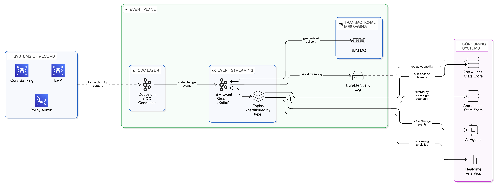
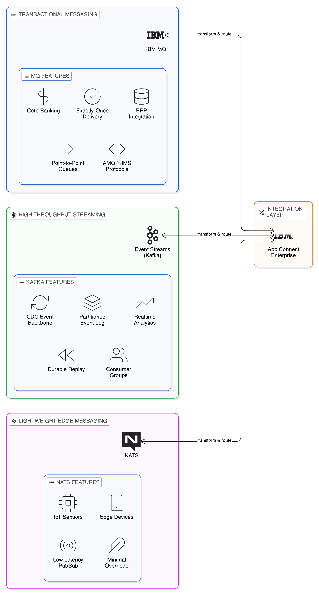
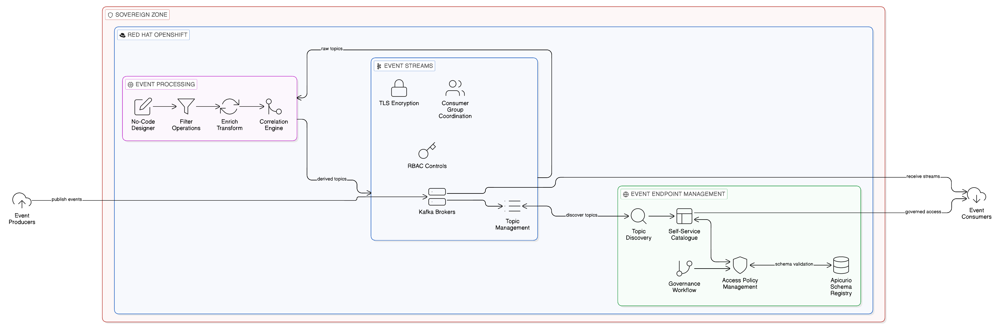
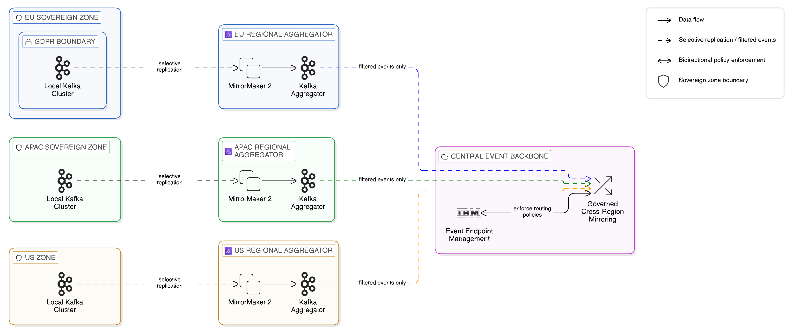
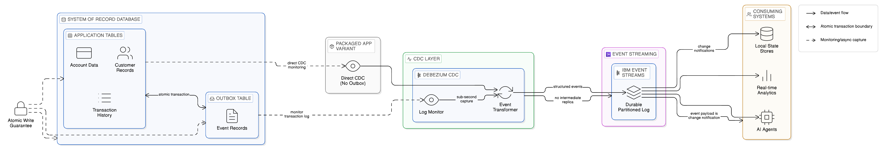

# Chapter 7 --- The Zero-Copy Event Layer

*Event Sourcing, Event Streaming, and the Replacement of Replication as the Enterprise Integration Backbone*

The preceding chapter examined the Application Integration Plane of the Zero-Copy architecture, establishing how API-first design and service mesh patterns enable inter-application communication without the need for shared databases or bulk data synchronisation. The discipline of that plane, however, is principally concerned with request-and-response interactions: a consumer requesting a capability or a data view from a provider and receiving a response in real time. Important as this synchronous integration model is, it is insufficient on its own to address the full breadth of enterprise integration requirements. A substantial proportion of enterprise integration occurs not through direct request, but through the propagation of state changes across systems: the notification that a customer record has been updated, that an order has been placed, that a regulatory threshold has been crossed, that a sensor reading has exceeded its permitted range. These integration requirements are, in nature, asynchronous. They do not await a consumer's request; they arise spontaneously from the state changes of the systems that originate them. It is the Event Plane of the enterprise architecture that addresses these requirements.

Events are, in a very precise sense, the natural medium of Zero-Copy Integration. An event describes what happened — a change of state, a significant occurrence, a business transaction completed — without carrying with it the full dataset from which it originates. It is a notification, not a replication. The receiving system can decide, on the basis of the event's content, whether it requires access to the originating data, and if so, it can request that data through the governed channels of the Data Plane, leaving the data at rest in its authoritative source. This architecture — events as lightweight notifications triggering selective data access — is the antithesis of the bulk replication model in which entire datasets are copied to all systems that might conceivably require them.

This chapter examines the Event Plane in depth: its relationship to the Zero-Copy philosophy, its technical foundations in event sourcing and event streaming, the circumstances in which it can replace ETL-based data movement entirely, and the specific patterns and technologies through which it is implemented at enterprise scale. It addresses the three principal technologies that constitute the enterprise event messaging landscape — Apache Kafka, IBM MQ, and NATS — and explains their respective roles in a coherent Zero-Copy architecture. It examines IBM's Event Automation portfolio as the enterprise governance layer for the Event Plane. It addresses the critical but frequently underserved question of event schema governance, which determines whether an event-driven architecture achieves the discipline its ambitions require or degenerates into a less structured form of the replication sprawl it was intended to replace. It concludes with three implementation patterns that together illustrate how the Event Plane, when properly designed, eliminates replication sprawl whilst preserving the real-time responsiveness that modern enterprise operations require.

## 7.1 Why Events Reduce the Need for Data Replication

To understand why the Event Plane is central to Zero-Copy Integration, it is necessary to examine with some precision the mechanisms through which traditional enterprise integration has created the replication problem that the Zero-Copy approach seeks to resolve.

The fundamental challenge of enterprise integration is that different systems need awareness of the same real-world facts. A payment system must know when a customer's account status changes. A logistics system must know when an order has been confirmed. A regulatory reporting system must know when a transaction crosses a reporting threshold. In each case, the same underlying fact — a change of state in an authoritative system of record — must be communicated to one or more consuming systems that require it.

The traditional response to this challenge has been replication: copying the relevant data from the authoritative system into a form accessible to the consuming systems. This might take the form of a nightly batch extract, a database-level replication mechanism, or a scheduled synchronisation job. In each case, the outcome is the same: a copy of the data exists in a location determined by the consuming system's convenience rather than by any governance policy, and that copy begins, from the moment of its creation, to drift from the authoritative source as subsequent changes to the originating system are not immediately reflected in the replica.

The consequences of this replication-driven architecture are multiple and well-documented in the earlier chapters of this work. From a sovereignty perspective, the proliferation of copies across jurisdictions creates compliance exposure that is difficult to manage and impossible to demonstrate precisely. From a resilience perspective, the reliance on scheduled batch processes creates a window of staleness that may render the replicated data useless for real-time operations. From an economic perspective, the data movement that replication requires accumulates as a recurring cost whose full magnitude is rarely visible to the enterprise until it appears as an unexpected line item in a cloud egress bill.

Events address the underlying requirement — communicating the fact of a state change from an authoritative system to consuming systems — without creating replicas. When a customer's account status changes, the originating system publishes an event containing the essential facts of that change: a reference to the affected account, the nature of the change, the timestamp at which it occurred, and any contextual information required for consuming systems to take appropriate action. Consuming systems receive this event and react to it: updating their own operational state, triggering downstream processes, or — where they require access to the full account record — querying it in place through the Data Plane rather than relying on a replicated copy.

The event itself is not a replica of the source data. It is a compact, structured description of a state transition. It does not carry the customer's full profile, transaction history, or relationship data; it carries precisely the information required to notify consumers that a relevant change has occurred. This distinction is architecturally fundamental: it means that the event can be published and consumed across jurisdictional boundaries without necessarily constituting a regulated data transfer, because it does not carry personal data beyond what is required to identify and contextualise the change. The full data remains in its authoritative location, subject to the sovereignty controls that govern it, accessible to consuming systems through governed query channels when genuinely required.

This architecture also addresses the staleness problem of batch replication. Events are published as state changes occur, not on a scheduled basis. A consuming system that processes events in real time maintains a current awareness of the originating system's state without requiring the polling, scheduling, and batch processing infrastructure that nightly extracts demand. In many enterprise contexts, this real-time awareness is not merely a technical convenience but an operational requirement: a fraud detection system that is operating against yesterday's account status data is operating against a fiction.

It is important to be clear about what the Event Plane does not do. It does not eliminate the requirement for data access entirely; rather, it refines the pattern of data access, ensuring that consuming systems access data when and as they genuinely require it, rather than pre-emptively accumulating replicas of data they might require. It does not remove the need for the Data Plane described in [Chapter 5](05_chapter_zero_copy_data_layer); the two planes are complementary, with the Event Plane managing the communication of state changes and the Data Plane providing the governed access to state itself. The architecture of the enterprise Zero-Copy Integration system is not built on events alone, but on the disciplined interaction of events, governed data access, and the control policies that determine what may be accessed, when, and by whom.

## 7.2 Event Sourcing and Event Streaming: A Necessary Distinction

The terms event sourcing and event streaming are frequently used interchangeably in technical discourse, but they describe architecturally distinct patterns with different implications for the Zero-Copy enterprise. Understanding the difference between them, and recognising when each is appropriate, is essential to designing an Event Plane that delivers the benefits of Zero-Copy Integration without introducing new forms of complexity.

Event streaming is the broader and more immediately practical of the two concepts. It describes the continuous publication of events — records of state changes, business occurrences, or operational measurements — from one or more originating systems to a persistent, ordered, high-throughput event log from which multiple consuming systems can read independently. The event log is the central artefact of event streaming: a durable, append-only record of everything that has happened within a defined domain of enterprise activity. Apache Kafka, the open-source distributed event streaming platform, has established itself as the dominant implementation of this pattern at enterprise scale, offering a log that can retain events for configurable retention periods, can be consumed by multiple consumers at different positions in the log simultaneously, and can process millions of events per second with latency measured in single-digit milliseconds.

The value of event streaming for Zero-Copy Integration derives directly from the properties of the event log. Because the log is persistent and replayable, a consuming system that experiences an outage does not require a bulk data transfer to restore its operational state upon recovery; it can replay the relevant portion of the event log, reconstructing its view of the relevant state changes from the authoritative source of event truth. This replay capability is a significant resilience advantage: it eliminates the recovery batch job that a replication-based architecture would require and ensures that the recovering system's state is consistent with the authoritative source rather than dependent on the freshness of a snapshot.

Event sourcing is a more specific architectural pattern in which the primary record of an entity's state is the complete history of events that have affected it, rather than a single current-state record. In an event-sourced system, the canonical representation of a customer account is not a row in a database containing the account's current attribute values; it is the ordered sequence of all events that have ever occurred to that account — its creation, each change of address, each change of credit limit, each status transition — from which the current state can be derived by replaying the event sequence from the beginning. The system of record is the event log itself.

Event sourcing has profound implications for Zero-Copy Integration because it aligns the architecture of the system of record itself with the Event Plane's communication model. In a conventionally architected system, the system of record holds current state and publishes events as a side-effect of state changes; the events are derived from the state. In an event-sourced system, the relationship is reversed: the events are primary and the current state is derived from the events. This reversal is significant because it means that the event log is not merely a communication channel between systems but the authoritative source of truth. Consuming systems that query an event-sourced system's current state are, in effect, querying a materialised view derived from the event log, and that materialised view can be regenerated at any time by replaying the log.

For the technology leader, the practical implication of this distinction is one of scope and sequencing. Event streaming is a broadly applicable infrastructure capability that can be adopted incrementally across an enterprise, improving the integration architecture of existing systems without requiring those systems to change their internal data model. Event sourcing is a more radical architectural pattern that requires systems to be designed from the outset — or re-architected — to store state as event sequences rather than as mutable records. Both have a role in the Zero-Copy enterprise, but they are adopted at different speeds and with different levels of disruption to existing systems.

In practice, the most common and most immediately valuable application of event-driven patterns in the enterprise context is the use of Change Data Capture to bridge between conventionally architected systems of record and the Event Plane. CDC mechanisms monitor the transaction log of an existing relational database and publish events corresponding to each insert, update, or delete operation as it is committed to the database. This approach allows the event streaming infrastructure to receive and distribute a real-time stream of change events from existing systems without requiring those systems to be re-architected as event-sourced applications. The Debezium open-source project has become the reference implementation of CDC for relational databases, supporting the major database platforms and providing reliable, transactionally consistent event publication with configurable schema evolution handling. The significance of Debezium in the context of Zero-Copy Integration is examined in greater detail in the implementation patterns section of this chapter.

## 7.3 When Events Replace ETL

The extract, transform, load pipeline has been a fixture of enterprise data integration for over three decades. In the absence of event-driven alternatives, ETL represented a pragmatic if inelegant solution to the challenge of making data originating in one system available to the processes and analytics of another: extract it periodically, transform it into the required format, and load it into the destination. The enterprise data warehouse was built on the assumption that analytical workloads could tolerate the latency of periodic refresh cycles, and for a generation of enterprise analytics that assumption was broadly valid.

That assumption is no longer valid across a significant and growing proportion of enterprise use cases. The proliferation of real-time digital channels, the adoption of event-driven business processes, and the expectation of near-instantaneous operational responses have collectively created a class of integration requirements that batch ETL cannot satisfy. More fundamentally, as earlier chapters of this work have established, ETL is architecturally antithetical to Zero-Copy Integration: it is, by definition, a mechanism for moving data from one location to another, creating copies in the process, incurring egress costs, and creating the sovereignty, consistency, and governance challenges that the Zero-Copy approach exists to eliminate.

The question of when event-driven integration can replace ETL is therefore not merely a technical one but a strategic one. The answer depends on the nature of the integration requirement and the characteristics of the systems involved.

The most straightforward case for replacement is the integration pattern in which ETL is used to communicate state changes from an operational system to a downstream analytical or operational consumer, and in which the consuming system requires awareness of those changes within a timeframe shorter than the ETL batch cycle can provide. In this case, CDC-based event streaming is a direct replacement for the ETL pipeline: changes are captured from the source system's transaction log as they are committed, published as events to the event streaming platform, and consumed by downstream systems in real time. The latency is reduced from hours to seconds or milliseconds; the data movement is reduced to the change events themselves rather than the full dataset; and the consuming system's view of the source data is continuously current rather than periodically refreshed.

A second case for replacement is the integration pattern in which ETL is used to synchronise reference data — product catalogues, customer segmentation models, regulatory code tables — across multiple operational systems. In this case, the reference data management system can publish events whenever a reference data entity is created, updated, or deprecated, and downstream operational systems can consume those events to maintain their local reference data stores in synchronisation. Again, the result is a reduction in data movement — only changes are communicated, not the entire reference dataset — and an improvement in currency: reference data updates are propagated within seconds rather than waiting for the next nightly batch.

The case for replacement is more nuanced when the ETL pipeline performs significant transformation work — aggregation, denormalisation, or the application of complex business rules — before loading the result into the destination. In this case, the event-driven equivalent requires stream processing: the application of transformation logic to the event stream in real time, producing derived events or materialised views that reflect the transformed output. Apache Kafka Streams and Apache Flink are the principal open-source frameworks for this form of stream processing, providing the capability to perform complex transformations on event streams with the low latency and high throughput that real-time integration requires. IBM provides stream processing capabilities through its integration with the Kafka Streams library within IBM Event Streams and through the broader IBM Event Automation platform's processing capabilities.

There are integration patterns in which ETL remains appropriate despite the availability of event-driven alternatives. Bulk historical data loads, the initial population of a new system from an established source, and the production of regulatory reports that require a point-in-time snapshot of a complete dataset are examples of integration requirements for which batch processing remains the correct approach. The Zero-Copy objective is not to eliminate batch processing categorically but to ensure that batch processing is reserved for use cases where it is genuinely the appropriate pattern and is not applied by default to integration requirements that event-driven approaches would serve better and at lower cost.

The strategic guidance for the technology leader is to treat the ETL portfolio as a candidate for systematic review against the event-driven alternatives, with the objective of identifying which pipelines move data that could instead be communicated as events, which downstream systems access replicated data that could instead be queried in place through the Data Plane, and which batch jobs create copies that persist beyond their operational utility. This review will typically reveal a segmented picture: a core of batch processing that remains justified, a larger volume of incremental synchronisation pipelines that are candidates for replacement by CDC-based event streaming, and a set of bulk data copies that can be eliminated entirely once consuming systems are connected to the Event Plane.

## 7.4 Kafka as the Distributed Integration Backbone

Apache Kafka has, over the course of a decade, evolved from a specialised log aggregation tool developed at LinkedIn into the de facto standard for enterprise event streaming. Its adoption across a broad range of industries and use cases reflects the degree to which its core architectural properties align with the requirements of modern enterprise integration: high throughput, low latency, durability, scalability, and the ability to support multiple independent consumers reading from the same event log at different positions and different speeds.

The architectural foundation of Kafka is the distributed, partitioned, replicated log. Events published to a Kafka topic are appended to an ordered, immutable sequence — the partition — that is stored durably on disk and replicated across multiple brokers for fault tolerance. The position of a consumer within the log is tracked as an offset, which the consumer maintains independently of the broker. This architecture has several properties that are directly relevant to Zero-Copy Integration.

First, the durability of the log means that events are not lost when a consumer is unavailable. Unlike traditional message queues, in which a message is removed from the queue when it is consumed, Kafka retains events for a configurable retention period regardless of whether or how many times they have been consumed. This retention enables the replay capability described in the preceding section and ensures that a consuming system that experiences an outage can recover its state from the event log without requiring a bulk data transfer from the originating system.

Second, the consumer offset model means that multiple independent consuming systems can read from the same event log simultaneously, each maintaining its own position in the log, without interfering with one another. This fan-out capability is fundamental to the event-driven integration model: a single event published to a Kafka topic by the originating system can be consumed by a fraud detection system, a customer notification service, a regulatory reporting system, and an operational analytics platform, each at its own pace, without the originating system needing to know about or manage any of these consumers.

Third, the partition model enables horizontal scalability that is unavailable in single-node message broker architectures. A Kafka topic can be divided into multiple partitions, distributed across multiple brokers, each consumed by a separate consumer instance. As the volume of events increases, additional partitions and consumers can be added without disrupting existing producers or consumers. This scalability characteristic means that Kafka can serve as the integration backbone for the entire enterprise event estate, accommodating the event volumes of high-throughput domains — financial transactions, IoT sensor readings, digital channel interactions — within the same infrastructure that handles lower-volume operational events.

The relevance of these properties to a sovereign, multi-cloud enterprise is significant. Kafka can be deployed in a distributed topology in which brokers are located within specific geographic regions or sovereign cloud zones, with event replication between regions controlled by configuration policies rather than determined by the network topology. This allows the enterprise to construct an event mesh in which events originating within a European sovereign zone are processed by European-located Kafka brokers and are only replicated to brokers in other zones when the content and context of the event permit that replication under the applicable regulatory framework. The event topology thus becomes a reflection of the sovereignty topology: events flow within jurisdictions by default and cross jurisdictional boundaries only under explicit governance authorisation.

IBM Event Streams is IBM's enterprise-grade distribution of Apache Kafka, designed for production deployment on Red Hat OpenShift. It provides the full Apache Kafka API with additional enterprise capabilities: a graphical management console for topic management and monitoring, role-based access control integrated with enterprise identity management systems, automated certificate management for TLS encryption of all inter-broker and producer-consumer communication, and integration with IBM's wider data and integration product portfolio. The deployment of IBM Event Streams on OpenShift ensures operational consistency across the diverse infrastructure environments of the hybrid, multi-cloud enterprise: the same Event Streams platform, the same operational tooling, and the same security controls operate identically whether the deployment is on-premises in a European data centre or on a public cloud platform in an Asian sovereign zone.

For enterprises at the beginning of their Kafka adoption journey, it is worth noting that the managed Kafka services offered by public cloud providers — Amazon MSK, Azure Event Hubs in Kafka-compatible mode, Google Cloud Managed Kafka — provide a starting point that may be operationally simpler than a self-managed deployment. However, these managed services introduce a dependency on the specific cloud provider's control plane and, in some configurations, a restriction on the ability to control the precise location of data within the managed service. For enterprises with strict sovereignty requirements, the control provided by a self-managed IBM Event Streams deployment on OpenShift, in which the location of every broker and every retained event is within the enterprise's control, may outweigh the operational simplicity of a managed service.

## 7.5 IBM MQ, Kafka, and NATS: Complementary Roles in the Zero-Copy Event Architecture

A common misapprehension in enterprise architecture discussions is that the selection of an event messaging technology is a binary choice: either Kafka or a traditional enterprise messaging broker. In practice, the event communication requirements of the enterprise are diverse, and a sophisticated Event Plane typically requires multiple messaging technologies operating in complementary roles, each suited to the particular characteristics of the integration patterns it serves.

IBM MQ represents the established enterprise messaging standard for a class of integration requirement that remains critically important in the Zero-Copy architecture: the reliable, ordered, exactly-once delivery of messages in scenarios where transactional integrity is non-negotiable. The financial sector provides the clearest illustration. A payment instruction must be delivered to the payment processing system exactly once — not zero times, which would result in non-payment, and not twice, which would result in a duplicate payment. It must be delivered in the correct order relative to other instructions affecting the same account. And the producer system must receive a reliable acknowledgement of delivery before it considers the instruction dispatched. These requirements — exactly-once delivery, ordered processing, transactional acknowledgement — are the architectural strengths of IBM MQ, which has provided them at enterprise scale for several decades.

IBM MQ achieves these guarantees through a combination of persistent message storage, transactional put-and-get operations, and a delivery acknowledgement protocol that ensures the message queue manager and the application are in agreement about the state of each message at all times. In a distributed deployment, IBM MQ provides multi-instance queue managers, mirrored queues, and bi-directional channel replication that together ensure continuous availability and message durability across infrastructure failures. For a payment system processing millions of transactions per day, these guarantees are not optional features; they are the foundational requirements that any messaging infrastructure must meet before it can be trusted with payment instructions.

Kafka, and by extension IBM Event Streams, is designed for a different class of requirement: the high-throughput streaming of events in which the messaging semantics are at-least-once rather than exactly-once, and in which the volume of events and the requirement for fan-out to multiple independent consumers make the transactional overhead of exactly-once delivery impractical at scale. Apache Kafka has introduced exactly-once semantics within a single Kafka cluster in more recent versions, but this capability comes with performance trade-offs that make it less suitable for the highest-throughput streaming workloads. For event streaming at scale — millions of events per second, dozens of independent consumer groups, events retained for days or weeks for replay — Kafka's architecture is substantially better suited than traditional enterprise messaging brokers.

The practical guidance for the enterprise architect is therefore that IBM MQ and Kafka are not substitutes for one another but complements. Transactional messaging — payment instructions, reservation confirmations, legally binding notifications — is the domain of IBM MQ. High-throughput event streaming — customer interaction events, IoT sensor readings, audit logs, operational metrics — is the domain of Kafka and IBM Event Streams. In many enterprise architectures, the two technologies co-exist and interact: IBM MQ delivers payment instructions reliably from the payment initiation system to the payment processing system, whilst IBM Event Streams streams the resulting payment events — payment initiated, payment settled, payment failed — to the fraud detection, customer notification, and regulatory reporting systems that need awareness of payment activity.

IBM provides a bridge between these two technologies through MQ-Kafka connectors that allow messages from IBM MQ queues to be published to Kafka topics and vice versa. This bridging capability is important in the context of Zero-Copy Integration because it allows enterprises with a substantial existing investment in IBM MQ infrastructure to extend their event architecture to incorporate the streaming capabilities of Kafka without requiring the immediate replacement of MQ-based integrations. The MQ-Kafka bridge can be deployed selectively, connecting the MQ-based transactional messaging backbone to the Kafka-based event streaming infrastructure for those integrations where the fan-out and replay capabilities of Kafka add genuine value.

NATS is a third messaging technology that occupies a distinct position in the enterprise event architecture. Where IBM MQ is optimised for transactional integrity and Kafka for high-throughput streaming with durable retention, NATS is optimised for low-latency, lightweight messaging in distributed and edge computing environments. Its binary protocol, minimal broker overhead, and support for a wide range of deployment environments — including environments with constrained resources, such as IoT edge devices and mobile connectivity scenarios — make it appropriate for event communication at the edge of the enterprise, where the full weight of a Kafka or MQ deployment is disproportionate to the integration requirement.

In the context of a sovereign, multi-cloud enterprise that extends to edge deployments — retail point-of-sale systems, manufacturing floor sensors, field service mobile applications — NATS provides the event communication layer at the edge, with events aggregated and forwarded to the central Kafka-based event backbone when connectivity permits. This edge-to-core event propagation model is consistent with the Zero-Copy principle: events are generated at the edge, processed locally where possible, and forwarded to the central event infrastructure selectively, based on the relevance and regulatory permissibility of each event type.

NATS JetStream, the persistent messaging layer introduced in NATS version 2, extends the core NATS capability with message persistence, consumer acknowledgements, and replay semantics that bring it closer to the durability guarantees of Kafka for use cases where lightweight persistence is sufficient. For edge deployments that require local event durability during network outages — a retail point-of-sale system that must record transactions during periods of connectivity loss and replay them when connectivity is restored — NATS JetStream provides an appropriate balance between the operational simplicity of NATS and the durability requirements of a business-critical edge application.

## 7.6 Event Schema Governance: The Discipline That Determines Whether Event-Driven Succeeds

The discussion of event streaming technology in the preceding sections addresses the infrastructure layer of the Event Plane. There is, however, a dimension of event-driven architecture that receives significantly less attention in both vendor literature and practitioner discourse than the streaming infrastructure, and yet determines more than any other factor whether an event-driven integration estate remains governable over time. That dimension is event schema governance.

An event schema is the formal definition of an event's structure: the fields it contains, their data types and constraints, the semantics of each field, and the rules governing how the schema may evolve over time. In the absence of schema governance, event-driven architectures have a well-documented tendency to degenerate into what practitioners describe as event spaghetti: a proliferation of loosely structured events whose schemas are inconsistent between producers, unknown to consumers until they break, and impossible to govern in any meaningful sense. The consequences for a Zero-Copy architecture are particularly severe, because an ungoverned event schema can cause an event that was designed to carry only a notification identifier to accumulate data fields as successive teams add attributes they find convenient — eventually becoming, in effect, a replicated data record dressed in event clothing.

The architectural mechanism through which schema governance is enforced in a Kafka-based event streaming environment is the schema registry: a centralised service that maintains the registered schemas for all event topics, enforces schema compatibility rules for new schema versions, and provides the schema definitions that consumer applications use to deserialise incoming events. Apache Avro and Protocol Buffers (Protobuf) are the most commonly used serialisation formats for event schemas in enterprise Kafka deployments; both provide rich type systems, efficient binary encoding, and schema evolution rules that support controlled schema changes whilst maintaining backward and forward compatibility with existing producers and consumers.

The Confluent Schema Registry, available both in the open-source Confluent Community version and as part of IBM Event Streams through IBM's partnership with Confluent, provides the reference implementation of a schema registry for Kafka-based event architectures. It enforces schema compatibility checks at the point of event production: a producer that attempts to publish an event whose schema is incompatible with the registered schema for the target topic will have the publication rejected, ensuring that schema evolution is always deliberate and controlled rather than inadvertent and disruptive. The registry's compatibility modes — backward, forward, full, and their transitive variants — provide precise control over the evolution rules applicable to each topic's schema, allowing teams to choose the compatibility model appropriate to the operational dependencies of each event type.

IBM's Event Endpoint Management capability, part of the IBM Event Automation portfolio, extends schema governance beyond the technical enforcement of schema compatibility to the broader governance discipline of event topic management. Event Endpoint Management provides an event portal — a self-service catalogue of the enterprise's event topics, analogous to the developer portal that IBM API Connect provides for the API estate — through which producers register their event topics, declare their schemas, and publish the governance policies governing access to those topics. Consumers discover available event topics through the portal, review their schemas and access policies, and submit access requests that are subject to the governance workflow. This catalogue-and-policy model, applied consistently to the Event Plane in the same manner that it is applied to the Application Integration Plane, transforms the event estate from an invisible web of undocumented data flows into a governed, discoverable, auditable integration asset.

The governance implications of this approach are significant for the sovereignty posture of the enterprise. An event topic that is registered in the Event Endpoint Management portal has a declared schema, a declared owner, a declared access policy, and a declared data classification. These declarations enable the enterprise's governance function to assess the sovereignty implications of the topic — which data categories it carries, which consuming systems are authorised to access it, and whether cross-boundary consumption of the topic is subject to any regulatory constraints — in the same way that it assesses the sovereignty implications of data assets registered in IBM Knowledge Catalog. The integration of Event Endpoint Management with the broader IBM governance estate creates a unified governance view that spans data assets, API assets, and event assets, making the enterprise's complete integration estate visible and governable as a coherent whole rather than as a collection of separately managed technical capabilities.

The technology leader who underestimates the importance of event schema governance typically discovers its significance through operational failure: a consumer application that breaks because an upstream producer changed an event schema without notice, a sovereignty audit that cannot trace the lineage of data that has propagated through the event estate because event schemas were not documented, or a compliance examination that reveals that events were routing regulated data attributes across jurisdictional boundaries because the event payload grew beyond its original design without governance review. The investment in schema registry infrastructure and event portal governance is not a luxury; it is the discipline that ensures the Event Plane delivers the governed, auditable, sovereignty-compatible integration that the Zero-Copy architecture requires.

## 7.7 IBM Event Automation: The Unified Event Platform

IBM Event Automation is the portfolio that brings together the enterprise event capabilities of the IBM platform — IBM Event Streams, IBM Event Endpoint Management, and IBM Event Processing — into a unified, co-deployed platform on Red Hat OpenShift. Understanding its architecture as a coherent platform, rather than as three separately positioned products, is important for the technology leader making investment decisions about the Event Plane, because the value of the platform derives substantially from the integration between its components.

IBM Event Streams provides the Kafka-based event streaming infrastructure: the brokers, the topic management, the consumer group management, and the security controls that constitute the operational Event Plane. IBM Event Endpoint Management provides the governance layer: the event portal, the schema registry integration, the access policy management, and the discovery capabilities that make the event estate governable and auditable. IBM Event Processing provides the stream processing capability: the ability to apply filter, enrich, transform, and correlation logic to event streams in real time, without the latency of batch processing, using a no-code and low-code visual interface that allows business analysts as well as engineers to define event processing logic.

The combination of these three capabilities within a single, co-deployed platform provides a complete Event Plane implementation that addresses the operational, governance, and processing dimensions of enterprise event architecture in an integrated manner. An event flow in the IBM Event Automation platform can be described as follows: events are produced to IBM Event Streams topics by originating systems; Event Processing applies the filtering, enrichment, and correlation logic that transforms raw events into business-meaningful signals; Event Endpoint Management governs access to both the raw event topics and the processed event topics, enforcing schema compatibility and access policies; and the governed event streams are consumed by the applications, AI agents, and analytical systems that the enterprise's operational and governance requirements designate as authorised consumers.

This end-to-end capability within a single platform simplifies the operational complexity of the Event Plane considerably. The alternative — assembling the equivalent capability from separate open-source components, each with its own deployment model, its own operational tooling, and its own governance gaps — is a viable approach for enterprises with the engineering capacity to manage that complexity, but it introduces integration challenges and operational inconsistencies that the IBM Event Automation platform avoids by design. The availability of the platform on Red Hat OpenShift provides the same geographic flexibility that characterises the rest of the IBM integration portfolio: an IBM Event Automation deployment can be placed within any sovereign zone, operated by the customer-designated in-boundary operator, and integrated with the enterprise's wider Sovereign Core governance infrastructure.

## 7.8 Implementation Patterns

The theoretical principles of the Event Plane are made concrete through a set of implementation patterns that address the specific challenges of event-driven integration in the sovereign, multi-cloud enterprise. Three patterns are examined here in detail: event-driven synchronisation without replication, the cross-cloud event mesh, and the Outbox-Debezium pattern for CDC without replication sprawl. These three patterns together cover the principal integration scenarios in which the Event Plane replaces or substantially reduces the need for data replication.

### 7.8.1 Event-Driven Synchronisation

The event-driven synchronisation pattern addresses the integration requirement that is most commonly satisfied by batch ETL or database-level replication in conventional architectures: maintaining a consistent operational view of data across multiple systems that cannot all access the same authoritative data store directly.

In the conventional replication-based approach to this requirement, a secondary data store — a replica database, a data mart, a materialised cache — is created and maintained as a copy of the relevant portion of the primary system's data. The replica is refreshed periodically or continuously, depending on the currency requirements of the consuming system. As documented in earlier chapters, this approach creates the full set of replication-associated problems: egress costs, sovereignty exposure, consistency drift, and governance complexity.

The event-driven synchronisation pattern replaces the replica with a local state store that is maintained not through periodic bulk refresh but through the continuous processing of state-change events from the authoritative source. When the authoritative system changes a customer's account status, it publishes an event describing that change. The consuming system receives the event, updates its local state store to reflect the change, and continues to operate against its now-current local view of the account status. The local state store contains only the subset of data that the consuming system genuinely uses, updated as changes occur, rather than the full replica of the source system's data that a conventional replication approach would maintain.

This pattern has several properties that make it superior to replication for the majority of enterprise integration use cases. The data footprint of the local state store is typically much smaller than a full replica, because it contains only the attributes and entities that the consuming system actually accesses. The currency of the local state store is determined by the latency of the event streaming infrastructure — typically seconds or milliseconds — rather than the frequency of a batch refresh cycle. The sovereignty exposure is reduced, because the local state store contains only a curated subset of the source system's data, and the events that populate it can be filtered to exclude attributes that may not be transferred across jurisdictional boundaries. And the operational dependency between the consuming system and the authoritative source is reduced, because the consuming system's operational state is maintained locally and does not require a live connection to the source system for each operational transaction.

IBM App Connect Enterprise, IBM's integration mediation platform, provides the processing capability required to implement event-driven synchronisation in practice. App Connect Enterprise can consume events from IBM Event Streams, apply the transformation and filtering logic required to update the consuming system's local state store, and publish acknowledgement or derived events back to the event backbone. Its visual integration flow designer, combined with its extensive library of pre-built connectors for common enterprise systems and protocols, allows event-driven synchronisation flows to be designed and deployed without requiring bespoke development for each integration. The platform's deployment on OpenShift ensures that these integration flows can operate within sovereign zones, with the same flow logic executing consistently across different deployment environments.

### 7.8.2 The Cross-Cloud Event Mesh

The cross-cloud event mesh pattern addresses the integration challenge specific to the multi-cloud enterprise: the need to propagate events between workloads and services that are deployed across multiple cloud providers and sovereign regions, subject to the regulatory and commercial constraints that govern cross-boundary data flows.

In a single-cloud or single-region deployment, event routing is relatively straightforward: all producers and consumers connect to the same Kafka cluster or set of clusters, and events flow between them within the boundary of a single infrastructure environment. In a multi-cloud enterprise with sovereign zone constraints, this simple topology is insufficient. A Kafka cluster operating within a European sovereign zone cannot, by default, permit a consumer operating in a United States public cloud zone to read all topics without scrutiny of the data contained in those topics and the regulatory framework governing its transfer.

The cross-cloud event mesh addresses this challenge through a topology of regionally distributed Kafka clusters connected by selective mirroring, with the content and routing of mirrored events governed by the enterprise's data sovereignty policies. Each sovereign zone operates its own Kafka cluster or cluster group, processing events within the zone with the full throughput and low latency of a local deployment. Between zones, a mirroring mechanism — implemented using Kafka's MirrorMaker 2 tool or a commercial equivalent — selectively replicates designated topics from one cluster to another, subject to the content filtering and routing rules established by the enterprise's governance framework.

The governance of the mirroring configuration is the critical element of the cross-cloud event mesh pattern. Not all events may be mirrored across all zone boundaries: an event originating in a European zone and containing attributes of European personal data may be mirrored to a United States zone only if the content of the event is filtered to exclude the personal data attributes, or only if the applicable legal basis for the transfer — Standard Contractual Clauses, adequacy decision, or equivalent — has been established and documented. The mirroring configuration must therefore be maintained not as a technical artefact but as a governance artefact, with each mirroring rule traceable to the regulatory analysis that authorises it.

IBM's Event Endpoint Management capability provides the governance infrastructure for the cross-cloud event mesh. It enables the enterprise to catalogue its event topics in the event portal, defining the schema, ownership, and access policies for each topic, and to enforce those policies at the point of consumption. Consumers — whether internal services or external partners — request access to specific event topics through the portal, and access is granted subject to the applicable governance policies. This approach brings to the Event Plane the same catalogue-and-policy governance model that IBM API Connect provides for the Application Integration Plane, creating a consistent governance pattern across the full enterprise integration estate.

The practical deployment of the cross-cloud event mesh in an enterprise context typically involves three tiers of Kafka infrastructure: local cluster instances operating within each sovereign zone for high-throughput, low-latency event processing within the zone; regional aggregation clusters that consolidate event streams across multiple zones within a single regulatory jurisdiction; and a central event backbone that connects regions for the specific event topics whose content and regulatory status permit cross-regional distribution. This three-tier topology balances the performance requirements of local event processing with the governance requirements of cross-boundary event propagation, ensuring that events flow freely within jurisdictions and are controlled precisely as they cross jurisdictional boundaries.

### 7.8.3 The Outbox Pattern with Debezium CDC: Eliminating Replication Sprawl at Source

The most persistent source of data replication in the enterprise is the operational database of the system of record. Despite the best intentions of event-driven architecture advocates, the reality of most enterprise environments is that critical systems of record — core banking platforms, ERP systems, policy administration systems — are not event-native applications. They were designed to store and manage state, not to publish events, and integrating them with an event-driven architecture requires bridging the gap between their state-storage model and the event publication model of the Event Plane.

The naive approach to this bridging challenge is to create a replica of the system of record's database in a location that is accessible to the event infrastructure and to drive event publication from that replica. This approach is immediately recognisable as a replication pattern: it creates a copy of the source data, incurs the associated egress costs and sovereignty exposure, and introduces the consistency hazards of distributed databases. It is, in effect, the problem that the Event Plane is intended to solve, applied to the event publication infrastructure itself.

The Outbox pattern, combined with Debezium CDC, provides an architecturally sound alternative. The Outbox pattern requires a modest modification to the originating application: when the application performs a state-changing operation — updating a customer record, processing a transaction, changing an account status — it writes a corresponding event record to an outbox table within the same database, within the same database transaction as the state change itself. The outbox table is a permanent part of the application's own database, not a separate replica; the event is written atomically with the state change that it describes, ensuring that the event and the state change are always consistent.

Debezium, the open-source CDC tool, monitors the transaction log of the application's database and captures the inserts to the outbox table as they are committed. For each outbox record captured, Debezium publishes a corresponding event to the Kafka topic designated for that event type. This publication occurs within seconds of the original transaction's commit, providing the near-real-time event propagation that modern integration requires whilst maintaining the transactional consistency guarantee that the Outbox pattern provides.

The architectural elegance of the Outbox-Debezium pattern is that it achieves event-driven integration from systems of record without creating any intermediate data copies. The only data movement is the event payload published to Kafka, and that payload contains precisely the information that the enterprise's governance framework has determined is appropriate to communicate externally about the state change in question. The full state of the affected entity remains in its authoritative location; the Kafka topic carries the change notification, not the entity. Consuming systems that require access to the full entity state do so through the Data Plane's governed query mechanisms, not through access to a replica.

In practice, the Outbox pattern requires the application's development team to implement the outbox table and the transaction-scoped outbox writes. In environments where access to the application's source code is available and the application is under active development, this is a straightforward modification. In environments where the system of record is a packaged application — an ERP system, a core banking platform — access to the source code is unavailable, and the Outbox pattern as described is not directly applicable. In these environments, Debezium can be configured to monitor the application's own tables directly, publishing events corresponding to changes to designated tables without requiring any modification to the application. This approach is less precise than the Outbox pattern because the events are derived from the application's internal data model rather than from an intentionally designed event schema, but it provides a pragmatic path to CDC-based event integration from packaged systems of record.

IBM provides Debezium-based CDC capabilities through IBM InfoSphere Data Replication in CDC mode and through integration with the Red Hat build of Debezium, which is available as part of the Red Hat Integration portfolio distributed with OpenShift. Both approaches integrate with IBM Event Streams as the target Kafka platform, providing a supported, enterprise-grade implementation of the Outbox-Debezium pattern that can be deployed and operated within the enterprise's existing OpenShift infrastructure. The combination of Red Hat's Debezium distribution and IBM Event Streams represents a coherent, open-standards-based CDC-to-streaming pipeline whose constituent components are maintained and supported by IBM's unified support organisation.

## 7.9 The Event Plane in the Sovereign, Multi-Cloud Architecture

The patterns described in the preceding sections collectively constitute the Event Plane of the enterprise Zero-Copy architecture. It is appropriate at this stage to consider how this plane relates to the wider architecture of which it is a part, and what its implications are for the sovereignty and resilience objectives that motivate the Zero-Copy approach.

From a sovereignty perspective, the Event Plane, when properly designed, reinforces rather than undermines the enterprise's jurisdictional controls. Events are, by their nature, compact and selective: they carry precisely the information that the event schema designates, no more. This selectivity makes it possible to design event schemas that exclude attributes that cannot lawfully be transferred across jurisdictional boundaries, ensuring that the event content itself is compliant with the applicable regulatory framework. The cross-cloud event mesh pattern builds on this selectivity by enforcing governance policies at the point of cross-boundary event replication, ensuring that the enterprise's mirroring topology reflects its regulatory obligations rather than simply its operational convenience. And the schema governance discipline enforced through IBM Event Endpoint Management ensures that the selectivity of event schemas is maintained over time as producing systems evolve, rather than eroding through the informal accumulation of additional fields.

The resilience implications of the Event Plane are equally significant. The asynchronous, decoupled nature of event-driven communication means that producing systems and consuming systems are not operationally dependent on one another's availability. A consuming system can continue to operate — processing previously received events, maintaining its local state store, serving its own consumers — during a period in which the producing system is unavailable. When the producing system recovers, the consuming system can resume event consumption from the point at which it stopped, processing any events that accumulated during the outage without requiring manual intervention or a bulk data transfer to restore synchronisation. This resilience characteristic is architecturally superior to both synchronous API integration — which fails immediately when the downstream service is unavailable — and batch replication — which requires a potentially lengthy recovery batch to restore currency after an outage.

The durability of the Kafka event log provides an additional resilience mechanism that is not available in transient messaging systems: the ability to replay events to restore state after a consumer failure. If a consuming system loses its local state due to a storage failure, or if a new instance of a consuming system is deployed that requires initialisation with the current state, the event log can be replayed from the beginning — or from a designated snapshot point — to reconstruct the state without requiring a bulk data extract from the authoritative source. This replay capability eliminates a category of recovery operation that in conventional architectures would require significant coordination between the teams responsible for the source and consuming systems, and ensures that the recovery process can be completed within the consuming system's sovereign zone without requiring data to cross jurisdictional boundaries.

For the technology leader, the Event Plane represents an investment in integration infrastructure whose returns are realised across multiple dimensions. The immediate operational return is the replacement of batch ETL pipelines with real-time event streams, reducing the latency of data propagation and improving the currency of distributed operational state. The medium-term strategic return is the reduction of the enterprise's replication estate: as event-driven synchronisation patterns replace replication-based integration, the volume of replicated data, and the associated egress costs, sovereignty exposure, and governance complexity, diminishes. The long-term architectural return is the creation of an event backbone that serves as the foundation for the event-driven business processes, real-time analytics, and AI-powered operational capabilities that will define the competitive enterprise of the coming decade.

## 7.10 Summary and Architectural Imperatives

This chapter has examined the Zero-Copy Event Plane from its theoretical foundations through to its practical implementation patterns. The argument developed through the chapter may be summarised in five claims.

First, events are the natural medium of Zero-Copy Integration: they communicate the fact of a state change without carrying the full state, enabling consuming systems to maintain operational awareness without accumulating replicas. The adoption of event-driven integration patterns is therefore not merely a technical modernisation choice but a strategic commitment to the sovereignty, resilience, and economic disciplines that the Zero-Copy philosophy requires.

Second, the distinction between event sourcing and event streaming, and between event streaming and CDC-based event publication, is architecturally important and should be understood by the technology leader before committing to a specific implementation approach. Event streaming with CDC provides an immediately applicable path to event-driven integration from existing systems of record; event sourcing provides a more radical but more structurally coherent approach for new systems or systems undergoing significant re-architecture.

Third, the enterprise event messaging landscape is not homogeneous: IBM MQ, Kafka and IBM Event Streams, and NATS occupy distinct and complementary roles, serving transactional messaging, high-throughput streaming, and lightweight edge messaging respectively. The enterprise Event Plane should incorporate each technology in the role for which it is best suited, rather than seeking to standardise on a single platform across all event communication requirements.

Fourth, and emphatically, event schema governance is not a secondary concern but the discipline that determines whether an event-driven architecture maintains its Zero-Copy integrity over time. An event infrastructure that is technically capable but governance-deficient will, over time, reproduce the replication sprawl and sovereignty exposure that the Zero-Copy approach exists to eliminate, because it will be used opportunistically for data sharing rather than disciplinedly for event communication. IBM Event Endpoint Management, with its schema registry integration and event portal, provides the governance infrastructure that prevents this deterioration.

Fifth, IBM Event Automation as a unified platform — bringing together Event Streams, Event Endpoint Management, and Event Processing in a single co-deployed OpenShift-based capability — provides a more coherent and governable foundation for the enterprise Event Plane than an equivalent capability assembled from separate open-source components, because the integration between its components addresses the governance gaps that independently managed components leave between them.

Several architectural imperatives emerge from this analysis. The first is the establishment of an event schema registry and event portal as foundational governance mechanisms: before events can be published and consumed in a governed manner, their schemas must be defined, versioned, enforced, and discoverable. The second is the systematic review of the existing ETL portfolio to identify pipelines that are candidates for replacement by CDC-based event streaming, prioritising those with the highest egress cost, the greatest sovereignty exposure, or the most significant latency limitations. The third is the design of the cross-boundary event mirroring topology as a governance artefact rather than a technical configuration, ensuring that each mirroring rule is traceable to the regulatory analysis that authorises it and is subject to the same review and approval processes as the enterprise's other cross-boundary data transfer mechanisms.

The chapter that follows extends this architectural framework to the security architecture of the Zero-Copy enterprise, examining how the Event Plane, the Application Integration Plane, and the Data Plane together create a security posture that is fundamentally superior to that of a replication-based architecture. The insight that underpins this security analysis is the same insight that underpins the Zero-Copy philosophy: data that does not move cannot be intercepted in transit, cannot be found in an unintended location, and cannot be exposed by a breach of a replica that need not have existed.
