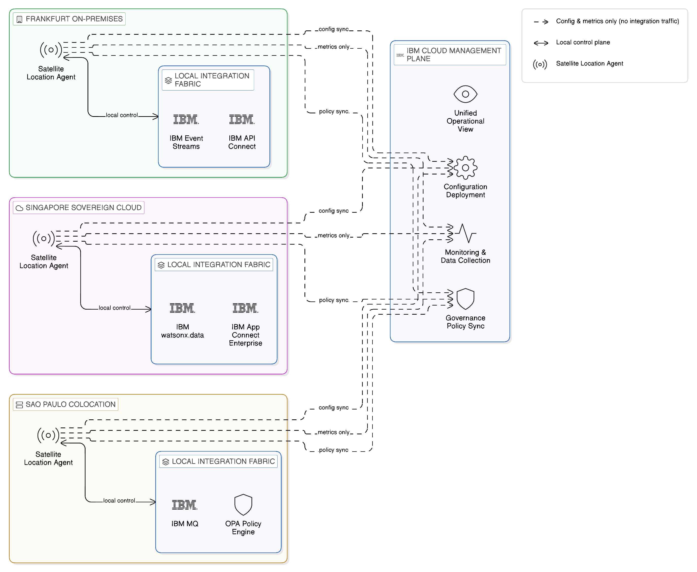
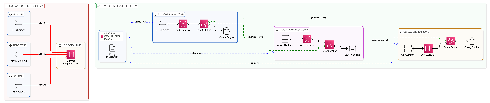
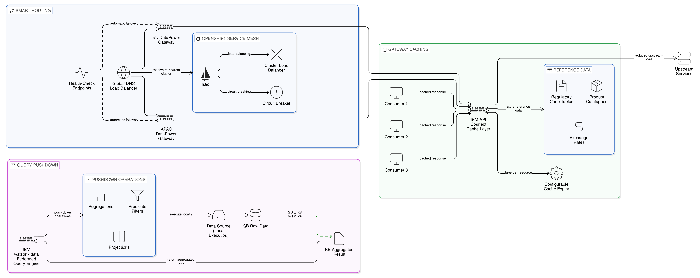
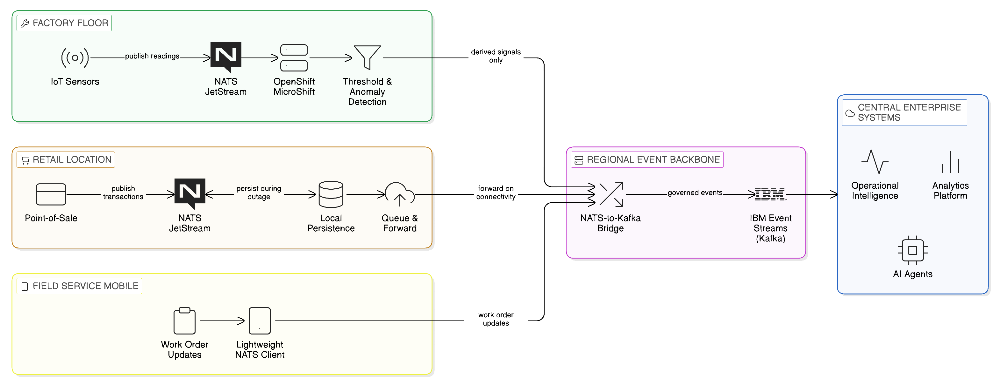
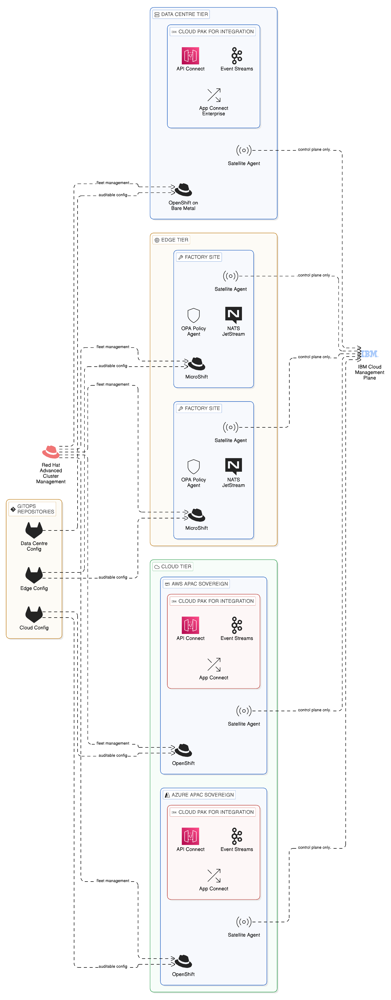

# Chapter 10 --- Network-Aware, Sovereign-Aware Integration Topologies

*Designing Integration Architectures That Are Conscious of Physics, Policy, and Failure*

The preceding chapter argued that the enterprise integration fabric provides the governance, operational, and catalogue layer that unifies the Data, Application Integration, and Event planes of a Zero-Copy Integration architecture into a coherent platform. That argument was largely organisational in character: it described how the fabric manages the relationships between producing and consuming domains, how it enforces access policies, and how it provides the cost attribution and observability capabilities that give the CIO and CTO visibility over the enterprise's integration estate. What the preceding chapter necessarily deferred was a question that is equally fundamental to the success of any real-world integration architecture: where, physically and logically, should the components of this fabric be deployed, and how should they be connected?

This question cannot be answered by organisational principles alone. The topology of an integration architecture — the geographic and logical arrangement of its components, the network paths that connect them, and the failure domains that bound each subsystem's availability — is determined not by governance preference but by the laws of physics, the realities of wide-area network behaviour, the requirements of data sovereignty, and the operational characteristics of the enterprise's business. A financial services firm whose trading systems must respond within microseconds has different topological requirements from a retail enterprise whose supply chain visibility platform aggregates data across dozens of supplier systems spanning multiple continents. Both are subject to data sovereignty obligations, both operate across multiple cloud environments, and both must design for resilience; but the specific topologies that serve them best are different in important ways.

This chapter addresses the topological dimension of Zero-Copy Integration: how the architecture should be arranged across the network, how sovereign boundaries should be reflected in the deployment model, how failure domains should be identified and used to design for resilience, and how the specific topological anti-patterns that afflict conventional integration architectures can be avoided. It begins by establishing the nature and scale of the topology problem in enterprise integration, before examining the physics of wide-area networks and their direct implications for integration design. It then describes the principles of regionally distributed topology design, the analysis of failure domains and resilience zones, and the techniques of smart routing, caching, and query pushdown that minimise the data transit that distributed topologies require. It addresses the sovereign topology — the explicit mapping of integration components to jurisdictional boundaries — and the specific challenge of edge computing environments where the integration architecture must extend beyond the data centre to factory floors, retail outlets, and mobile field operations. It concludes with an examination of IBM Cloud Satellite and Red Hat OpenShift as the platform capabilities that make sovereignty-conscious, resilience-conscious integration topology operationally feasible across the full diversity of the modern enterprise's infrastructure estate.

## 10.1 The Topology Problem in Enterprise Integration

Most enterprise integration architectures, when their actual topology is visualised, exhibit a pattern that is easy to recognise and whose problems are immediately apparent: they are hub-and-spoke designs in which a central integration platform — a single enterprise service bus, an API management gateway, or a data warehouse — acts as the intermediary through which all integration traffic passes. Every message flows through the hub; every data query is resolved by the hub; every integration event is brokered by the hub. The appeal of this topology is understandable. It concentrates governance and operational management in a single place, simplifying monitoring, policy enforcement, and troubleshooting. It provides a single point through which audit trails can be maintained and compliance reports generated. It enables central capacity planning, since all integration workloads are visible in one place.

The problems with the hub-and-spoke topology, however, are equally clear once the architecture is subjected to the scrutiny that the multi-cloud, multi-sovereign enterprise demands. The hub is a single point of failure: when it becomes unavailable, the integration capability of the enterprise is compromised, and the scope of that compromise may extend to systems and processes that the enterprise considers critical. The hub is a performance bottleneck: as the volume of integration traffic grows, the hub must scale to absorb it, and the cost of that scaling grows with the volume. The hub is a source of unnecessary data movement: data that could remain in its source system and be accessed in place is instead routed through the hub, creating the replication patterns that Zero-Copy Integration is designed to eliminate. And the hub creates egress: traffic that originates in one region, passes through a central hub in another, and is delivered to a consumer in a third region generates egress charges at each network boundary crossing, contributing to the egress cost accumulation described in Chapter 2.

These problems are not merely theoretical. For an enterprise operating at scale across multiple geographic regions and cloud providers, a centralised integration hub is both a commercial liability — through the egress costs it generates — and a sovereignty risk — through the jurisdictional boundaries it may cause data to cross. A query issued by a user in Germany that passes through a central integration hub in the United States before being resolved against a data source in Germany has crossed a jurisdictional boundary twice, potentially in violation of the data sovereignty obligations that apply to the data in question. This pattern is not uncommon in enterprises that established their integration architecture before data sovereignty became the pressing concern it is today, and the cost of restructuring that architecture is significant. The topology problem is therefore not a technical inconvenience but a strategic liability that compounds over time as the enterprise's geographic footprint grows, its regulatory obligations multiply, and the volume of its integration traffic increases.

## 10.2 The Physics of Wide-Area Networks and Their Integration Implications

Before examining the design of distributed integration topologies, it is necessary to establish an honest understanding of the physical constraints within which any distributed architecture must operate. The laws of physics impose limits on wide-area network performance that no architectural cleverness can circumvent — and integration architectures that are designed without awareness of these limits produce systems whose real-world performance is consistently worse than their designers expected.

The most fundamental physical constraint is the speed of light. Light travels through optical fibre at approximately 200,000 kilometres per second — roughly two-thirds of its speed in a vacuum, due to the refractive index of glass. A network packet travelling from London to Singapore, a distance of approximately 10,700 kilometres by great circle, takes a minimum of approximately 54 milliseconds at the speed of light in fibre, purely in propagation delay. In practice, routing overhead, queuing delay, and protocol processing add to this minimum, so that real-world round-trip latency between London and Singapore over a well-optimised network path typically falls in the range of 160 to 180 milliseconds. This is not a function of network quality or investment; it is a physical constraint. No amount of bandwidth investment will reduce the propagation component of latency below its physical floor.

The integration implications of this physical reality are direct and significant. An API call from a consuming system in Frankfurt to a service hosted in a data centre in Singapore carries a minimum round-trip latency of approximately 170 milliseconds before any application processing begins. If that API call is part of a synchronous user-facing transaction, the user perceives this as a slow response. If it is part of a high-frequency operational workflow that chains multiple API calls, the latency compounds: five sequential API calls across the same inter-continental path carry a minimum latency of approximately 850 milliseconds, exclusive of processing time. If the API gateway through which those calls are routed is itself hosted in a third location — as occurs in hub-and-spoke architectures where all traffic passes through a central hub — the latency compounds further.

The practical guidance this analysis produces for the integration architect is the proximity principle: integration processing should occur as close as possible to the systems and data being integrated, and traffic should traverse wide-area network paths only when the source and consumer genuinely reside in different locations. This is not a preference but a physical necessity for any integration architecture that must satisfy meaningful latency requirements. It is also, as [Chapter 9](09_chapter_integration_fabrics) established, a governance preference: integration processing that occurs locally within a sovereign zone does not generate cross-boundary data flows, and it is therefore more easily demonstrated to be compliant with the sovereignty obligations that apply to the data in question.

Wide-area networks are also characterised by variable reliability that has direct consequences for integration resilience design. Cloud provider networks are, by commercial SLA standards, highly reliable — major providers advertise availability figures in the range of 99.9% to 99.99% for their backbone network services. However, even at 99.99% availability, a network path experiences approximately 52 minutes of outage per year. For an enterprise integration architecture that relies on that path for critical business processes, 52 minutes of annual outage may be acceptable; for one that chains multiple such paths in series, the compound unavailability may not be. An integration topology that routes all traffic through a central hub across multiple wide-area network paths has a compounded availability that is the product of the availability of each path in the chain — a mathematical reality that frequently surprises organisations that have not explicitly modelled their end-to-end availability posture.

Bandwidth asymmetry is a further wide-area network characteristic with integration implications. Many enterprise network connections — particularly those connecting branch offices, manufacturing sites, or retail locations to central data centres — have substantially less bandwidth available for upload than for download, or have bandwidth that is effectively shared with other organisational traffic and subject to contention. An integration architecture that assumes symmetrical, uncontested bandwidth for all integration traffic will encounter unexpected performance constraints in these environments. The integration topology must therefore be designed with an understanding of the bandwidth characteristics of each network segment that integration traffic will traverse, and the volume of integration data must be engineered to fit within the available bandwidth — another argument for event-driven and federated access patterns that minimise data transit over constrained network paths.

## 10.3 Designing Regionally Distributed Topologies

The alternative to the hub-and-spoke topology is a distributed integration topology that places integration components in proximity to the systems and data they serve, routes integration traffic through the shortest available path between source and consumer, and maintains central governance without requiring central data transit. This topology is more complex to design and operate than a hub-and-spoke architecture, but it avoids the commercial, sovereignty, and resilience liabilities that hub-and-spoke architectures accumulate at scale.

The fundamental design principle of a distributed integration topology is the proximity principle established in the preceding section: integration processing should occur as close as possible to the systems and data being integrated, and traffic should only traverse wide-area network paths when the source and consumer genuinely reside in different locations. An API gateway that serves a set of microservices in a particular data centre should be deployed in that data centre, not in a remote cloud region. An event broker that distributes events to consumers in a particular availability zone should be deployed in that zone, not in a shared central cluster that consumers connect to across regional boundaries. A federated query engine that resolves queries against data sources in a particular jurisdiction should execute queries in that jurisdiction, not transmit the data to a remote engine for processing.

This proximity principle has direct implications for the deployment topology of each plane of the Zero-Copy Integration architecture. For the Data Plane, it implies that query execution engines — whether IBM watsonx.data, Trino, or Presto — should be deployed in the same region or availability zone as the data they query, so that query processing occurs in place and only query results traverse the network. For the Application Integration Plane, it implies that API gateways should be deployed per region or per data centre, enforcing access policies and protocol translation at the point of entry rather than routing traffic to a central gateway for processing. For the Event Plane, it implies that event brokers should be deployed in the zones that generate and consume events, with topic replication between zones used selectively and deliberately rather than as the default topology.

### 10.3.1 Regional Clusters and Zone Hierarchies

A practical distributed topology for a large enterprise will typically consist of multiple regional clusters, each containing the integration components required to serve the business processes and data assets of that region, connected by a set of controlled inter-regional channels that carry only the traffic that genuinely requires cross-regional transit. Within each regional cluster, an intra-zone topology further distributes components across the availability zones that make up the cluster, ensuring that the failure of any single zone does not compromise the integration capability of the region as a whole.

This hierarchical topology — zone within region within enterprise — mirrors the hierarchical failure domain model that is the foundation of resilient distributed systems design. Each level of the hierarchy is designed to be autonomous within its boundary: a zone can continue to provide its integration capability even if its connections to peer zones are interrupted; a region can continue to provide its integration capability even if its connections to peer regions are degraded. This autonomy is achieved not through replication of data across zones and regions — which would recreate the data sovereignty and egress cost problems that Zero-Copy Integration is designed to address — but through local caching of integration metadata, policy decisions, and frequently accessed reference data, combined with asynchronous synchronisation of state changes between zones and regions when connectivity is restored.

The governance model that operates within this hierarchical topology must be similarly distributed. Policy enforcement cannot rely on a central policy decision point if the topology is designed to allow regional autonomy during connectivity degradation: local policy enforcement components must be capable of making access control decisions based on locally available policy information. This is precisely the role that a distributed deployment of Open Policy Agent serves within the Zero-Copy Integration architecture: OPA instances deployed in each zone maintain local copies of the policies that govern that zone's integration assets, evaluate access requests against those policies without requiring a round-trip to a central policy service, and synchronise policy updates from the central governance layer when connectivity permits. The result is a governance posture that maintains consistent policy enforcement even during the network partitions and connectivity disruptions that the distributed topology is designed to survive.

## 10.4 Failure Domains and Resilience Zones

The concept of a failure domain — a boundary within which a failure can propagate, and beyond which its effects are contained — is central to the design of resilient distributed systems. In the context of an enterprise integration architecture, failure domains correspond to the boundaries within which a component failure, a network partition, or a software fault can affect the integration capability provided to consuming applications and users. Designing the topology of the integration architecture with failure domains in mind means ensuring that the components that serve the most critical business processes are distributed across multiple independent failure domains, so that the failure of any single domain does not prevent those processes from continuing.

For an integration architecture that spans multiple cloud providers, the natural failure domain boundaries are the availability zones of each cloud provider, the regions of each cloud provider, and the providers themselves. A design that deploys critical integration components in a single availability zone of a single cloud provider has a failure domain coextensive with that zone: a zone failure takes down the integration capability. A design that distributes those components across three availability zones of a single cloud provider has a failure domain coextensive with the cloud provider's regional failure: a provider-wide regional outage takes down the integration capability. A design that distributes components across two cloud providers has a failure domain bounded only by a simultaneous multi-provider outage, a scenario whose probability is low enough to represent an acceptable residual risk for most enterprises.

The practical challenge of designing across multiple failure domains is that components that must coordinate — an API gateway and the policy engine it consults, an event broker and the schema registry it validates against, a federated query engine and the metadata catalogue it resolves table names through — must be co-located within the same failure domain if coordination is to remain available during partial outages. This creates a tension between the resilience benefit of distribution across failure domains and the operational complexity of maintaining distributed components that must maintain consistent state. The resolution of this tension is the same in integration architecture as it is in distributed systems design generally: components whose coordination is on the critical path of integration requests must be co-located or must be designed to operate autonomously on locally cached state during periods of inter-domain connectivity degradation.

This analysis produces a practical design rule: every sovereign zone in the integration topology should contain a self-sufficient set of integration components — API gateway, event broker, policy engine, schema registry, and metadata cache — that can serve the integration requirements of that zone without requiring connectivity to any component outside the zone. Cross-zone communication is then reserved for the synchronisation of governance state — policy updates, schema changes, catalogue additions — and for the selective propagation of events or query results that genuinely require cross-zone distribution. The integration capability of the zone is never dependent on the availability of resources outside it; the quality and currency of its governance state may degrade during extended connectivity disruption, but the basic integration function continues.

### 10.4.1 IBM Cloud Satellite and Resilience Zone Management

IBM Cloud Satellite addresses the topological challenge of deploying enterprise-grade integration infrastructure across multiple locations — on-premises data centres, sovereign cloud regions, edge facilities, and public cloud availability zones — under a unified management and governance model. Satellite extends IBM Cloud services, including IBM Event Streams, IBM API Connect, and IBM OpenShift, to locations that the enterprise controls, allowing those services to operate with local autonomy whilst being governed and observed from the central IBM Cloud management plane.

The architectural model that Cloud Satellite provides is precisely the distributed execution, centralised governance model that the integration fabric requires. Each Satellite location — whether an on-premises data centre in Frankfurt, a sovereign cloud region in Singapore, or a co-location facility in São Paulo — runs an IBM Cloud Satellite location agent that connects the local infrastructure to the IBM Cloud management plane. IBM Cloud services deployed to that location operate on the local infrastructure, processing integration workloads locally, without routing operational data through IBM's cloud regions. The IBM Cloud management plane provides configuration deployment, monitoring data collection, and governance policy synchronisation, but does not route integration traffic through itself.

In the context of resilience zone design, Satellite enables the enterprise to establish integration capabilities in the locations that represent their natural failure domains — in the data centres, the sovereign cloud regions, or the edge facilities that house the systems being integrated — and to connect those capabilities into a coherent integration topology without requiring the central routing of integration traffic through IBM-operated regions. An IBM API Connect gateway deployed via Satellite in a Frankfurt data centre serves its local API consumers from that data centre, applying locally cached policies and maintaining local access logs, and synchronises its configuration and metrics with the central IBM Cloud management plane when connectivity permits. An IBM Event Streams broker deployed via Satellite in the same data centre serves its local event producers and consumers without routing events through a remote broker cluster, and participates in cross-zone topic mirroring only for the topics that genuinely require cross-zone propagation.

This model preserves the operational benefits of a centrally managed platform — consistent configuration, unified observability, central governance — whilst avoiding the topological liabilities of a centrally routed architecture. The enterprise's integration capability is distributed across the locations where it is needed, governed from the centre, and resilient to the failures that affect individual locations. For the technology leader evaluating the operational implications of this model, the key insight is that Cloud Satellite does not add complexity to the management of distributed integration infrastructure; it reduces it by providing a single management plane that spans all locations rather than requiring environment-specific tooling for each deployment.

## 10.5 Smart Routing, Caching, and Query Pushdown

The distributed topology described in the preceding sections requires that integration components be capable of making intelligent routing decisions: directing API requests to the nearest available gateway, routing event consumption to the local broker replica rather than a remote primary, and executing federated queries against the data source node that minimises both latency and cross-boundary data transit. These routing decisions cannot be made by a central routing controller, since the central controller itself represents a hub in the topology and a single point of failure. They must be made by distributed routing components that have sufficient information about the current state of the integration topology to make locally optimal decisions without central coordination.

For the Application Integration Plane, intelligent routing is most commonly realised through a combination of service mesh capabilities and DNS-based load balancing. A service mesh deployed within each regional cluster — Red Hat OpenShift Service Mesh, based on the Istio project, is the natural choice within an OpenShift environment — provides within-cluster routing, load balancing, and resilience behaviours such as circuit breaking and retry logic. Cross-cluster routing is managed through global load balancing, which resolves API endpoint hostnames to the nearest available gateway cluster based on the geographic location of the requesting client and the current health of each cluster's gateway. This provides the consumer with a consistent API endpoint that the routing infrastructure resolves to the nearest available gateway, without requiring the consumer to be aware of the multi-cluster topology. The IBM DataPower Gateway, deployed within Cloud Pak for Integration, participates in this routing infrastructure, with its health status exposed to the global load balancer through standard health-check endpoints that enable automatic failover when a gateway instance becomes unavailable.

Caching at the API gateway layer provides a further mechanism for reducing cross-boundary data transit and improving response times for high-frequency requests. Reference data — regulatory code tables, product catalogues, organisational hierarchies — that is requested frequently by multiple consumers and that changes infrequently is a natural candidate for gateway-level caching: the gateway caches the most recent response to a reference data query and serves subsequent requests from the cache until the cache entry expires, reducing the load on the upstream data service and the network traffic between the gateway and the service. The governance consideration for caching is the freshness guarantee: the cache expiry period must be set in accordance with the tolerance for stale data in the consuming application, and for data that is subject to regulatory requirements — tax tables, exchange rates used in financial reporting, regulatory reference codes — the freshness requirements may be strict. IBM API Connect's caching policies provide configurable cache control at the gateway level, with cache expiry and invalidation rules that can be tuned to the specific freshness requirements of each cached resource.

For the Data Plane, the concept of query pushdown is the key mechanism through which distributed topologies can minimise cross-boundary data transit. Query pushdown refers to the technique of executing as much of a query's processing as possible at the data source, so that only the final result — rather than the raw data from which the result is computed — is transmitted over the network. In a federated query architecture based on IBM watsonx.data or Apache Iceberg with a Trino query engine, pushdown is applied at the level of predicate filters, aggregations, and projections: a query that asks for the count of orders by product category for a specific date range will, with pushdown enabled, transmit only the count result from the data source to the query engine, rather than transmitting all order records for the date range and computing the count at the query engine.

Pushdown is not always achievable in full, since the capabilities of the data source and the complexity of the query determine what can be pushed down and what must be computed at the engine. But even partial pushdown — reducing the data transmitted from gigabytes to megabytes, or from millions of records to thousands — has significant implications for both the cost and the sovereignty profile of a distributed query architecture. Less data in transit means lower egress charges; less data crossing jurisdictional boundaries means a reduced risk of inadvertent sovereignty violations; and faster query execution means a better user experience for the analytics and operational intelligence consumers that the Data Plane serves. IBM watsonx.data's query optimiser is specifically designed to maximise pushdown effectiveness across the heterogeneous data sources that the platform federates, pushing predicates, aggregations, and projections to each source connector in a form that the source system can execute natively.

## 10.6 The Sovereign Topology: Keeping Data Within Boundaries

The integration topology described in this chapter is, at its foundation, a sovereignty-conscious topology: it is designed to ensure that data moves only across the boundaries that the organisation's sovereignty posture permits, and that integration traffic crosses jurisdictional lines only when the purpose of that crossing is legitimate and the data involved is authorised for cross-boundary transit. This sovereignty-conscious design requires that the topology be mapped against the organisation's regulatory obligations, and that the mapping be maintained as those obligations evolve.

In practice, the sovereignty mapping of an integration topology involves three activities. First, the identification of sovereignty zones: the geographic and organisational boundaries within which specific categories of data must reside and be processed, as determined by the applicable regulatory frameworks — GDPR, the EU Data Act, national data localisation requirements, sector-specific regulations such as those governing financial services and healthcare, and the enterprise's own data classification policy. Second, the assignment of integration components to sovereignty zones: determining which API gateways, event brokers, query engines, and metadata services are deployed within each zone, and ensuring that the components assigned to a zone are capable of serving all integration workloads that involve data within that zone without routing traffic outside it. Third, the definition of permitted cross-zone integration patterns: specifying the conditions under which integration traffic may legitimately cross sovereignty zone boundaries — for example, when the data involved is explicitly classified as non-personal, when a data sharing agreement or regulatory exemption authorises the transfer, or when the data is aggregated or anonymised to a degree that removes the sovereignty obligation.

These three activities produce a sovereign topology map that serves as both an architectural specification and a compliance artefact: it documents where each integration component is deployed, which data flows cross which boundaries, and what authorisation or classification justifies each cross-boundary flow. This map should be maintained in the enterprise's integration fabric catalogue as part of the metadata associated with each integration asset, so that governance teams can audit the sovereign topology as the architecture evolves and consuming teams can understand the sovereignty implications of the integration assets they are considering. The sovereign topology map is not a document produced once and forgotten; it is a living governance artefact that must be updated whenever an integration asset is created, modified, or retired, and reviewed whenever the applicable regulatory framework changes.

The practical challenge of maintaining the sovereign topology map is that the integration estate of a large enterprise evolves continuously: new APIs are created, new event topics are added, new data sources are federated. Each of these additions must be assessed against the sovereign topology to determine whether it creates new cross-boundary data flows that require regulatory authorisation. IBM's Knowledge Catalog, with its data classification and data lineage capabilities, provides part of the technical foundation for this ongoing assessment: by tracking the data classifications associated with each integration asset and the lineage of data flows through the integration estate, it enables governance teams to identify when a new data flow crosses a boundary in a way that may require additional regulatory scrutiny. IBM API Connect's governance workflow provides the process mechanism through which new API assets that might cross sovereign boundaries are reviewed before they are published to the integration catalogue.

## 10.7 Edge Computing Topologies: Extending Integration to the Periphery

The discussion of integration topology to this point has focused primarily on the deployment of integration components across data centres, sovereign cloud regions, and public cloud availability zones. This is the topology that most enterprise integration discussions address, and it represents the majority of enterprise integration traffic by volume. However, an increasingly significant proportion of enterprise data originates not in data centres but at the physical periphery of the enterprise: on factory floors where IoT sensors monitor production processes, in retail locations where point-of-sale systems process customer transactions, in field service vehicles where mobile workers access and update operational systems, and in remote facilities where connectivity to the enterprise network is intermittent and bandwidth is constrained.

These edge environments present integration topology challenges that differ in character from those of the data centre and cloud deployment scenarios. The integration components deployed at the edge must operate in environments where computing resources are constrained, network connectivity is unreliable, and physical security cannot match the standards of a managed data centre. The data generated at the edge is often high-volume and time-sensitive — sensor readings, transaction logs, operational events — and must be processed locally before transmission to the central enterprise systems, both to reduce the bandwidth required for transmission and to enable local operational decisions that cannot wait for a round-trip to the central enterprise.

The Zero-Copy principle applies at the edge as well as in the data centre, though its expression differs. At the edge, Zero-Copy means processing data locally as close as possible to its origin, transmitting only the events, aggregates, and alerts that genuinely require central awareness rather than raw sensor data streams that the central enterprise has no capacity to process. An industrial IoT deployment that transmits every sensor reading from a production line to a central data store creates both a bandwidth problem — the volume of raw sensor data may exceed available connectivity — and an integration problem, since the central enterprise has no practical use for millions of individual sensor readings; it requires the exceptions, the aggregates, and the events that indicate significant operational conditions. The edge integration architecture that implements the Zero-Copy principle transmits these derived signals rather than the raw data from which they are computed, reducing both bandwidth consumption and the volume of data that must be stored and governed centrally.

NATS, introduced in [Chapter 7](07_chapter_zero_copy_event_layer) as the lightweight edge messaging technology of the Zero-Copy Event Plane, is particularly well suited to edge integration environments. Its binary protocol, minimal resource requirements, and NATS JetStream's local persistence capability make it deployable on the constrained computing resources that characterise edge devices and edge servers. Events generated locally at the edge are published to a local NATS JetStream cluster, processed by local consumer applications that implement the operational logic appropriate to the edge environment, and selectively forwarded to the central Kafka-based event backbone when connectivity permits. During periods of connectivity loss — which are more frequent and more extended at the edge than in the data centre — the local NATS JetStream cluster provides local durability, retaining events until connectivity is restored and forwarding them to the central backbone without loss. This edge-to-core event propagation model is the event-driven expression of the Zero-Copy principle at the periphery of the enterprise.

Red Hat OpenShift extends to edge environments through Red Hat OpenShift MicroShift, a lightweight distribution of OpenShift designed for deployment on edge devices with constrained resources. MicroShift provides the Kubernetes-compatible runtime environment required to run containerised integration components — NATS JetStream, lightweight Debezium CDC instances, local policy enforcement agents — on edge hardware without the full resource requirements of a conventional OpenShift cluster. The consistency of the OpenShift deployment model across data centre and edge environments is operationally significant: the same deployment tooling, the same configuration management, and the same security controls apply at the edge as in the data centre, reducing the edge-specific operational expertise that would otherwise be required and ensuring that governance policies are enforced consistently across the full integration topology.

For the technology leader designing an integration topology that spans data centre, cloud, and edge environments, the practical guidance is to treat the edge not as a separate integration system but as the outermost tier of the hierarchical distributed topology described in this chapter. The hierarchy of zone within region within enterprise extends to include edge locations as sovereign micro-zones within their regional parent: edge devices and edge servers are assigned to the regional sovereignty zone in which they physically operate, governed by the same OPA policy framework as the data centre components in that zone, and connected to the regional event backbone and data access infrastructure through the same governed channels as other zone participants. The edge is not an ungoverned periphery; it is the most challenging tier of a consistently governed distributed topology.

## 10.8 Red Hat OpenShift Everywhere: A Platform for Sovereign Topologies

The topological principles described in this chapter presuppose a platform capable of deploying containerised workloads across diverse infrastructure environments — private data centres, sovereign cloud regions, edge facilities, and public cloud zones — with consistent management, security, and operational tooling. Red Hat OpenShift provides this platform. OpenShift's design as a Kubernetes distribution that operates consistently across bare metal, virtualised infrastructure, private cloud, and public cloud environments makes it uniquely suited to the role of the integration topology's execution substrate.

OpenShift clusters deployed across the locations that constitute the enterprise's sovereignty zones form the execution environment for the integration components of those zones. IBM Cloud Pak for Integration, deployed on OpenShift, provides the API management, event streaming, and data integration capabilities that each zone requires, with a configuration model that is consistent across environments and a governance model that extends from the central integration fabric to each zone's local deployment. OpenShift's multi-cluster management capabilities, provided through Red Hat Advanced Cluster Management, give the integration platform team a single view of all clusters across all zones, with the ability to deploy, configure, and update integration workloads consistently across the topology from a central management interface. This centralised management of a distributed execution environment is precisely what the integration fabric model requires: the governance and management consistency of a centralised platform, without the topological liabilities of centralised execution.

Red Hat Advanced Cluster Management extends this capability further through its integration with the GitOps deployment model — the practice of managing cluster configuration and workload deployment through version-controlled Git repositories, with automated reconciliation ensuring that the running state of each cluster matches the declared state in the repository. In the context of a sovereign integration topology, GitOps provides an important governance mechanism: the configuration of each zone's integration components — the API policies, the event broker configuration, the OPA policy bundles — is defined in version-controlled repositories whose change history is auditable. When a governance team needs to demonstrate to a regulator that the sovereignty controls applicable to a specific zone were properly configured at a specific point in time, the GitOps repository provides the authoritative record. The running state of the cluster was derived from that repository, and the history of changes to the repository provides the evidence of governance control that the audit requires.

The combination of OpenShift as the execution substrate, Cloud Pak for Integration as the integration capability layer, and IBM Cloud Satellite as the management extension mechanism provides the enterprise with a sovereignty-aware, resilience-conscious integration topology that can be operated with a single, coherent operational model regardless of the diversity of the underlying infrastructure. This is not a trivial capability: the alternative — managing heterogeneous integration deployments across diverse environments with environment-specific tooling — is both operationally expensive and a source of the inconsistencies that undermine governance and create security gaps. When each environment is managed through different tooling with different operational procedures, the governance of the overall topology is the weakest of its individually governed components. When all environments are managed through a consistent platform and tooling model, the governance of the topology is as strong as the platform's governance capabilities — which, in the case of the IBM and Red Hat platform described here, are specifically designed to meet the sovereignty and compliance requirements of regulated enterprises.

## 10.9 Topological Anti-Patterns to Avoid

A discussion of integration topology design would be incomplete without examining the anti-patterns that most commonly afflict real-world integration architectures. These are not merely theoretical failure modes; they are patterns that the author has observed repeatedly in enterprise integration estates, often as the result of design decisions that appeared reasonable in their original context but that accumulated liabilities over time as the enterprise grew, its regulatory environment evolved, and its technology landscape changed.

The first and most prevalent anti-pattern is the accidental hub: the integration component that was designed as a zonal service but that gradually accumulated dependencies from components outside its zone until it became, in practice, the hub through which all integration traffic passed. This pattern arises when the governance discipline of the fabric is insufficient to prevent the creation of cross-zone dependencies, when the operational convenience of a well-functioning central component causes teams to route traffic through it opportunistically, or when a component is deployed centrally to serve one domain and then extended to serve adjacent domains without explicit architectural review. The remedy is not technical but governance: the integration fabric's access control policies must explicitly govern cross-zone routing, and the creation of new cross-zone dependencies must require governance approval that assesses the sovereignty, performance, and resilience implications of the proposed dependency.

The second anti-pattern is the governance-free edge: the edge deployment that is treated as outside the scope of the enterprise's integration governance because it operates in a constrained environment where the full governance infrastructure is considered impractical to deploy. This pattern creates precisely the security and compliance exposure that governance exists to prevent: edge devices that process sensitive operational data without access control policies, edge event streams that cross jurisdictional boundaries without the content filtering that the applicable sovereignty framework requires, and edge integration flows that accumulate data locally without the retention controls that the enterprise's data protection obligations mandate. The remedy is the hierarchical governance model described in this chapter: edge deployments as the outermost tier of the distributed topology, governed by the same policy framework as data centre deployments, with the governance infrastructure right-sized to the edge environment's constraints through lightweight OPA deployments, local schema registries, and JetStream-based event governance.

The third anti-pattern is the unaudited cross-boundary flow: the integration path that crosses a sovereignty zone boundary without the corresponding governance artefact — the data sharing policy, the regulatory authorisation, the data classification assessment — that would justify the crossing. This pattern arises most commonly through the gradual evolution of integration flows: a flow that was originally confined within a single zone is extended to serve a consumer in another zone without explicit governance review, or an event topic that originally contained only non-personal data is modified to include personal attributes without reassessing the sovereignty implications of the existing mirroring configuration. The remedy is the sovereign topology map, maintained as a living governance artefact in the integration fabric catalogue and reviewed whenever integration assets change, combined with the automatic lineage tracking that IBM Knowledge Catalog provides to alert governance teams when data flows evolve in ways that may create new cross-boundary exposure.

## 10.10 Summary and Architectural Imperatives

This chapter has examined the topological dimension of Zero-Copy Integration: how the architecture should be arranged across the network, how sovereign boundaries should be reflected in the deployment model, and how the specific topological challenges of distributed multi-cloud environments — network physics, failure domain design, smart routing, and edge integration — should be addressed. The argument developed through the chapter may be summarised in five claims.

First, the topology of an integration architecture is determined not by governance preference but by the laws of physics, the realities of wide-area network behaviour, the requirements of data sovereignty, and the operational characteristics of the enterprise's business. An integration topology designed without explicit awareness of these constraints will consistently underperform its designers' expectations and accumulate commercial, sovereignty, and resilience liabilities over time.

Second, the hub-and-spoke integration topology — the dominant pattern in most enterprise integration estates — is structurally incompatible with the sovereignty, resilience, and economic disciplines of the Zero-Copy enterprise. It creates single points of failure, performance bottlenecks, unnecessary data movement, and cross-boundary data flows that may violate the applicable sovereignty framework. The distributed topology, with local execution by default and central governance without central data transit, addresses all of these liabilities.

Third, failure domain design is not a resilience enhancement but a foundational design requirement. Every sovereign zone in the integration topology should contain a self-sufficient set of integration components capable of serving that zone's integration requirements without external connectivity, and the failure domain boundaries of the topology should be explicitly mapped and designed against.

Fourth, query pushdown, gateway-level caching, and event-driven edge integration are the specific technical mechanisms through which the distributed topology minimises the cross-boundary data transit that generates egress costs and sovereignty exposure. These mechanisms are not optional optimisations; they are the means by which the Zero-Copy principle is realised in the specific context of distributed network topology.

Fifth, edge computing environments require an extension of the integration topology's hierarchical governance model to the periphery of the enterprise, treating edge deployments as the outermost tier of a consistently governed distributed topology rather than as ungoverned periphery outside the scope of enterprise governance.

Several architectural imperatives emerge from this analysis. The first is the explicit design of the integration topology against a documented sovereignty zone map before deployment: the topology must reflect the enterprise's regulatory obligations from its initial design, because retrofitting sovereignty controls to an existing topology is substantially more costly and disruptive than building them in from the start. The second is the adoption of IBM Cloud Satellite and Red Hat OpenShift as the consistent execution substrate for all integration topology tiers — data centre, cloud, and edge — ensuring that governance policies, security controls, and operational tooling are consistent across the full topology rather than varying by environment. The third is the implementation of query pushdown as the default operational mode for all federated data access across zone boundaries, minimising the volume of data that traverses sovereign boundaries and reducing the egress cost and sovereignty exposure of the distributed architecture. The fourth is the establishment of a topological anti-pattern review process as part of the integration fabric's governance discipline, ensuring that the accidental hub, the governance-free edge, and the unaudited cross-boundary flow are identified and remediated before they accumulate into structural liabilities.

The chapter that follows extends the architectural framework to the observability, lineage, and audit dimensions of the Zero-Copy enterprise, examining how the distributed topology described in this chapter can be made fully visible, traceable, and auditable for the governance and compliance requirements of the regulated enterprise.
