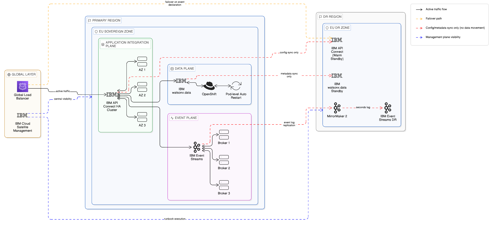
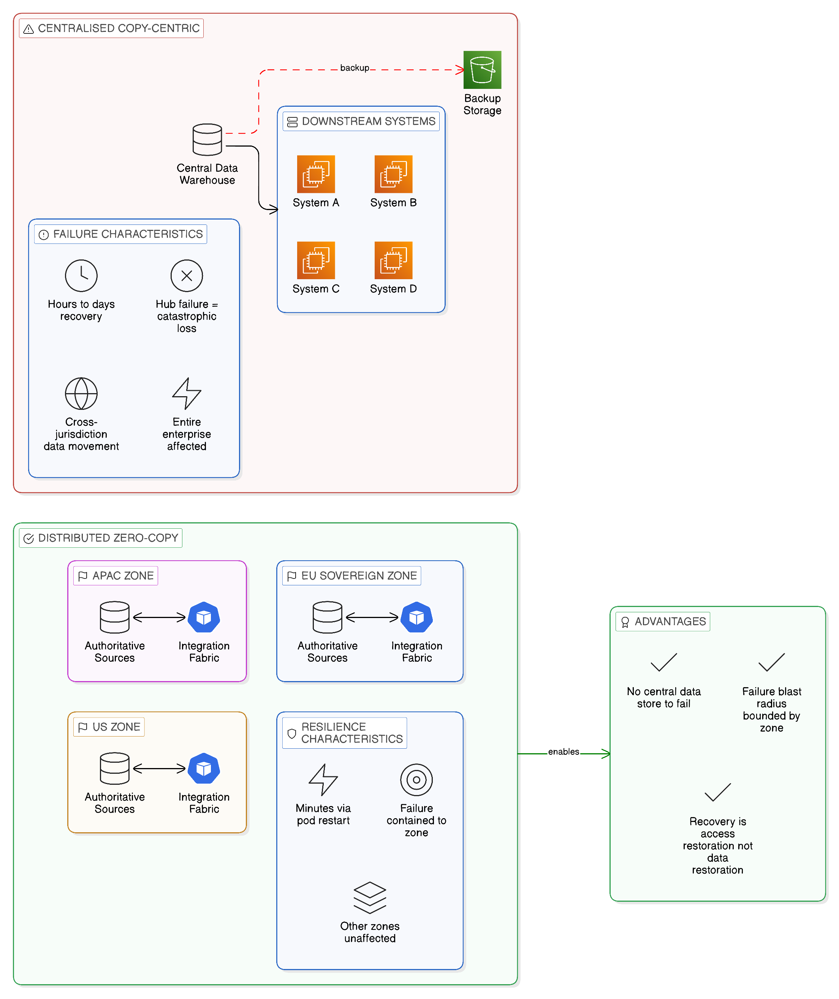
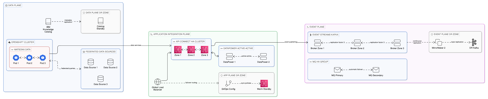
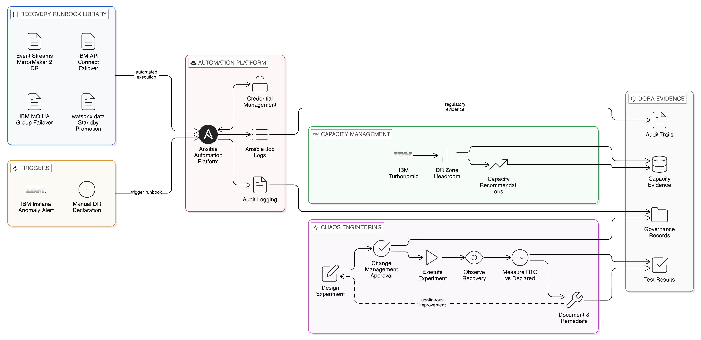
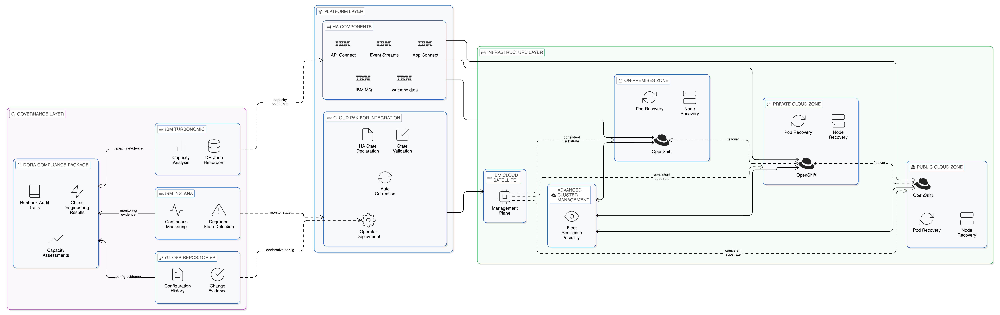

# Chapter 12 --- Business Continuity, Disaster Recovery, and Zero-Copy Resilience

*Designing for Operational Continuity in a Distributed, Sovereign, Multi-Cloud Architecture*

*Figure 12.1: BC/DR architecture for a sovereign Zero-Copy enterprise—primary EU zone with three-plane HA configurations, DR zone within the same jurisdiction receiving synchronised configuration and MirrorMaker 2 event replication, global load balancer failing over on event declaration, with IBM Cloud Satellite managing both zones from a single plane while maintaining sovereignty boundaries throughout recovery.*

The preceding chapters have established the technical, topological, governance, and observability foundations of a Zero-Copy Integration architecture. They have described how data is accessed in place through federated query engines, how APIs and events mediate service interactions without replicating data between systems, how the integration fabric unifies these capabilities under a coherent governance and operational model, how the topology is arranged to honour sovereign boundaries and survive failure, and how observability and lineage are maintained through the recording of access events rather than the tracking of data copies. What has not yet been addressed is a challenge that, for regulated enterprises in particular, is as pressing as any of the technical considerations examined so far: what happens when components of this architecture fail, and how is the enterprise's integration capability restored within the timeframes that its operational continuity obligations demand?

Business continuity and disaster recovery in a distributed, sovereignty-conscious integration architecture present challenges that differ materially from those of a centralised architecture. In a hub-and-spoke integration estate, the BC/DR challenge is straightforward in its structure, even if it is operationally demanding: the hub is the single point of criticality, and recovery planning is concentrated on restoring the hub to service. In a distributed Zero-Copy architecture, the challenge is more nuanced: criticality is distributed across multiple planes, multiple zones, and multiple integration components, each with its own failure modes, its own recovery characteristics, and its own interactions with the governance and sovereignty constraints that the architecture must respect even during a recovery event. A recovery procedure that restores integration capability by routing traffic through a temporary hub, or by recovering data from a backup in a different jurisdiction, may resolve the operational interruption whilst creating a sovereignty violation — a worse outcome than the interruption itself in regulatory terms.

This chapter examines business continuity and disaster recovery for the Zero-Copy Integration enterprise. It begins by establishing the regulatory and operational context that drives BC/DR requirements, with particular attention to the Digital Operational Resilience Act and the Basel Committee's operational resilience standards that are reshaping continuity planning in financial services and beyond. It then examines the specific resilience characteristics of the Zero-Copy architecture, and the ways in which distributed design creates inherent resilience advantages over centralised alternatives. It addresses the recovery objectives — RTO and RPO — that govern the design of recovery mechanisms for each component of the integration estate, the specific high-availability and disaster recovery patterns that apply to the Data, Application Integration, and Event planes, and the role of IBM MQ, IBM Event Streams, IBM Cloud Satellite, and Red Hat OpenShift in delivering the resilience capabilities that those patterns require. It examines the governance of recovery procedures — runbook automation, chaos engineering, and recovery testing in a sovereignty-conscious environment — and concludes with the summary and architectural imperatives that flow from the analysis.

## 12.1 The Regulatory and Operational Context for Integration Resilience

The obligation to maintain operational continuity is not merely a sensible risk management practice; for an increasing number of enterprise sectors it is a direct regulatory requirement carrying material consequences for non-compliance. The landscape of operational resilience regulation has evolved substantially in the decade since the 2008 financial crisis, and the trajectory of that evolution is towards more prescriptive requirements, tighter recovery timeframes, and greater boardroom accountability for the continuity of critical business services.

The European Union's Digital Operational Resilience Act, which entered into force for in-scope financial entities from January 2025, represents the most comprehensive and prescriptive operational resilience framework yet enacted. DORA requires financial entities — banks, insurers, investment firms, and their critical third-party technology providers — to identify their critical or important functions, map the information and communication technology assets that support those functions, assess the resilience of those assets to disruption, and demonstrate that they can recover critical functions within timeframes consistent with their agreed recovery objectives. Critically, DORA extends these requirements to the ICT third-party providers on which financial entities depend, requiring both the entities and their providers to maintain written contractual arrangements that specify recovery time and recovery point objectives, and to test those recovery capabilities through realistic exercises including full recovery tests. For an enterprise whose integration estate is the backbone of its critical business services, DORA effectively mandates that the resilience of the integration architecture be designed, tested, and evidenced to a standard that satisfies regulatory examination.

The Basel Committee on Banking Supervision's Principles for Operational Resilience and the related Principles for Sound Management of Operational Risk set out the expectations of banking supervisors globally for the resilience of bank operations. BCBS 239, the Committee's Principles for Effective Risk Data Aggregation and Risk Reporting, is particularly relevant to the integration architecture, because it requires that banks be capable of aggregating their risk data in a timely and accurate manner during periods of stress — precisely when their integration infrastructure is most likely to be operating in a degraded or partially recovered state. A bank that cannot aggregate its risk data because its integration fabric has failed or is recovering is non-compliant with BCBS 239 regardless of how technically elegant its Zero-Copy architecture may be during normal operations. The resilience of the integration fabric is therefore a risk data governance requirement as well as an operational continuity requirement.

Beyond financial services, the Network and Information Security Directive (NIS2) extends operational resilience requirements to operators of essential services across energy, transport, health, digital infrastructure, and other critical sectors throughout the European Union. The UK's Critical National Infrastructure protection framework and equivalent regimes in other jurisdictions impose comparable obligations. For the enterprise technology leader, the practical implication of this regulatory landscape is that operational resilience is not a discretionary investment that competes for budget against feature development and infrastructure modernisation; it is a compliance requirement whose absence carries regulatory, reputational, and commercial consequences.

## 12.2 Zero-Copy Architecture as Inherently More Resilient

Before examining the specific BC/DR mechanisms that the Zero-Copy Integration architecture requires, it is worth establishing the inherent resilience advantages that the architecture provides over centralised, copy-centric alternatives. These advantages are not incidental; they flow directly from the architectural principles that distinguish Zero-Copy Integration from its predecessors, and they should be recognised and credited in the enterprise's risk and resilience assessments.

The most significant inherent resilience advantage is the absence of the centralised data store. In a conventional integration architecture that centralises data in a shared data warehouse, data mart, or replication hub, the failure of that central store is a catastrophic event: it removes access to data that may be critical to dozens or hundreds of downstream systems and business processes simultaneously. The recovery of the central store is typically a lengthy, complex, and high-risk operation involving the restoration of large volumes of data from backup, the verification of data integrity across all replicated datasets, and the re-establishment of the replication pipelines that feed the store. During the recovery period, all downstream systems that depend on the central store are operating without their data — or, in the best case, on a stale copy that may be days old. The Zero-Copy architecture eliminates this category of failure by eliminating the central store: data resides in its authoritative source systems, and the failure of any single component of the integration fabric may degrade the quality or performance of data access but does not destroy the data itself, because the data was never held in the failed component. Recovery from integration fabric component failures, in the Zero-Copy model, is recovery of access capability rather than recovery of data — a fundamentally different and generally faster recovery challenge.

The second inherent resilience advantage is the distributed topology described in [Chapter 10](10_chapter_network_aware_topologies). A Zero-Copy integration architecture that follows the proximity principle — deploying integration components in the sovereign zones where the data and consumers they serve are located, with zone autonomy during connectivity degradation — is inherently resilient to the category of wide-area network failures and inter-zone connectivity disruptions that represent a significant proportion of real-world integration disruptions. A zone that can serve its local consumers without depending on connectivity to other zones is unaffected by failures in those zones or in the network paths between them. This autonomy does not emerge automatically; it requires deliberate design, as described in the preceding chapters. But when it is correctly designed, it provides a resilience characteristic that centralised integration architectures simply cannot match: the failure scope of any single disruption is bounded by the zone in which it occurs, and the rest of the integration estate continues to function.

The third inherent resilience advantage is the alignment between the distributed topology and the sovereign boundary map. Because the Zero-Copy architecture is designed to confine data processing within sovereign zones as a matter of normal operation, the constraints that sovereignty requirements impose on recovery procedures — the prohibition on recovering data by routing it through an out-of-jurisdiction facility, the prohibition on restoring a backup held in a different jurisdiction's infrastructure — are already incorporated into the design. The recovery topology is consistent with the normal operating topology, which simplifies both the design of recovery procedures and the demonstration to regulators that recovery procedures respect the applicable sovereignty obligations.

*Figure 12.2: Centralised copy-centric architectures create catastrophic single points of failure requiring lengthy data restoration across potentially violating jurisdictional boundaries—contrasted with Zero-Copy's distributed zones where failure blast radius is bounded, recovery restores access capability not data, and the sovereignty topology in recovery is identical to normal operations.*

## 12.3 Recovery Objectives and Their Implications for Integration Design

The design of BC/DR capabilities for an integration architecture begins with a clear articulation of the recovery objectives that govern the design. Two measures are conventional in this analysis: the Recovery Time Objective, which specifies the maximum acceptable period of disruption before a capability must be restored, and the Recovery Point Objective, which specifies the maximum acceptable amount of data loss measured in time — the point in history to which data can be restored without unacceptable business consequence. These measures, whilst familiar to every enterprise architect, have specific and sometimes counter-intuitive implications when applied to a Zero-Copy integration estate.

For the RTO, the relevant question in a Zero-Copy context is not "how long does it take to restore the data?" but "how long does it take to restore the integration access capability?" Since the data remains in its authoritative source systems and is not lost as a consequence of integration fabric component failures, the RTO for most Zero-Copy integration scenarios is determined by the time required to restore the component's processing capability — to bring up a replacement API gateway instance, to re-establish a Kafka broker, to restart a federated query engine — rather than the time required to restore data from backup. This recovery time is, in most cases, significantly shorter than the data restoration time that governs recovery in a copy-centric architecture: a containerised integration component can typically be restored within minutes on a pre-provisioned infrastructure, where a large data warehouse restoration may take hours or days.

The RTO must, however, account for the specific dependencies of the failing component. An API gateway that can be restored to a pre-provisioned standby node within minutes may have a dependency on a policy enforcement service or a schema registry that has a longer recovery time; the end-to-end RTO of the API gateway capability is determined by the longest recovery time in its dependency chain, not by the recovery time of the gateway component alone. The analysis of integration component RTOs must therefore be a dependency-chain analysis rather than a component-by-component analysis, and the recovery architecture must ensure that the dependencies of each critical component are themselves designed for the recovery time that the component's RTO requires.

For the RPO, the relevant question in a Zero-Copy context is more nuanced. For the Data Plane, where data is accessed in place and not stored in integration components, the RPO for data content is effectively zero — the data has not moved, so there is no data loss from integration component failures. For the Application Integration Plane, the RPO relates to the in-flight API transactions that were in process at the time of failure — transactions that were accepted but whose processing was interrupted. For the Event Plane, the RPO relates to the events that were published to a broker but not yet consumed by all subscribers at the time of failure — events that must be preserved through the failure to ensure that no consumer misses an event that was committed to the event log. These distinctions require that the RPO analysis treat each integration plane separately, with recovery mechanisms designed to the specific RPO characteristics of each.

## 12.4 High Availability and Disaster Recovery Patterns by Integration Plane

### 12.4.1 The Data Plane: Resilient Federated Access

The resilience design of the Data Plane centres on ensuring that federated query capability is available within the RTO even when individual components of the query infrastructure fail. IBM watsonx.data, deployed on Red Hat OpenShift, benefits from OpenShift's native pod-level and node-level resilience: the platform's operator-based deployment model automatically detects the failure of a query engine pod and schedules a replacement, typically within seconds for a pod failure on a healthy node or within minutes for a node failure requiring pod rescheduling to a healthy node. For planned maintenance that requires taking query engine nodes offline, OpenShift's rolling update mechanism allows the update to be applied without interrupting query service, by updating nodes in sequence whilst the remaining nodes continue to serve queries.

The more complex resilience challenge for the Data Plane is the failure of the underlying data sources that federated queries access. A federated query engine that executes queries against data sources can only serve queries against a source that is currently available; if a source becomes unavailable, queries that require data from that source will fail or return partial results. The resilience design must therefore address both the availability of the query engine itself and the availability of the data sources it federates. For data sources that are themselves deployed in high-availability configurations — active-passive database clusters, object storage services with regional redundancy — the federated query engine benefits from those configurations directly, since it accesses the data through the standard database or object storage interface that the high-availability configuration makes available. For data sources that do not have inherent high-availability configurations, the integration architect must assess whether the RTO for queries that depend on those sources can be satisfied by manual intervention to restore the source, or whether additional resilience measures — a standby replica of the source, a circuit breaker that routes queries to a degraded result set when the primary source is unavailable — are required.

IBM Knowledge Catalog's metadata store, which governs the access policies and data classifications that the Data Plane enforces, is itself a critical dependency of the query infrastructure: if the catalogue is unavailable, policy evaluation fails, and access to governed data sources may be blocked. Knowledge Catalog's deployment on OpenShift provides pod-level resilience through automatic restart; for zone-level DR, the catalogue's metadata must be replicated to a standby instance in the DR zone, with recovery procedures that ensure the standby's metadata is current to within the RPO before it assumes the active role.

### 12.4.2 The Application Integration Plane: API Gateway and Mediation Resilience

The Application Integration Plane's resilience design must address the availability of each component in the API lifecycle: the API gateway that enforces access policies and routes requests, the API management platform that publishes and governs API contracts, and the integration flow engines that mediate between API consumers and the backend systems they access.

IBM API Connect's deployment on OpenShift provides a graduated high-availability model that scales from single-node deployments suitable for development environments to full multi-node, multi-zone clusters that can tolerate the failure of individual nodes and, with appropriate deployment configuration, the failure of an entire availability zone. In a multi-zone deployment, API Connect's gateway and management components are distributed across two or three availability zones within a region, with the platform's operator managing the distribution and ensuring that the failure of any single zone does not interrupt API traffic or management operations. This within-region high availability covers the majority of real-world disruption scenarios — hardware failures, network partition within a region, planned maintenance — within an RTO measured in seconds to minutes.

For cross-region disaster recovery — the scenario in which an entire cloud region becomes unavailable — the recovery architecture must provide an API Connect instance in a secondary region that can assume traffic within the required RTO. The pattern for cross-region API gateway DR in a Zero-Copy architecture is the warm standby: a secondary API Connect deployment is maintained in the DR region in a reduced-capacity configuration, with the API configurations and access policies synchronised from the primary region. Upon declaration of a DR event, the warm standby is scaled to full capacity and the global load balancer is updated to route API traffic to the DR region. The synchronisation of API configurations and policies between primary and DR regions is the critical operational dependency of this pattern: if the secondary region's configuration is not current to within the RPO at the time of the DR event, the restored capability may reflect stale access policies that do not represent the current governance state. IBM API Connect's configuration export and import capability, combined with a GitOps-based configuration synchronisation process as described in [Chapter 10](10_chapter_network_aware_topologies), provides a reliable mechanism for maintaining policy currency in the DR region without requiring the continuous operation of a replication stream between the two regions.

IBM DataPower Gateway, which provides the enterprise-grade security gateway layer for API traffic, shares its resilience characteristics with API Connect in multi-node deployments. DataPower's active-active clustering allows multiple gateway nodes to share API traffic with automatic failover upon node failure, with the gateway cluster's shared policy configuration ensuring consistent enforcement across all active nodes. For sovereign zone deployments where DataPower gateways are deployed within specific jurisdictional boundaries, the recovery architecture must ensure that DR failover respects those boundaries — routing traffic to the DR zone within the same jurisdiction rather than to a recovery facility in a different jurisdiction.

IBM App Connect Enterprise, the integration flow execution engine, is deployed as containerised integration servers on OpenShift. The same OpenShift pod and node resilience that applies to watsonx.data applies here: pod failures are recovered automatically through restart, and node failures trigger rescheduling of integration server pods to healthy nodes within the zone. For high-availability deployments that require continuous integration flow execution without interruption during pod restarts, App Connect Enterprise supports active-active deployment with load-balanced message distribution across multiple integration server instances, ensuring that the failure of any single instance does not interrupt message processing.

### 12.4.3 The Event Plane: Kafka and MQ High Availability

The Event Plane presents the most complex resilience design challenge of the three integration planes, because the event log is itself a stateful persistence layer: events committed to the log must be durable, and the RPO for event data is typically zero — no committed event may be lost, even in the event of a failure that takes one or more broker nodes offline.

IBM Event Streams, as an enterprise distribution of Apache Kafka, implements Kafka's replication model to provide this durability guarantee. In a Kafka cluster, each partition of each topic is replicated across a configurable number of broker nodes, with one replica designated the leader and the remainder serving as followers. Writes are acknowledged to producers only when a configurable number of replicas — the in-sync replica set — have committed the write, ensuring that the loss of any single broker node does not result in data loss for partitions whose replica factor and in-sync replica count are configured appropriately. For an Event Plane deployment that requires zero RPO, the minimum configuration is a replication factor of three with a minimum in-sync replica count of two: a cluster of at least three broker nodes, deployed across three availability zones to ensure zone-level failure tolerance, with writes acknowledged when at least two replicas have committed.

The recovery from a broker node failure in this configuration is automatic: the Kafka controller detects the failed broker, elects new leaders for the partitions whose leaders were on the failed broker from among the remaining in-sync replicas, and resumes normal operation. Consumers that were reading from the failed broker's partitions reconnect to the new leaders and continue consuming without intervention. This automatic recovery from single-node failures makes the Event Plane inherently resilient to the category of hardware and software failures that represent the most common causes of real-world service disruption, and is the primary argument for maintaining a Kafka broker cluster with sufficient replica distribution rather than relying on a single-broker deployment with manual failover procedures.

For cross-region disaster recovery of the Event Plane, the mechanism provided by IBM Event Streams is MirrorMaker 2, the Apache Kafka-native tool for inter-cluster topic replication. MirrorMaker 2 continuously replicates the contents of specified topics from a primary Event Streams cluster to a secondary cluster in the DR region, maintaining the consumer group offset mappings that allow consumers in the DR region to resume consumption from the correct position in the replicated topic upon failover. The RPO for cross-region Event Plane DR with MirrorMaker 2 is determined by the replication lag between the primary and secondary clusters: under normal operating conditions with a well-provisioned replication channel, replication lag is typically measured in seconds, providing an RPO comfortably within the tolerance of most business processes. The RTO for consumer failover — the time from declaring a DR event to consumers successfully reading from the DR cluster's replicated topics — is determined by the time required to update consumer configuration to point to the DR cluster and to restart consuming applications, which with automated runbook execution is typically achievable within minutes.

IBM MQ provides the transactional messaging resilience model for the class of integration requirements that demands exactly-once, ordered message delivery with transactional guarantees that Kafka's at-least-once delivery model does not provide. IBM MQ's high availability configurations support several deployment patterns that span the spectrum from simple automatic recovery to continuous availability. IBM MQ's native high availability capability, available in queue manager HA groups on OpenShift, deploys the queue manager across multiple instances with automatic failover upon instance failure, maintaining message persistence through the shared storage or replication mechanism configured for the deployment. For the most demanding continuity requirements — those that cannot tolerate even a brief interruption for queue manager failover — IBM MQ's uniform cluster capability supports active-active message distribution across multiple queue managers, allowing application connections to be load-balanced and automatically rerouted upon queue manager failure without interrupting message processing.

*Figure 12.3: HA and DR patterns for each integration plane—Data Plane with OpenShift automatic pod restart and Knowledge Catalog metadata replication achieving near-zero RPO, Application Integration Plane with API Connect multi-zone HA and cross-region warm standby, and Event Plane with Kafka replication factor three for zero-RPO durability and MirrorMaker 2 for cross-region topic replication.*

## 12.5 Recovery Governance: Runbooks, Automation, and Chaos Engineering

The technical design of high-availability and disaster recovery mechanisms is a necessary but insufficient foundation for operational resilience. The organisations that satisfy DORA and comparable regulatory frameworks are those that demonstrate not merely that their recovery mechanisms exist but that they are tested, that the test results evidence the ability to recover within the declared RTO and RPO, and that the people, processes, and tooling required to execute recovery are available and effective when genuinely needed. Recovery governance — the discipline of designing, maintaining, testing, and improving recovery procedures — is as important as the technical resilience architecture itself.

Recovery runbooks, the documented procedures that operations teams follow during a recovery event, must be maintained for each critical component of the integration estate, at a level of detail that allows the procedure to be executed correctly by a competent operator who is not a specialist in the specific component being recovered. A runbook that specifies "restore the API gateway from backup" without specifying how to access the backup, which tools to use, what configuration parameters to supply, and how to verify that the restored gateway is operating correctly is not an operational runbook; it is a description of an intent. The quality of a recovery runbook is measured by whether an operator who has not previously executed it can follow it successfully under the time pressure and stress of a real recovery event. This standard is demanding, and meeting it requires that runbooks be written with that operator in mind, reviewed by operators who are unfamiliar with the component, and validated through regular testing under realistic conditions.

The automation of recovery runbooks is the natural next step in resilience maturity: where a manual runbook specifies the steps that a human operator executes, an automated runbook executes those steps through scripted or workflow-based automation that reduces both the recovery time and the risk of human error during high-pressure recovery events. Red Hat Ansible Automation Platform, which is tightly integrated with the Red Hat OpenShift environment in which the Zero-Copy integration components are deployed, provides the execution environment for automated recovery runbooks in OpenShift-based deployments. Ansible playbooks can be written to perform the recovery steps for each integration component — scaling up a warm standby API Connect deployment, updating global load balancer configuration, triggering MirrorMaker 2 failover — and executed from the central automation controller with the appropriate credential management and audit logging that regulated industries require. The automation controller's job log provides the execution evidence that demonstrates to regulators that recovery procedures were executed correctly and completely, addressing the DORA requirement for audit trails of recovery test and execution activities.

Chaos engineering — the practice of deliberately introducing controlled failures into the integration estate to validate its resilience and identify resilience gaps before a real failure does so — is the most demanding and the most valuable component of a mature recovery governance programme. The basic premise of chaos engineering, popularised by Netflix's Chaos Monkey programme, is that the only way to know with confidence that a system will recover from a failure is to cause the failure and observe the recovery. Examining the recovery architecture in theory and testing it under controlled conditions with notice will identify many resilience gaps; only unexpected failures — or deliberately introduced failures that simulate them — will identify the gaps that careful design and polished test procedures miss. For a Zero-Copy integration estate, chaos engineering experiments can range from the straightforward — terminating individual integration component pods to validate automatic recovery — to the complex — simulating the failure of an entire availability zone by blocking network traffic between zones to validate zone-level autonomy. The governance of chaos engineering in a regulated environment requires that experiments be designed and executed with appropriate change management oversight, that the scope and potential impact of each experiment be documented and approved before execution, and that recovery from each deliberately introduced failure be verified to be within the declared RTO.

IBM Turbonomic's analysis of integration workload resource behaviour, described in [Chapter 11](11_chapter_observability_lineage_audit) in the context of FinOps, also contributes to recovery governance by providing continuous assessment of whether the integration estate has sufficient resource capacity to absorb a failover event. A failover from a primary zone to a DR zone requires that the DR zone's infrastructure have sufficient capacity to serve the combined workload of both zones: if the DR zone's capacity is fully utilised serving its own integration workloads, there is no headroom to absorb the failover traffic. Turbonomic's capacity analytics identify this headroom deficiency proactively, providing the evidence base for the infrastructure investments that are required to ensure that DR capacity is genuine rather than notional.

*Figure 12.4: Recovery governance combining component-specific automated runbooks executed through Red Hat Ansible Automation Platform with full audit logging for DORA evidence, a chaos engineering cycle of controlled failure experiments validating actual versus declared RTO, and IBM Turbonomic capacity analysis confirming DR zone headroom is genuine—together satisfying the testing, evidence, and audit standards that operational resilience regulations mandate.*

## 12.6 Sovereignty Constraints on Recovery Procedures

The interaction between BC/DR recovery procedures and data sovereignty obligations deserves specific treatment, because it is a source of operational risk that is easy to overlook in the focus on technical recovery mechanisms. A recovery procedure that is technically effective but sovereignty-non-compliant is not, from a regulatory perspective, an acceptable recovery procedure: it trades one compliance risk for another, and in some regulatory contexts the sovereignty violation may have more severe consequences than the operational disruption it was designed to resolve.

The most common sovereignty violation in recovery procedures is jurisdictional boundary crossing during data restoration. When a recovery procedure restores a component's state from a backup held in a different jurisdiction — because the backup was stored in a geographically distant DR facility without regard for the data sovereignty classification of the backed-up data — it may inadvertently transfer regulated personal data across a jurisdictional boundary, violating the applicable data localisation requirement. The Zero-Copy architecture's principle that data remains in its authoritative source location provides partial protection: since integration components do not hold copies of the data they process, there is typically no data content to restore from backup, and the restoration of an integration component from its configuration backup does not involve the transfer of regulated data. This protection is, however, conditional on the discipline with which the Zero-Copy principle has been applied: an integration component that logs request and response payloads — a common observability practice that conflicts with Zero-Copy discipline — may hold copies of regulated data in its log store, and restoring the component from a backup of those logs in a different jurisdiction creates a sovereignty violation.

The practical guidance for recovery governance in a sovereign context is therefore threefold. First, the backup and recovery architecture for each integration component must be reviewed against the sovereignty classification of any data that the component might hold in its configuration, log, or state stores, and the backup storage location must be within the same jurisdiction as the component's primary deployment. Second, the Zero-Copy discipline of not logging regulated data payload content must be enforced as a governance control rather than a design guideline, with Guardium monitoring and OPA policy enforcement used to detect and prevent payload logging in governed integration flows. Third, recovery procedures must be validated against the sovereignty requirements applicable to each zone before they are approved for operational use, with the sovereignty assessment documented as part of the runbook's governance record.

## 12.7 The Integrated Resilience Architecture

The BC/DR capabilities described in the preceding sections — plane-specific high-availability configurations, cross-region DR mechanisms, automated runbook execution, chaos engineering validation, and sovereignty-aware recovery governance — are not independent measures to be applied in isolation. They constitute an integrated resilience architecture that spans the full integration estate, providing layered protection against failure at every level from individual pod failures to full regional disasters.

The highest layer of this architecture is the IBM Cloud Satellite and Red Hat OpenShift infrastructure layer, which provides the consistent deployment substrate across all sovereign zones and the global management capability that allows the central operations team to observe and act across the full integration topology. Satellite's ability to deploy and manage IBM Cloud services across on-premises, private cloud, and public cloud environments ensures that the high-availability configurations and DR mechanisms described in this chapter are available regardless of the infrastructure tier on which the integration components are deployed. A queue manager HA group running on OpenShift in an on-premises Frankfurt data centre has the same automatic failover capability as one running on OpenShift in an IBM Cloud region; the operational procedures for managing both are consistent; and the Satellite management plane provides the central visibility and control that allows the operations team to monitor resilience posture and execute recovery procedures across all zones from a single interface.

Below the infrastructure layer, the integration platform layer — IBM Cloud Pak for Integration with its constituent components — provides the application-level resilience configurations described in Section 12.4. The operator-based deployment model that Cloud Pak for Integration uses on OpenShift is the mechanism through which HA configurations are specified declaratively, validated continuously by the operator, and automatically corrected when the running state deviates from the desired state. An operations team that has correctly specified the HA configuration for each integration component in the Cloud Pak for Integration operator configuration does not need to manually intervene in most single-node failure scenarios: the operator detects the deviation and corrects it autonomously. The operations team's resilience governance responsibility shifts, in this model, from reactive recovery to proactive validation — ensuring that the operator configuration is correct, that the underlying infrastructure can support the desired HA configuration, and that the automated recovery mechanisms are exercised regularly through chaos engineering to verify that they work as intended.

The governance layer — the policies, runbooks, audit logs, and test records that constitute the evidential record of the enterprise's operational resilience — is the component of the integrated resilience architecture that is most directly visible to regulators and most directly relevant to DORA compliance assessments. IBM Instana's continuous monitoring of all integration components provides the operational visibility that allows the operations team to detect degraded resilience states — a replica falling out of the in-sync set, a standby instance failing to synchronise, a DR zone's capacity headroom falling below the threshold required for failover — before they manifest as incidents. IBM Turbonomic's resource analysis provides the capacity evidence that supports investment decisions about DR infrastructure. And the GitOps-based configuration management of the integration estate provides the change history that demonstrates, in response to regulatory enquiry, that the resilience configuration was maintained consistently and that changes were managed through an appropriately governed process.

*Figure 12.5: The integrated Zero-Copy resilience architecture spanning three layers—IBM Cloud Satellite and OpenShift infrastructure providing consistent deployment and automatic recovery, Cloud Pak for Integration operator-based HA configuration continuously enforcing desired state, and a governance layer of Instana monitoring, Turbonomic capacity analysis, and GitOps change history that together produce the DORA-compliant evidence record regulators require.*

## 12.8 Summary and Architectural Imperatives

This chapter has examined business continuity and disaster recovery for the Zero-Copy Integration enterprise, arguing that the distributed architecture's inherent resilience advantages must be supplemented by deliberate recovery architecture design, governance discipline, and regular testing to satisfy the increasingly prescriptive operational resilience requirements of the regulatory environment. The argument developed through the chapter may be summarised in five claims.

First, the regulatory landscape — led by DORA in financial services but extending through NIS2 and sector-specific frameworks across multiple industries — has transformed operational resilience from a risk management best practice into a compliance requirement with material consequences for non-compliance. The integration estate, as the backbone of critical business services, is a primary subject of these requirements, and its resilience architecture must be designed to satisfy the evidence and testing standards that regulators expect.

Second, the Zero-Copy architecture provides inherent resilience advantages over centralised alternatives: the absence of a central data store eliminates the most catastrophic single point of failure in conventional integration estates, the distributed topology limits the blast radius of any single failure to the zone in which it occurs, and the alignment between the operational topology and the sovereign boundary map ensures that recovery procedures can be designed to respect sovereignty constraints without requiring special-case exception procedures.

Third, the RTO and RPO analysis for a Zero-Copy integration estate must be conducted plane by plane, with the specific failure modes and recovery characteristics of each plane — Data, Application Integration, and Event — analysed separately and the component dependency chains mapped to identify the longest recovery time in each chain. The headline RTO of a Zero-Copy integration component is typically shorter than an equivalent copy-centric component because the recovery challenge is access restoration rather than data restoration.

Fourth, the IBM MQ, IBM Event Streams, IBM API Connect, and IBM watsonx.data high-availability and disaster recovery configurations described in this chapter — from within-region pod and zone resilience to cross-region warm standby and MirrorMaker 2-based event topic replication — provide the technical resilience mechanisms for each integration plane. These mechanisms must be configured explicitly, validated through chaos engineering, and operated with runbook automation to deliver the recovery timeframes that business and regulatory requirements demand.

Fifth, sovereignty constraints on recovery procedures are as binding as sovereignty constraints on normal operations, and recovery procedures that violate jurisdictional boundaries are not acceptable alternatives to operational disruption. The Zero-Copy principle — that data remains in its authoritative source and is not held in integration components — is the primary mechanism that simplifies sovereignty-compliant recovery design; it must be enforced as a governance control rather than relied upon as a design assumption.

Several architectural imperatives emerge from this analysis. The first is the dependency-chain analysis of RTO and RPO for each critical integration component before the DR architecture is designed, ensuring that the recovery architecture addresses the longest dependency chain rather than the recovery time of the component in isolation. The second is the deployment of all critical integration components in HA configurations on Red Hat OpenShift, with replica distribution across availability zones and operator-based desired-state enforcement that provides automatic recovery from single-node and single-zone failures without manual intervention. The third is the establishment of cross-region DR mechanisms — warm standby for API Connect and watsonx.data, MirrorMaker 2-based replication for Event Streams, MQ HA groups within jurisdiction — with their configuration managed through GitOps version control and their currency validated through regular automated synchronisation verification. The fourth is the implementation of an automated runbook execution capability through Red Hat Ansible Automation Platform, with execution audit logs that provide the evidential record of recovery procedure execution required for DORA and comparable regulatory frameworks.

The chapter that follows examines the sovereign operating model — the organisational, process, and governance structures through which the Zero-Copy enterprise manages its integration estate as a strategic, governed capability rather than a project-by-project technical resource.
