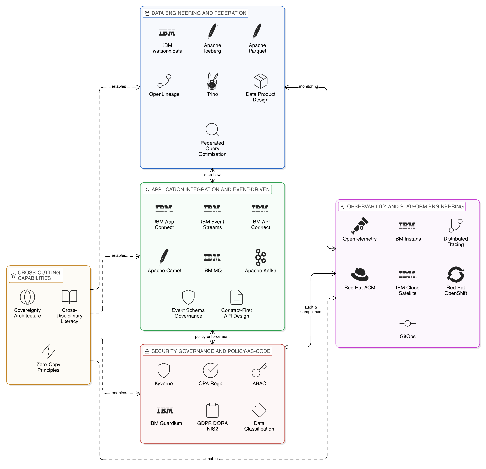
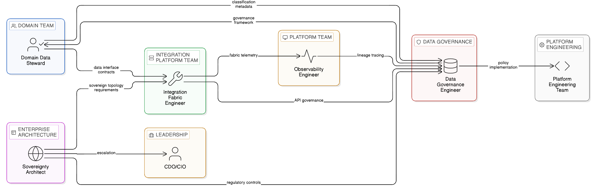
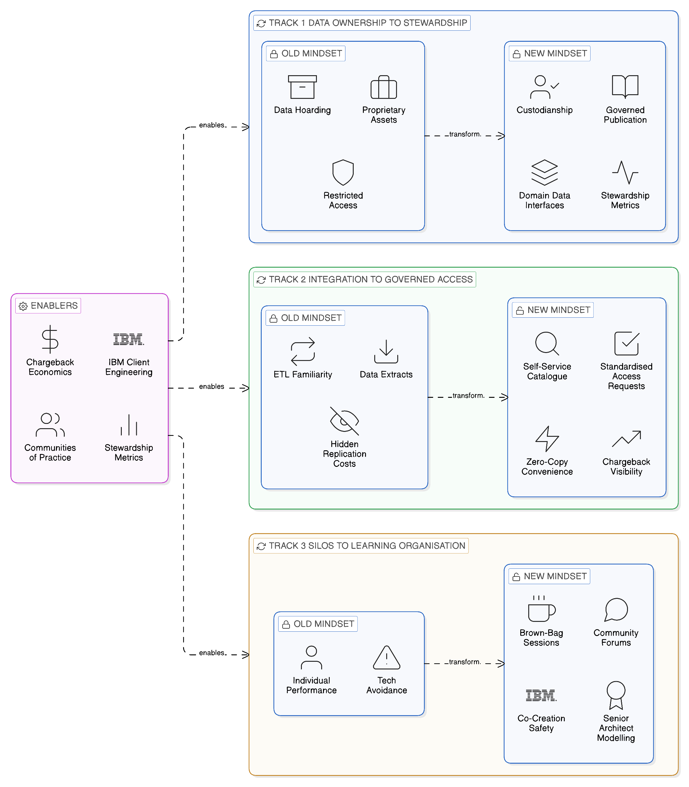
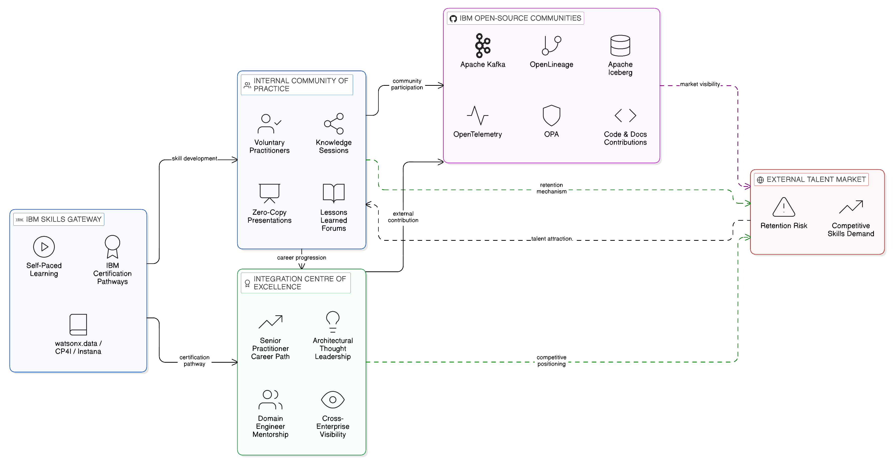
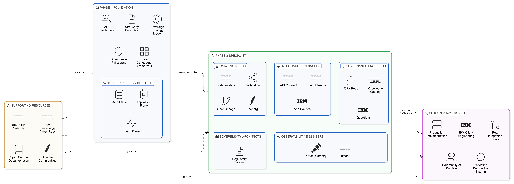

# Chapter 14 --- Skills, Culture, and Talent for a Sovereign, Resilient Enterprise

*Building the Human Foundation of the Zero-Copy Architecture*

It is a persistent temptation of enterprise architecture to treat the technology and the organisation as separable concerns: define the architecture, acquire the platforms, and trust that the teams who operate those platforms will acquire the skills they need through experience. This approach has produced a reliable pattern of outcome across the history of enterprise digital transformation: technically capable platforms operated by teams whose skills are calibrated to the architectures those platforms were designed to supersede. The event-driven integration platform operated by engineers who think in terms of batch data transfers. The federated query engine accessed through patterns that replicate the operational characteristics of the centralised data warehouse. The API gateway managed by processes that reflect the point-to-point integration discipline it was introduced to replace.

The Zero-Copy Integration architecture described in this book is sufficiently different from the copy-centric integration paradigm that has dominated enterprise IT for the past three decades that it cannot be effectively operated by teams whose skills, mental models, and working practices were formed within that paradigm. The cognitive shift required — from thinking about data as a transferable asset that flows between systems to thinking about data as a local resource that is accessed in place through governed interfaces — is not merely a technical skill that can be acquired through a training course. It is a change in the fundamental model through which architects, engineers, and data stewards understand their work, and it requires deliberate, sustained investment to achieve at the organisational level.

This chapter examines the skills, cultural shifts, and talent development strategies that the Zero-Copy enterprise requires. It begins with the skills landscape — the specific technical competencies that the architecture demands across each of its constituent disciplines — before examining the new roles that the sovereign-by-design operating model creates and the distinct accountability and skill requirements each carries. It addresses the cultural shifts that must accompany the technical transformation, the communities of practice and talent retention strategies that sustain Zero-Copy capability over the long term, and the training pathways through which enterprises can build these capabilities systematically. It closes with the summary and talent imperatives that translate the analysis into actionable guidance for the technology leader and the HR function that supports the transformation programme.

*Figure 14.1: Zero-Copy Enterprise Skills Landscape — four discipline pillars (Data Engineering and Federation, Application Integration and Event-Driven, Security Governance and Policy-as-Code, Observability and Platform Engineering) with their key tools and competencies, unified by a cross-cutting sovereignty architecture and Zero-Copy principles layer.*

## 14.1 The Skills Landscape of the Zero-Copy Enterprise

The Zero-Copy architecture requires a distinctive combination of skills that spans disciplines which, in many enterprises, have historically been organised into separate, sometimes isolated, functional groups. Data engineering, application integration, event-driven architecture, data governance, cloud infrastructure, observability engineering, and security engineering are each established disciplines with their own practitioner communities, career pathways, and bodies of knowledge. The Zero-Copy architecture requires practitioners who can work across the boundaries of these disciplines — not generalists who lack depth in any domain, but specialists who understand the interaction effects between their domain and adjacent domains sufficiently to design integration patterns that are coherent across the full architectural stack.

### 14.1.1 Data Engineering and Federation Skills

Within the data engineering discipline, the shift from ETL-centric to query-federation-centric data access requires practitioners to develop proficiency in distributed query optimisation: understanding the cost models of federated SQL execution, the conditions under which query pushdown to source systems is beneficial, the trade-offs between in-place computation and the selective materialisation of intermediate results, and the performance implications of cross-zone network latency on federated queries spanning multiple sovereign locations. These are not skills that transfer directly from experience with centralised data warehousing, where the query optimiser operates against a single co-located dataset and the cost model is relatively well understood; federated query optimisation requires an understanding of the heterogeneous cost landscape of distributed data sources and the network paths between them.

Proficiency in Apache Iceberg, Delta Lake, and Apache Parquet as open table formats that underpin the query federation model is increasingly essential. The data engineer who understands Iceberg's metadata architecture — the manifest files, partition specifications, and column-level statistics that enable partition pruning and predicate pushdown across files in object storage — is equipped to design data products that can be federated efficiently. The data engineer who does not understand this architecture will produce data products that federated query engines must scan in their entirety, generating unnecessary network traffic and query latency that undermine the performance case for Zero-Copy analytics. Experience with IBM watsonx.data — the enterprise-grade federation engine that orchestrates queries across heterogeneous sources including Iceberg tables, relational databases, and object storage — provides the production context in which these theoretical foundations are validated against the performance, governance, and operational realities of enterprise-scale workloads.

The data engineering skill set must also encompass the data product design discipline introduced in [Chapter 9](09_chapter_integration_fabrics): the practice of defining data assets not as raw tables or extract files but as versioned, contracted, SLA-governed products with defined schemas, quality expectations, and access interfaces. A data engineer who can design a data product that satisfies the consuming team's analytical requirements, is governed by the applicable access controls, emits lineage metadata in the OpenLineage format that IBM Knowledge Catalog ingests, and is optimised for federated access from IBM watsonx.data is a practitioner whose skills are fully aligned with the Zero-Copy architecture. Developing this combination of data product thinking, governance awareness, and federation optimisation proficiency from a starting point of traditional ETL engineering requires a structured investment that most enterprises underestimate.

### 14.1.2 Application Integration and Event-Driven Skills

Within the application integration discipline, the shift from point-to-point integration to contract-first, fabric-governed integration requires practitioners to develop proficiency in API design principles — the versioning strategies, backward compatibility conventions, and schema management practices that allow APIs to evolve without breaking consuming applications — and in the governance frameworks through which APIs are published, discovered, and access-controlled within the integration fabric. The IBM API Connect platform provides the production environment in which these principles are applied, but the principles themselves are not platform-specific: an engineer who has internalised the discipline of contract-first API design will apply it effectively regardless of which gateway or management platform the enterprise deploys.

Event-driven architecture design — the design of event schemas, the selection of appropriate event granularity, the management of event ordering and idempotency, and the choice between event notification and event-carried state transfer patterns — is a skill that is distinct from but related to both API design and data engineering, and which is insufficiently developed in many enterprise integration teams. Engineers trained primarily in synchronous request-response integration often struggle with the conceptual shift that event-driven architecture demands: designing for eventual consistency rather than immediate confirmation, designing consumers that are idempotent and resilient to out-of-order delivery, and designing event schemas that evolve without breaking existing consumers. IBM Event Streams and IBM MQ provide the production platforms on which these skills are developed and exercised; Apache Kafka's extensive practitioner community provides the supporting educational resources through which the conceptual foundations can be built.

The integration flow design discipline — the design of mediation, transformation, and routing logic within IBM App Connect Enterprise and its Camel-based connector ecosystem — requires a specific combination of technical skills: understanding of the message formats, protocols, and data models of the source and target systems being integrated; proficiency in the transformation and routing DSL of the integration platform; and the architectural judgement to design integration flows that are observable, testable, and maintainable rather than merely functional. The last of these is the most difficult to develop, because it requires experience with the operational consequences of poorly designed integration flows — the unmaintainable flow that cannot be modified without breaking consuming systems, the unobservable flow that cannot be diagnosed during an operational incident — that can only be gained through exposure to production integration estates of sufficient complexity.

### 14.1.3 Security, Governance, and Policy-as-Code Skills

Within the security and compliance discipline, the shift from perimeter-based security to policy-as-code enforcement within a distributed architecture requires practitioners to develop proficiency in attribute-based access control frameworks, in the Open Policy Agent policy engine that has become the de facto standard for policy-as-code in cloud-native environments, and in the data classification frameworks that determine which data assets are subject to which access policies. OPA's Rego policy language is not difficult to learn at a basic level, but writing Rego policies that correctly express complex access control requirements — policies that account for data classification, consumer identity, access purpose, geographic context, and time-of-day constraints simultaneously — requires both technical proficiency in the language and a clear understanding of the regulatory and governance requirements the policy is intended to enforce.

The interaction between data governance policy and data sovereignty regulation — the mapping from regulatory requirements such as GDPR Article 46 on international data transfers, the EU Data Act's data sharing obligations, and sector-specific regulations such as DORA and the NIS2 Directive, to the technical controls that implement them within the integration fabric — is a cross-disciplinary capability that requires legal literacy alongside technical proficiency. The practitioner who understands both the regulatory requirement and its technical implementation is rare and highly valuable. Enterprises that cannot develop this capability internally must ensure that it is available through a combination of legal counsel, compliance function expertise, and the Integration Centre of Excellence's policy translation work described in [Chapter 13](13_chapter_sovereign_operating_model); but at least a small number of architects within the enterprise should have sufficient fluency in both domains to evaluate whether a proposed technical control adequately addresses the underlying regulatory requirement.

IBM Guardium expertise — the ability to configure and operate IBM's data security monitoring platform for comprehensive data access audit and anomaly detection — is a specific skill requirement that the Zero-Copy architecture creates. A Guardium specialist understands how to define monitoring policies that capture the access events required for regulatory compliance without generating unmanageable volumes of audit data; how to configure correlation rules that identify anomalous access patterns across multiple data sources simultaneously; and how to integrate Guardium's audit stream with IBM Knowledge Catalog's governance metadata to produce the correlated governance record described in [Chapter 11](11_chapter_observability_lineage_audit). This is a specialist capability that is unlikely to exist within most enterprise security teams at the outset of a Zero-Copy transformation programme, and it should be identified as a specific skills investment requirement.

### 14.1.4 Observability and Platform Engineering Skills

The observability dimension of the Zero-Copy architecture, examined in detail in [Chapter 11](11_chapter_observability_lineage_audit), creates a skill requirement that is relatively new to enterprise integration teams but is increasingly recognised as a first-class engineering discipline in its own right. The observability engineer in a Zero-Copy enterprise must understand distributed tracing — how OpenTelemetry trace context propagates through API calls, event headers, and federated query metadata, and how IBM Instana assembles those propagated contexts into end-to-end transaction traces. They must understand dynamic baseline modelling — how Instana's AI-powered anomaly detection constructs normal-behaviour baselines and identifies deviations, and what configuration is required to tune the sensitivity of the anomaly detection to the enterprise's specific performance characteristics. And they must understand the federated observability architecture — how zone-level Instana instances collect and retain telemetry within sovereign boundaries whilst contributing aggregated metrics to the central operational view — so that they can design the observability deployment to respect the same sovereignty constraints as the integration architecture it monitors.

The platform engineering skills required to operate Red Hat OpenShift clusters across the distributed topology described in [Chapter 10](10_chapter_network_aware_topologies) represent a further significant skills investment. OpenShift administration — cluster provisioning, operator lifecycle management, network policy configuration, certificate management, and the GitOps-based configuration management that underpins the integration architecture's governance — is a mature discipline with a well-developed training and certification pathway. IBM Cloud Satellite administration — the extension of IBM Cloud services to on-premises and edge infrastructure — is a more specialised capability that requires both OpenShift proficiency and an understanding of the Satellite connectivity model and its security implications. Red Hat Advanced Cluster Management, the multi-cluster management platform described in [Chapter 10](10_chapter_network_aware_topologies), requires its own operational expertise: the ability to design and maintain cluster policies that are consistent across all clusters in the enterprise's sovereign topology, and to diagnose and resolve the configuration drift and policy violations that the platform's continuous reconciliation surfaces.

## 14.2 New Roles in the Zero-Copy Operating Model

The sovereign-by-design operating model described in [Chapter 13](13_chapter_sovereign_operating_model) creates organisational roles that do not exist in the traditional, centralised enterprise architecture. These roles are not merely renamed versions of existing roles; they have distinct accountability boundaries, distinct skill requirements, and distinct working relationships that reflect the distributed structure of the operating model. Five roles merit detailed description.

### 14.2.1 The Domain Data Steward

The Domain Data Steward is the individual within a business domain who is accountable for the governance of the domain's data assets. The Data Steward defines the data interface contracts through which the domain's data is accessible to consuming teams, maintains the data classification metadata that determines which access controls apply to each data asset, and is responsible for responding to data subject requests and regulatory inquiries that concern the domain's data. This role requires a combination of business domain knowledge — an understanding of the business processes that generate the domain's data and the business context that determines its sensitivity — and data governance knowledge sufficient to implement the enterprise's governance standards within the domain. It does not require deep technical implementation skills, but it does require sufficient technical literacy to communicate the domain's data governance requirements to the engineering team responsible for implementing the domain's data interfaces, and to evaluate whether the implemented controls genuinely address the regulatory requirements they are intended to satisfy.

The Data Steward role is, in most organisations, a new accountability that must be assigned to existing individuals rather than filled by new hires. The most effective Data Stewards are typically senior business analysts, product owners, or data architects within the domain who have both the business context and the governance awareness to fulfil the role's cross-cutting obligations. Organisations that assign the Data Steward role to junior team members as an additional responsibility, or that treat it as a purely technical configuration role rather than a governance accountability, consistently underperform on data quality and compliance outcomes relative to those that invest in genuinely senior, empowered Data Stewards.

### 14.2.2 The Integration Fabric Engineer

The Integration Fabric Engineer is a platform team role responsible for the design, implementation, and operation of the shared integration fabric infrastructure. This role requires depth in the IBM Cloud Pak for Integration platform — API Connect, Event Streams, App Connect, MQ, and DataPower Gateway — as well as in the open-source ecosystem of integration tools that complements it: Apache Kafka and its ecosystem of connectors and stream processing frameworks, Apache Camel for integration flow implementation, and Kong for API gateway management in cloud-native environments. The Integration Fabric Engineer must also understand the governance framework within which the fabric operates: how OPA policies are deployed to the gateway, how Kafka schema registry enforces schema evolution governance, how the integration catalogue is populated and maintained, and how the cost attribution model is implemented through the fabric's metering infrastructure.

The Integration Fabric Engineer is distinct from the application integration engineer who implements integration flows within the fabric: the fabric engineer is responsible for the platform infrastructure and governance framework within which application integration engineers work. This distinction is important for career development as well as for organisational design: the Integration Fabric Engineer requires a systems-level perspective on the integration estate — understanding how individual platform components interact, how governance policies propagate across the fabric, and how the fabric's operational characteristics affect the performance of the flows that run within it — that is different in character from the implementation-focused perspective of the integration flow developer.

### 14.2.3 The Sovereignty Architect

The Sovereignty Architect is an enterprise architecture role responsible for ensuring that the Zero-Copy architecture's design decisions are consistent with the enterprise's data sovereignty obligations across all relevant jurisdictions. This role requires a deep understanding of the data localisation requirements imposed by the regulatory frameworks in each jurisdiction in which the enterprise operates, the technical mechanisms through which sovereignty constraints are implemented within the platform infrastructure — jurisdiction-aware routing, regional deployment topology, confidential computing where required — and the governance processes through which sovereignty compliance is maintained as the architecture evolves.

The Sovereignty Architect works across the platform teams and domain teams, providing the cross-cutting sovereignty perspective that no individual team can maintain without a dedicated function. In a large enterprise operating across multiple jurisdictions, the Sovereignty Architect may need to be supported by jurisdiction-specific advisors — legal counsel in each operating jurisdiction and domain architects who understand the specific regulatory requirements of their sector — but the architectural coordination function, ensuring that technical design decisions across all teams reflect a coherent and current understanding of the enterprise's sovereignty obligations, requires a dedicated role with the authority to escalate sovereignty concerns to the CDO and CIO when domain or platform team decisions threaten to create compliance exposure.

### 14.2.4 The Observability Engineer

The Observability Engineer is a role that has emerged from the DevOps and site reliability engineering movements and is now directly relevant to the Zero-Copy integration estate. Distinct from the traditional monitoring specialist who configures dashboards and alert thresholds, the Observability Engineer designs and maintains the observability architecture of the integration estate: the distributed tracing instrumentation that propagates OpenTelemetry context through all integration components; the IBM Instana deployment configuration that maximises the coverage and accuracy of automatic agent-based instrumentation; the federated observability topology that retains raw telemetry within sovereign zones whilst enabling central operational visibility; and the AI-powered anomaly detection configuration that identifies performance deviations before they manifest as operational incidents.

The Observability Engineer bridges the gap between the operations team, which consumes observability data to diagnose and resolve incidents, and the platform and domain engineering teams, which instrument their components to generate it. This bridging function requires both the technical depth to configure complex observability tooling — IBM Instana agents, OpenTelemetry SDK integrations, Prometheus exporters, Grafana dashboard design — and the operational awareness to design observability that serves the needs of the operations team under the time pressure and stress of a real incident. An observability architecture designed by engineers who have never experienced a production incident investigation is rarely as useful as one designed with active input from the operations team.

### 14.2.5 The Data Governance Engineer

The Data Governance Engineer is a relatively new role that reflects the automation of data governance in the Zero-Copy enterprise. Where conventional data governance relied on manual processes — data stewards reviewing access requests, compliance teams conducting periodic audits, lineage tracked through spreadsheets — the Zero-Copy architecture automates governance through policy-as-code, lineage capture via OpenLineage, and active policy enforcement within the IBM Knowledge Catalog governance layer. The Data Governance Engineer is responsible for the technical implementation of this automated governance: writing and maintaining the OPA policies that enforce data classification controls, configuring the OpenLineage integrations that capture lineage metadata from each integration component, maintaining the Knowledge Catalog's data asset registry, and ensuring that the automated governance infrastructure continues to reflect the current state of the enterprise's regulatory obligations and domain data landscape.

The Data Governance Engineer requires a combination of technical skills — OPA Rego proficiency, Knowledge Catalog administration, OpenLineage integration, Guardium policy configuration — and governance domain knowledge sufficient to translate regulatory requirements into implementable technical controls. This is a role that sits at the intersection of the data governance function and the platform engineering function, and its reporting line should reflect that intersection: a Data Governance Engineer who reports exclusively within either function will tend to develop an imbalance of technical depth and governance understanding that reduces their effectiveness.

*Figure 14.2: Five New Roles in the Zero-Copy Operating Model — Domain Data Steward (domain governance accountability), Integration Fabric Engineer (platform infrastructure), Sovereignty Architect (cross-cutting jurisdiction compliance), Observability Engineer (telemetry and tracing architecture), and Data Governance Engineer (policy-as-code and lineage automation), showing their distinct team placements and interaction patterns.*

## 14.3 Cultural Shifts: From Ownership to Stewardship

The cultural dimensions of the transition to the Zero-Copy operating model are as significant as the technical and organisational dimensions, and they are considerably more difficult to address through explicit programme activity. Cultures are changed not by declarations of intent but by changes in the incentives, structures, and experiences that shape the behaviour of individuals and teams over time. The sovereign-by-design operating model changes several of the incentive structures that have, in the copy-centric enterprise, produced the cultural disposition towards data hoarding, replication convenience, and integration fragmentation.

### 14.3.1 From Data Ownership to Data Stewardship

The most significant cultural shift required is the transition from a data ownership mentality — in which each team treats the data it holds as a proprietary asset to be defended against the demands of other teams — to a data stewardship mentality in which each team understands itself as the custodian of data assets that have value across the enterprise and is responsible for making that value accessible to other teams in a governed, sustainable way. This shift is not achieved by exhortation; it is achieved by changing the accountability structures that determine how teams are evaluated. When a domain team is evaluated partly on the quality of the data interfaces it publishes — the completeness of their documentation, the reliability of their access controls, the timeliness of their response to access requests, the accuracy of the lineage metadata they contribute to the Knowledge Catalog — the incentive to invest in governed data publication is institutionalised. When a domain team is evaluated solely on the features it delivers to internal business stakeholders, with no measure of how effectively it enables other domains, the data hoarding mentality will reassert itself regardless of the technical infrastructure that makes sharing possible.

### 14.3.2 From Integration-by-Copying to Governed Access as Default

A second cultural shift is the transition from integration-by-copying as the path of least resistance to governed access as the natural default. In the copy-centric organisation, requesting a data extract is operationally simpler than implementing a federated query, both because the tools for data extraction are familiar and because the governance overhead of requesting a federated access arrangement is real whilst the long-term costs of managing a replicated data asset are deferred and often invisible. The Zero-Copy operating model changes this equation by making governed access operationally straightforward — through the self-service catalogue and the standardised access request process that the integration fabric provides — and by making replication costs visible through the chargeback model described in [Chapter 13](13_chapter_sovereign_operating_model). But the cultural shift requires more than changed economics: it requires that the teams most knowledgeable about Zero-Copy patterns — the platform engineers, the fabric engineers, the integration architects who have implemented the first reference patterns — actively share their knowledge through internal presentations, code reviews, and mentorship, making Zero-Copy approaches familiar to the engineering teams who might otherwise default to extraction patterns out of habit and familiarity.

### 14.3.3 Psychological Safety and the Learning Organisation

A third cultural dimension that is insufficiently addressed in most transformation programmes is the psychological safety required to admit uncertainty and ask for guidance when working with unfamiliar technology. Engineers who have been competent practitioners for years, moving from a familiar technology paradigm to an unfamiliar one, often experience a period of reduced confidence that they may respond to by avoiding the unfamiliar rather than engaging with it. In the context of a Zero-Copy transformation, this avoidance manifests as the continued application of familiar extraction-based patterns in contexts where event-driven or federated-access patterns would be more appropriate — not because the engineer does not understand the preference for Zero-Copy approaches, but because they are not yet confident in their ability to implement them correctly, and they do not feel safe asking for help in an organisation that does not visibly celebrate learning and experimentation.

Creating the psychological safety that makes the Zero-Copy transformation's learning demands manageable requires explicit leadership attention. Senior engineers and architects who are themselves learning the new paradigm — and who are willing to acknowledge that learning publicly — model the behaviour that makes it safe for others to do the same. Brown-bag sessions and internal community forums where engineers present their Zero-Copy implementation experiences, including the mistakes they made and the guidance they sought, normalise the learning process. The IBM Client Engineering co-creation model, described in [Chapter 13](13_chapter_sovereign_operating_model), provides a safe environment for learning because it pairs enterprise engineers with IBM practitioners who have implemented Zero-Copy patterns in multiple production contexts, providing the guidance that makes experimentation productive rather than frustrating.

*Figure 14.3: Zero-Copy Cultural Transformation Map — three parallel culture shifts (data ownership to stewardship, integration-by-copying to governed access as default, siloed competence to psychological safety and learning organisation), with the structural enablers — chargeback economics, stewardship accountability metrics, IBM co-creation model, and communities of practice — that drive each transition.*

## 14.4 Communities of Practice and Talent Retention

The skills developed during a Zero-Copy transformation programme represent a significant organisational investment that is vulnerable to the natural attrition of an engineering talent market in which practitioners with cloud-native integration, federated data, and observability engineering skills are in strong demand. A practitioner who has developed deep proficiency in IBM watsonx.data federation, OPA governance, and IBM Instana observability in the context of a Zero-Copy integration programme is an attractive candidate for other employers, and the enterprise that has invested in developing that proficiency has a direct commercial interest in retaining it. The standard talent retention mechanisms — competitive compensation, career progression clarity, and meaningful work — apply, but the Zero-Copy architecture creates a specific additional retention mechanism: the community of practice.

An internal community of practice for Zero-Copy Integration is a voluntary, self-organising group of practitioners — engineers, architects, data stewards, and governance specialists — who share an interest in the Zero-Copy paradigm and are committed to developing and sharing their knowledge of it. Communities of practice are distinct from project teams: they have no delivery accountability and no formal governance authority; their value lies entirely in the knowledge they generate and share, and in the professional community they provide to practitioners who might otherwise feel isolated in their expertise. In a large enterprise where Zero-Copy practitioners are distributed across multiple domain and platform teams with limited day-to-day interaction, the community of practice is the mechanism through which those practitioners stay connected to each other, to the latest developments in the open-source ecosystem, and to the evolving governance requirements that shape the architecture's implementation.

IBM's active involvement in the open-source communities that underpin the Zero-Copy architecture — Apache Kafka, Apache Iceberg, OpenLineage, OpenTelemetry, and Open Policy Agent — provides enterprise practitioners with pathways into broader professional communities that extend beyond the enterprise's internal network. An engineer who participates in the Apache Iceberg community, contributes to its documentation or test suite, or presents at its conferences develops both technical depth and professional visibility that contributes to their sense of professional growth within their current role. Enterprises that support and encourage this kind of external community participation — through conference travel budgets, allocated innovation time, and explicit recognition of community contributions — retain talent more effectively than those that treat professional development as a purely internal matter.

The Integration Centre of Excellence described in [Chapter 13](13_chapter_sovereign_operating_model) plays a direct role in talent retention as well as in governance quality. Senior practitioners who join or contribute to the Centre of Excellence gain visibility into the full breadth of the enterprise's Zero-Copy architecture, work on the most challenging governance and design problems the architecture presents, and develop the mentorship and thought leadership capabilities that distinguish technical leaders from technical specialists. For practitioners with the ambition and capability to develop in this direction, the Centre of Excellence provides a career pathway that is attractive and distinctive — one that is unlikely to be replicated by an employer who is not operating a Zero-Copy Integration programme of comparable sophistication.

*Figure 14.4: Zero-Copy Community of Practice and Talent Retention Ecosystem — internal community of practice, Integration Centre of Excellence career pathway, IBM open-source community participation (Apache Kafka, Iceberg, OpenLineage, OPA), and IBM Skills Gateway, showing how each node reinforces practitioner development and retention against the competitive external talent market.*

## 14.5 Training Pathways and Upskilling Strategies

IBM's training and certification ecosystem provides a structured pathway through which enterprise teams can develop the technical proficiencies that the Zero-Copy architecture requires. The IBM Technology Expert Labs organisation provides practitioner-led training grounded in the operational realities of IBM Cloud Pak for Integration, IBM watsonx.data, IBM Knowledge Catalog, and IBM Instana, complemented by the broader IBM Skills Gateway platform that provides self-paced learning resources across the full IBM portfolio.

For data engineering practitioners, the IBM watsonx.data learning pathway covers the conceptual foundations of federated query architecture, the practical configuration of Presto-based federation across heterogeneous data sources, the integration of watsonx.data with IBM Knowledge Catalog for governance enforcement, the OpenLineage integration that enables lineage capture from watsonx.data query execution, and the performance tuning and cost optimisation practices that are essential for sustainable production operation. For integration engineering practitioners, the IBM Cloud Pak for Integration curriculum covers API design and governance within API Connect, event-driven architecture implementation within Event Streams, integration flow design within App Connect, and the operational management of the integration fabric as a whole, including the FinOps cost attribution capabilities that support the chargeback model. For governance practitioners, the IBM Knowledge Catalog curriculum covers data classification framework design, business glossary management, lineage tracking configuration, active policy enforcement design, and the integration of Knowledge Catalog governance metadata with Guardium's data access audit stream. For observability practitioners, IBM Instana's training curriculum covers agent deployment, OpenTelemetry integration, dynamic baseline configuration, anomaly detection tuning, and the federated Instana deployment model for sovereign topologies.

The open-source dimension of the Zero-Copy technology stack is served by the practitioner communities surrounding Apache Kafka, Apache Iceberg, Apache Camel, OpenLineage, and the Open Policy Agent. These communities provide technical documentation, conference presentations, and community forums through which practitioners can develop and maintain proficiency in the open-source components of the architecture. IBM's active contribution to these communities — through code contribution, documentation, and conference participation — means that the open-source and IBM components of the architecture are developed with a degree of integration awareness that makes the combined stack more coherent than a collection of independently developed projects, and it ensures that IBM's training materials reflect the open-source foundations on which its platforms are built.

For the enterprise undertaking a Zero-Copy transformation, the most effective upskilling strategy combines formal training with practical implementation experience. The IBM Client Engineering co-creation model provides this combination: practitioners develop their skills in the context of implementing real capabilities, with IBM practitioners available to provide the guidance and correction that accelerates learning beyond what is possible through training courses alone. The enterprise that treats skills development as a programme-level objective — with defined skills profiles for each Zero-Copy role, measured proficiency levels, structured learning plans, and explicit investment in training time — will achieve the cultural and capability maturity that the operating model requires more rapidly than the enterprise that treats skills development as an incidental outcome of technology deployment.

A practical upskilling programme for the Zero-Copy transformation should be structured in three phases. The foundation phase establishes the conceptual framework — Zero-Copy principles, the three-plane architecture, the sovereign topology model, the governance philosophy — for all practitioners involved in the transformation, regardless of their specific role. Without this shared conceptual foundation, the practitioners in each discipline develop their technical skills in isolation from each other, producing the fragmented understanding that leads to integration patterns that are technically sound within one plane but incoherent across the full stack. The specialist phase develops the role-specific technical skills — federation engineering, event-driven design, policy-as-code, observability instrumentation — through a combination of IBM-led training and structured hands-on exercises that use the enterprise's own integration estate as the learning context. The practitioner phase embeds skills through supervised implementation of real production capabilities within the IBM Client Engineering co-creation model, with reflection and knowledge-sharing activities that capture the lessons learned from each implementation and distribute them through the community of practice.

*Figure 14.5: Zero-Copy Three-Phase Upskilling Programme — Phase 1 Foundation (shared conceptual framework for all practitioners), Phase 2 Specialist (parallel role-specific tracks: data engineering, integration, governance, observability, sovereignty), Phase 3 Practitioner (IBM Client Engineering co-creation with supervised production implementation and community of practice contribution), supported by IBM Technology Expert Labs, IBM Skills Gateway, and open-source community resources.*

## 14.6 Summary and Talent Imperatives

The Zero-Copy enterprise requires a distinctive combination of technical skills, organisational roles, and cultural dispositions that must be deliberately cultivated rather than assumed to emerge naturally from technology deployment. The skills gap between the copy-centric paradigm and the Zero-Copy paradigm is real and significant; closing it requires sustained investment in training, in the creation of roles that the operating model demands, in the communities of practice that sustain capability over time, and in the cultural and incentive changes that make Zero-Copy behaviour the natural default of domain teams. The argument developed through this chapter may be summarised in five claims.

First, the skills that the Zero-Copy architecture requires — federated query optimisation, event-driven design, policy-as-code governance, distributed observability engineering, and sovereignty architecture — span disciplines that are conventionally organised as separate functional groups in the enterprise. The architecture's value emerges from the coherent integration of these disciplines, and the enterprise's talent strategy must invest in developing the cross-disciplinary literacy that makes that coherence achievable in practice.

Second, the sovereign-by-design operating model creates five distinct new roles — Domain Data Steward, Integration Fabric Engineer, Sovereignty Architect, Observability Engineer, and Data Governance Engineer — each with a specific accountability boundary, a specific skill profile, and a specific working relationship with the domain, platform, and Centre of Excellence structures described in [Chapter 13](13_chapter_sovereign_operating_model). These roles must be defined explicitly and filled by practitioners with the appropriate combination of technical and governance expertise; assigning them as additional responsibilities to existing roles without the corresponding allocation of time and authority consistently produces poor outcomes.

Third, the cultural transition from data ownership to data stewardship, and from integration-by-copying to governed access as default, cannot be achieved through technology deployment or governance documentation alone. It requires changes in the accountability structures and evaluation criteria through which domain teams are assessed, combined with the psychological safety and learning culture that makes the transition's learning demands manageable for practitioners whose competence is temporarily reduced by the shift to an unfamiliar paradigm.

Fourth, communities of practice and external open-source community participation are talent retention mechanisms as well as knowledge development mechanisms, and should be invested in and supported as a deliberate component of the talent strategy rather than treated as an optional activity that practitioners undertake in their discretionary time.

Fifth, the most effective upskilling strategy combines formal IBM and open-source training with practical implementation experience in the IBM Client Engineering co-creation model, structured into a three-phase programme — foundation, specialist, and practitioner — that develops both conceptual understanding and hands-on capability in the sequence that produces the fastest and most durable proficiency growth.

Several talent imperatives emerge from this analysis. The first is the investment in skills profiling: before the transformation programme begins, assess the current skills profile of all practitioners who will be involved against the specific role profiles and technical competency requirements described in this chapter, identify the gaps, and design the upskilling programme to address those gaps systematically. The second is the deliberate creation of the five Zero-Copy roles as named, accountable positions with explicit career pathways — not as project-duration responsibilities that disappear when the initial transformation programme concludes, but as permanent elements of the operating model's organisational structure. The third is the establishment of the internal community of practice and the active support of external open-source community participation as components of the talent retention strategy, with explicit investment in the conference attendance, innovation time, and leadership development that make community involvement professionally rewarding. The fourth is the design of the team accountability structures — the evaluation criteria, the performance measures, and the public recognition mechanisms — that make Zero-Copy behaviour individually rewarding for domain teams, replacing the cultural inertia of the copy-centric paradigm with the positive reinforcement of the stewardship model.

The following chapter examines the transformation roadmap and maturity model through which enterprises can assess their current state and define a structured path to the sovereign, resilient Zero-Copy architecture.
