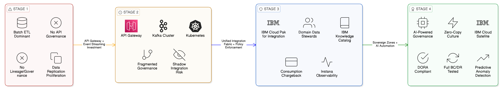
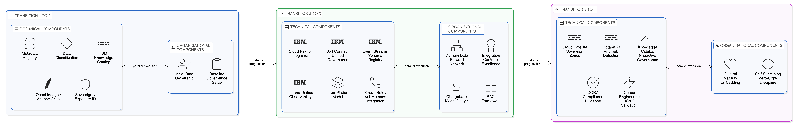
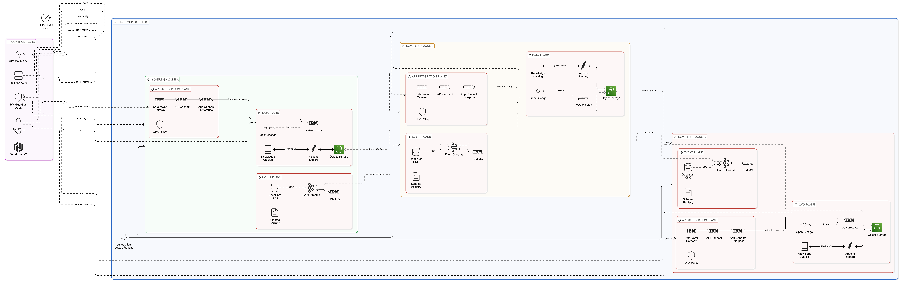
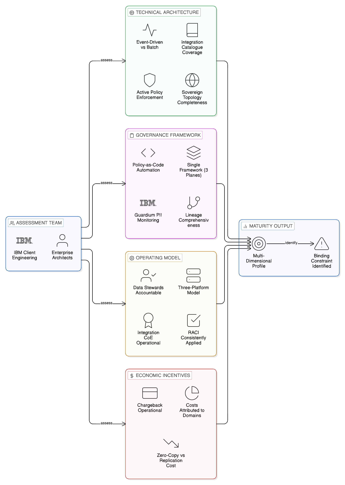
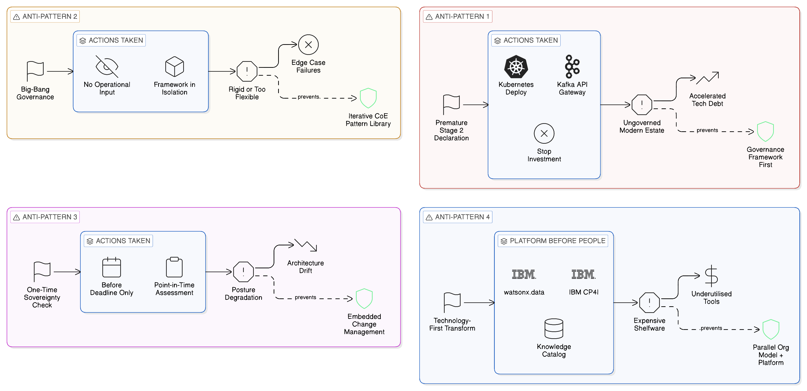

# Chapter 15 --- The Zero-Copy Integration Maturity Model

*From Copy-Heavy Integration to a Fully Sovereign, Resilient Architecture*

*Figure 15.1: The Zero-Copy Integration Maturity Model — four stages (Copy-Heavy, Distributed but Fragile, Federated and Policy-Driven, Fully Sovereign and Resilient) distinguished by governance framework maturity, operating model coherence, and economic incentive alignment, with key transition investments indicated between each stage.*

Every enterprise that undertakes a significant architectural transformation requires, alongside a vision of the target state, a realistic understanding of its current state and a structured path between the two. The target state described in the preceding chapters of this book — the sovereign-by-design, Zero-Copy enterprise in which data is accessed in place through governed interfaces, integration flows propagate state changes as events rather than bulk data transfers, and the architectural discipline of replication avoidance is sustained by domain ownership, platform governance, and economic incentive alignment — is not a state that any enterprise reaches in a single transformation programme. It is the outcome of a staged maturation process in which each stage builds on the capabilities established in the preceding stage and addresses the limitations and risks that the preceding stage creates.

This chapter presents the Zero-Copy Integration Maturity Model: a four-stage framework that characterises enterprise integration architectures from the least mature — the copy-heavy, point-to-point integration estate that most enterprises are working to escape — to the most mature — the fully sovereign, fully resilient Zero-Copy enterprise that this book describes. The model provides enterprises with a diagnostic framework for assessing their current maturity, a set of concrete indicators by which each stage can be identified and measured, explicit guidance on the transition investments required to advance from one stage to the next, and a mapping of the IBM and open-source technology capabilities that enable each stage. It draws on the accumulated experience of IBM's enterprise integration transformation practice across multiple industries and geographies, and on the theoretical foundations established in the preceding chapters of this book. The chapter also examines the assessment methodology through which enterprises can locate themselves within the model honestly and completely, the characteristic anti-patterns that cause transformation programmes to stall or regress, and the five-stage path from initial assessment to sustained Stage Four operation.

## 15.1 Stage One: The Copy-Heavy Integration Estate

### 15.1.1 Characterisation

The first maturity stage is the default condition of most established enterprises: an integration estate built primarily on the pattern of extracting data from source systems and loading it into consuming systems or shared repositories. This pattern has a long history in enterprise IT, having been the dominant integration approach for the batch-oriented computing environments of the 1980s and 1990s, and it has persisted into the cloud era because the tooling for extract-load-transform operations is mature, well understood, and operationally familiar to the data engineering teams that implement it.

The copy-heavy integration estate is characterised by several structural patterns that, whilst individually expedient, collectively produce the compliance, operational, and economic problems that this book has identified as the drivers for Zero-Copy transformation. Data is replicated across multiple systems as a natural consequence of the access model: each consuming team requests its own data extract because the cost of a point-to-point extract is individually lower than the cost of implementing a shared access mechanism, even when the aggregate cost of multiple extracts exceeds the cost of the shared access mechanism by a substantial margin. The result is a proliferation of data copies, each with its own version of the truth, each subject to its own refresh schedule, and each creating its own compliance liability.

The primary technical indicator of Stage One maturity is the prevalence of scheduled batch ETL processes as the dominant integration pattern. Data warehouses are populated from operational systems through nightly or weekly extraction runs; data lakes receive bulk loads from enterprise applications; application-to-application integration is implemented through file-based transfers or database-level access to shared schemas. Event-driven integration is minimal or absent; API governance is project-specific rather than fabric-wide; data lineage is either absent or manually documented in systems that are not integrated with the governance tooling. Where API gateways exist, they are deployed for specific projects or external interfaces rather than as a shared enterprise fabric. Where a Kafka cluster exists, it was likely deployed for a specific streaming project and is not governed as part of a coherent integration platform.

### 15.1.2 Diagnostic Indicators

An enterprise can confirm its Stage One status through a small number of diagnostic questions, the answers to which reveal the structural characteristics of the integration estate more reliably than technology inventories. What proportion of inter-system data flows are implemented as scheduled batch extracts rather than event-driven or API-based integrations? If the answer is more than sixty per cent, the estate is predominantly Stage One in its integration patterns. How many distinct copies of core data assets — customer master data, product catalogue, financial positions — exist across the enterprise's systems? If the answer is more than five, the replication proliferation that characterises Stage One is in evidence. Is the enterprise able to produce, within forty-eight hours, a complete and accurate inventory of all systems that hold personal data and the data flows through which that personal data moves between systems? If not, the catalogue gap that is Stage One's most significant governance liability is present. Has the enterprise experienced a data subject access request or a regulatory enquiry that it was unable to satisfy completely because data existed in systems whose holdings were unknown to the compliance function? If so, the compliance exposure of Stage One is being felt directly.

### 15.1.3 Stage One to Stage Two: The Transition Investment

For the enterprise at Stage One, the immediate priority is not the implementation of the full Zero-Copy architecture but the establishment of the visibility and cataloguing capabilities that are preconditions for any meaningful progress. No integration transformation programme can succeed without a reliable baseline inventory of the current state: without knowing which data assets exist, where they reside, and how they flow through the enterprise, it is impossible to make principled decisions about which integration patterns to replace, in what order, and with what governance controls.

IBM Knowledge Catalog, deployed initially as a metadata registry that documents the enterprise's existing data assets and integration flows, provides the baseline inventory from which subsequent transformation decisions can be made. The initial Knowledge Catalog deployment need not implement active policy enforcement; its Stage One role is cataloguing and classification — establishing the business glossary that defines the enterprise's canonical data entities, assigning initial data classifications to all catalogued assets, and registering the existing integration flows as documented lineage records. Apache Atlas and OpenLineage, for enterprises that prefer to complement IBM tooling with open-source alternatives, provide equivalent metadata capabilities that integrate with Knowledge Catalog through the OpenLineage standard.

The governance infrastructure investment at Stage One should be accompanied by a targeted identification and remediation programme for the highest-priority sovereignty exposures in the existing estate: the ETL processes that transfer personal data across jurisdictional boundaries without legal basis, the shared database schemas that allow consuming applications to access personal data without data classification controls, and the file-based data transfers that bypass any governance infrastructure and leave no audit trail. These exposures do not need to be eliminated before the Stage Two transition begins; they need to be identified, documented, and prioritised so that the Stage Two investment addresses the most material compliance risks first.

## 15.2 Stage Two: Distributed but Fragile Integration

### 15.2.1 Characterisation

The second maturity stage is characterised by the adoption of modern integration technologies — API gateways, event streaming platforms, container-based deployment — without the governance framework and operating model that would make those technologies collectively coherent. This is the condition of many enterprises that have undertaken partial modernisation programmes: they have deployed a Kafka cluster for event streaming, an API gateway for external API management, and a Kubernetes platform for application deployment, but these capabilities operate as independent silos managed by separate teams with separate governance processes and separate monitoring infrastructure.

Stage Two is in some respects more dangerous than Stage One, because the appearance of modernity can mask governance and sovereignty exposures that are more complex than those of the simpler, more legible Stage One estate. The event streaming platform, operating without effective data governance integration, may be processing and distributing personal data across regional boundaries without the compliance team's awareness. The API gateway, managed without a shared governance framework, may have inconsistent access control policies across the APIs it manages, creating security exposures that are difficult to identify without a unified governance view. The container platform, deployed without network policies that enforce jurisdiction-aware routing, may be scheduling workloads in regions that violate the enterprise's data localisation obligations. Most importantly, the investment in modern technology may generate an organisational confidence that the integration transformation is substantially complete when in reality the governance, operating model, and economic incentive dimensions of the transformation have not yet been addressed at all.

### 15.2.2 Diagnostic Indicators

The diagnostic signature of Stage Two is the combination of modern technology with fragmented governance. An enterprise is at Stage Two when it has deployed two or more of the following technologies — API gateway, event streaming platform, container orchestration, data catalogue — but cannot demonstrate a unified operational view of the health and performance of its integration estate across all of them. An enterprise is at Stage Two when its API governance processes differ materially from its event topic governance processes, which differ from its data access governance processes, with no common policy framework spanning all three. An enterprise is at Stage Two when a compliance team asked to confirm the enterprise's data localisation posture must consult separate teams managing each integration platform and synthesise their individual assessments manually, because no single governance system provides an integrated view. An enterprise is at Stage Two when integration platform teams exist as separate organisational units with separate reporting lines, separate tooling, and separate governance frameworks, with no shared integration fabric model connecting them.

### 15.2.3 Stage Two to Stage Three: The Transition Investment

The transition from Stage Two to Stage Three requires the establishment of the integration fabric governance framework described in Chapters 9 and 13: a unified governance layer that spans all integration planes and all integration technologies, providing a common catalogue, common access policies, common operational observability, and the domain ownership model that assigns governance accountability to the teams best positioned to exercise it.

The IBM capabilities that are most relevant at this transition are those that provide governance integration across the disconnected capabilities the enterprise has already deployed. IBM API Connect provides a unified API governance layer that can integrate with and govern APIs published through other gateway technologies already in the estate, rather than requiring their replacement. IBM Event Streams, as a Kafka-compatible event streaming platform with native integration into IBM's governance and monitoring stack, can operate alongside existing Kafka deployments, providing schema registry governance and lineage capture for the event streaming plane whilst the enterprise's existing Kafka infrastructure is progressively brought under governed management. IBM Cloud Pak for Integration's management plane provides the unifying governance framework that creates a single operational view of the integration estate across all planes and technologies. IBM Instana, deployed at this stage with its full suite of integration technology sensors, establishes the unified operational observability baseline that makes the fragmentation of Stage Two visible and measurable — a prerequisite for the governance consolidation that the Stage Three transition requires.

The Stage Two to Stage Three transition must also reckon with the heterogeneous technology investments that most enterprises have accumulated before reaching this point. Many enterprises arrive at Stage Two with integration tools that fall outside the IBM Cloud Pak for Integration estate: StreamSets DataOps pipelines managing CDC-based data movement from legacy source systems, webMethods integration flows governing B2B partner connectivity, or other commercial and open-source integration platforms deployed by individual project teams. The principle that governs the handling of these investments during the Stage Three transition is the same principle that governs the handling of the ungoverned Kafka clusters and API gateways present at Stage Two: these platforms do not need to be replaced before governance consolidation can begin; they need to be brought under the unified governance framework. StreamSets' OpenLineage-compatible pipeline lineage output can be ingested by IBM Knowledge Catalog, registering the data movement flows that StreamSets manages as documented governance artefacts within the enterprise catalogue — making visible, and therefore governable, integration flows that were previously opaque to the governance function. webMethods' OpenAPI-compliant API Gateway can be registered as a governed gateway within IBM API Connect's management plane, with OPA policies enforcing consistent data classification and jurisdiction-aware routing across both webMethods-governed and IBM-governed APIs simultaneously. The practical implication for the Stage Three transition planning is that the asset inventory conducted at Stage One — the catalogue of all integration tools, flows, and assets in the estate — should explicitly identify StreamSets, webMethods, and any other non-IBM integration platforms present, and the governance integration plan should specify how each platform's lineage and access control outputs are connected to the unified governance layer before the Stage Three governance model is declared operational. A governance framework that provides complete coverage of the IBM-governed portion of the estate whilst leaving the webMethods B2B gateway or the StreamSets CDC pipeline estate ungoverned is not a Stage Three governance framework; it is Stage Two governance with a more sophisticated subset of the estate controlled.

The organisational transition at Stage Two to Three is as significant as the technical transition. The three-platform model described in [Chapter 13](13_chapter_sovereign_operating_model) must be established, with platform teams assigned clear mandates and the Integration Centre of Excellence created to develop and distribute the governance standards that will be applied consistently across the consolidated fabric. The RACI framework for the Zero-Copy enterprise's governance decisions must be defined and communicated to all domain and platform teams. The chargeback model must be designed and its introduction planned, so that the economic incentives for Zero-Copy discipline are operational from the beginning of Stage Three rather than retrofitted after the fact.

## 15.3 Stage Three: Federated and Policy-Driven Integration

### 15.3.1 Characterisation

At Stage Three, the enterprise has established the integration fabric described in [Chapter 9](09_chapter_integration_fabrics): a unified governance framework through which APIs, event topics, and federated data sources are catalogued, access-controlled, and operationally monitored within a single operational model. Domain ownership of data is formally defined, with Data Stewards assigned and accountable for the governance of their domain's data assets. The three-platform model is in place, with distinct platform teams responsible for the data, integration, and application platforms. The economic model provides consumption-based visibility into integration costs, and domain teams have begun to internalise the Zero-Copy discipline as a consequence of the governance framework and the incentive model it creates.

Stage Three is the stage at which the sovereignty and resilience dividends of the Zero-Copy approach begin to be realised in operationally meaningful ways. The compliance team can produce a credible data localisation attestation because the governance framework provides a complete, auditable record of where data assets reside and through which integration channels they are accessed. IBM Knowledge Catalog's active policy enforcement — described in [Chapter 11](11_chapter_observability_lineage_audit) — ensures that data access requests are evaluated against governance policies in real time rather than relying on post-hoc audit. IBM Guardium's independent data access monitoring provides the tamper-evident audit record that regulatory compliance demands. The operations team can respond to integration incidents with the confidence that comes from unified observability across the full integration estate through IBM Instana. The finance team can attribute integration costs to consuming teams with sufficient precision to make the economic case for replication avoidance visible at the domain level.

The residual risk at Stage Three is shadow integration: the informal data sharing arrangements, the ad-hoc file transfers, and the manual database queries that exist outside the governed integration fabric and are therefore invisible to the governance and observability infrastructure. In any large enterprise, the governed integration fabric will coexist, at least temporarily, with a legacy of ungoverned integration that predates the fabric and has not yet been migrated into it. The task at Stage Three is to extend the scope of the governance framework to encompass this shadow integration, either by migrating ungoverned flows into the fabric or by detecting and constraining them through network policy enforcement and IBM Guardium monitoring.

### 15.3.2 Diagnostic Indicators

An enterprise is at Stage Three when it can demonstrate all of the following: a single integration catalogue from which all integration assets — APIs, event topics, and data sources — can be discovered and accessed through a common request and provisioning process; an operational observability platform that provides a unified view of integration health and performance across all three integration planes without requiring manual correlation between separate monitoring systems; an active governance policy framework that enforces data classification controls and cross-boundary routing rules at the point of access rather than through post-hoc audit; a domain ownership structure with named Data Stewards accountable for the governance of their domain's assets; and a consumption-based cost attribution model that attributes integration costs to the domains that incur them. An enterprise that meets all five of these criteria is operating at Stage Three regardless of whether its technology stack precisely matches the IBM reference architecture, because these criteria describe the governance and operational outcomes of Stage Three rather than the technology choices that produce them.

### 15.3.3 Stage Three to Stage Four: The Transition Investment

The transition from Stage Three to Stage Four is the most demanding of the three transitions, because it requires not merely the addition of new capabilities to an existing framework but the achievement of a qualitative change in how the enterprise's integration discipline is sustained. At Stage Three, the Zero-Copy discipline is maintained primarily through the governance framework — the policies that the fabric enforces, the RACI accountability that assigns governance responsibility, and the chargeback model that creates economic incentives for governed access. At Stage Four, the discipline is self-sustaining: it is maintained not only by the governance framework but by the cultural disposition of domain and platform teams who have internalised the Zero-Copy principles, the predictive governance capabilities that identify and address governance risks before they manifest as incidents, and the AI-powered operational intelligence that manages the integration estate with a degree of automation that makes human operational management more strategic and less reactive.

The specific capabilities that characterise the Stage Three to Stage Four transition are three. The first is the deployment of AI-powered anomaly detection and predictive governance: IBM Instana's dynamic baselining and AI anomaly detection, extended by the machine learning models trained on historical access patterns from IBM Guardium's audit stream, that identify performance deviations and access anomalies before they become operational incidents or compliance violations. The second is the full realisation of the distributed sovereignty topology described in [Chapter 10](10_chapter_network_aware_topologies): IBM Cloud Satellite deployed to all sovereign zones in the enterprise's operating geography, providing consistent integration fabric capabilities at each location without requiring cross-boundary routing for normal operations, and fully tested BC/DR capabilities validated through chaos engineering to DORA standards. The third is the transition from reactive to predictive governance in the Knowledge Catalog: policy simulation capabilities that allow governance teams to evaluate the impact of proposed changes before deployment, and cost forecasting that identifies consumption trends and projects future integration costs before they become commercial surprises.

IBM Cloud Satellite provides a critical capability at this transition for the enterprise operating across multiple jurisdictions: the ability to deploy the integration fabric's governance and runtime infrastructure in any location — on-premises data centres, co-location facilities, sovereign cloud environments, partner cloud environments, and edge locations — under the operational management of the central platform team, whilst maintaining the data localisation and jurisdictional boundary enforcement that sovereignty requirements demand. This capability allows the integration fabric to be extended to the locations where sovereign data assets reside, rather than requiring those assets to be moved to where the integration fabric is deployed. Without IBM Cloud Satellite, the Stage Four topology remains aspirational; with it, the sovereign zone deployment model becomes operationally feasible for enterprises whose infrastructure spans the full diversity of modern enterprise deployment scenarios.

*Figure 15.2: Zero-Copy Maturity Stage Transition Investment Map — three transitions (Stage 1→2: cataloguing and sovereignty exposure identification; Stage 2→3: unified governance fabric, three-platform model, and Centre of Excellence; Stage 3→4: AI-powered governance, full sovereign zone deployment, and cultural maturity), each showing parallel technical and organisational investment tracks.*

## 15.4 Stage Four: The Fully Sovereign, Resilient Zero-Copy Enterprise

### 15.4.1 Characterisation

Stage Four represents the target state described throughout this book: an enterprise in which the Zero-Copy discipline is sustained by the combined effect of technical architecture, organisational structure, governance process, and economic incentive. Data is accessed in place through governed interfaces as the default; replication is the exceptional case, justified by specific operational requirements and explicitly approved through the governance process. The integration fabric is the universal conduit through which all enterprise integration flows pass, providing complete visibility, auditability, and policy enforcement across the full integration estate. The operating model distributes data accountability to domain teams whilst maintaining enterprise-wide policy coherence through the governance framework. The community of practice sustains the cultural disposition that makes Zero-Copy behaviour the natural default, and the economic incentives make it individually rational for domain teams to maintain that disposition even under commercial pressure.

*Figure 15.3: The Fully Sovereign, Resilient Enterprise: Synthesis Architecture — Data Plane (watsonx.data, Iceberg, Knowledge Catalog), Application Integration Plane (API Connect, App Connect, DataPower), Event Plane (Event Streams, MQ, CDC), and Control Plane (Guardium, Instana, ACM, Vault, Terraform), distributed by IBM Cloud Satellite across multiple sovereign zones with jurisdiction-aware routing and BC/DR validated to DORA standards.*

At Stage Four, the resilience characteristics of the architecture are fully realised. The event-driven, stateless integration patterns that the Zero-Copy model favours produce a natural resilience at the architectural level: because consuming services do not maintain copies of the data they consume, the failure of a producing service does not leave consuming services with stale or inconsistent data states; they simply cease to receive events until the producing service recovers, and resume processing from the point of interruption when it does. The jurisdiction-aware routing and regional deployment topology of the integration fabric ensure that regional failures do not propagate across jurisdictional boundaries, maintaining the sovereignty posture of the architecture even under degraded operational conditions. The BC/DR architecture, tested and evidenced to the standards that DORA and comparable operational resilience frameworks require, provides the compliance team with the confident attestation of recovery capability that regulators expect.

### 15.4.2 Diagnostic Indicators

An enterprise is at Stage Four when it can demonstrate the following outcomes, each of which represents the full realisation of one of the book's central themes. On sovereignty: the enterprise can produce, in response to any regulatory enquiry, a complete and accurate inventory of all personal data holdings and all data flows that cross jurisdictional boundaries, with the governance authorisation and legal basis for each cross-boundary flow documented in the Knowledge Catalog and verifiable through Guardium's audit record. On resilience: the enterprise has tested and documented the recovery of all critical integration capabilities to within their declared RTO and RPO, through realistic BC/DR exercises including zone-level failure simulation, and can produce the evidence of those tests in the format that DORA examination requires. On economics: the enterprise can demonstrate, through its FinOps cost attribution data, that the aggregate cost of its integration estate — compute, storage, egress, and governance overhead — is materially lower than the equivalent cost under a copy-centric model, with the cost differential attributable to specific Zero-Copy patterns that have replaced specific replication flows. On culture: the proportion of new integration designs reviewed by the Integration Centre of Excellence that require remediation for Zero-Copy non-compliance has declined to a low and stable level, indicating that the Zero-Copy discipline is being applied consistently by domain and platform teams without requiring enforcement intervention. These are outcomes, not technology configurations; an enterprise that achieves them through a combination of IBM and open-source tooling is at Stage Four regardless of the specific technology choices it has made.

### 15.4.3 IBM's Role at Stage Four

IBM's role at Stage Four transitions from transformation enabler to operational and innovation partner. The IBM watsonx.data, Cloud Pak for Integration, Knowledge Catalog, Instana, Guardium, and OpenShift platforms provide the production infrastructure of the Zero-Copy architecture; IBM's managed service and operational support capabilities provide the enterprise with the assurance that the platform infrastructure will be maintained, updated, and supported with the enterprise-grade reliability that the architecture requires. IBM's research and development investment in the open-source projects that underpin the architecture — Apache Kafka, Apache Iceberg, OpenLineage, OpenTelemetry, and others — ensures that the open-source components of the architecture continue to develop in directions that are consistent with the enterprise needs the architecture serves, and that the IBM enterprise distributions of those open-source projects incorporate the security, governance, and operational management capabilities that production deployment demands.

At Stage Four, the enterprise's relationship with IBM also extends to the forward-looking technology investments described in [Chapter 19](19_chapter_ai_analytics): the governance of AI workloads within the Zero-Copy framework, the preparation for post-quantum cryptography transitions, and the exploration of decentralised compute patterns that may provide the next generation of sovereignty-preserving integration capabilities. The Zero-Copy architecture's investment in open standards — OpenLineage, OpenTelemetry, Apache Iceberg, Open Policy Agent — provides the foundation for this forward-looking evolution, because standards-based architectures can incorporate new capabilities as they mature without requiring the wholesale replacement of the integration infrastructure they augment.

## 15.5 Assessing Current Maturity: The Diagnostic Methodology

The maturity model is only useful to an enterprise that is willing to assess its current state honestly against all four dimensions of the model — technical architecture, governance framework, operating model, and economic incentives — rather than against the technology dimension alone. It is entirely possible for an enterprise to have a technically sophisticated integration estate at Stage Three or Stage Four by technology inventory whilst being at Stage One or Stage Two by governance, operating model, and economic incentive. Such an enterprise has invested in platform capability without investing in the organisational and governance disciplines that make the platform productive; it will fail to realise the Zero-Copy benefits that the platform makes technically possible, and it will accumulate the governance and sovereignty liabilities that the model exists to prevent.

A practical assessment methodology for locating the enterprise within the maturity model should address four dimensions. The technical architecture dimension asks: what proportion of integration flows use event-driven and API-based patterns rather than batch extraction; what is the coverage of the integration catalogue; is active policy enforcement in place; is the sovereign topology deployed to all relevant zones. The governance framework dimension asks: is there a single governance framework spanning all three integration planes; are governance policies expressed as code and enforced automatically; is lineage capture comprehensive and current; is Guardium monitoring all personal data stores. The operating model dimension asks: are domain Data Stewards defined and accountable; is the three-platform model in place with clear mandates; is the Integration Centre of Excellence operational; are RACI responsibilities defined and applied consistently. The economic incentives dimension asks: is a consumption-based chargeback model in operation; are integration costs attributed to the domains that incur them; can the enterprise quantify the cost differential between Zero-Copy and replication-based integration for comparable flows.

The assessment should be conducted by a team that includes both internal enterprise architects who understand the current state of the integration estate and IBM Client Engineering practitioners who have experience of the maturity stages and their characteristic indicators across a range of enterprise contexts. Internal assessment alone is prone to optimism bias: teams who have invested in building a capability tend to assess its maturity more generously than an external observer would. External assessment alone lacks the contextual knowledge required to distinguish genuine maturity from surface-level compliance with the model's criteria. The combination of internal knowledge and external benchmarking produces the most accurate and actionable assessment.

The output of the assessment should be a maturity profile that distinguishes the current stage across all four dimensions and identifies the specific gaps within each dimension that represent the highest-priority investments for advancing to the next stage. For most enterprises, this profile will be uneven: a Stage Three technical architecture with Stage Two governance, or a Stage Two operating model with Stage One economic incentives. The transformation plan should address the most lagging dimension first, because the maturity of the integration estate is ultimately determined by the weakest of its four dimensions, not the strongest.

*Figure 15.4: Zero-Copy Four-Dimensional Maturity Assessment Methodology — four assessment dimensions (Technical Architecture, Governance Framework, Operating Model, Economic Incentives) with diagnostic questions for each, conducted by a team combining internal enterprise architects and IBM Client Engineering practitioners, producing a multi-dimensional maturity profile that identifies the binding constraint dimension.*

## 15.6 Anti-Patterns to Avoid on the Maturity Journey

The maturity journey from Stage One to Stage Four is not without risks, and the enterprise that is aware of the characteristic failure modes of each transition is better positioned to avoid them. Several anti-patterns recur with sufficient frequency in enterprise integration transformation programmes to warrant careful examination.

The most common and most damaging anti-pattern is the premature declaration of success at Stage Two. Having deployed modern integration technology — a Kafka cluster, an API gateway, a Kubernetes platform — the enterprise declares its integration transformation complete and redirects its investment towards other priorities, leaving the Stage Two capability to operate without the governance framework and operating model that would make it coherent. The resulting architecture — modern in its technology stack but ungoverned in its operation — often accumulates technical debt at a faster rate than the legacy Stage One estate it replaced, because the higher velocity of change that modern platforms enable is not constrained by the governance discipline that the legacy estate's inertia inadvertently enforced. Point-to-point connections proliferate through the event streaming platform as readily as they did through file-based transfers; personal data propagates across topic subscribers without governance controls; API contracts break consuming applications because no versioning discipline is enforced. The enterprise finds itself, within two to three years, with a Stage Two estate that is harder to govern than the Stage One estate it replaced, because the complexity is higher and the patterns are less visible.

A second anti-pattern is the big-bang governance implementation: the attempt to define and implement a comprehensive governance framework for the entire enterprise integration estate in a single programme of work, deferring any governance capability to consuming teams until the framework is complete. Governance frameworks designed in isolation from the operational contexts they are intended to govern invariably fail to address the practical edge cases that those contexts present, producing a framework that is either too rigid to accommodate legitimate operational requirements or too flexible to provide meaningful constraint. The governance framework should be designed iteratively, beginning with the highest-priority data assets and integration flows — those that carry the most significant sovereignty or compliance risk — and extended progressively as operational experience reveals the edge cases that the initial design did not anticipate. The Integration Centre of Excellence's pattern library is the vehicle for this iterative governance development: each new pattern added to the library represents a governance problem that has been solved in practice and documented for reuse, building the governance framework from operational experience rather than from theoretical design.

A third anti-pattern, specific to the sovereignty dimension of the transformation, is the treatment of data localisation controls as a one-time compliance exercise rather than as a sustained operational discipline. Sovereignty requirements evolve as regulations change, as the enterprise expands into new jurisdictions, and as the technology landscape introduces new integration patterns that create new cross-boundary data flow risks. The enterprise that treats sovereignty compliance as a point-in-time assessment — conducting a comprehensive review before a regulatory deadline and then allowing the sovereignty posture to drift until the next deadline — will find that its posture degrades steadily as the architecture evolves, new integration flows are created outside the governed fabric, and the sovereignty topology map in the Knowledge Catalog becomes progressively less accurate. Sovereignty discipline must be embedded in the integration fabric's change management process: every new integration flow, every new data source registration, and every change to an existing integration contract must be assessed against the sovereign topology map as a standard step in the approval workflow, not as a periodic compliance exercise.

A fourth anti-pattern is the technology-first transformation that invests in platform capabilities before establishing the organisational model that will operate them. Enterprises that deploy IBM Cloud Pak for Integration, IBM watsonx.data, and IBM Knowledge Catalog before defining domain boundaries, assigning Data Stewards, establishing the three-platform model, and creating the RACI framework for governance decisions consistently fail to achieve the governance outcomes the platforms are capable of delivering. The platforms are designed to be operated within the sovereign-by-design operating model described in [Chapter 13](13_chapter_sovereign_operating_model); operated without that model, they become expensive monitoring tools whose governance capabilities are underutilised. The organisational investment and the platform investment must proceed in parallel, with the operating model design informing the platform configuration from the outset.

*Figure 15.5: Zero-Copy Maturity Journey Anti-Patterns — four failure modes (Premature Stage Two Success Declaration, Big-Bang Governance Implementation, Sovereignty as One-Time Compliance Exercise, Technology-First Transformation), each showing the characteristic consequence and the structural mitigation that prevents the transformation programme from stalling or regressing.*

## 15.7 Summary and Transformation Imperatives

The Zero-Copy Integration Maturity Model provides the diagnostic framework and the roadmap that the enterprise needs to navigate from its current state to the sovereign, resilient target state. The four stages — copy-heavy, distributed but fragile, federated and policy-driven, and fully sovereign — are distinguished by the maturity of the governance framework, the coherence of the operating model, the degree to which economic and cultural incentives reinforce the Zero-Copy discipline, and the completeness of the sovereign topology. Progress through the stages is sequential: each stage builds on the capabilities and organisational practices established in the preceding stage, and attempts to skip stages — to implement the full governance framework without the underlying operating model, or to establish the operating model without the platform capabilities that make it operationally feasible — consistently underperform relative to the staged approach. The argument of the chapter may be summarised in five claims.

First, the maturity of an integration estate is determined by the weakest of its four dimensions — technical architecture, governance framework, operating model, and economic incentives — not the strongest. An enterprise that assesses its maturity by its technology inventory alone will consistently overestimate its position in the model and underinvest in the governance and organisational dimensions that are most frequently the binding constraints on Zero-Copy benefit realisation.

Second, Stage Two is the most dangerous maturity level, not the least dangerous, because the appearance of modern technology capability creates an organisational confidence that the transformation is substantially complete when in reality the governance, operating model, and economic dimensions have not yet been addressed. Enterprises that stall at Stage Two accumulate governance liabilities at the rate of their integration velocity rather than at the slower rate of their legacy Stage One estate.

Third, each stage transition has both a technical component and an organisational component, and the organisational component is consistently the more difficult and the more commonly underinvested of the two. The Stage Two to Stage Three transition requires the establishment of the three-platform model, the Integration Centre of Excellence, the domain Data Steward network, and the RACI framework alongside the technical integration fabric deployment; these organisational investments cannot be deferred without compromising the governance outcomes that the technical investment is designed to achieve.

Fourth, the diagnostic assessment of current maturity must address all four dimensions, conducted with both internal knowledge and external benchmarking, to produce the accurate and actionable maturity profile that the transformation plan requires. An honest, comprehensive assessment conducted at the outset of the transformation programme produces better outcomes than an optimistic, technology-focused assessment that leaves the highest-priority governance and organisational investments unidentified until they become visible as programme failures.

Fifth, sovereignty and resilience are not properties to be added to the architecture after the functional requirements are satisfied; they are design constraints that must be present from Stage One of the transformation, progressively strengthened through Stages Two and Three, and fully realised at Stage Four. The enterprise that treats sovereignty compliance as a late-stage addition will find that the cost of retrofitting sovereignty controls to an existing integration estate substantially exceeds the cost of designing for sovereignty from the outset.

Several transformation imperatives emerge from this analysis. The first is the commitment to a multi-dimensional maturity assessment — technical, governance, operating model, and economic — conducted with external benchmarking, before the transformation investment programme is defined, to ensure that the programme addresses the binding constraints rather than the most visible ones. The second is the establishment of the Integration Centre of Excellence and the domain Data Steward network as investments that precede or accompany the platform deployment investment, not as investments that follow it after the technology is in place. The third is the adoption of an iterative governance development approach — building the governance framework from operational experience through the Centre of Excellence's pattern library, rather than designing it comprehensively in advance — that produces a governance framework that is grounded in the enterprise's actual operational context and therefore more consistently applied. The fourth is the design and deployment of the sovereignty topology map in IBM Knowledge Catalog as a living governance artefact maintained through the integration fabric's change management process from Stage Two onwards, rather than as a point-in-time compliance document.

The following part of this book moves from the transformation journey to the architectural patterns and blueprints that embody the Zero-Copy principles in specific deployment contexts.
