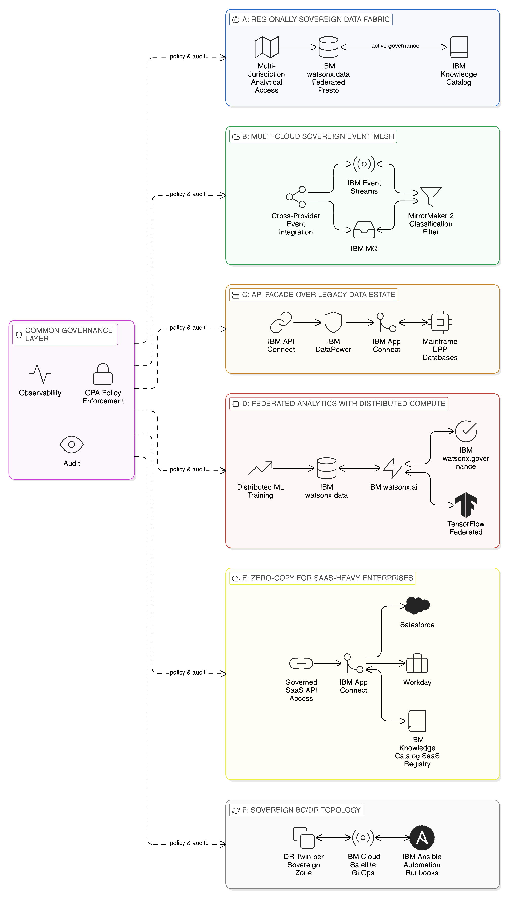
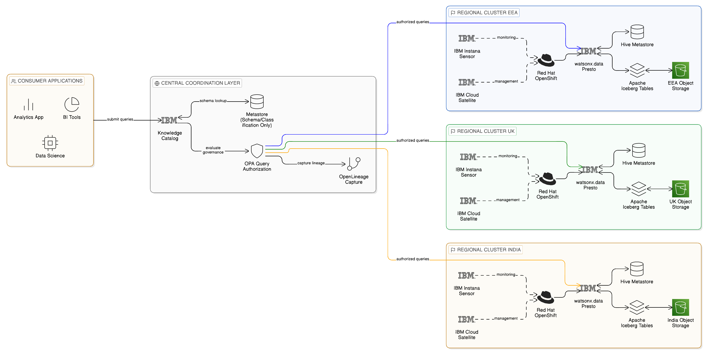
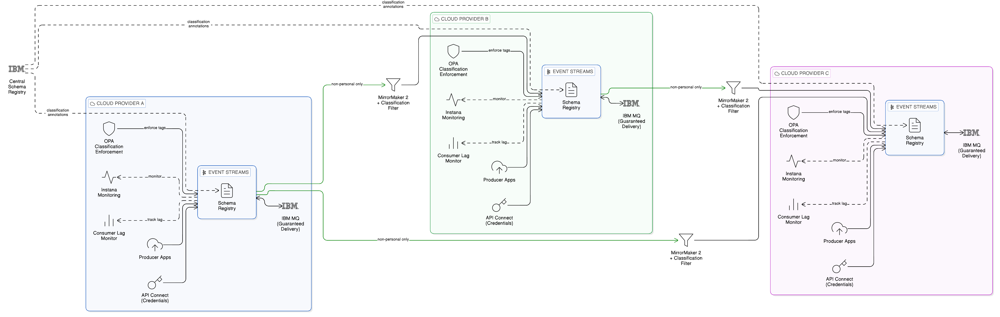
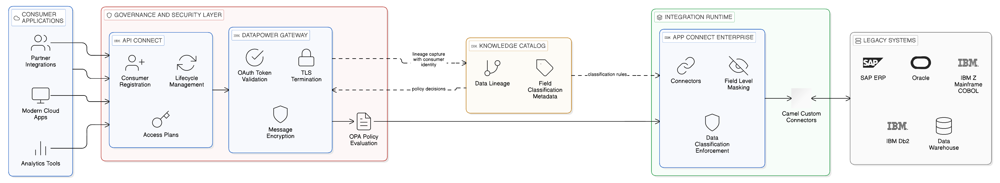
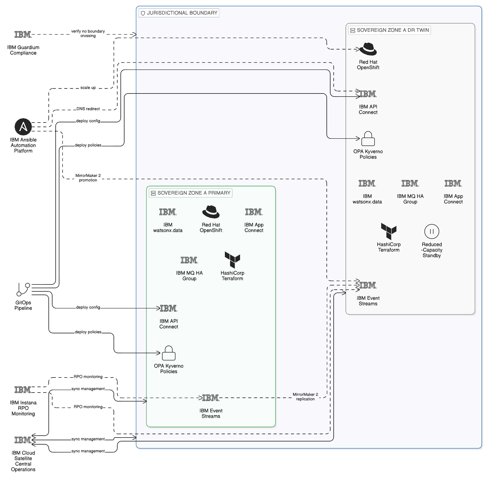

# Chapter 16 --- Architectural Blueprints for the Sovereign, Resilient Enterprise

*Reference Patterns for Zero-Copy Integration in Production*

The preceding chapters have developed the Zero-Copy Integration architecture through a layered exposition of its technical principles, organisational requirements, and governance framework. The Data Plane, the Application Integration Plane, the Event Plane, the integration fabric, the operating model, and the maturity model have each been examined as distinct but interdependent dimensions of an architectural whole. This chapter translates that architectural whole into a set of concrete reference blueprints: deployable architectural patterns that an enterprise can adopt, adapt, and extend to implement Zero-Copy Integration within its own technical and regulatory context.

Each blueprint presented in this chapter addresses a distinct deployment scenario — a specific combination of integration requirements, sovereignty constraints, and resilience objectives that arises with sufficient frequency across enterprises to warrant a reference pattern. The blueprints are not product catalogues; they are architectural specifications that identify the components, the interaction patterns, the governance mechanisms, the deployment topology, and the observable indicators that collectively produce the sovereign, resilient integration capability each scenario demands. Where IBM platforms and open-source technologies are identified within a blueprint, they are identified because of the specific capabilities they contribute to the architectural pattern, not as the only possible implementation of those capabilities. The enterprise architect should treat each blueprint as a structured starting point for contextual design rather than as a prescription to be implemented verbatim.

Six blueprints are presented. Blueprint A addresses the regionally sovereign data fabric for enterprises operating analytical workloads across jurisdictional boundaries. Blueprint B addresses the multi-cloud sovereign event mesh for event-driven integration across cloud provider boundaries. Blueprint C addresses the API façade over the legacy data estate for enterprises whose regulated data assets are concentrated in systems that cannot be modernised. Blueprint D addresses federated analytics with distributed compute for data science workloads that cannot centralise their training data. Blueprint E addresses Zero-Copy Integration for SaaS-heavy enterprises where data governance must extend to provider-operated systems. Blueprint F, newly introduced in this edition, addresses the sovereign BC/DR topology that provides operational continuity without creating the jurisdictional violations that nave recovery architectures produce.

*Figure 16.1: Zero-Copy Integration Architectural Blueprints — overview of six reference patterns (A: Regionally Sovereign Data Fabric, B: Multi-Cloud Sovereign Event Mesh, C: API Façade over Legacy Estate, D: Federated Analytics with Distributed Compute, E: Zero-Copy for SaaS-Heavy Enterprises, F: Sovereign BC/DR Topology), each addressing a distinct deployment scenario with a common governance layer of OPA policy enforcement, IBM Instana observability, and IBM Guardium audit.*

## 16.1 Blueprint A: The Regionally Sovereign Data Fabric

### Problem Context

The regionally sovereign data fabric is the reference pattern for enterprises that operate data assets across multiple jurisdictions and must provide analytical access to those assets without creating the cross-border data flows that data localisation regulations prohibit. The canonical scenario is a multinational enterprise with operational data systems distributed across three or more regulatory jurisdictions — the European Economic Area, the United Kingdom, and a non-EEA country such as the United States or India — in each of which different data localisation requirements apply to different categories of data. The enterprise requires a unified analytical capability through which data scientists, finance teams, and operational analysts can issue queries against the distributed estate; it cannot satisfy this requirement through a conventional centralised data warehouse because the centralisation itself would create the cross-border transfers the regulatory framework prohibits.

### Architectural Principles

The blueprint is structured around three architectural principles. First, data assets reside in and are governed within the jurisdiction in which they originate; they are never replicated to a central repository for analytical purposes. Second, analytical workloads are computed in proximity to the data they process; query execution is pushed to the data source rather than pulling data to the query engine. Third, the governance framework enforces jurisdiction-aware access controls at query submission time; every query is validated against the requestor's identity, the data classification of the assets it targets, and the jurisdiction from which the request originates before execution is authorised.

### Component Architecture

In IBM terms, the blueprint is implemented through a distributed deployment of IBM watsonx.data: regional Presto query engine clusters deployed within each jurisdiction on Red Hat OpenShift, each cluster configured to access only the data sources resident within its jurisdiction. A central metastore — hosted in a jurisdiction-neutral administrative zone, containing only metadata about data sources and their jurisdiction classifications, never holding actual data content — provides the catalogue that allows the central query coordination layer to route sub-queries to the appropriate regional cluster. IBM Knowledge Catalog provides the active governance layer, maintaining the data classification policies that determine which data categories are subject to which jurisdictional controls, evaluating every incoming query request against those policies before authorising regional cluster dispatch, and capturing the lineage record of each query execution for compliance audit.

IBM Cloud Satellite enables the management of regional OpenShift deployments from a central operations plane, providing consistent deployment configuration, certificate management, network policy enforcement, and operational monitoring across all regional clusters without requiring operations staff to log into each regional environment individually. Red Hat Advanced Cluster Management, deployed centrally, enforces the OpenShift configuration policies that prevent regional clusters from being reconfigured in ways that would create cross-jurisdictional data access paths. IBM Instana's federated monitoring model, described in Chapter 11, provides the operational visibility to confirm that each regional cluster is serving only local data sources and that no cross-boundary query execution is occurring.

The open-source foundation of the blueprint — Apache Iceberg as the open table format for data stored in regional object storage, the Hive Metastore as the catalogue backend within each regional cluster, and the Presto query engine — provides the portability and vendor independence that many enterprises require in their foundational data infrastructure. OpenLineage instrumentation within the regional Presto clusters captures query-level lineage metadata that is published to IBM Knowledge Catalog, enabling the central governance team to maintain the complete lineage record without requiring the regional raw data to leave its jurisdiction.

### Failure Modes and Resilience

The primary failure mode of this blueprint is the unavailability of a regional Presto cluster, which renders the data assets in that region temporarily inaccessible to cross-region analytical queries. The governance design must specify how the central query layer handles this scenario: whether it fails the query entirely, returns a partial result set from the remaining available regions with an explicit indication of the missing jurisdiction, or routes to a standby regional cluster. For analytical workloads where partial results are acceptable — dashboards that can tolerate missing data for a temporarily unavailable region — the partial result pattern is appropriate. For compliance and risk reporting workloads where incomplete data would produce a misleading result, the query should fail explicitly rather than silently omitting a jurisdiction. The OPA policies deployed to the central query layer can be configured to enforce this distinction automatically based on the data classification of the query's target assets.

### Operational Indicators

The blueprint is operating correctly when the following indicators are observable through IBM Instana and IBM Knowledge Catalog: all analytical queries are accompanied by lineage records attributing each sub-query to the regional cluster that executed it; no cross-boundary data flows are recorded in the network traffic analysis of any regional cluster; all query requests are accompanied by governance evaluation records confirming that the requesting identity and data classification combination was authorised before execution commenced; and the metadata held by the central metastore contains only schema and classification metadata, with no row-level data.

*Figure 16.2: Blueprint A — Regionally Sovereign Data Fabric: a jurisdiction-neutral central coordination layer (IBM Knowledge Catalog, OPA query authorisation, OpenLineage) routing analytical queries to jurisdiction-specific IBM watsonx.data Presto clusters on Red Hat OpenShift, each accessing only local Apache Iceberg data sources, with cross-boundary raw data flows architecturally eliminated and IBM Cloud Satellite providing central operational management across all regional clusters.*

## 16.2 Blueprint B: The Multi-Cloud Sovereign Event Mesh

### Problem Context

The multi-cloud sovereign event mesh addresses the challenge of event-driven integration across cloud providers without creating cross-provider data replication or violating the provider-specific data residency requirements that apply to regulated workloads. The canonical scenario is an enterprise that operates workloads on two or more cloud providers — a common pattern in enterprises that have grown through acquisition or that have strategically distributed workloads across providers for resilience reasons — and that must integrate those workloads through an event-driven architecture without allowing event payloads containing regulated data to cross provider boundaries. The enterprise also requires that the event mesh be resilient to the failure of any single provider's infrastructure, so that a provider-level outage does not interrupt the event-driven integrations that support critical business processes.

### Architectural Principles

The blueprint implements a federated event topology in which each cloud provider hosts its own regional event streaming cluster, and events are exchanged between providers only through a controlled mirroring mechanism that applies data classification filtering and payload sanitisation before any event crosses a provider boundary. Events containing regulated data categories — personal data, health information, financial account details, or any other category subject to cross-border transfer restrictions — are tagged with their data classification at publication time and are not mirrored to providers in jurisdictions where that category cannot lawfully be processed. The event schema registry enforces schema compatibility and data classification annotations as a publication prerequisite, ensuring that unclassified events cannot enter the mesh.

### Component Architecture

IBM Event Streams, deployed as a managed Kafka service within each cloud provider's environment or on Red Hat OpenShift clusters running on that provider's infrastructure, provides the per-provider event streaming capability. IBM MQ, where persistent guaranteed-delivery messaging is required for inter-provider event transfer — particularly for business events whose loss would require manual reconciliation — provides the durable messaging layer with transactional delivery guarantees that Kafka's at-least-once semantics do not provide by default. The MirrorMaker 2 component of the Kafka ecosystem provides the inter-cluster mirroring mechanism; the governance integration provided by IBM's platform adds data classification filtering that evaluates each event's classification tag against the target provider's jurisdiction before authorising the mirror operation.

IBM API Connect governs the administrative APIs through which producer applications connect to the event mesh: credential management, schema registration, and publication permission are all managed through the governed API layer rather than through direct Kafka broker access, ensuring that every producer has been authenticated and authorised before it begins publishing. IBM Knowledge Catalog maintains the schema registry for the event mesh, enforcing that every event schema registered includes a data classification annotation, and providing the compliance team with a complete inventory of event types, their data classifications, and the producer and consumer applications that participate in each event flow. Strimzi, the open-source Kubernetes operator for Apache Kafka, provides the deployment automation for provider-hosted Kafka clusters in environments where IBM Event Streams' managed deployment model is not available, with IBM's governance integration available as an overlay through the Cloud Pak for Integration management plane.

### Failure Modes and Resilience

The primary failure modes of this blueprint are the unavailability of a provider-specific event cluster and the failure of a cross-provider mirroring path. For the first, the resilience is provided by IBM Event Streams' within-cluster replication model: a minimum replication factor of three across availability zones within each provider's environment, with automatic partition leader election providing millisecond-scale recovery from individual broker failures. For the second, IBM MQ's persistent messaging provides the durability layer: events destined for a temporarily unreachable provider cluster are persisted in the MQ queue rather than discarded, and delivered when the mirroring path is restored. The RPO for cross-provider event delivery under this pattern is bounded by the MQ queue depth at the time of failure — effectively zero for events that were committed to the queue before the failure — and the RTO for event delivery resumption is bounded by the time to restore the mirroring path.

### Operational Indicators

The blueprint is operating correctly when: no event classified above a specified sensitivity threshold appears in the event stream of a provider whose jurisdiction does not authorise processing of that classification; consumer group lag across all participating providers is within the agreed SLA bounds; MirrorMaker 2 replication lag between providers is below the agreed RPO threshold; and the event schema registry in IBM Knowledge Catalog contains classification annotations for every registered event type, with no unclassified event schemas in production.

*Figure 16.3: Blueprint B — Multi-Cloud Sovereign Event Mesh: per-provider IBM Event Streams Kafka clusters governed through IBM API Connect credential management and IBM Knowledge Catalog schema registry, with MirrorMaker 2 cross-provider mirroring applying data classification filtering to block regulated events from crossing jurisdictional boundaries, IBM MQ providing durable guaranteed-delivery for inter-provider transfers, and IBM Instana monitoring consumer group lag and replication health across all providers.*

## 16.3 Blueprint C: API Façade over the Legacy Data Estate

### Problem Context

The API façade blueprint addresses the challenge of exposing regulated data assets — held in legacy systems such as mainframe databases, packaged ERP applications, and first-generation data warehouses — through governed API interfaces, without requiring the modernisation of those systems or the replication of their data to modern platforms. This is one of the most practically important blueprints for large enterprises whose regulated data assets are concentrated in legacy systems that are operationally stable, compliance-certified, and economically infeasible to replace, but technically incompatible with the API-first, fine-grained access control patterns that modern consuming applications require. The blueprint also addresses the data sovereignty dimension of legacy integration: legacy systems often hold personal data in schemas that pre-date modern data classification frameworks, and exposing that data through a governed API façade enables the application of modern access controls without requiring the legacy system to be re-architected.

### Architectural Principles

The blueprint interposes a thin, stateless API layer between the legacy systems and their consuming applications. This API layer does not extract data from legacy systems or maintain a copy of their content; it translates API requests into native legacy system queries — COBOL programme calls, SQL queries against legacy database schemas, API calls to packaged application interfaces — and returns the results as governed API responses. The API layer enforces access controls that the legacy systems themselves cannot implement at the required granularity; it applies data masking, field-level access control, and rate limiting based on the consuming application's identity and the data classification of the fields it requests. The legacy system is shielded from direct consumer access; all data access is mediated through the governed façade and is therefore visible, auditable, and policy-controlled.

### Component Architecture

IBM API Connect provides the management and governance plane for the API façade: API lifecycle management, consumer registration, access plan enforcement, rate limiting, and the API catalogue through which consuming teams discover and request access to the governed legacy data interfaces. IBM DataPower Gateway provides the security enforcement layer within the façade: TLS termination, OAuth token validation, message-level encryption, and the real-time policy evaluation that determines whether a specific request from a specific consuming application is authorised to receive the specific fields it requests from the specific legacy data source it targets.

IBM App Connect Enterprise provides the integration runtime through which the translation between API requests and legacy system queries is implemented, using pre-built connectors for IBM Z mainframe systems, SAP and Oracle packaged applications, and IBM Db2 databases. The transformation logic within App Connect Enterprise applies field-level masking and data classification enforcement before the API response is returned to the consumer: fields classified as personal data are masked or excluded for consuming applications that are not authorised to receive unmasked personal data, ensuring that the API façade cannot be used to bypass the data classification controls that the enterprise's governance framework mandates. IBM Knowledge Catalog maintains the data classification metadata for each field exposed through the façade, providing the classification basis that DataPower and App Connect use for access control enforcement, and capturing the lineage record that documents which consuming applications accessed which data fields through which API interfaces.

For the open-source dimension, Apache Camel provides an extensive connector library that supplements the IBM connector set for bespoke or less-common legacy system integration scenarios — in-house developed mainframe applications with custom interfaces, legacy messaging systems that predate modern integration standards, and industrial control system interfaces that require specialised protocol support.

### Failure Modes and Resilience

The primary failure mode of this blueprint is the unavailability of the legacy system being exposed through the façade. Unlike a copy-centric architecture where a central data repository can serve consumers even when source systems are unavailable, the Zero-Copy façade cannot serve requests for data that the underlying legacy system cannot provide. This is a genuine operational trade-off of the Zero-Copy approach: it preserves data sovereignty and eliminates the governance overhead of maintaining replicated copies, but it makes the availability of consuming applications dependent on the availability of authoritative source systems. The resilience design must account for this dependency through two mechanisms: first, ensuring that the legacy system itself has appropriate high-availability configuration; second, designing consuming applications to handle API errors gracefully, using locally cached data for tolerable staleness periods or deferring operations that require current data when the source system is temporarily unavailable.

### Operational Indicators

The blueprint is operating correctly when: all data access to governed legacy systems passes through the API façade as evidenced by zero direct database connections from consuming application networks in the network policy enforcement logs; field-level masking is applied consistently to all responses containing personal data for consumers not authorised to receive unmasked personal data, as verified through synthetic test requests; API response latency is within the SLA bounds agreed between the integration platform team and consuming domain teams; and the lineage record in IBM Knowledge Catalog contains an entry for every API invocation that accessed personal data, with the consuming application identity, the data classification of the accessed fields, and the governance policy that authorised the access.

*Figure 16.4: Blueprint C — API Façade over the Legacy Data Estate: IBM API Connect (lifecycle management, consumer registration), IBM DataPower Gateway (TLS, OAuth, OPA real-time policy), and IBM App Connect Enterprise (legacy connectors, field-level masking) interposed as a stateless governed façade over IBM Z mainframe, SAP/Oracle ERP, and IBM Db2 systems, with IBM Knowledge Catalog field classifications driving access control decisions and every API invocation captured as a lineage record.*

## 16.4 Blueprint D: Federated Analytics with Distributed Compute

### Problem Context

The federated analytics blueprint addresses the need to support data science and machine learning workloads across distributed data assets without centralising training data in a single repository. This requirement arises with particular force in regulated industries — healthcare, financial services, and telecommunications — where personal data relevant to analytical model training is distributed across regulatory jurisdictions, each imposing restrictions on the transfer of that data to a central repository. It also arises in competitive contexts where multiple organisations hold complementary datasets and wish to train models on their combined data without sharing the underlying data with each other — a scenario increasingly relevant in consortium banking, federated clinical research, and shared fraud detection programmes. The blueprint described here addresses the enterprise deployment scenario; Chapter 19 examines the emerging federated learning frameworks that extend this blueprint to inter-organisational contexts.

### Architectural Principles

The blueprint implements a federated compute model in which analytical workloads are distributed to the locations of their input data, rather than concentrating input data at a central compute location. A central model registry maintains the definitions, versions, and parameters of analytical models; training runs are executed as distributed compute jobs within the jurisdiction of the data they consume, returning only model parameters — not training data — to the central registry upon completion. Inference serving can be deployed regionally or centrally depending on the latency requirements of the consuming application and the jurisdiction classification of the inference inputs.

### Component Architecture

IBM watsonx.data provides the federated SQL query engine through which structured analytical workloads are distributed across regional data sources, executing predicate pushdown and partition pruning at the regional source to minimise the data volumes processed by each regional compute node. IBM watsonx.ai provides the model development and training environment, integrated with the federated data infrastructure to support the distributed training workflows that the blueprint requires: model parameter initialisation, distributed training coordination, parameter update aggregation, and model version management. IBM watsonx.governance provides the model lifecycle governance layer — tracking which training datasets contributed to each model version, maintaining the explainability documentation that regulatory requirements demand, monitoring model performance for drift and degradation, and enforcing the model approval workflow before new versions are released to production inference.

IBM Analytics Engine, IBM's managed Apache Spark service deployed on OpenShift, provides the in-place batch computation substrate for jurisdictions where large-scale data processing is required — executing Spark jobs that read directly from regional Iceberg tables in object storage, process the data within the jurisdiction, and write results or model parameters to regional object storage without transmitting raw training data across jurisdiction boundaries. Apache Spark's native integration with Apache Iceberg, through Iceberg's Spark connector, ensures that the partition pruning and column pruning capabilities of the Iceberg format are fully exploited, minimising the compute and I/O cost of regional training runs. TensorFlow Federated and PySyft provide the open-source federated learning frameworks through which model parameters are aggregated across distributed training nodes using privacy-preserving techniques including differential privacy and secure aggregation, protecting the training data from inference attacks that attempt to reconstruct training data from model parameters.

### Failure Modes and Resilience

The federated analytics blueprint has two primary failure modes. The first is the failure of a regional compute node during a distributed training run, which interrupts the contribution of that region's data to the model training process. IBM watsonx.ai's training coordination layer is designed to tolerate regional node failures by checkpointing training progress and resuming from the last checkpoint when the node recovers, without requiring the full training run to restart. The second is the failure of the central parameter aggregation service, which interrupts the global model update process. The resilience design should deploy the aggregation service with high availability on OpenShift and include a recovery procedure that can restart the aggregation from the last committed parameter checkpoint, with the RPO for parameter checkpointing configured according to the cost of repeating the training computation since the last checkpoint.

### Operational Indicators

The blueprint is operating correctly when: the lineage record in IBM watsonx.governance documents, for each model version, the jurisdictions in which training data was accessed and the privacy-preserving techniques applied to parameter updates; no raw training data appears in cross-boundary network traffic logs; model performance metrics reported by IBM Instana's watsonx.ai sensor are within the expected range for the current model version; and the parameter aggregation service logs confirm that all expected regional parameter updates were received and incorporated in the most recent global model update.

## 16.5 Blueprint E: Zero-Copy Integration for SaaS-Heavy Enterprises

### Problem Context

The SaaS-heavy enterprise presents a distinctive integration challenge for the Zero-Copy architecture. Software-as-a-Service applications are, by their nature, operated by third parties in infrastructure environments that the enterprise does not control. The data that those applications hold — customer relationship data in Salesforce, human resources data in Workday, financial management data in SAP S/4HANA Cloud — is technically resident in the SaaS provider's infrastructure, governed by the contractual data processing agreements between the enterprise and the provider, and subject to the provider's data residency and sovereignty capabilities rather than the enterprise's own architectural controls. The enterprise faces a specific governance challenge: it is legally responsible for the personal data it has entrusted to the SaaS provider, but it cannot apply the technical controls described in the preceding blueprints to data resident in a provider's managed environment.

### Architectural Principles

The blueprint for Zero-Copy Integration in SaaS-heavy enterprises is built around three principles. First, the enterprise should prefer API-based access to SaaS data over data extraction wherever the SaaS provider's API capability is sufficient to support the consuming application's data access requirements — thereby avoiding the creation of enterprise-side copies of data whose governance is already complex. Second, where data extraction from SaaS platforms is required — for analytical workloads, compliance reporting, or integration with non-SaaS systems — extraction should be performed through governed pipelines subject to the enterprise's data governance framework, with extracted data held in the enterprise's own regulated storage, classified according to the enterprise's classification framework, and deleted when no longer required for the purposes that justified the extraction. Third, the integration fabric should maintain a complete record of all SaaS data access patterns — both API-based and extraction-based — in IBM Knowledge Catalog, enabling the compliance team to assess the enterprise's SaaS data exposure accurately and respond to data subject access requests that span both enterprise-held and SaaS-provider-held data.

### Component Architecture

IBM Cloud Pak for Integration provides the integration layer through which SaaS APIs are accessed under enterprise governance controls. IBM API Connect manages the API credentials and OAuth access tokens for SaaS platform connections, maintaining the credential rotation schedule that SaaS platform security policies require and providing the central audit log of all credential usage. IBM App Connect provides the SaaS connector library through which data is accessed via the SaaS platform's native API — pre-built connectors for Salesforce, Workday, ServiceNow, Microsoft Dynamics, and the major SaaS platforms are available within the App Connect connector catalogue, and custom connectors can be developed using the Apache Camel integration framework for SaaS platforms whose native APIs are not covered by the standard catalogue. IBM Event Streams provides the decoupling layer that insulates internal enterprise services from the availability and rate-limiting characteristics of SaaS platform APIs: SaaS-originated events are published to enterprise-controlled topics from which internal consumers subscribe, ensuring that SaaS API rate limits do not directly propagate as throughput constraints into internal event-driven architectures.

IBM Knowledge Catalog's data asset registry must be extended to include SaaS-resident data assets: the personal data categories held by each SaaS provider, the legal basis for processing registered in the data processing agreement with the provider, and the data residency commitments the provider has made by contractual obligation. This registration enables the compliance function to evaluate data subject rights requests — the right of access, the right to erasure — against a complete inventory that includes both enterprise-held and SaaS-provider-held data. IBM OpenPages provides the governance workflow through which data processing activities on SaaS platforms are documented, risk-assessed, and monitored for compliance with both the data processing agreement terms and the applicable regulatory requirements.

### Failure Modes and Resilience

The primary failure mode specific to this blueprint is the unavailability or degraded performance of a SaaS provider's API, which disrupts both direct API-based access and extraction pipelines that depend on the provider's data export capabilities. IBM Event Streams' message persistence provides durability for event flows initiated by SaaS provider webhooks: events received before the SaaS provider becomes unavailable are retained in the enterprise-controlled topic and processed when the availability degradation resolves, without requiring the SaaS provider to re-deliver the events. For extraction pipelines, the failure mode is typically a delayed or failed extraction run; the resilience design should include monitoring of extraction pipeline completion through IBM Instana and automated alerting when an extraction run fails or takes longer than its SLA, with a manual recovery procedure for delayed data.

### Operational Indicators

The blueprint is operating correctly when: all SaaS API credentials used by IBM App Connect connectors are registered in IBM Knowledge Catalog with current expiry dates and rotation schedules; all SaaS-resident personal data categories are registered in Knowledge Catalog with documented legal basis and data processing agreement reference; the proportion of SaaS data access that is API-based rather than extraction-based is tracked and reported as a metric in the FinOps dashboard; and no SaaS data extraction pipeline produces an output dataset that persists in enterprise storage beyond the retention period authorised for the purpose that justified the extraction.

## 16.6 Blueprint F: The Sovereign BC/DR Topology

### Problem Context

The sovereign BC/DR topology blueprint addresses the challenge — examined in depth in Chapter 12 — of designing business continuity and disaster recovery mechanisms that restore integration capability within regulatory recovery time objectives without creating the jurisdictional boundary crossings that a naïve recovery architecture would produce. The canonical scenario is an enterprise operating under DORA or equivalent operational resilience regulation, with integration infrastructure distributed across two or more sovereign zones, that must demonstrate tested and evidenced recovery capability for its critical integration services whilst maintaining the sovereignty constraints that govern normal operations during the recovery event itself.

This blueprint is distinct from the resilience architecture described in Chapter 12, which addressed the technical mechanisms for each integration plane. This blueprint addresses the holistic topology of the BC/DR architecture — the spatial arrangement of primary and standby capabilities, the governance of the topology through IBM Cloud Satellite, and the runbook automation that executes recovery within sovereignty constraints.

### Architectural Principles

The blueprint is structured around three principles that extend the Zero-Copy architecture's normal operating topology into the recovery scenario. First, every sovereign zone in the primary integration topology must have a DR twin: a secondary deployment of all critical integration components in a separate failure domain within the same jurisdiction, ensuring that zone-level failures can be recovered within the jurisdiction without routing traffic through a different jurisdiction. Second, the recovery topology must be identical in its governance configuration to the primary topology: the same OPA policies, the same Knowledge Catalog data classifications, the same network policies — because a recovery topology that relaxes governance controls to simplify the recovery procedure is non-compliant with the sovereignty requirements it exists to respect. Third, the recovery procedures must be automated through IBM Ansible Automation Platform runbooks so that the speed of automated execution can satisfy the RTO without requiring the manual steps that introduce both delay and error risk.

### Component Architecture

IBM Cloud Satellite provides the infrastructure layer through which the sovereign topology is extended to include DR zones: the same IBM Cloud services — API Connect, Event Streams, App Connect, watsonx.data — that are deployed in the primary zone are deployed in the DR zone through the same Satellite-managed OpenShift configuration, ensuring that the DR zone's governance configuration is maintained synchronously with the primary zone's configuration rather than managed separately and subject to drift. Red Hat Advanced Cluster Management enforces the configuration policies that prevent the DR zone from being reconfigured independently of the primary zone, ensuring that the sovereignty compliance of the DR topology is maintained continuously rather than verified only at the point of a DR test.

IBM Event Streams' MirrorMaker 2 provides the continuous event topic replication from primary to DR zones: topics are replicated with their data classification annotations intact, consumer group offsets are synchronised, and the replication lag is monitored by IBM Instana's Event Streams sensor to confirm that the RPO for event data is being met under normal operating conditions. IBM API Connect's configuration synchronisation — implemented through the GitOps pipeline described in Chapter 10, where all API configurations and governance policies are version-controlled in a Git repository and deployed through the same pipeline to both primary and DR zones — ensures that the DR zone's API governance configuration is current to within the RPO at all times without requiring a dedicated synchronisation process. The underlying OpenShift cluster infrastructure for both primary and DR zones must be provisioned through the same HashiCorp Terraform module, with the DR zone parameterised as a secondary instance of the primary zone's infrastructure declaration: this is the only mechanism by which the enterprise can be confident that the network topology, storage class configuration, and security group policies of the DR zone are identical to the primary zone rather than approximately equivalent — because a DR cluster whose infrastructure-layer configuration deviates from the primary cluster will produce governance policy discrepancies when the same OPA and Kyverno policies are applied to it, potentially creating sovereignty violations in the DR configuration that are not present in the primary. Infrastructure provisioned by hand, however carefully, cannot provide this assurance; only the deterministic, version-controlled Terraform provisioning model can. IBM MQ's HA group configuration on OpenShift provides queue manager resilience within each zone, with queue data replicated across availability zones to survive zone-level infrastructure failures without message loss.

Red Hat Ansible Automation Platform hosts the recovery runbooks that orchestrate the DR failover procedure: the sequence of API calls to IBM Cloud Satellite to scale up DR zone components that were running in reduced-capacity standby, the DNS updates to redirect API traffic to the DR zone, the MirrorMaker 2 configuration changes to promote the DR zone's topics to primary status, and the verification checks that confirm each recovery step has completed successfully. The automation controller's execution log provides the audit trail of each recovery step with timestamps, confirming the RTO for the overall recovery procedure and enabling the compliance team to produce the recovery evidence that DORA examination requires.

### Failure Modes and Resilience of the DR Topology Itself

The DR topology blueprint must address the failure mode in which the DR mechanism itself fails — the MirrorMaker 2 replication falls behind, the DR zone's components are misconfigured, or the Ansible runbook execution encounters an unexpected error. IBM Instana's continuous monitoring of the DR topology's health — replication lag, DR zone component availability, runbook execution success rates — provides the early warning that allows operations teams to identify and remediate DR topology health issues before a real disaster event requires the DR capability to perform. IBM Turbonomic's capacity analysis, described in Chapter 11, ensures that the DR zone's infrastructure has sufficient headroom to absorb the primary zone's workload in addition to its own; without this validation, the DR topology may be nominally present but practically inadequate.

### Operational Indicators

The blueprint is operating correctly when: MirrorMaker 2 replication lag for all critical event topics is below the RPO threshold at all times, as monitored by IBM Instana; the DR zone's API Connect configuration matches the primary zone's configuration to within a defined drift tolerance, as validated by the GitOps deployment pipeline's reconciliation; the most recent full DR failover test was completed within the declared RTO, with evidence recorded in the Ansible automation controller's execution log; and no DR failover procedure — test or real — has involved data crossing a jurisdictional boundary outside the approved sovereignty topology, as confirmed by IBM Guardium's cross-boundary access monitoring.

*Figure 16.5: Blueprint F — Sovereign BC/DR Topology: primary sovereign zone and DR twin (same jurisdiction, separate failure domain) deployed from identical HashiCorp Terraform modules, governed synchronously by IBM Cloud Satellite and GitOps with identical OPA and Kyverno policies, IBM Event Streams MirrorMaker 2 continuous replication meeting the RPO, and IBM Ansible Automation Platform runbooks orchestrating the complete failover sequence within the RTO without crossing jurisdictional boundaries.*

## 16.7 Summary and Architectural Imperatives

The six blueprints presented in this chapter translate the Zero-Copy Integration architecture's principles into deployable reference patterns for the deployment scenarios most frequently encountered in regulated, multi-cloud enterprises. Together they cover the major dimensions of the Zero-Copy integration challenge: analytical access to sovereign data across jurisdictions, event-driven integration across cloud boundaries, access modernisation for legacy data estates, distributed AI model development, SaaS governance, and operational resilience within sovereignty constraints. The argument of the chapter may be summarised in five claims.

First, each blueprint is structured around architectural principles rather than technology choices, ensuring that the design decisions embedded in the blueprint are transferable to enterprises that implement the principles using different specific technologies whilst retaining the IBM platform recommendations that provide the enterprise-grade governance, operational management, and support assurance that production deployment requires.

Second, every blueprint includes explicit governance mechanisms — IBM Knowledge Catalog data classification enforcement, OPA policy evaluation, IBM Guardium audit monitoring, IBM Instana observability — because the Zero-Copy architecture's sovereignty and compliance benefits are realised only when governance is embedded in the integration fabric at the architectural level, not applied retrospectively to a completed technical design.

Third, the failure mode analysis in each blueprint is as important as the component architecture: understanding how a blueprint degrades under partial failure conditions, and designing the resilience mechanisms and consumer behaviour that make that degradation graceful rather than catastrophic, is an essential component of the architectural specification that is consistently underweighted in reference architecture documentation.

Fourth, the operational indicators for each blueprint provide the observable evidence that the blueprint is functioning correctly — the governance outcomes, the performance characteristics, and the compliance artefacts that together confirm that the architectural intent is being realised in production. These indicators are the starting point for the observability design that a production deployment of each blueprint requires.

Fifth, the six blueprints are not exhaustive; Chapter 17 applies these and additional patterns to the specific industry contexts — financial services, healthcare, public sector, manufacturing, and retail — in which the sovereignty and resilience requirements of the Zero-Copy architecture are most acute and most distinctively shaped by sector-specific regulatory frameworks.

Four architectural imperatives emerge from this analysis for the enterprise architect adapting these blueprints to a specific deployment context. The first is the primacy of the governance mechanism: before configuring any component of a blueprint, define the data classification framework, the OPA policies that implement it, and the Knowledge Catalog registration structure that makes classifications discoverable — because every other element of the blueprint depends on governance metadata that must exist before integration flows can be correctly configured. The second is the sovereignty topology validation: map the blueprint's component deployment against the enterprise's sovereign zone topology before deployment begins, confirming that no component interaction in the blueprint creates a cross-boundary data flow that the sovereign topology does not authorise. The third is the operational indicator baseline: deploy IBM Instana instrumentation before the blueprint's integration components go live, establishing the performance baseline against which Instana's dynamic anomaly detection will identify deviations — a baseline established in production during a settling period is more accurate than a baseline specified from design assumptions. The fourth is the DR topology twin: every production deployment of every blueprint must be accompanied by a DR twin in a separate failure domain within the same jurisdiction, with the twin's governance configuration maintained synchronously through the same GitOps pipeline as the primary deployment, and the twin's recovery capability validated through a live failover test before the production deployment is considered production-ready.

The following chapter applies these blueprints and architectural principles to specific industry contexts, examining the distinctive sovereignty and resilience requirements of financial services, healthcare, public sector, manufacturing, and retail.
