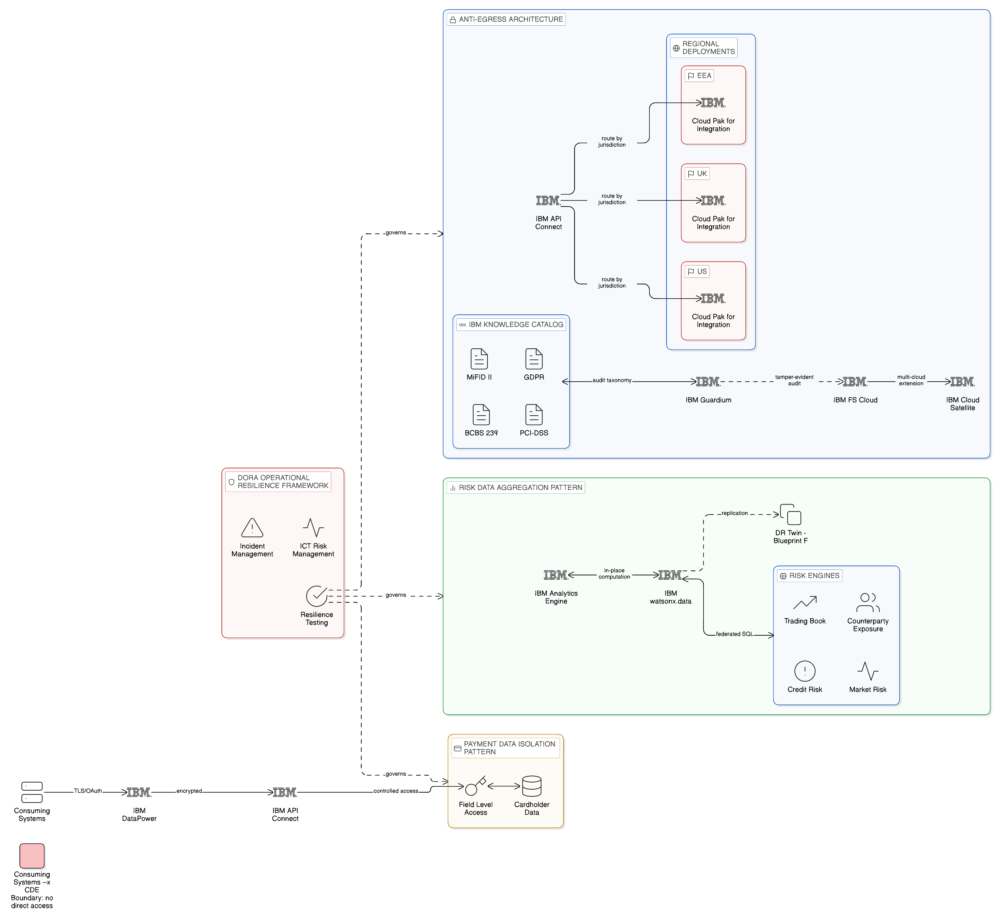
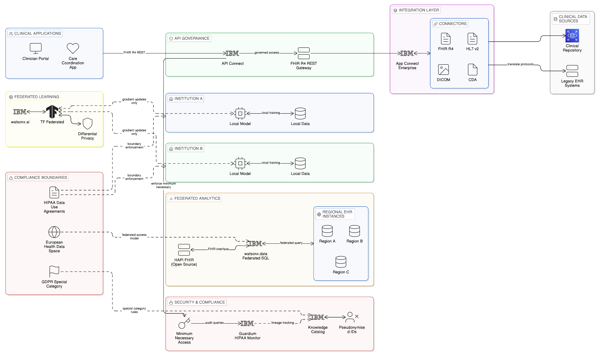
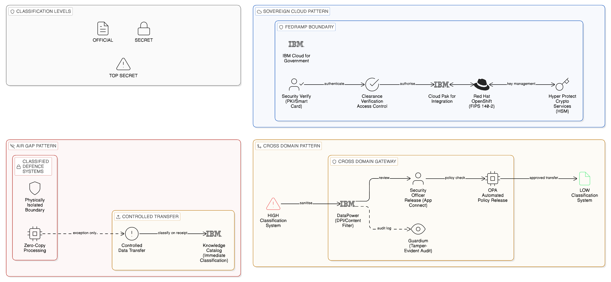
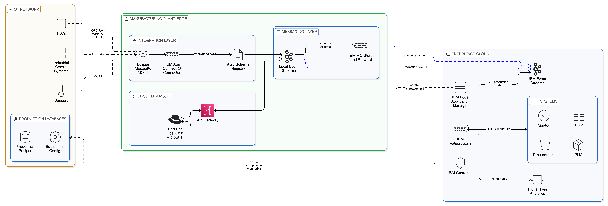
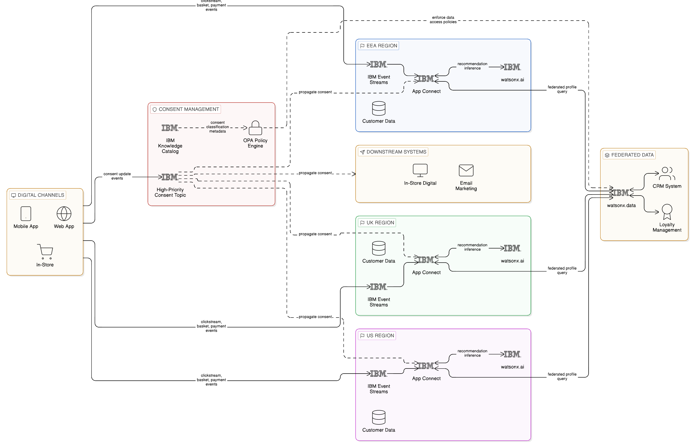

# Chapter 17 --- Industry-Specific Sovereignty and Resilience Patterns

*Sector Architectures for Finance, Healthcare, Government, Manufacturing, and Retail*

The preceding chapters of this book have presented the Zero-Copy Integration architecture as a set of general principles — data locality, governed access, event-driven communication, policy enforcement — that apply across the full range of enterprise integration scenarios. This generality is a strength of the architectural framework; the same technical disciplines that make a financial services firm's customer data sovereign-by-design also make a healthcare provider's patient records accessible without unnecessary replication, and the same resilience patterns that protect a government agency's operational systems from cascading failure also protect a manufacturing firm's production control infrastructure from network partition.

The generality of the framework, however, must be complemented by an understanding of the sector-specific regulatory, operational, and technological contexts within which it is applied. A financial services firm operates under the Digital Operational Resilience Act, the Basel III capital adequacy framework, and the Payment Card Industry Data Security Standard, each of which imposes specific requirements on the design and operation of its integration architecture. A healthcare provider operates under HIPAA in the United States, the EU Medical Device Regulation, the forthcoming European Health Data Space regulation, and a growing body of national health data governance legislation whose requirements differ materially from the financial services regulatory framework in both substance and enforcement culture. A government agency may operate under national security legislation that imposes air-gap requirements on certain integration contexts that have no commercial equivalent. A manufacturing enterprise faces operational resilience demands driven not by financial regulators but by the physical consequences of production control system failures. A retail enterprise faces the intersection of high-velocity event processing at consumer scale with the data protection obligations of an organisation handling large volumes of customer personal data across multiple jurisdictions.

This chapter examines the sector-specific sovereignty and resilience patterns that apply in five industries where the Zero-Copy Integration architecture has particular relevance. For each sector, the chapter identifies the distinctive regulatory and operational context, the specific sovereignty and resilience challenges that context creates, the named architectural patterns and IBM platform capabilities that address those challenges most effectively, and the operational considerations that the sector context introduces. The blueprints presented in [Chapter 16](16_chapter_architectural_blueprints) provide the general-purpose reference patterns on which the sector-specific patterns in this chapter are built; each sector section identifies the relevant [Chapter 16](16_chapter_architectural_blueprints) blueprint and the adaptations that the sector context requires.

## 17.1 Financial Services: Regulated Resilience and Data Sovereignty

### The Regulatory Context

The financial services sector is simultaneously one of the most heavily regulated and one of the most technically advanced sectors for data integration architecture. The regulatory environment — comprising prudential regulation by bodies such as the Prudential Regulation Authority in the United Kingdom, the European Central Bank under the Single Supervisory Mechanism, and the Federal Reserve in the United States; conduct regulation by the Financial Conduct Authority, the Securities and Exchange Commission, and their equivalents; and operational resilience regulation through DORA and national equivalents — creates a complex matrix of data governance requirements that vary by data category, by jurisdiction, and by the specific financial services activity to which the data relates.

DORA, which entered application in January 2025, is particularly relevant to the Zero-Copy architecture because it directly addresses the operational resilience of digital systems in financial entities. DORA's ICT risk management requirements mandate that financial entities maintain ICT systems that are resilient, recoverable, and tested; its digital operational resilience testing requirements mandate that firms periodically test their incident response and recovery capabilities through threat-led penetration testing and full recovery exercises; its ICT third-party risk requirements mandate that firms assess and manage the concentration risks created by their dependence on third-party technology providers, with contractual requirements specifying recovery time and recovery point objectives. BCBS 239 adds specific requirements for the timely and accurate aggregation of risk data during periods of stress — a requirement that bears directly on the integration fabric's resilience, since a firm that cannot aggregate its risk data because its integration infrastructure is degraded is non-compliant regardless of how well its individual systems are functioning. PCI-DSS requires that cardholder data never be transmitted in cleartext across open networks and imposes specific requirements on the isolation and monitoring of systems that process payment card data, requirements that the Zero-Copy architecture must satisfy through its data classification framework and network policy enforcement.

### The Anti-Egress Architecture Pattern

The primary sovereignty pattern for financial services is the anti-egress architecture: a design philosophy in which regulated data — customer personal data, transaction records, position data, risk calculations, market data entitlements — does not cross jurisdictional boundaries except where specifically required by regulatory reporting obligations, and all cross-border transfers are explicitly authorised by a governance policy, logged in a tamper-evident audit record, and available for regulatory review on demand. This pattern is the direct application of Blueprint A (the regionally sovereign data fabric) to the financial services context, with the addition of financial sector-specific data classification categories and the DORA-mandated audit evidence requirements.

In IBM terms, the anti-egress architecture is implemented through IBM Cloud Pak for Integration deployed regionally within each regulatory jurisdiction, with IBM API Connect's jurisdiction-aware routing policies enforcing the prohibition on cross-border data flows for regulated data categories. IBM Knowledge Catalog maintains the authoritative classification of each data asset against which routing decisions are evaluated, extended with the financial sector-specific data taxonomy — MiFID II financial instrument reference data, GDPR special category data, PCI-DSS cardholder data, BCBS 239 risk data — that the regulatory framework demands. IBM Guardium provides the tamper-evident audit record of all data access events, including attempted cross-border transfers that were blocked by policy enforcement, with the audit log format conforming to the evidentiary standards that financial regulatory examinations require.

IBM Financial Services Cloud provides the sovereign deployment environment in which the anti-egress architecture is hosted for workloads that require the regulatory transparency, audit logging, and change management controls that financial regulators require from cloud-hosted critical infrastructure. The platform's controls library, which maps IBM Financial Services Cloud capabilities to specific regulatory requirements across multiple jurisdictions, reduces the compliance assessment burden for financial services firms migrating regulated workloads to cloud infrastructure. For financial services firms that must operate on multi-cloud or hybrid infrastructure — as many do, either by regulatory requirement for jurisdictional redundancy or by strategic choice for commercial resilience — IBM Cloud Satellite extends the Financial Services Cloud governance model to non-IBM infrastructure locations, ensuring that the compliance controls that apply within IBM Financial Services Cloud also apply to workloads deployed on other providers' infrastructure through the Satellite management plane.

### The Risk Data Aggregation Pattern

The BCBS 239 risk data aggregation requirement creates a specific integration architecture demand that the general anti-egress pattern does not fully address: the ability to aggregate risk data rapidly across all risk systems — trading books, counterparty exposure calculators, market risk models, credit risk engines — into a consolidated risk position that can be computed and reported within the regulatory timeline. In a distributed Zero-Copy architecture, this aggregation is achieved not by copying risk data to a central repository but by executing federated SQL queries against each risk system's data in place, aggregating the results at the query engine layer, and presenting the consolidated position to the risk reporting system. IBM watsonx.data provides this federated aggregation capability, with IBM Analytics Engine (managed Spark) providing the in-place computation substrate for risk data held in object storage or data lake formats.

The resilience dimension of the BCBS 239 pattern is critical: the firm must be able to demonstrate that risk data aggregation is possible even under degraded infrastructure conditions. The Zero-Copy approach, where risk data remains in its authoritative risk system rather than in a central repository, means that the resilience of the aggregation capability is determined by the resilience of each risk system individually and the resilience of the watsonx.data federation layer. The BC/DR topology described in Blueprint F of [Chapter 16](16_chapter_architectural_blueprints) — with a DR twin of the watsonx.data federation layer in each region, and Instana monitoring confirming that the DR twin's catalogue is synchronised — is the direct implementation of the BCBS 239 resilience requirement in the Zero-Copy context.

### The Payment Data Isolation Pattern

PCI-DSS compliance requires that cardholder data be processed within a technically isolated environment — the cardholder data environment — and that all data flows into and out of this environment be explicitly authorised, encrypted, and monitored. The Zero-Copy architecture implements this requirement through the API façade pattern (Blueprint C of [Chapter 16](16_chapter_architectural_blueprints)) applied to the cardholder data environment: consuming systems access payment data through governed API interfaces that enforce the field-level access controls and encryption requirements of PCI-DSS, without direct access to the cardholder data environment's underlying systems. IBM DataPower Gateway provides the TLS termination, message-level encryption, and access token validation that form the security boundary of the API façade at the cardholder data environment perimeter. IBM API Connect manages the API contracts and consumer authorisations for payment data access, maintaining the audit trail that PCI-DSS audit requirements demand.

*Figure 17.1: Financial Services Sector Patterns — Anti-Egress Architecture (IBM Cloud Pak for Integration with jurisdiction-aware routing and MiFID II/GDPR/PCI-DSS/BCBS 239 taxonomy in IBM Knowledge Catalog), Risk Data Aggregation Pattern (IBM watsonx.data federated SQL across risk systems for BCBS 239 without centralisation), and Payment Data Isolation Pattern (IBM DataPower Gateway API façade over the PCI-DSS cardholder data environment), all governed under DORA operational resilience requirements.*

## 17.2 Healthcare: Zero-Copy Integration for Patient Data and Clinical Systems

### The Regulatory Context

Healthcare organisations face a data sovereignty challenge that is in some respects more complex than that of financial services: the sensitivity of patient health information creates strong legal, ethical, and reputational obligations to minimise its exposure through unnecessary replication, whilst the clinical necessity of making patient information available across care settings creates equally strong obligations to make that information accessible in a timely and complete manner to authorised clinical users. The Zero-Copy architecture addresses this tension directly by enabling access to patient data in its authoritative location — the Electronic Health Record system, the clinical data repository, the diagnostic imaging archive — without requiring that data to be replicated to the system or user interface through which it is consumed.

In the United States, HIPAA defines the minimum standards for the protection of Protected Health Information and creates specific obligations around its use and disclosure in data integration scenarios. The HIPAA Privacy Rule's minimum necessary standard — the requirement that health information be disclosed only to the extent necessary for the purpose of the disclosure — is directly supported by the Zero-Copy architecture's field-level access control capability: the integration fabric can enforce the minimum necessary standard at the individual field level, ensuring that each consuming system receives only the fields of the patient record that are necessary for its specific clinical or administrative purpose.

The EU's General Data Protection Regulation applies to health data as a special category of personal data under Article 9, imposing stricter processing conditions than those applicable to ordinary personal data. The forthcoming European Health Data Space regulation creates specific requirements for cross-border access to health data within the European Union: its model of federated access to health data across member state health systems, without centralising patient data in a pan-European repository, is architecturally equivalent to Blueprint A's regionally sovereign data fabric, and the Zero-Copy architecture is positioned to implement the EHDS access model more faithfully than any centralised alternative. The EU Medical Device Regulation imposes additional data governance requirements on medical devices that process or transmit patient data, requirements that the integration fabric must accommodate through device-specific data classification and the access controls that IBM Knowledge Catalog's policy framework enforces.

### The Clinical Interoperability Pattern

The primary integration pattern in healthcare is the governed clinical interoperability architecture: a Zero-Copy implementation of the HL7 FHIR (Fast Healthcare Interoperability Resources) standard that enables the exchange of clinical data between EHR systems, diagnostic platforms, care coordination services, and patient-facing applications without replicating patient records between systems. The FHIR standard defines a RESTful API model for health data access that is inherently aligned with the Zero-Copy approach: FHIR resources — Patient, Observation, DiagnosticReport, MedicationRequest — are accessed through API queries against the authoritative EHR system rather than extracted to intermediate data stores.

IBM App Connect Enterprise provides the integration runtime for the healthcare sector through a set of pre-built connectors for the principal healthcare interoperability standards: HL7 FHIR R4, HL7 v2 messaging, DICOM for diagnostic imaging, and the HL7 CDA document standard. These connectors implement the protocol translation between clinical systems that use legacy HL7 v2 messaging — the dominant standard in hospital information systems installed before the FHIR era — and modern consuming applications that expect FHIR RESTful APIs, without requiring the clinical system itself to be modernised. This legacy-to-FHIR translation is implemented through the API façade pattern (Blueprint C), with IBM App Connect providing the transformation and IBM API Connect providing the governance and access control layer that enforces the minimum necessary standard at query time.

IBM Cloud Pak for Integration provides the governance layer through which FHIR API access to EHR systems is managed, audited, and access-controlled. Every FHIR query is logged in IBM Knowledge Catalog's lineage record with the requesting application identity, the patient identifier (pseudonymised for audit privacy), the FHIR resource types accessed, and the data classification of the accessed fields. IBM Guardium provides the database-level access monitoring that HIPAA's technical safeguard requirements mandate: monitoring all database-level queries to patient data repositories, recording every access event in the tamper-evident audit log, and generating alerts for access patterns that are inconsistent with the clinical context in which the data is being accessed — a large-volume query of patient records outside normal clinical hours, for example, or an application accessing patient records in bulk without a matching care episode record.

### The Clinical Analytics Pattern

For healthcare analytics — population health management, clinical quality improvement, pharmaceutical outcomes research — the Zero-Copy approach implements federated analytics (Blueprint D) over clinical data that must remain within the jurisdiction and institutional boundary of the health system that generated it. IBM watsonx.data provides the federated SQL capability through which analytical queries are dispatched to regional EHR and clinical data repository instances, with query pushdown minimising the volume of patient data that traverses the network. The open-source FHIR-native analytics ecosystem — including FHIR Shorthand for dataset specification and HAPI FHIR for open-source FHIR server implementation — provides the clinical data access layer on which IBM watsonx.data's federation connectors operate.

For pharmaceutical research scenarios where federated model training across multiple health systems is required — for example, training a diagnostic model on patient cohort data from multiple hospitals without sharing individual patient records — the federated learning pattern described in Blueprint D applies directly. IBM watsonx.ai's distributed training coordination, combined with the privacy-preserving parameter aggregation techniques available through the open-source TensorFlow Federated framework, enables model training across multi-site clinical cohorts whilst maintaining the HIPAA data use agreement boundaries that prohibit sharing of individual-level patient data between institutions.

*Figure 17.2: Healthcare Sector Patterns — Clinical Interoperability Pattern (IBM App Connect Enterprise with HL7 FHIR R4, HL7 v2, DICOM, and CDA connectors governed by IBM API Connect with minimum-necessary field-level enforcement and IBM Guardium HIPAA monitoring) and Clinical Analytics Pattern (IBM watsonx.data federated SQL across regional EHR instances, IBM watsonx.ai federated learning with TensorFlow Federated for multi-site research within HIPAA data use agreement boundaries), aligned with GDPR Article 9 and the European Health Data Space federated access model.*

## 17.3 Public Sector: Sovereign Operations and Security Domain Patterns

### The Regulatory and Security Context

Public sector organisations — government departments, defence agencies, national intelligence services, critical national infrastructure operators — represent the most demanding sovereignty and resilience context for the Zero-Copy architecture. The sovereignty requirements of public sector integration are not merely regulatory in nature; they reflect genuine national security imperatives that may justify architectural measures — air-gap isolation, cryptographic separation, hardware security module-protected key management — that commercial enterprises would regard as operationally disproportionate. At the same time, government organisations face increasing pressure to modernise their digital infrastructure and to share data more effectively between departments and agencies, creating a tension between the isolation requirements of security and the connectivity requirements of effective public administration.

The regulatory framework for public sector integration varies by country and security classification level. In the United Kingdom, the Government Security Classification Policy defines three classification levels — OFFICIAL, SECRET, and TOP SECRET — each with specific requirements for the systems that may process data at that level and the network environments in which those systems may operate. The Cabinet Office's Cloud Security Principles and the National Cyber Security Centre's guidance on cloud adoption define the technical controls that government cloud deployments must implement. In the United States, the Federal Risk and Authorisation Management Programme (FedRAMP) defines the cloud security requirements that apply to federal government workloads, with FISMA providing the broader information security management framework. NATO and EU classified information handling requirements apply to defence and security organisations operating within those frameworks.

### The Sovereign Cloud Pattern for Government

For government workloads that do not require the extreme isolation of air-gap deployment, the sovereign cloud pattern implements the integration fabric within a dedicated, access-controlled cloud environment whose operational management, personnel security, and data processing activities satisfy the applicable government security framework. IBM Cloud for Government provides the FedRAMP-authorised cloud environment for United States federal government workloads, with IBM Cloud Pak for Integration and IBM watsonx.data deployed within the FedRAMP authorisation boundary. For UK public sector organisations, IBM's alignment with the G-Cloud procurement framework and the Cyber Essentials Plus certification standard provides the governance assurance that public sector procurement requires. Red Hat OpenShift Government provides the secure container orchestration platform on which classified and sensitive government workloads are deployed, with FIPS 140-2 validated cryptographic modules and Common Criteria evaluated security components that government security requirements demand.

The sovereign cloud pattern for government extends Blueprint A (the regionally sovereign data fabric) with government-specific access control requirements: personnel security clearance verification as a prerequisite for access to classified data assets, hardware security module-based key management for the encryption of data in transit and at rest, and the enhanced audit logging requirements that government security standards impose. IBM Hyper Protect Crypto Services provides the HSM-backed key management that government data classification requirements demand for the most sensitive data categories, ensuring that encryption keys for classified data never leave the tamper-evident hardware boundary of the HSM. IBM Security Verify provides the identity and access management capability that integrates with government identity frameworks — PKI certificates, smart card authentication, government identity federation standards — to ensure that access to classified data through the integration fabric satisfies the personnel security requirements applicable to each classification level.

### The Cross-Domain Solution Pattern

The cross-domain solution pattern is applicable to public sector organisations that must exchange data between systems operating at different security classification levels: passing data from a SECRET system to an OFFICIAL system, or receiving data from an external, unclassified network into a classified environment. This is a specialised variant of the API façade blueprint (Blueprint C) in which the mediation layer implements the content inspection, data sanitisation, and release authorisation workflow required to permit controlled data transfer across a security domain boundary without compromising the integrity of the higher-classification domain.

IBM DataPower Gateway's deep packet inspection and content filtering capabilities provide the technical enforcement layer for cross-domain data transfers: every message crossing a domain boundary is inspected for content that would be classified at a level incompatible with the target domain, sanitised to remove or redact such content, and audited before transfer is authorised. The release authorisation workflow — in which a human security officer reviews and approves each cross-domain transfer before it is executed — is implemented through IBM App Connect's workflow orchestration capability, with the full transfer record logged in IBM Guardium's tamper-evident audit store. For high-volume, automated cross-domain transfers where human review of individual messages is impractical, the policy-based automated release workflow enforces the content filtering rules through OPA policies that are maintained by the security function and deployed through the Centre of Excellence's policy-as-code pipeline.

### The Air-Gap Integration Pattern

For systems that must be physically isolated from external networks — classified defence systems, critical national infrastructure control networks, intelligence collection platforms — the Zero-Copy architecture operates entirely within the air-gapped boundary for internal data access, with the integration fabric's full capabilities — query federation, event streaming, API governance — deployed on infrastructure that has no external network connectivity. The challenge is data exchange at the air-gap boundary itself, which necessarily involves some form of controlled data transfer. The Zero-Copy principle is honoured within the boundary; data transfers across the boundary are treated as governed exceptions that require explicit authorisation and logging, with the transferred data immediately classified upon receipt in the destination environment and subjected to the destination environment's access controls through IBM Knowledge Catalog.

*Figure 17.3: Public Sector Patterns — Sovereign Cloud Pattern (IBM Cloud for Government FedRAMP boundary, IBM Hyper Protect Crypto Services HSM key management, IBM Security Verify PKI/smart-card authentication), Cross-Domain Solution Pattern (IBM DataPower Gateway content inspection and sanitisation across security classification boundaries with human release authorisation and OPA automated policy enforcement), and Air-Gap Integration Pattern (full Zero-Copy fabric within the isolated boundary, controlled transfer exceptions with immediate IBM Knowledge Catalog classification on receipt).*

## 17.4 Manufacturing: Edge Resilience and Plant Autonomy Patterns

### The Operational Context

The manufacturing sector presents a resilience challenge for integration architecture that is distinct from the regulatory-driven sovereignty challenges of financial services, healthcare, and public sector. The factory floor is an environment in which network connectivity to central cloud or data centre infrastructure may be intermittent, latency-sensitive operational control systems cannot tolerate the response time variability of round-trips to cloud-based integration, and the consequences of integration failure — production stoppages, quality control breaches, safety system failures — are immediately tangible and potentially severe. The Zero-Copy Integration architecture, applied to manufacturing, must be designed for disconnected operation as a first-class requirement rather than as an edge case.

The IT/OT convergence challenge — the integration of enterprise IT systems with operational technology, the proprietary industrial control systems, programmable logic controllers, and sensor networks that control physical production processes — creates an additional complexity. OT systems speak industrial protocols — OPC-UA, MQTT, Modbus, PROFINET — that have no direct equivalents in enterprise IT integration standards. They are often deployed on dedicated networks that are physically separated from corporate IT networks for safety and security reasons. And they are typically maintained on much longer refresh cycles than IT systems, meaning that integration solutions must accommodate OT equipment that may be decades old alongside modern cloud-native enterprise systems.

### The Local Autonomy Pattern

The edge resilience pattern for manufacturing implements the principle of local plant autonomy: each manufacturing site operates an independent instance of the critical integration capabilities — a local event streaming cluster, an API gateway, and an operational data store — that can function completely independently of central infrastructure when connectivity is unavailable. The local integration infrastructure is synchronised with the central enterprise integration fabric when connectivity is available, propagating operational events — production counts, quality measurements, equipment telemetry, maintenance alerts — to the central analytical infrastructure and receiving configuration updates and production schedules from the central planning systems. When connectivity is lost, the local infrastructure continues to operate the site's integration independently, buffering synchronisation events in a durable local store for replay when connectivity is restored.

Red Hat OpenShift deployed on edge-certified server hardware provides the container runtime that hosts the local integration capabilities within each manufacturing site, using Red Hat OpenShift MicroShift for the most resource-constrained edge locations where a full OpenShift control plane would be disproportionate to the available hardware. IBM Edge Application Manager provides the central management plane through which local edge deployments are configured, monitored, and updated from a central operations centre, without requiring continuous connectivity between the edge location and the management plane — updates are queued at the management plane and applied when connectivity is restored.

IBM MQ, with its durable message store and guaranteed delivery semantics, provides the messaging backbone for the synchronisation events that are buffered at the edge during connectivity interruptions. IBM MQ's store-and-forward capability ensures that events generated during a connectivity outage are persisted in the local MQ queue manager and delivered to the central Event Streams cluster in strict order when connectivity resumes, without requiring the central system to poll the edge location or the edge to retransmit buffered messages multiple times. IBM Event Streams provides the local event streaming infrastructure for high-volume operational telemetry — equipment sensor readings, production counter pulses, environmental monitoring data — that must be available to local real-time analytics workloads during disconnected operation.

### The IT/OT Integration Pattern

The integration of OT protocols into the enterprise event fabric is implemented through the IBM App Connect OT connectors and the open-source Eclipse Mosquitto MQTT broker, which provides the bridge between the lightweight MQTT messaging used by industrial IoT devices and the enterprise-grade IBM Event Streams Kafka infrastructure. OPC-UA data sourced from industrial control systems is translated by IBM App Connect into FHIR-equivalent data structures — using Apache Avro schemas registered in the Event Streams schema registry — that allow analytical workloads to query OT data through the same IBM watsonx.data federation interface as enterprise IT data sources. This unified query layer, spanning both IT and OT data sources, is the foundation of the manufacturing digital twin analytics capability: a federated query that joins production event data from OT systems with maintenance history from the enterprise ERP, quality specifications from the product lifecycle management system, and supply chain data from the procurement system, without replicating any of those datasets to a central analytical store.

IBM Guardium's monitoring capability extends to OT database systems in the manufacturing context, providing the tamper-evident audit record for access to production recipe data, quality specification databases, and equipment configuration stores that are subject to intellectual property protection obligations and, in regulated manufacturing sectors such as pharmaceuticals and aerospace, to GxP and AS9100 quality management audit requirements.

*Figure 17.4: Manufacturing Sector Patterns — Local Autonomy Pattern (Red Hat OpenShift MicroShift on plant edge hardware, IBM MQ store-and-forward buffering, IBM Event Streams local cluster, IBM Edge Application Manager central management, connected/disconnected operation modes) and IT/OT Integration Pattern (Eclipse Mosquitto MQTT bridge, IBM App Connect OT connectors translating OPC-UA/MQTT/Modbus to Apache Avro schemas, IBM watsonx.data unified federated query across OT and IT systems for digital twin analytics, IBM Guardium GxP/AS9100 audit on production databases).*

## 17.5 Retail: Real-Time Personalisation Without Cross-Border Exposure

### The Operational and Regulatory Context

The retail sector presents a distinctive integration challenge that combines the high-velocity event processing requirements of consumer-facing digital channels with the data protection obligations of organisations holding large volumes of customer personal data across multiple jurisdictions. Real-time personalisation — the capability to present each customer with product recommendations, pricing, and promotional content dynamically tailored to their individual behaviour and preferences — is a primary driver of digital retail value creation. It requires the continuous processing of customer interaction data at a scale and velocity that makes the Zero-Copy architecture a practical necessity rather than merely a desirable aspiration: the volume of customer interaction events generated by a major digital retail platform — clickstreams, search queries, basket modifications, payment initiations, abandonment events — cannot be cost-effectively replicated to a central processing system; it must be processed in place, at or near the point of generation.

The regulatory context for retail integration is primarily driven by GDPR and its equivalents for personal data held in the European Union, UK, and other jurisdictions, supplemented by sector-specific regulations such as the Payment Services Directive (PSD2) for payment processing and the Cookie Law for digital tracking. The geographic distribution of retail customers creates a specific sovereignty challenge: the same personalisation engine must serve customers whose data is subject to different national data protection regimes, and the integration architecture must enforce the applicable data residency and consent requirements for each customer's data without creating a separate technical implementation for each jurisdiction. This is precisely the multi-jurisdictional governance problem that Blueprint A's regionally sovereign data fabric addresses, applied to the customer data context.

### The Real-Time Personalisation Pattern

The retail event-driven personalisation pattern implements real-time customer segmentation and recommendation logic as stream processing workloads that execute against the event stream rather than against a replicated customer data repository. Customer profile attributes — preferences, purchase history, loyalty tier, consent flags — are accessed through the federated data fabric rather than copied to the stream processing environment; the stream processor queries the customer profile for the relevant attributes of each customer whose interaction event it processes, receiving the minimum necessary data to compute the personalised recommendation for that specific event context. This minimum-necessary access model is not only privacy-respecting; it is operationally efficient, since the stream processor does not maintain a growing in-memory copy of all customer profiles, but instead fetches the specific profile attributes it needs at the moment it processes each event.

IBM Event Streams provides the event streaming infrastructure for the retail interaction event bus, with per-region topic partitioning ensuring that customer event data for European customers is processed by the European cluster and does not cross regional boundaries without explicit governance authorisation. IBM App Connect provides the stream processing runtime for the personalisation logic, integrating with the federated data access layer to support the at-event-time customer profile queries that the pattern requires. IBM watsonx.data provides the federated access layer through which the stream processing workloads query customer profile attributes held in the retail CRM and loyalty management systems — enabling low-latency profile queries from the stream processing context without replicating the customer master to the event processing infrastructure. IBM watsonx.ai provides the machine learning model serving capability through which recommendation models are executed against the stream processing inputs, with model serving deployed regionally to ensure that inference latency is consistent regardless of the geographic distribution of the customer base.

### The Consent and Preference Management Pattern

A specific sovereignty challenge in retail integration that the general personalisation pattern does not fully address is the management of customer consent and data processing preferences under GDPR and equivalent regulations. A customer who has withdrawn consent for personalisation in one channel — for example, by updating their privacy preferences in a mobile app — must have that preference honoured immediately across all channels, including the event-driven personalisation engine, the email marketing platform, and the in-store digital interaction systems. This requires that consent state changes be propagated to all systems that process personal data for personalisation purposes as an event, with governance controls that prevent any system from processing personal data for a purpose to which the customer has not consented.

IBM Event Streams provides the event channel through which consent state changes are propagated to all consuming systems as high-priority events. IBM Knowledge Catalog maintains the consent classification metadata for each data processing purpose — personalisation, analytics, marketing, third-party sharing — and the OPA policies that enforce consent requirements at the point of data access, refusing queries for personal data in the context of a processing purpose for which the accessing consumer's target customer has not given consent. This consent enforcement at the data access governance layer, rather than implemented separately in each consuming application, provides the systematic assurance that GDPR consent requirements are honoured across the full digital retail estate without requiring every consuming application to implement its own consent evaluation logic.

*Figure 17.5: Retail Sector Patterns — Real-Time Personalisation Pattern (IBM Event Streams per-region customer interaction topics, IBM App Connect stream processing, IBM watsonx.data federated at-event-time profile queries against CRM/loyalty systems, IBM watsonx.ai regional ML model serving, regional partitioning preventing cross-border customer data flows) and Consent and Preference Management Pattern (high-priority consent event propagation to all consuming systems, IBM Knowledge Catalog consent classification by processing purpose, OPA enforcement at data access layer within GDPR prompt-withdrawal latency requirements).*

## 17.6 Summary and Sector Imperatives

The sector-specific analysis in this chapter reinforces a theme that runs through the book as a whole: data sovereignty is not a single, uniform requirement but a family of requirements that vary by sector, by jurisdiction, and by the specific data categories and processing activities to which they apply. The Zero-Copy Integration architecture provides a framework that can accommodate this diversity because it is built on principles — data locality, governed access, policy enforcement, jurisdiction-aware routing — that can be configured to reflect the specific requirements of each sector rather than on a fixed set of technical controls that impose a uniform sovereignty model. The argument of the chapter may be summarised in five claims.

First, the financial services sector's combination of DORA operational resilience requirements, BCBS 239 risk data aggregation obligations, and PCI-DSS payment data isolation requirements creates a layered compliance demand that the Zero-Copy architecture addresses more comprehensively than any copy-centric alternative, by eliminating the data replication that multiplies the compliance surface whilst simultaneously providing the federation capability that makes risk data aggregation and regulatory reporting feasible without centralisation.

Second, the healthcare sector's clinical interoperability challenge — making patient data available across care settings without replicating it to systems outside its authoritative boundary — is the most natural expression of the Zero-Copy philosophy across all sectors examined in this chapter. The HL7 FHIR standard's RESTful API model is architecturally equivalent to the Zero-Copy access principle, and the IBM App Connect healthcare connector library provides the implementation path that bridges the FHIR-native world and the legacy HL7 v2 environment that most hospital information systems continue to operate.

Third, the public sector's security domain separation requirements — particularly the cross-domain solution and air-gap patterns — represent the most extreme instantiation of the Zero-Copy architecture's sovereignty principles, demonstrating that the framework's governance and isolation mechanisms can accommodate the most demanding national security integration requirements as well as the commercial regulatory requirements to which the majority of the book has been devoted.

Fourth, the manufacturing sector's local autonomy requirement — the need for each plant to operate its integration infrastructure independently when connectivity to central systems is unavailable — is the most compelling demonstration of the Zero-Copy architecture's inherent resilience advantage over centralised alternatives: a plant whose integration fabric cannot receive central connectivity has lost nothing in the Zero-Copy model, because its data was never held centrally; a plant dependent on a centralised integration hub loses all integration capability when the hub becomes unreachable.

Fifth, the retail sector's real-time personalisation at scale demonstrates that the Zero-Copy architecture is not merely a compliance instrument but a performance architecture: the ability to process customer interaction events against federated customer profile data, without replicating the customer master to the event processing environment, provides both the governance assurance of minimal personal data exposure and the operational efficiency of avoiding the storage, synchronisation, and freshness costs that a centralised customer data platform requires.

Several sector-specific imperatives emerge from this analysis. For financial services, the imperative is to treat DORA's operational resilience testing requirement as an opportunity to validate the Zero-Copy architecture's inherent resilience advantages — particularly zone-level failure tolerance and sovereignty-compliant recovery — through the formal testing programme that DORA mandates, generating the evidence that regulatory examination requires. For healthcare, the imperative is to align the Zero-Copy architecture's field-level access control and minimum necessary enforcement capability with the HIPAA minimum necessary standard and GDPR Article 9 special category conditions as a design requirement from the architecture's inception, not as a retrofit to an existing clinical integration estate. For public sector, the imperative is to engage national government security authorities early in the architecture design process to validate that the Zero-Copy architecture's sovereignty and isolation mechanisms satisfy the applicable classification requirements, rather than discovering non-compliance during a security accreditation process. For manufacturing, the imperative is to design the local autonomy capability — the edge cluster, the MQ buffering, the MicroShift-based local runtime — as a standard component of every plant integration deployment, treating disconnected operation as the baseline requirement rather than the exceptional case. For retail, the imperative is to implement the consent and preference management pattern as a first-class architectural capability rather than as a compliance add-on, ensuring that consent state changes propagate through IBM Event Streams to all consuming systems within the latency window that GDPR's requirement for prompt withdrawal of consent demands.

The following chapter draws on real-world experience to present case studies of enterprises that have implemented Zero-Copy principles using IBM and open-source technologies, examining what worked, what did not, and the lessons that other enterprises can extract from their experience.
