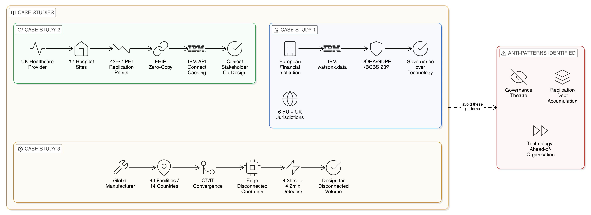
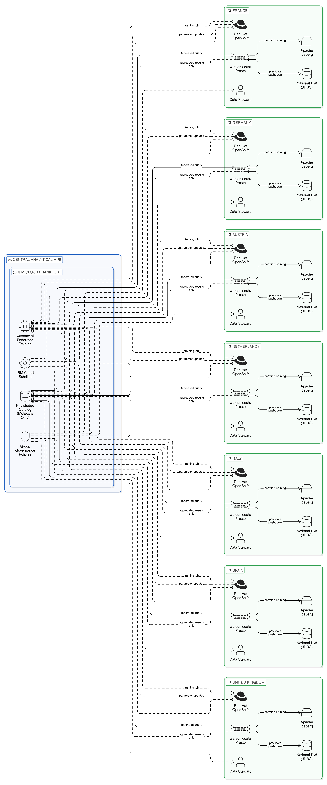
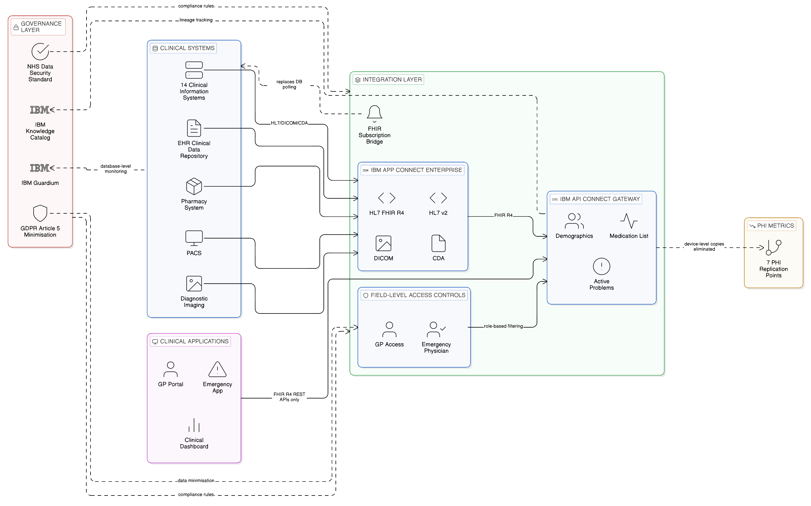
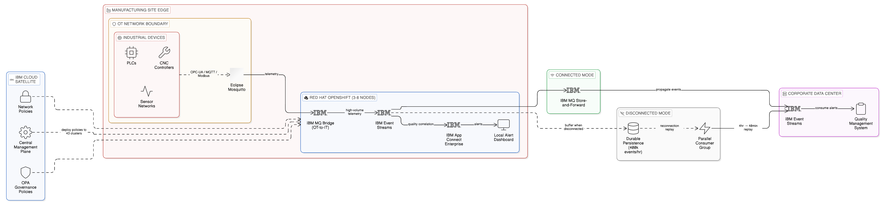
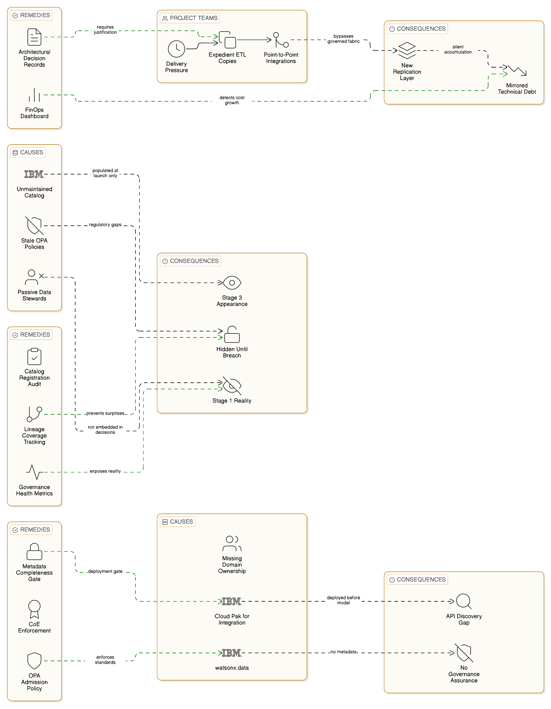

# Chapter 18 --- Case Studies in Sovereign and Resilient Integration

*Lessons from the Field and Anti-Patterns to Avoid*

The architectural principles, blueprints, and sector patterns presented in the preceding chapters represent the accumulated wisdom of enterprise integration practice synthesised into a coherent framework. That framework has the characteristics of all architectural frameworks: it is more orderly in its exposition than in its application, and the edge cases, organisational realities, and inherited constraints that characterise real enterprise environments do not always map cleanly to the categories through which the framework analyses them. This chapter grounds the architectural framework in operational experience, examining three cases of Zero-Copy Integration transformation across regulated industries and extracting the lessons — both positive and cautionary — that those cases offer.

The cases presented here are composites, drawn from experience across multiple client engagements, to preserve confidentiality whilst retaining the operational authenticity that makes case study analysis practically useful. They are not success narratives constructed to validate the framework; they are honest accounts of transformation programmes that achieved significant outcomes whilst also confronting genuine difficulties, and from which the lessons most valuable to other enterprises are as often the failures and course corrections as the successes. Three anti-patterns, observed with sufficient frequency across enterprise transformation programmes to warrant systematic treatment, follow the case studies and precede the practical disciplines through which the most common failure modes can be avoided.

*Figure 18.1: Case Studies Overview — three Zero-Copy transformation programmes (European Financial Institution: seven-jurisdiction sovereign data fabric; UK Healthcare Provider: FHIR-based PHI replication elimination; Global Manufacturer: 43-site edge IT/OT integration) with their key challenges and primary transformation lessons, followed by three recurring anti-patterns.*

## 18.1 Case Study One: A European Financial Institution's Sovereign Data Fabric

### Background and Impetus

A major European retail bank, operating across six EU member states and the United Kingdom, found itself in 2022 with a data infrastructure that had evolved organically through a series of acquisitions over the preceding decade into a collection of national data estates, each with its own data warehouse, its own ETL infrastructure, and its own data governance processes. The national estates had been allowed to diverge during the acquisition period because the integration of each acquired institution's technology infrastructure was treated as a medium-term programme, lower in priority than the commercial integration required to achieve the merger's revenue synergies. By 2022, however, the divergence had reached the point at which the group's risk management and regulatory reporting functions were operating with materially inconsistent data across national boundaries, and the cost of maintaining seven separate data warehousing estates — each with its own vendor licensing, its own data engineering team, and its own refresh schedule — was approaching levels that the group's board could no longer regard as acceptable.

The bank's Chief Data Officer had a strategic mandate to consolidate the analytical capability of these national estates into a unified capability that could support group-level risk management, regulatory reporting, and customer analytics without violating the data localisation requirements that applied to customer data in each national jurisdiction. The mandate was complicated by the simultaneous application of DORA from January 2025: the bank's prudential regulator had signalled that a centralised cloud-based data platform that aggregated customer data from multiple jurisdictions would face scrutiny as a concentration risk under DORA's ICT third-party risk framework, and that the bank would need to demonstrate that its analytical infrastructure design addressed rather than amplified that concentration risk.

### The Rejected Centralisation Approach

The initial proposal from the bank's previous systems integrator was to build a central data lake hosted in a single cloud region, into which the national data estates would load standardised data extracts on a nightly schedule. This proposal was rejected by the bank's legal counsel as incompatible with the data localisation obligations under GDPR that applied to customer personal data in several of the national jurisdictions — most specifically in France, Germany, and Austria, where national implementing legislation imposed stricter localisation requirements on financial services customer data than the GDPR minimum standards. The concentration risk concern raised by the prudential regulator further argued against the centralised approach: a single data lake serving all national analytical workloads would represent precisely the kind of critical single point of failure that DORA's operational resilience framework was designed to address.

### The Zero-Copy Architecture

The alternative architecture, developed with IBM's assistance through an IBM Client Engineering co-creation programme, implemented the regionally sovereign data fabric blueprint described in Chapter 16. Regional IBM watsonx.data clusters were deployed in each of the six national data centres and in a seventh cluster serving the United Kingdom operation, each cluster federated with the local national data estate through a combination of JDBC connectors for the relational database systems that formed the core of each national warehouse and Iceberg table connectors for the object storage tiers that the more recently modernised national estates had adopted. A central analytical hub, hosted on IBM Cloud in Frankfurt within the EEA, maintained only the metadata catalogue and the group-level governance policies in IBM Knowledge Catalog; no customer data from the national estates was replicated to the central hub.

Group-level analytical queries were executed as federated workloads, with computation distributed to the national watsonx.data clusters and only aggregated, anonymised results returned to the central hub for group reporting. Group risk models that required individual-level data from multiple national customer bases were trained using the federated model training pattern described in Blueprint D of Chapter 16: training jobs were distributed to each national cluster, parameter updates were aggregated centrally by IBM watsonx.ai's training coordination layer, and the resulting global model was deployed to all national clusters without any national customer data leaving its country of residence. IBM Cloud Satellite provided the management plane through which the seven national OpenShift clusters were operated as a coherent estate from the group's central operations team, maintaining consistent governance policy configuration across all national deployments without requiring the central team to manage seven separately administered infrastructure environments.

### Challenges Encountered

The programme took eighteen months from initiation to production operation of the full federated analytical capability. The principal challenges were not technical but organisational. The national data governance teams, accustomed to owning their data estates as local resources and accustomed to a governance regime in which group-level data requests were handled through manual data extract processes that they controlled, required sustained engagement to transition to the domain ownership model in which they became publishers of governed data interfaces to the group fabric. Several national teams expressed concern that the federated query model, in which group analysts could query national data through watsonx.data, represented a loss of sovereignty over their data assets rather than a gain. This concern was addressed through the design of access control policies in IBM Knowledge Catalog that gave national domain stewards explicit control over which query patterns were permitted against their data sources, with group-level queries subject to the same access controls as local queries. The IBM Client Engineering co-creation model was essential to this transition: national data stewards participated in the design of their domains' data interfaces rather than receiving a pre-specified technical requirement, producing a genuine sense of ownership over the federated model that sustained their engagement through the delivery phase.

The second significant challenge was query performance across national data centres. The network latency between data centres in different national jurisdictions — typically 20 to 40 milliseconds for intra-EEA paths, rising to 80 to 120 milliseconds for the UK-to-EEA path post-Brexit — meant that federated queries that joined data from multiple national estates were sensitive to the volume of data exchanged across national boundaries. Significant query engineering work was required to ensure that predicate pushdown and partition pruning were correctly configured on all national cluster connectors, so that queries filtered data at the national cluster before transmitting results to the central analytical hub. IBM watsonx.data's query optimiser proved capable of this pushdown configuration once the national data sources' statistics were correctly ingested, but the initial period of query performance tuning added approximately six weeks to the programme timeline.

### Outcomes and Lessons

The outcomes were demonstrably positive on the dimensions that motivated the programme. The bank's compliance function confirmed that the federated architecture satisfied its data localisation obligations in all six national jurisdictions, and the DORA operational resilience assessment conducted by the bank's prudential regulator accepted the federated deployment topology as evidence of appropriate concentration risk management — specifically noting that the failure of any single national cluster would not interrupt analytical capability for the remaining national operations, in contrast to the centralised data lake that had been the original proposal. The group analytical capability delivered value that the previous siloed national estates could not: group-level customer risk models that incorporated behaviour patterns from all national customer bases without centralising personal data, and cross-border fraud detection that identified transaction patterns spanning multiple national operations without requiring the creation of a pan-European customer data repository.

The programme's most important lesson was the primacy of governance over technology in determining whether a Zero-Copy architecture succeeds. The watsonx.data federation capability was available from the outset; the eighteen months of programme duration were consumed almost entirely by the organisational and governance work — domain boundary definition, Data Steward assignment, access control policy design, national team engagement — that made the technical capability operational within a governance framework that all stakeholders trusted. Enterprises that underestimate this organisational investment and attempt to compress it in favour of accelerated technical delivery consistently produce Zero-Copy architectures that are technically functional but organisationally unsustained.

*Figure 18.2: Case Study One — European Financial Institution Sovereign Data Fabric: seven IBM watsonx.data Presto clusters on Red Hat OpenShift deployed within national jurisdictions, connected to a Frankfurt central analytical hub containing only IBM Knowledge Catalog governance metadata (no customer data), with federated group risk queries using predicate pushdown at each national cluster, federated model training via IBM watsonx.ai returning only parameters, and IBM Cloud Satellite providing consistent operational management across all seven national deployments.*

## 18.2 Case Study Two: A Healthcare Provider's FHIR-Based Integration Without PHI Replication

### Background and Impetus

A large regional healthcare provider in the United Kingdom, operating across seventeen hospital sites and associated community health settings, had accumulated by 2023 an integration estate of considerable complexity: more than two hundred integration flows connecting fourteen distinct clinical information systems, implemented through a mixture of HL7 v2 message queuing, database-level data sharing through shared schemas, and point-to-point file transfer. The provider's information governance team had identified, through a comprehensive audit conducted in preparation for a Care Quality Commission inspection, that this integration estate contained at minimum forty-three locations where patient identifiable data — name, date of birth, NHS number, clinical diagnosis codes — was replicated unnecessarily across systems. These replicated PHI copies were creating compliance exposure under GDPR's Article 5 data minimisation principle and the NHS Data Security and Protection Standard's requirement to handle patient data only to the extent required for the care purpose it supports.

The audit had further identified that five of these forty-three replication points involved copies of patient data being held on end-user computing devices — laptops, mobile devices, local workstation databases — outside the information governance controls of the central clinical information management framework. These device-level copies were the legacy of workflow workarounds implemented by clinical teams who found the access latency of the central clinical systems unacceptable for time-critical clinical decisions, and who had therefore created local caches of the patient records they most frequently consulted. Addressing these device-level copies required not only a technical solution — the elimination of the replication — but also a performance solution that made Zero-Copy access to the central systems sufficiently responsive that clinical teams would not need the workaround.

### The Zero-Copy Architecture

The Zero-Copy transformation programme, implemented in partnership with IBM over a twenty-four-month period, replaced the legacy integration estate with a FHIR-based API layer implemented through IBM API Connect and IBM App Connect, through which clinical systems accessed patient records through standardised HL7 FHIR R4 interfaces rather than through direct database connections or file transfers. The FHIR API layer enforced field-level access controls based on the NHS's national data classification framework, supplemented by role-based access controls that reflected the specific clinical roles authorised to access each category of clinical information — general practitioners receiving a different view of the patient record from emergency physicians, for example, based on the different care purposes each role serves.

IBM Knowledge Catalog maintained the lineage of each patient data access event, providing the audit trail that the provider's Caldicott Guardian function required to respond to patient data subject access requests under GDPR and to demonstrate to the CQC that patient data access was governed in accordance with the NHS Data Security and Protection Standard. IBM Guardium was deployed to monitor all database-level access to the fourteen clinical information systems, providing the independent audit record that could detect any direct database access that bypassed the FHIR API layer — a critical capability given the history of clinical teams creating local workarounds, which could in principle be extended to creating direct database access connections outside the governed integration framework.

IBM API Connect's response caching capability addressed the access latency concern that had driven clinical teams to create local data copies. Frequently accessed patient record elements — demographics, current medication list, active problem list — were cached at the API gateway tier with a freshness configuration that balanced clinical accuracy requirements (no stale data for time-critical clinical elements) against the performance requirements of clinical workflows. The cache configuration was developed in close consultation with the provider's clinical informatics team to ensure that the freshness thresholds were clinically appropriate: medication lists were cached with a two-minute freshness window to allow for rapid sequential queries by a clinician reviewing multiple patients, but were always refreshed on first access after a clinical session began, ensuring that a clinician who had been away from the system for a significant period always received a current medication list rather than a cached one.

### The FHIR Subscription Challenge

The most significant technical challenge of the programme was the modernisation of the legacy data sharing arrangements that implemented real-time clinical alerting — the notification to clinical staff of critical test results, medication administration reminders, and patient deterioration alerts — which had been implemented through direct database polling of the clinical information systems. Database polling at the frequency required by clinical alert SLAs was imposing significant load on the clinical systems' databases and was one of the factors driving the clinical system vendors to restrict direct database access by third-party applications.

The replacement of database polling with FHIR Subscription resources — the HL7 FHIR mechanism for event-driven notification, in which a subscribing system registers interest in changes to specific FHIR resource types and receives notifications as those changes occur, without requiring the subscribing system to hold copies of the subscribed data — required significant renegotiation of interface designs with the clinical information system vendors. Several vendors had not yet implemented the FHIR Subscription capability in their products at the time the programme began; for these vendors, IBM App Connect's adapter framework provided a bridging mechanism through which the legacy database polling-based alerting was wrapped in a FHIR-compatible event-driven interface, translating database change events into FHIR Subscription notifications that the new alert management system consumed. This bridging mechanism allowed the clinical alerting capability to be migrated to the Zero-Copy model ahead of the vendors' FHIR Subscription implementations, with the bridge removed when vendors delivered native FHIR Subscription support in later product versions.

### Outcomes and Lessons

The programme reduced the number of PHI replication points in the integration estate from forty-three to seven — the seven remaining instances being operationally justified by specific clinical requirements that could not be satisfied through API-based access within the performance constraints of the clinical workflows they supported. The information governance team documented each of the remaining seven replication instances with a clinical necessity justification, a Data Protection Impact Assessment conducted in accordance with ICO guidance, and a defined review date — a governance posture that the provider's Data Protection Officer assessed as materially superior to the previous state of undocumented proliferation. The five device-level patient data copies were eliminated entirely through the API gateway caching mechanism, which provided the response time that clinical teams had previously required local copies to achieve whilst maintaining the governance controls that local copies by definition circumvented.

The programme's most important lesson was the necessity of engaging clinical stakeholders as partners in the architecture design rather than as recipients of a technical specification. The device-level data copy problem — which could only be addressed by making the governed access alternative attractive enough that clinical teams chose it over the workaround — required the clinical informatics team, the clinical nursing informatics leads, and the clinical system vendors to be active participants in the API gateway caching design. A technically correct caching configuration that was not validated against actual clinical workflows would have produced a cache that either failed the clinical accuracy requirements of time-critical decisions or failed the performance requirements that had driven the workarounds. The involvement of clinical stakeholders in the design produced a configuration that satisfied both requirements and that the clinical teams trusted because they had participated in its creation.

*Figure 18.3: Case Study Two — Healthcare Provider FHIR-Based Integration: IBM API Connect with role-differentiated response caching (eliminating device-level PHI copies) and IBM App Connect Enterprise FHIR R4/HL7 v2/DICOM connectors providing the API façade over 14 clinical systems, IBM Knowledge Catalog lineage with pseudonymised patient identifiers, IBM Guardium independent database monitoring detecting bypass attempts, reducing PHI replication points from 43 to 7 with DPIA-documented clinical necessity for the remaining seven.*

## 18.3 Case Study Three: A Global Manufacturer's Edge Integration and IT/OT Convergence

### Background and Impetus

A global precision engineering manufacturer, operating forty-three production facilities across fourteen countries, faced in 2023 a convergence of pressures that made its existing integration architecture untenable. The company's operational technology infrastructure — the proprietary industrial control systems, CNC machine controllers, and sensor networks that governed its production processes — had been managed as a separate technology domain from its IT systems, with the two domains exchanging data through periodic manual exports and a collection of vendor-specific integration adaptors that had been installed over twenty years without a governing architecture. The OT network was deliberately isolated from the corporate IT network for safety and security reasons, a configuration that had served the company well in terms of operational stability but that was increasingly incompatible with the company's strategic requirement for real-time production visibility across all forty-three facilities.

The strategic pressure came from two directions. Commercially, the company's largest customers — aerospace and automotive manufacturers operating just-in-time supply chains — were requiring real-time production tracking data as a condition of supply agreements, enabling their own supply chain management systems to optimise component scheduling based on actual production progress rather than planned completion dates. Operationally, the company's quality management function had identified that production quality incidents that could have been detected and addressed in real time were instead being identified through end-of-shift quality sampling, by which point a significant volume of non-conforming production had accumulated. Real-time quality monitoring — with automatic alerting when sensor-measured process parameters deviated from the specification bands that correlated with quality outcomes — required the integration of OT sensor data with the corporate quality management system in near-real time, across connectivity that was intermittent between many of the production facilities and their regional data centres.

### The Zero-Copy Edge Architecture

The Zero-Copy edge architecture deployed at each manufacturing site implemented the local autonomy pattern described in Section 17.4, with the IT/OT integration challenge addressed through the protocol bridging approach that connects the OT network's sensor data to the enterprise event fabric. At each of the forty-three production facilities, a local Red Hat OpenShift cluster — sized to match the facility's production volume, ranging from a three-node cluster at smaller specialist facilities to an eight-node cluster at the high-volume primary manufacturing sites — hosted the local integration fabric components: IBM MQ for durable message persistence, IBM Event Streams for high-volume OT telemetry streaming, and IBM App Connect Enterprise for the protocol translation and business rule processing that transformed raw OT sensor readings into business-meaningful production events.

The OT network at each facility was connected to the local integration cluster through an Eclipse Mosquitto MQTT broker, deployed within the OT network boundary, that collected sensor readings from the CNC machine controllers and production line equipment through the OPC-UA protocol and published them as MQTT messages to an IBM MQ bridge. The MQ bridge translated the MQTT messages into IBM MQ messages and forwarded them to the local Event Streams cluster, where IBM App Connect Enterprise's stream processing runtime applied the quality correlation rules — the mapping from raw sensor parameter values to quality classification outcomes — and generated quality alert events when sensor readings crossed the specification boundaries. These quality alert events were published to a dedicated alert topic in the local Event Streams cluster and consumed by both a local alert dashboard visible to the production floor supervisors and by the IBM MQ synchronisation channel that propagated events to the corporate quality management system.

IBM Cloud Satellite provided the central management plane through which the forty-three local OpenShift clusters were maintained as a consistent, governed deployment estate. Governance policies — the OPA admission policies that prevented non-standard container images from being deployed to production clusters, the network policies that enforced the OT-to-IT security boundary, the IBM Knowledge Catalog data classifications for each OT data stream — were deployed centrally through Satellite's configuration management and applied automatically to all clusters, eliminating the per-facility manual configuration that had previously been required and ensuring that governance consistency was maintained as the cluster estate was updated.

### Disconnected Operation and Reconnection Challenges

The intermittent connectivity challenge — the majority of the company's production facilities connected to regional data centres over MPLS links with measured availability of between 97 and 99.5 per cent — required the local integration architecture to be designed for disconnected operation as the baseline, with connected operation treated as the beneficial case rather than the required case. IBM MQ's store-and-forward capability was central to this design: events generated during connectivity outages were persisted in the local MQ queue manager's durable message store and delivered to the central corporate Event Streams cluster in strict order when connectivity was restored, without loss. The corporate quality management system was designed to process reconnection event bursts — the replay of hours of buffered production events when a facility's connectivity was restored — without degrading the real-time processing of events from the facilities that had maintained connectivity throughout.

The reconnection event burst was a more significant challenge than anticipated at the programme's design phase. The first large-scale connectivity restoration test — simulating a twelve-hour outage at the company's highest-volume manufacturing site, which generated approximately 400,000 production events per hour during peak production — revealed that the central Event Streams cluster's consumer group lag recovery algorithm, under default configuration, prioritised event ordering over throughput during large-scale replay. The result was a replay period of approximately four hours for a twelve-hour backlog, which fell within the corporate quality management system's event processing SLA but left insufficient headroom for simultaneous reconnection bursts from multiple facilities. A configuration change to the Event Streams consumer group's max.poll.records parameter, combined with a parallel consumer group deployment for reconnection burst processing that isolated burst processing from real-time processing, reduced the replay period to forty minutes and provided the headroom required for simultaneous reconnection from up to six facilities.

### Outcomes and Lessons

The programme delivered the real-time production visibility required by the company's aerospace and automotive customers within the twenty-two months from programme initiation to the deployment of the final facility cluster. The quality monitoring capability reduced the mean time between a quality-impacting process deviation and its detection from the previous average of 4.3 hours — the end-of-shift sampling interval — to an average of 4.2 minutes, with the associated reduction in non-conforming production volume representing a direct manufacturing cost saving that recovered the programme's capital investment within fourteen months of production deployment.

The programme's most important lesson for enterprises considering edge integration programmes was the necessity of designing for disconnected operation in quantitative terms rather than as an architectural principle. The reconnection event burst problem — invisible in architectural design because it only manifests at the scale of actual production volumes — was identified through load testing of the reconnection scenario before production deployment, and resolved through a configuration change that added three weeks to the programme timeline. An enterprise that defers this testing to production operation will encounter the same problem but without the ability to resolve it in a controlled environment; the consequence in a manufacturing context could be a multi-hour delay in quality event processing that allows significant non-conforming production to accumulate before the alert is processed.

*Figure 18.4: Case Study Three — Global Manufacturer Edge IT/OT Integration: Eclipse Mosquitto MQTT broker in OT network collecting OPC-UA sensor data, IBM MQ bridge to IBM Event Streams local cluster, IBM App Connect Enterprise quality correlation rules generating alerts (mean detection time reduced from 4.3 hours to 4.2 minutes), IBM MQ durable buffering for disconnected operation with parallel consumer group tuning reducing 12-hour reconnection replay from 4 hours to 40 minutes, IBM Cloud Satellite deploying consistent governance policies across all 43 OpenShift clusters.*

## 18.4 Anti-Pattern Analysis

### Anti-Pattern One: Replication Debt Accumulation

The most frequently observed failure mode across enterprise Zero-Copy transformation programmes is what might be described as replication debt accumulation: the progressive accumulation of replicated data assets and point-to-point integration flows that are created as expedient solutions to immediate integration requirements and that collectively undermine the transformation programme's ability to achieve its architectural objectives.

The pattern typically unfolds as follows. An enterprise initiates a Zero-Copy transformation programme, establishes a target architecture, and begins implementing the governed integration fabric and federated data access capabilities that the architecture requires. At the same time, individual project teams — under delivery pressure to implement new business capabilities before the transformation programme has completed the platform capabilities those projects require — implement the integration requirements of their specific projects through the most expedient means available: database-level data copies, scheduled ETL processes, point-to-point API calls that bypass the integration fabric. Each of these expedient implementations is individually justified by the delivery pressure of the project that created it, and each is individually small enough to appear inconsequential. Collectively, however, they accumulate into a new layer of technical debt that mirrors the technical debt the transformation programme was intended to eliminate, and that progressively erodes both the organisational will to sustain the transformation's architectural discipline and the measurable progress towards the Zero-Copy target state.

The governance mechanism that most effectively prevents replication debt accumulation is an architectural decision record process that requires every integration design decision to be assessed against the Zero-Copy principles and documented with an explicit justification where the decision deviates from those principles. When deviations are explicitly documented and reviewed — by the Integration Centre of Excellence, and with the consuming domain's business owner accountable for the justification — the organisational visibility of the replication debt being accumulated is maintained. When deviations are undocumented, the replication debt accumulates silently until it has reached the scale at which its remediation would require a transformation programme of comparable scope to the one that created it. The FinOps dashboard that measures integration costs by consuming team provides an early quantitative indicator: teams whose integration costs are growing faster than their business activity volumes are accumulating replicated data assets at a rate inconsistent with Zero-Copy discipline.

### Anti-Pattern Two: Governance Framework as Compliance Theatre

A second anti-pattern, less obviously damaging in the short term but equally destructive in its long-term effects, is the implementation of the governance framework as a formal compliance requirement rather than as an operational discipline. In this pattern, the enterprise deploys IBM Knowledge Catalog, registers its data assets and integration flows in the catalogue, and assigns Data Stewards to each domain — satisfying the formal criteria of the sovereign-by-design operating model — but does not embed the governance framework in the daily working practices of its engineering and data teams. The catalogue is populated with an initial dataset at programme launch and then not kept current as integration flows are added, modified, or retired. Data Stewards attend the governance review meetings required by the programme's governance calendar but do not apply their governance knowledge to the integration design decisions their teams make between meetings. OPA policies are deployed to the integration fabric but not updated when regulatory changes create new governance requirements.

The result is an enterprise that presents the appearance of a Stage Three governance posture in its programme documentation and architecture diagrams whilst operating at a Stage Two or even Stage One governance posture in its day-to-day integration management. This gap between documented governance and operational governance is particularly dangerous because it is invisible to the enterprise's own governance oversight functions — who see a complete catalogue, an assigned Data Steward network, and deployed policy infrastructure — and becomes visible only when a regulatory examination, a data breach, or a data subject access request that the governance framework cannot satisfy reveals that the operational discipline has not been maintained.

The remedy for governance theatre is the same as the remedy for replication debt accumulation: making governance outcomes measurable and connecting those measurements to the accountability structures that determine team and individual performance. The proportion of data access events that generate lineage records in IBM Knowledge Catalog is a governance health metric; the proportion of integration flows deployed in the past quarter that have a current Knowledge Catalog registration is a governance currency metric; the proportion of data subject access requests satisfied completely within the regulatory deadline is a governance outcome metric. Teams and Data Stewards whose governance metrics are deteriorating should receive the same management attention as teams whose operational performance metrics are deteriorating.

### Anti-Pattern Three: Technology-Ahead-of-Organisation Deployment

A third anti-pattern — particularly acute in enterprises that have invested heavily in IBM Cloud Pak for Integration, IBM watsonx.data, or both without establishing the three-platform model and domain ownership structure described in Chapter 13 — is the deployment of enterprise-grade platform capabilities ahead of the organisational model required to operate them at enterprise-grade governance maturity. The platform capabilities are genuinely powerful, and the temptation to demonstrate that power through rapid deployment is understandable; but a platform deployed without the governance framework, domain ownership model, and Centre of Excellence that make it governable will not produce the sovereignty and resilience outcomes that motivated the investment.

The specific manifestation of this anti-pattern in IBM Cloud Pak for Integration deployments is the integration catalogue that is populated with APIs and event topics but not with the governance metadata — data classification, access policies, lineage configuration — that makes the catalogue a governance instrument rather than a discovery tool. An API published to the catalogue without a data classification annotation can be discovered by any consuming team but provides no governance assurance about the data it exposes; the catalogue's completeness metric looks healthy whilst its governance quality metric is zero. The remedy is not to slow down the technology deployment but to make the governance metadata quality a deployment gate: no integration flow is registered in the catalogue without a complete governance record, enforced by the Centre of Excellence's review process and by the OPA admission policy that prevents unclassified integration flows from being deployed to the production fabric.

*Figure 18.5: Zero-Copy Anti-Pattern Analysis — three recurring failure modes: Replication Debt Accumulation (expedient project integrations bypassing the governed fabric, remedied by architectural decision records and FinOps anomaly detection), Governance Framework as Compliance Theatre (catalogue populated at launch then unmaintained, remedied by governance health metrics connected to accountability structures), and Technology-Ahead-of-Organisation Deployment (IBM Cloud Pak for Integration deployed before domain ownership model, remedied by governance metadata completeness as a deployment gate).*

## 18.5 Practical Disciplines for Sustainable Zero-Copy Programmes

The case studies and anti-pattern analysis in this chapter converge on a set of practical disciplines that consistently distinguish Zero-Copy Integration programmes that achieve sustainable outcomes from those that achieve technically correct but organisationally unsustained implementations.

The first discipline is establishing a quantitative baseline before defining the target architecture. Without a reliable inventory of the current state — the number of PHI replication points, the volume of cross-border data flows, the integration cost attribution by consuming team, the proportion of integration flows with complete governance records — the transformation programme cannot measure its progress, cannot prioritise its work towards the highest-value improvements, and cannot demonstrate its outcomes to the business leaders and regulators whose continued support depends on evidence of progress. IBM Knowledge Catalog's automated discovery capabilities can accelerate this inventory significantly, but the discovery must be complemented by manual review to identify the data sharing arrangements that leave no traces in the technical infrastructure — the manual file transfers, the spreadsheet-based exchanges, the informal database access agreements that are common in large enterprises with long-tenured teams.

The second discipline is treating governance as a parallel investment stream, not as a phase that follows technical deployment. The experience of all three case studies in this chapter confirms that the governance work — domain boundary definition, Data Steward assignment, access control policy design, catalogue population, stakeholder engagement — takes as long as or longer than the technical platform deployment, and that compressing it in favour of technical velocity produces a technically capable but governance-immature outcome that must be remediated before the transformation's business objectives can be realised. The IBM Client Engineering co-creation methodology provides the structured engagement model in which governance and technical work proceed in parallel, with IBM practitioners and client teams working together on both dimensions simultaneously rather than in sequence.

The third discipline is designing for operational scale before production deployment. The manufacturing case study's reconnection event burst problem, and the healthcare case study's API gateway caching configuration, were both invisible in design and revealed only through testing at realistic production volumes. Zero-Copy Integration architectures involve distributed components whose interaction characteristics under load — the watsonx.data federation layer under concurrent query load, the Event Streams cluster under reconnection burst conditions, the API Connect gateway under peak consumer request volumes — cannot be reliably predicted from component-level performance specifications. Load testing at realistic volumes, in a pre-production environment that mirrors the production topology, is a production-readiness gate that should not be negotiated away under programme timeline pressure.

The fourth discipline is maintaining the architectural governance process throughout the operational phase. Replication debt and governance theatre both develop in the operational phase, after the initial transformation programme has concluded and the day-to-day pressures of new capability delivery have reasserted themselves. The Integration Centre of Excellence's quarterly architectural review — examining the current state of the integration estate against the Zero-Copy principles, identifying emerging replication debt, and reviewing the governance currency of the integration catalogue — is the operational discipline that prevents the post-programme regression that afflicts enterprises that treat the Zero-Copy transformation as a project rather than as an operating model.

## 18.6 Summary and Transformation Lessons

The case studies and anti-pattern analysis in this chapter translate the architectural framework's principles into the experiential knowledge that only operational programmes can generate. The argument of the chapter may be summarised in five claims.

First, the organisational and governance dimensions of Zero-Copy transformation consistently take more time and more skilled effort than the technical platform deployment, and enterprises that underestimate this investment relative to their technology investment will produce architectures that are technically capable but organisationally unsustained, and that will therefore fail to deliver the sovereignty and resilience outcomes that motivated the investment.

Second, clinical, commercial, and operational stakeholders whose workflows are affected by Zero-Copy transformation must be active participants in the architecture design, not recipients of a pre-specified technical requirement. The healthcare case study's API gateway caching configuration and the financial services case study's national data steward engagement both demonstrate that technically correct solutions that do not reflect the operational realities of their users will be rejected or circumvented; solutions that reflect those realities because their users shaped them will be adopted and sustained.

Third, disconnected operation must be designed and tested at production volumes before production deployment in any architecture that includes edge integration components. The manufacturing case study's reconnection event burst problem was identified and resolved in pre-production testing; the same problem discovered in production operation would have produced a multi-hour quality event processing delay with direct commercial consequences. Designing for disconnected operation as an architectural principle is insufficient; it must be validated at scale.

Fourth, the three anti-patterns identified — replication debt accumulation, governance theatre, and technology-ahead-of-organisation deployment — are all forms of the same underlying failure: the separation of the technical architecture from the organisational and governance disciplines that make it operate correctly. The remedy for all three is the same: making governance outcomes measurable, connecting those measurements to accountability structures, and treating the governance quality of the integration estate as seriously as its technical performance.

Fifth, progress in Zero-Copy transformation is non-linear: all three case studies in this chapter encountered unexpected challenges — the query performance tuning in the financial services programme, the FHIR Subscription vendor gap in the healthcare programme, the reconnection event burst in the manufacturing programme — that added time to their timelines and required architectural decisions not anticipated at programme initiation. The enterprises that achieved their transformation objectives were those that maintained the architectural discipline and organisational commitment to navigate these periods rather than abandoning the target architecture for the more immediately comfortable compromise of the copy-centric approach their programmes were designed to supersede.

The final part of this book turns from the current state of the Zero-Copy enterprise to its future, examining the technological and regulatory developments — artificial intelligence as a sovereignty risk, post-quantum cryptography, and decentralised compute — that will shape the next decade of enterprise integration architecture.
