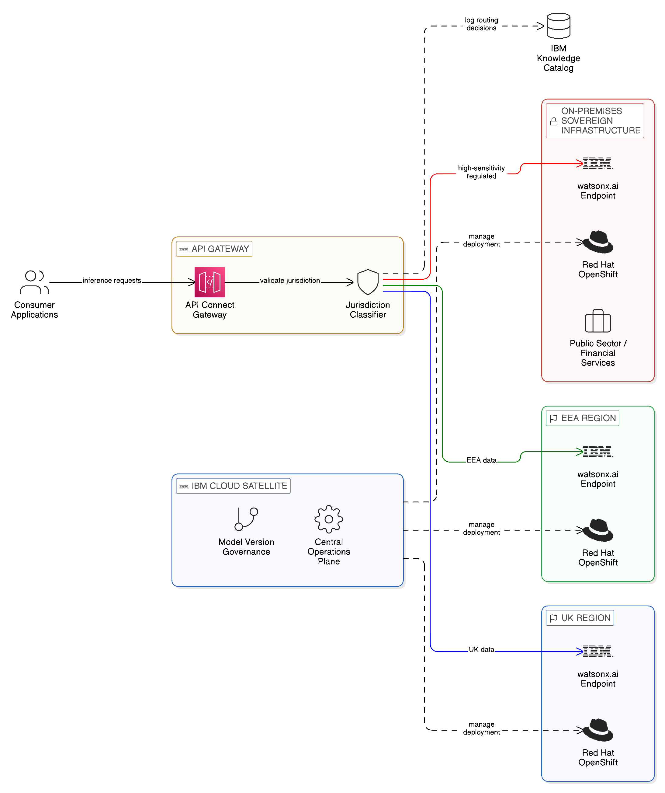
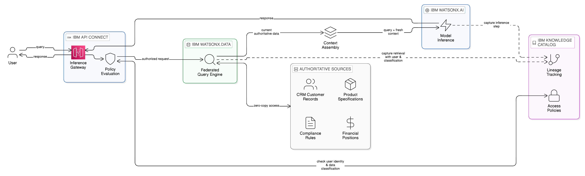
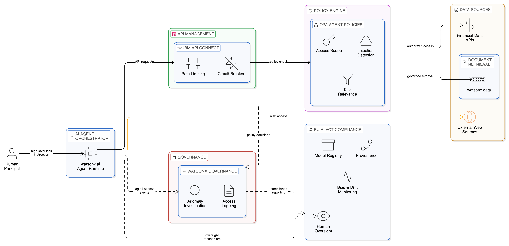
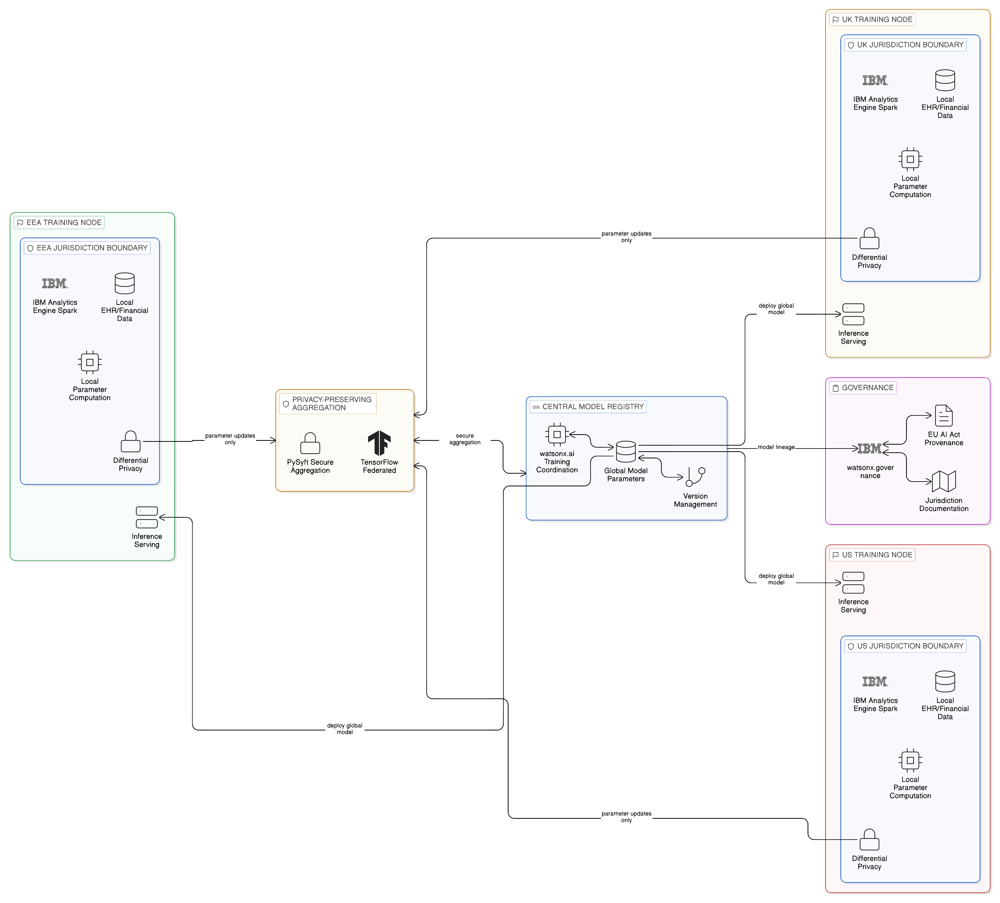
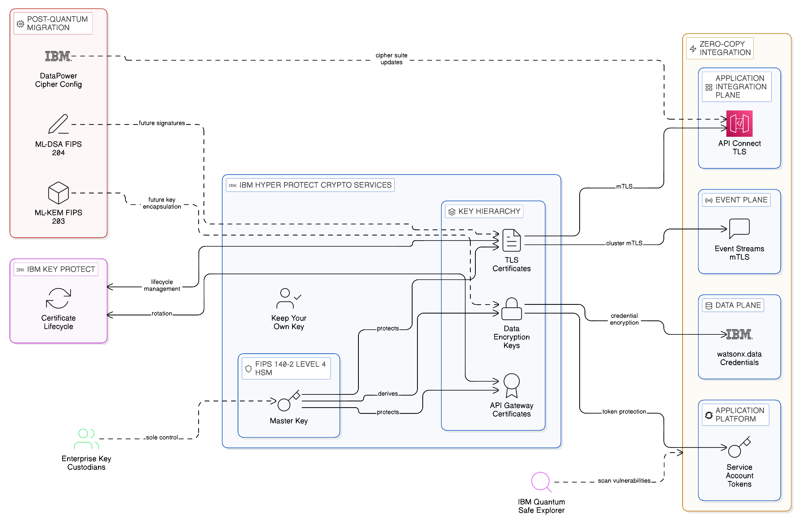
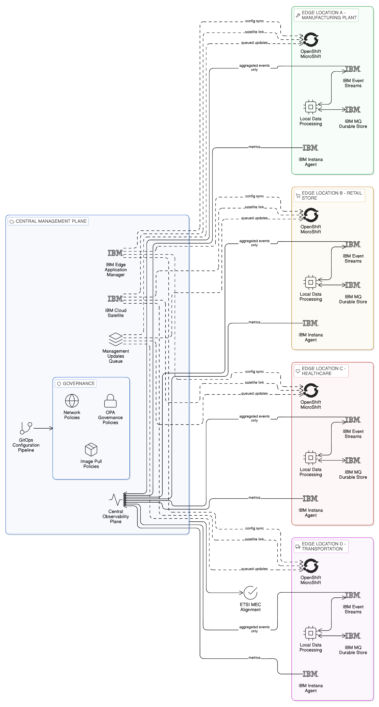
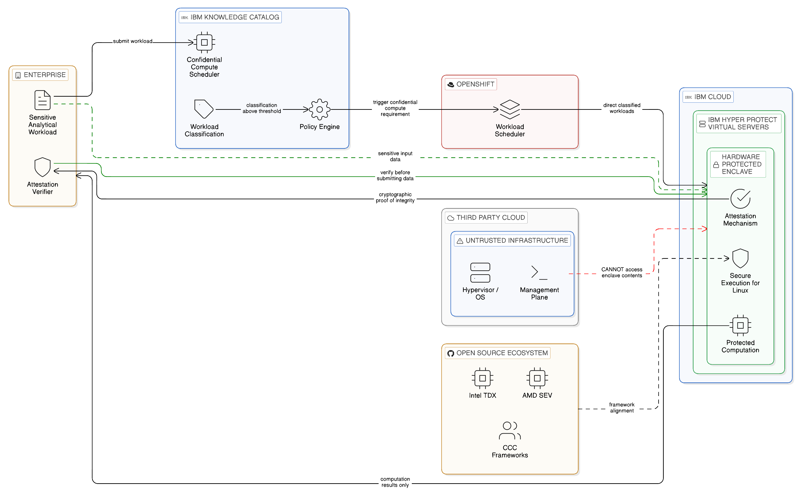

# Chapter 19 --- AI, Quantum, and Decentralised Compute: The Next Frontier of Sovereignty

*How Emerging Technologies Will Reshape the Zero-Copy Enterprise*

The Zero-Copy Integration architecture described in this book has been developed in response to the integration, sovereignty, and resilience challenges of the present enterprise technology environment: the multi-cloud proliferation of the 2020s, the data localisation regulatory landscape inaugurated by the General Data Protection Regulation and extended by a growing body of national and sectoral data sovereignty legislation, and the operational resilience requirements imposed by digital operational resilience regulation in financial services and critical infrastructure sectors. These challenges are real and immediate, and the architecture proposed to address them is grounded in currently available technology capabilities and operational practice.

The enterprise technology environment, however, is not static. Three technological developments are currently at varying stages of maturity — artificial intelligence at the scale of enterprise deployment, post-quantum cryptography as a practical engineering discipline, and decentralised compute as an architectural paradigm including confidential computing enclaves — each of which will have material implications for the Zero-Copy enterprise architecture as they reach enterprise scale over the coming decade. Alongside these technological developments, the regulatory frontier is advancing: the EU's Data Act, AI Act, and the second generation of operational resilience requirements under DORA will impose data governance and transparency obligations that the Zero-Copy architecture is positioned to satisfy but that copy-centric alternatives will struggle to accommodate. This chapter examines each development in turn, assessing the sovereignty risks it creates, the ways in which the Zero-Copy architecture provides a foundation for managing those risks, and the specific technical responses that each development demands.

## 19.1 Artificial Intelligence as a Sovereignty Risk and Opportunity

### The Data Sovereignty Risk of Enterprise AI

The deployment of large language models and other generative AI capabilities in enterprise contexts has created a new category of data sovereignty risk that extends beyond, and is more difficult to govern than, the structured data flows that the Zero-Copy architecture's current governance mechanisms address. When an enterprise employee submits a query to an AI assistant, the query may contain sensitive data — customer names, account details, proprietary commercial information, protected health information — that is transmitted to the AI platform's inference infrastructure as part of natural language text. If that infrastructure is operated by a third-party provider in a different jurisdiction, the transmission constitutes a cross-border transfer of personal data that may require legal basis under GDPR or equivalent legislation, and may be prohibited in contexts where data localisation requirements apply.

The structural challenge is that the sensitive data enters the AI query as natural language rather than as a structured data field to which a classification label has been applied. A conventional data classification and access control framework can prevent an application from querying a classified data field through an ungoverned API; it cannot automatically prevent an employee from including a customer's name in a question to an AI assistant. The Zero-Copy principles provide a conceptual framework for addressing this challenge — the principle of inference locality, discussed below — but their application to AI interactions requires governance mechanisms that extend the integration fabric's policy enforcement into the AI interaction layer in ways that the current architecture does not yet fully address.

### Inference Locality and Regional AI Deployment

*Figure 19.1: Inference Locality and Regional AI Deployment — IBM API Connect validating jurisdiction classification of each inference request and routing to the appropriate regional IBM watsonx.ai endpoint (EEA, UK, or on-premises for highest-sensitivity workloads), with IBM Cloud Satellite providing consistent model version governance across all regional deployments and IBM Knowledge Catalog logging routing decisions for compliance audit.*

The principle of data locality — processing data in the jurisdiction where it resides — translates in the AI context to the principle of inference locality: AI inference should be executed in the jurisdiction in which the input data's sensitivity is classified, rather than transmitting the input to a remote inference endpoint operated in a potentially different jurisdiction. Regional inference serving — deploying AI model replicas within each regulatory jurisdiction and routing inference requests to the regional endpoint appropriate to the input data's sensitivity classification — is the architectural response to this requirement.

IBM watsonx.ai supports regional inference serving through its integration with Red Hat OpenShift's deployment and routing infrastructure. An enterprise can deploy watsonx.ai inference endpoints in each of its regulated jurisdictions — within the EEA, within the United Kingdom, within member states that impose national data localisation requirements — and route inference requests to the appropriate regional endpoint based on the jurisdiction classification of the input context. The routing decision is enforced by IBM API Connect in its role as the integration fabric's Application Integration Plane gateway, which validates the jurisdiction classification of each inference request before forwarding it to the appropriate regional endpoint, logging the routing decision in IBM Knowledge Catalog's lineage record for compliance audit. IBM Cloud Satellite enables the management of regional watsonx.ai deployments from a central operations plane — maintaining consistent model version governance across all regional endpoints — without requiring local operations teams in each jurisdiction.

For enterprises where on-premises AI deployment is required by regulation — public sector organisations operating under national security legislation, financial services firms with regulatory restrictions on cloud deployment of certain AI workloads — IBM watsonx.ai's deployment on Red Hat OpenShift on-premises provides the inference endpoint within the enterprise's own sovereign infrastructure. The OpenShift deployment model, managed through Cloud Satellite, ensures that on-premises endpoints can be maintained with the same governance configuration and model version management as cloud-hosted regional endpoints, enabling a hybrid inference topology that combines the convenience of cloud inference for lower-sensitivity workloads with the sovereignty assurance of on-premises inference for higher-sensitivity contexts.

### Retrieval-Augmented Generation as a Zero-Copy AI Pattern

*Figure 19.2: Retrieval-Augmented Generation as a Zero-Copy AI Pattern — governed retrieval step evaluated against IBM Knowledge Catalog access policies before execution, IBM watsonx.data federated query accessing authoritative sources in-place at query time (no AI-side data copies), context assembled and passed to IBM watsonx.ai for inference, with every retrieval logged as a lineage record. Retrieved context is always current at the moment of retrieval, eliminating the staleness problem of copy-based AI context stores.*

Retrieval-augmented generation, the pattern in which an AI model's response to a query is informed by information retrieved at query time from the enterprise's own data estate rather than encoded in the model's pre-trained weights, is the most architecturally significant AI integration pattern for the Zero-Copy enterprise. RAG is, at its core, a Zero-Copy pattern: rather than fine-tuning a model on enterprise data — which would require copying that data into the model training infrastructure — RAG retrieves relevant context from enterprise data sources at inference time and provides that context to the model as part of the inference input. The retrieved context is accessed through the enterprise's governed integration fabric, subject to the same access control policies that govern all other data access, and is not persisted in the AI infrastructure beyond the duration of the inference call.

IBM watsonx.ai's integration with IBM Knowledge Catalog enables the RAG retrieval step to be governed through the same classification and access control framework that governs the rest of the integration estate. The retrieval query — the semantic search or structured query that fetches relevant context for a specific user's inference request — is evaluated against IBM Knowledge Catalog's access policies before execution, ensuring that the user cannot retrieve context from data sources they are not authorised to access, even indirectly through an AI interface. This governed RAG architecture represents a significant advance over the typical enterprise AI deployment, in which the RAG retrieval step is implemented as a direct query to a vector database or document store without the governance controls that the integration fabric provides to structured data access.

IBM watsonx.data's federated query capability provides the structured data retrieval substrate for RAG patterns that require current, structured enterprise data — customer records, product specifications, financial positions, compliance rules — rather than document-based retrieval. A RAG query that needs to inform an AI response with a customer's current account details can retrieve those details through watsonx.data's federation layer, accessing the authoritative CRM system in place rather than a replicated copy, subject to the field-level access controls that Knowledge Catalog enforces. This Zero-Copy RAG pattern eliminates the data freshness problem that plagues copy-based AI context stores — the problem of an AI responding with outdated information because the context store was last refreshed hours or days ago — because the retrieved context is always current as of the moment of retrieval.

### Agentic AI and the Integration Fabric

The emergence of agentic AI — AI systems that plan and execute multi-step workflows by orchestrating multiple tools, APIs, and data sources autonomously — represents the most significant emerging integration challenge for the Zero-Copy enterprise. An AI agent instructed to "analyse the quarterly results for the European division and prepare a board summary" will autonomously query financial data systems, retrieve market context, access regulatory reporting data, and write and format a document, executing a sequence of integration actions that in a conventional enterprise would require a human analyst to navigate the integration estate's access controls, governance policies, and API contracts manually.

*Figure 19.3: Agentic AI and the Integration Fabric — AI agent orchestrator accessing enterprise data and APIs through IBM API Connect with OPA agent-specific access policies restricting scope to task-relevant sources, IBM watsonx.governance logging every agent data access event for retrospective anomaly investigation, AI traffic management rate limiting and circuit breakers, and OPA rules blocking prompt injection signature patterns, with EU AI Act compliance documentation via the watsonx.governance model registry.*

The integration implications are profound. An AI agent with broad data access permissions can traverse the entire governed integration estate without human intervention, and can be induced — through adversarial prompt injection in data it retrieves — to perform actions that its human principal did not intend and would not authorise. Prompt injection, the technique of embedding instruction text in data that an AI agent retrieves from the web, from documents, or from database records, so that the agent executes the embedded instruction as if it were part of its original task, is an integration security vulnerability with no direct analogue in conventional integration architectures. The integration fabric's existing security controls — access token validation, network policy enforcement, rate limiting — do not prevent a legitimately authenticated agent from following injected instructions that are indistinguishable, from the fabric's perspective, from legitimate agent behaviour.

The Zero-Copy architecture's response to agentic AI integration requires additional governance mechanisms beyond those described in the preceding chapters. IBM watsonx.governance provides the AI governance layer through which agent behaviour is monitored, logged, and evaluated: every data access event initiated by an AI agent is logged with the agent's identity, the task context, and the governance policy under which the access was authorised, creating the audit trail that allows the governance team to detect and investigate anomalous agent behaviour retrospectively. OPA policies, extended with agent-specific rules, can restrict the scope of data access that AI agents are permitted within specific task contexts — preventing agents from accessing data sources that are not relevant to the task type they are executing, and blocking action patterns that match known prompt injection signatures. IBM API Connect's AI traffic management capabilities — rate limiting on AI agent API consumers, circuit breaker policies that prevent agents from amplifying failures in downstream services — provide the operational safeguards that agent deployment at enterprise scale requires.

IBM watsonx.governance's alignment with the EU AI Act's requirements is particularly relevant for enterprises deploying AI agents in regulated contexts. The EU AI Act classifies certain AI applications as high-risk — including AI systems used in credit scoring, employment decisions, and healthcare diagnostics — and imposes requirements on their data governance, technical documentation, and human oversight that a conventional enterprise AI deployment framework does not address. IBM watsonx.governance's model registry, with its provenance tracking from training data through model version to production deployment, and its monitoring capability for detecting model performance drift and bias, provides the technical foundation for the AI Act's transparency and accountability requirements.

### Federated AI Training and Sovereign Model Development

*Figure 19.4: Federated AI Training and Sovereign Model Development — IBM watsonx.ai central model registry coordinating distributed training runs within each jurisdiction (EEA, UK, US), with only differential-privacy-protected parameter updates transmitted across borders (never raw training data), TensorFlow Federated / PySyft secure aggregation, and IBM watsonx.governance documenting training data jurisdiction provenance for EU AI Act compliance.*

Federated learning — the pattern of executing model training within each jurisdiction using local data, and aggregating only model parameter updates rather than training data across jurisdictions — provides a Zero-Copy approach to model training that is directly analogous to the federated query approach to analytical data access. The model parameters that are aggregated across regional training runs contain no personal data; only the statistical learning extracted from local training data is shared across jurisdictions, satisfying the data minimisation principle of GDPR whilst enabling the training of models on the combined data of all regional datasets.

IBM watsonx.ai's federated learning capabilities, based on the IBM Federated Learning framework, provide the technical infrastructure for enterprise-scale federated model training with privacy-preserving aggregation mechanisms. Open-source frameworks including TensorFlow Federated, PySyft, and FATE (Federated AI Technology Enabler) provide alternative and complementary implementations for specific federated learning scenarios. The enterprise that adopts federated learning as its standard approach to model training on regulated enterprise data is simultaneously satisfying its data sovereignty obligations and positioning itself for the AI governance regulatory environment: the AI Act and the EHDS both impose data sovereignty and model transparency requirements that federated learning architectures are better positioned to satisfy than centralised training approaches.

## 19.2 Post-Quantum Cryptography and Sovereign Key Management

### The Quantum Threat to the Integration Estate

Quantum computing's implications for data sovereignty are not speculative; they are a matter of current engineering planning in every major cryptographic standards body and national security agency. The cryptographic algorithms that protect data in transit and at rest across the enterprise's integration architecture — RSA, Elliptic Curve Diffie-Hellman, and their variants — are mathematically vulnerable to a sufficiently powerful quantum computer running Shor's algorithm. Whilst cryptographically relevant quantum computers are not yet operational, the consensus among cryptographic experts is that the transition to post-quantum algorithms must begin well in advance of their availability, because data encrypted today under quantum-vulnerable algorithms may still be sensitive when quantum computers become operational.

The "harvest now, decrypt later" attack strategy — in which adversaries collect encrypted data today with the intention of decrypting it when quantum computing capability matures — is assessed as a credible and active threat by national security agencies in multiple jurisdictions. For enterprises holding data that will retain its sensitivity for a decade or more — patient health records, financial position data, intellectual property, classified government information — the harvest risk is immediate even though the decryption capability is future. An integration architecture that minimises the volume of sensitive data transmitted across the network provides a smaller cryptographic attack surface for harvest-now attacks, but data minimisation does not eliminate the need for post-quantum cryptographic protection of the data that is transmitted.

### The NIST Standards and the Enterprise Migration Obligation

The National Institute of Standards and Technology completed its first post-quantum cryptographic standard selection process in 2024, selecting CRYSTALS-Kyber (standardised as ML-KEM under FIPS 203) for key encapsulation and CRYSTALS-Dilithium (ML-DSA, FIPS 204), FALCON, and SPHINCS+ for digital signatures. The UK National Cyber Security Centre and the European Union Agency for Cybersecurity have published comparable guidance recommending the transition to NIST-approved post-quantum algorithms across government and critical infrastructure deployments. The enterprise's obligation is to plan and execute a migration from current quantum-vulnerable algorithms to post-quantum algorithms across all cryptographic contexts — data in transit across integration flows, data at rest in data stores, digital signatures on API requests and event payloads, and the certificates in the PKI infrastructure through which integration components authenticate one another.

IBM's quantum-safe programme provides the enterprise with the tools and guidance required to plan and execute this migration. IBM's Quantum Safe Explorer and Quantum Safe Advisor tools discover and categorise the cryptographic vulnerabilities in an enterprise's integration estate, mapping each vulnerable cryptographic primitive to the integration flows, certificates, and key management systems in which it appears. The output is a cryptographic bill of materials — an inventory of every cryptographic dependency in the integration estate — that forms the baseline for the migration plan. IBM's cryptographic agility framework — the architectural approach of designing cryptographic dependencies as configurable parameters rather than hard-coded algorithm choices — enables the enterprise to migrate from current algorithms to post-quantum algorithms without requiring re-architecture of the integration flows that depend on cryptographic protection. IBM DataPower Gateway's cryptographic agility support, which allows TLS cipher suites and certificate signing algorithms to be updated through configuration rather than code change, is the practical implementation of this framework within the Application Integration Plane.

### Sovereign Key Management with IBM Hyper Protect

*Figure 19.5: Sovereign Key Management with IBM Hyper Protect Crypto Services — FIPS 140-2 Level 4 HSM implementing Keep Your Own Key architecture (IBM operator cannot extract enterprise master keys), managing TLS certificates for all integration planes, with IBM Quantum Safe Explorer identifying quantum-vulnerable cryptographic dependencies and IBM DataPower cryptographic agility enabling migration to CRYSTALS-Kyber (ML-KEM) and CRYSTALS-Dilithium (ML-DSA) post-quantum algorithms through configuration rather than re-architecture.*

The sovereignty dimension of post-quantum cryptography extends beyond the algorithm migration to the governance of the cryptographic keys that protect the enterprise's most sensitive data. Key management is itself a sovereignty challenge: if the keys that protect jurisdictionally resident data are held in a key management service operated in a different jurisdiction, the key management provider may be compelled by the laws of its jurisdiction to disclose those keys, effectively enabling the decryption of the enterprise's sovereign data assets without the enterprise's knowledge or consent. This risk applies to current cryptographic algorithms as well as post-quantum ones; the post-quantum transition is an opportunity to address the sovereignty dimension of key governance simultaneously with the algorithm transition.

IBM Hyper Protect Crypto Services provides the sovereign key management capability that the Zero-Copy enterprise requires for its most sensitive data classifications. Built on FIPS 140-2 Level 4 certified hardware security modules — the highest certification level available for commercial HSM implementations — IBM Hyper Protect Crypto Services implements a Keep Your Own Key architecture in which the enterprise holds sole control of the master keys. IBM as the cloud provider cannot access the keys, because the HSM firmware prevents key extraction by the service operator: even a compelled disclosure order served on IBM would not enable IBM to produce the enterprise's encryption keys, because those keys are held in an HSM instance that only the enterprise's designated key custodians can unlock. For regulated enterprises that must demonstrate key sovereignty to regulators — financial services firms under EBA cloud guidelines, healthcare organisations under HIPAA encryption requirements, public sector organisations under national security frameworks — this architectural assurance provides the technical evidence that key sovereignty requirements are satisfied.

The integration of IBM Hyper Protect Crypto Services with IBM Key Protect and with the integration fabric's certificate management infrastructure allows all cryptographic keys and certificates across the integration estate — API gateway TLS certificates, event streaming cluster mTLS certificates, data encryption keys for object storage — to be managed within a single sovereign key management framework. This consolidation reduces the operational complexity of the post-quantum migration whilst ensuring that key sovereignty is maintained throughout the transition.

## 19.3 Decentralised Compute and Confidential Computing

### Edge Computing as Sovereign Compute

*Figure 19.6: Edge Computing as Sovereign Compute — IBM Edge Application Manager and IBM Cloud Satellite providing central governance policy deployment (OPA, network policies, image pull policies) to edge locations running Red Hat OpenShift MicroShift, with data generated and processed locally within each jurisdiction's edge location satisfying Zero-Copy data locality and ETSI MEC latency requirements simultaneously, IBM Instana edge monitoring contributing to central observability without transmitting raw data centrally.*

The development of edge computing as a mainstream enterprise architecture pattern is creating a new dimension of the sovereignty challenge: data generated and processed at the edge — in manufacturing facilities, retail stores, healthcare settings, and transportation systems — is subject to the data sovereignty requirements of the jurisdiction in which the edge location operates. The architecturally significant characteristic of edge computing in the sovereignty context is that the edge location is, by definition, proximate to the data it generates. The Zero-Copy principle of data locality is therefore naturally satisfied at the edge: processing edge data at the edge, rather than transmitting it to central infrastructure for processing, is not merely a sovereignty discipline but a latency requirement imposed by the operational characteristics of the edge environment.

IBM Edge Application Manager provides the management and governance infrastructure through which edge deployments are administered from a central management plane without requiring continuous connectivity between the edge location and the management centre. Red Hat OpenShift MicroShift provides the container runtime for resource-constrained edge locations, delivering the same Kubernetes API and OpenShift governance model that the enterprise's central cloud deployments use, ensuring that the governance policies that apply in the central environment — OPA admission policies, network policies, image pull policies — are applied consistently at the edge. The ETSI Multi-access Edge Computing standard provides the technical framework for deploying compute capability within telecommunications network infrastructure to support the low-latency processing requirements of edge applications, and IBM's edge portfolio is aligned with MEC deployment models.

### Confidential Computing as a Sovereignty Mechanism

*Figure 19.7: Confidential Computing as a Sovereignty Mechanism — IBM Hyper Protect Virtual Servers (IBM Secure Execution for Linux) providing hardware-protected enclaves on untrusted cloud infrastructure, cryptographic attestation proving computation integrity and input confidentiality to the enterprise before sensitive data is submitted, OpenShift workload scheduling automatically directing IBM Knowledge Catalog-classified workloads above sensitivity threshold to confidential compute infrastructure, with Intel TDX / AMD SEV providing the open-source confidential computing substrate.*

A development in the decentralised compute landscape that has reached enterprise deployment maturity and that has particular relevance to the Zero-Copy sovereignty architecture is confidential computing: the execution of sensitive computation within a hardware-protected enclave that provides cryptographic assurance of the computation's integrity and the confidentiality of its inputs and outputs even when the surrounding infrastructure — the hypervisor, the operating system, the cloud provider's management plane — is untrusted. Confidential computing allows sensitive analytical workloads to be executed on infrastructure that the enterprise does not own or control — public cloud infrastructure, partner data centre infrastructure, shared edge hardware — without requiring the enterprise to trust that infrastructure with the plaintext of the data being processed.

The sovereignty implication is significant: confidential computing extends the Zero-Copy architecture's principle of in-place computation to environments where the enterprise cannot physically secure the infrastructure. A federated analytical query executed within a confidential computing enclave on a public cloud provider's hardware provides a stronger sovereignty assurance than the same query executed in a standard cloud virtual machine, because the enclave's attestation mechanism cryptographically proves to the enterprise that the computation was executed within the expected software environment without modification, and that the cloud provider's infrastructure could not inspect the data being processed.

IBM Hyper Protect Virtual Servers, built on IBM Secure Execution for Linux, provides the confidential compute substrate for sensitive workloads in IBM Cloud and in IBM Cloud Satellite locations. The integration with the Zero-Copy architecture's governance framework enables confidential compute to be specified as a deployment requirement for specific workload classifications in IBM Knowledge Catalog, so that workloads processing data classified above a specified sensitivity threshold are automatically directed to confidential compute infrastructure through the OpenShift workload scheduling mechanism. The open-source confidential computing ecosystem — Intel Trust Domain Extensions, AMD Secure Encrypted Virtualisation, and the Confidential Computing Consortium's open-source frameworks — provides the technology substrate on which IBM's confidential computing capabilities and third-party cloud providers' offerings are built, ensuring that the pattern is available across the multi-cloud topology that the Zero-Copy enterprise operates.

### WebAssembly and In-Source Computation

A further decentralised compute pattern with direct Zero-Copy relevance is the use of WebAssembly-based execution to push analytical logic to the data source, rather than bringing the data to a separate compute environment. WebAssembly — originally developed for secure, sandboxed computation in web browsers — has matured into a lightweight, portable execution environment that can be embedded in data storage systems, database engines, and API gateways, enabling the execution of arbitrary analytical logic within the data source's own process boundary. In the Zero-Copy integration context, WebAssembly-based in-source computation extends the predicate pushdown model that IBM watsonx.data's Presto query engine employs for SQL analytics into non-SQL scenarios: machine learning inference on time-series sensor data, complex event processing on raw event streams, and custom transformation logic on document data stores. Where the computation can be expressed as a WebAssembly module and deployed to the data source's execution environment, the entire computation is performed within the data source's infrastructure boundary, and only the result is returned to the consuming application.

## 19.4 The Regulatory Horizon: Anticipating Future Sovereignty Requirements

### The EU Regulatory Agenda

The regulatory landscape for data sovereignty is not static, and the enterprise that designs its integration architecture exclusively around the requirements of the present will find itself in a cycle of perpetual architectural remediation as the regulatory frontier advances. The EU's legislative agenda is the most instructive indicator of the direction of travel. The Data Act, which entered application in September 2025, creates mandatory data sharing obligations and portability rights that require enterprises to expose data assets through governed APIs in ways that their existing integration architectures may not support. Enterprises that have already implemented the integration fabric as a governed API layer are positioned to implement Data Act compliance through governance configuration — extending the access policies that govern internal data consumers to include the external sharing obligations the Act creates — rather than through architectural reconstruction.

The EU AI Act, which came into force in August 2024 and is being applied in phases through 2026, creates requirements for data governance and transparency in high-risk AI systems — those used in credit scoring, employment screening, and healthcare diagnostics — including documented lineage between training data and model outputs, representativeness evidence for training data, and human oversight mechanisms. IBM watsonx.governance's model registry and lineage tracking capabilities provide the technical foundation for these requirements; the integration with IBM Knowledge Catalog's data classification metadata enables the training data provenance documentation that the AI Act demands. The European Health Data Space regulation, expected to enter full application from 2027, will create a federated access model for health data across EU member states — architecturally equivalent to Blueprint A's regionally sovereign data fabric applied at European scale — and enterprises operating in EU healthcare that have implemented the federated data fabric will be positioned to participate with minimal additional architectural investment.

### DORA's Second Generation and Multi-Jurisdictional Convergence

DORA's second generation of requirements — expected in the DORA review cycle and in equivalent regulatory developments in the United Kingdom, the United States, and other major financial centres — is likely to extend operational resilience obligations deeper into AI systems and broader across critical infrastructure sectors beyond financial services. The convergence of AI Act and DORA second-generation governance demands — documented lineage, tested recovery capability, human oversight, technical auditability — means that the enterprise that has established IBM watsonx.governance, IBM Knowledge Catalog, IBM Instana, and IBM Guardium as a coherent governance and observability platform will find that the next regulatory generation's requirements can be satisfied through the extension of that platform's configuration, rather than through new compliance infrastructure deployment.

The multi-jurisdictional sovereignty multiplier deserves particular attention as the number of jurisdictions with active data sovereignty legislation grows. India's Digital Personal Data Protection Act, Brazil's LGPD, China's PIPL, and the ongoing development of US state-level privacy legislation each create distinct governance requirements for different categories of data and different processing activities. The combinatorial complexity of multi-jurisdictional compliance grows faster than the number of jurisdictions, and cannot be addressed by maintaining separate governance frameworks independently for each. The policy-as-code approach — OPA policies that evaluate each data access event against the complete set of applicable jurisdiction requirements simultaneously — is the only scalable governance mechanism for multi-jurisdictional compliance at enterprise scale, and the enterprise that has invested in the OPA policy infrastructure as part of its Zero-Copy architecture deployment has already made the foundational investment that this compliance challenge requires.

## 19.5 Summary and Forward Imperatives

The technological and regulatory developments examined in this chapter — AI sovereignty risks and the agentic enterprise, post-quantum cryptography and sovereign key management, decentralised and confidential compute, and the advancing regulatory frontier — share a common characteristic: each of them extends and amplifies the sovereignty and resilience requirements that this book has identified as the defining challenges of the contemporary enterprise, rather than replacing those requirements with fundamentally different ones. The enterprise that has built its integration architecture on Zero-Copy principles is therefore better positioned than the copy-centric enterprise to navigate these developments, because the foundational disciplines — data minimisation, in-place computation, governed access, jurisdiction-aware routing, policy enforcement — that address today's sovereignty challenges are the same disciplines that will address tomorrow's. The argument of the chapter may be summarised in five claims.

First, the emergence of enterprise AI — particularly retrieval-augmented generation and agentic AI — does not replace the Zero-Copy integration architecture but extends it, creating new demand for the federation, governance, and access control capabilities that the architecture provides. RAG's retrieval step is a Zero-Copy data access operation that the integration fabric governs; the inference locality principle extends the fabric's jurisdiction-aware routing into the AI inference layer; and AI agent governance through IBM watsonx.governance and OPA provides the audit trail and access constraint framework that agentic AI at enterprise scale requires.

Second, post-quantum cryptography is an integration architecture concern, not merely a security infrastructure concern, because the migration of cryptographic algorithms affects every integration flow, every API contract, and every PKI certificate in the integration estate. The cryptographic bill of materials — generated by IBM's Quantum Safe Explorer — is an integration estate governance document, and the cryptographic agility framework that enables algorithm migration through configuration rather than re-architecture is an integration design discipline that the Centre of Excellence should incorporate into its pattern library before the post-quantum migration timeline forces unplanned architectural change.

Third, confidential computing extends the Zero-Copy architecture's principle of in-place, governed data access to infrastructure environments that the enterprise cannot physically secure, providing sovereignty assurance through cryptographic attestation for sensitive workloads deployed on untrusted infrastructure. IBM Hyper Protect Virtual Servers and the open-source confidential computing ecosystem provide the implementation substrate, and the integration of confidential compute specification with IBM Knowledge Catalog's classification framework enables sovereign compute to be specified as an infrastructure requirement at the governance policy level.

Fourth, the regulatory horizon is convergent rather than divergent: the EU AI Act, the Data Act, the EHDS, and DORA's second generation all point in the same direction — towards documented data lineage, governed API access, federated data access, and AI governance transparency — and the Zero-Copy architecture implements each of these requirements as an operational discipline. The enterprise that has established the Zero-Copy architecture is positioned to respond to each new regulatory development through governance configuration and policy extension rather than through architectural reconstruction.

Fifth, the multi-jurisdictional sovereignty multiplier makes policy-as-code governance not merely desirable but necessary for enterprises operating across multiple jurisdictions, and the enterprise that has invested in the OPA policy framework as part of its Zero-Copy architecture deployment has already made the foundational investment that multi-jurisdictional compliance requires.

Five forward imperatives emerge from this analysis. The first is to establish the AI governance framework — IBM watsonx.governance, governed RAG retrieval through the integration fabric, and OPA agent access policies — before deploying AI agents at scale, not after the first AI governance incident has demonstrated the need for it. The second is to initiate the post-quantum cryptographic discovery programme now, beginning the migration of the highest-sensitivity integration flows to post-quantum algorithms before the harvest-now-decrypt-later window narrows the planning horizon. The third is to incorporate IBM Hyper Protect Crypto Services as the sovereign key management layer for all new integration flows involving regulated data classifications, establishing key sovereignty as a day-one architectural requirement rather than a retrofit. The fourth is to engage with the EU Data Act and EU AI Act compliance programmes, mapping the integration fabric's existing governance capabilities to the Act requirements and identifying the specific gaps in lineage coverage, API exposure, or model governance transparency that represent the highest-priority incremental investments. The fifth is to extend the Centre of Excellence's pattern library with the emerging patterns — RAG governance, agentic AI access control, confidential compute specification, post-quantum certificate management — ensuring that the organisation's institutional knowledge advances ahead of the deployment decisions that will embed these patterns in production systems.

The concluding chapter synthesises the book's themes into a strategic vision of the fully sovereign, fully resilient enterprise, and offers practical guidance for the technology leaders who are responsible for building and sustaining it.
