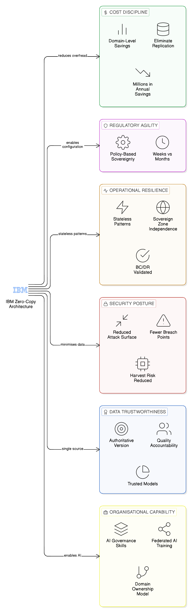
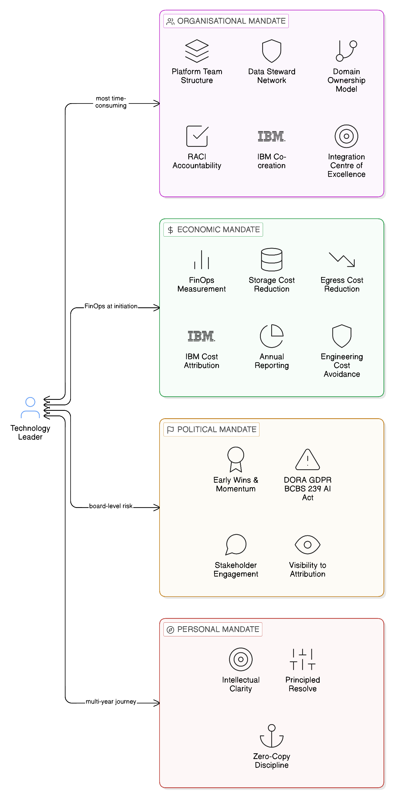
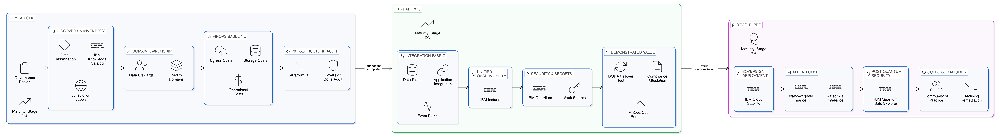
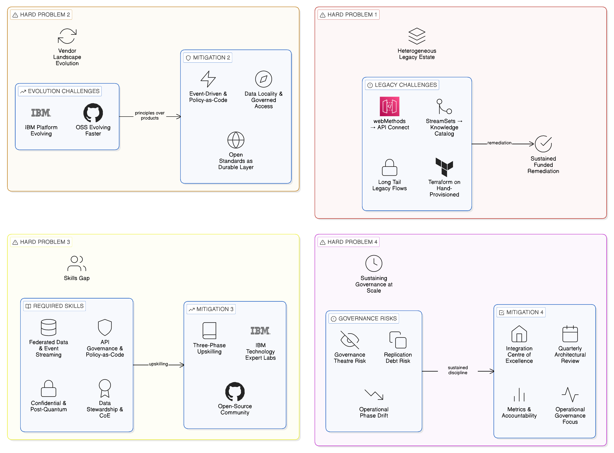
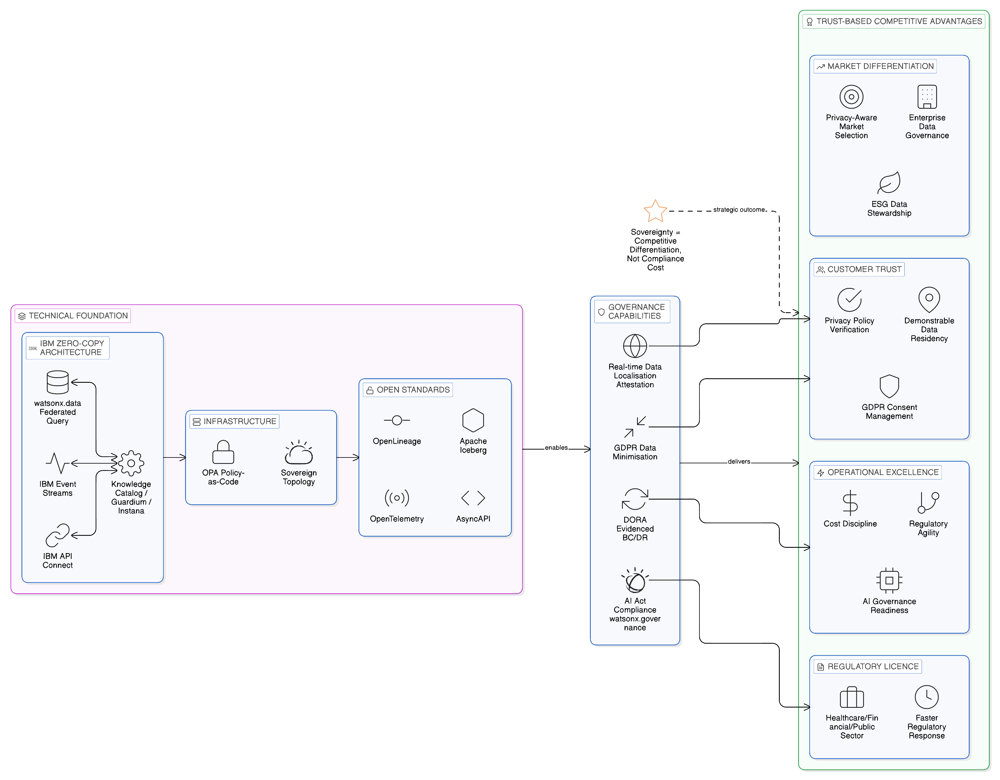

# Chapter 20 --- The Fully Sovereign, Fully Resilient Enterprise

*Strategic Guidance for CIOs and CTOs on Building and Sustaining Digital Independence*

This book has made a sustained argument: that the dominant paradigm of enterprise data integration — the movement of data between systems through replication, extraction, and loading — is architecturally incompatible with the sovereignty, resilience, and economic discipline that the modern enterprise requires; and that the Zero-Copy Integration architecture — an approach that favours accessing data in place through governed interfaces, propagating state changes as events rather than bulk data transfers, and managing integration flows through a unified governance fabric — provides the architectural foundation for an enterprise that is sovereign by design, resilient by architecture, and economically rational in its treatment of data as a shared resource rather than a commodity to be duplicated at will.

The argument has been developed through an examination of the technical architecture — the Data Plane, the Application Integration Plane, the Event Plane, and the integration fabric that unifies them — and the organisational architecture — the domain ownership model, the three-platform structure, the governance framework, and the maturity model — that together constitute the Zero-Copy enterprise. It has been grounded in the specific capabilities of IBM's enterprise technology portfolio — watsonx.data, Cloud Pak for Integration, Knowledge Catalog, MQ, Event Streams, API Connect, DataPower, OpenShift, Cloud Satellite, Instana, Guardium, and Hyper Protect — and complemented by the broader technology ecosystem that provides flexibility, portability, and operational depth within the architectural framework: Apache Kafka, Apache Iceberg, Open Policy Agent, OpenLineage, OpenTelemetry, HashiCorp Terraform, HashiCorp Vault, StreamSets, webMethods, and the CNCF project landscape on which cloud-native integration depends. It has been illustrated by sector-specific patterns, reference blueprints, and case studies drawn from operational experience across financial services, healthcare, public sector, manufacturing, and retail.

This concluding chapter steps back from the architectural detail to offer a strategic synthesis: a description of what the fully sovereign, fully resilient enterprise looks like from the perspective of the technology leader responsible for building and sustaining it; an honest assessment of what remains genuinely difficult even for enterprises that have implemented the architecture with rigour; and the strategic imperatives that guide the journey towards that state for the technology leaders who have read this far and are now determining what to do on Monday morning.

## 20.1 What the Fully Sovereign Enterprise Looks Like

The fully sovereign enterprise, in the sense this book has developed, is not an enterprise that is entirely independent of external technology providers or that processes all its data within its own physical infrastructure. Such an enterprise does not exist in the modern economy, and the pursuit of total technological self-sufficiency would be as economically irrational as it would be technically impractical. The fully sovereign enterprise is rather one in which the decisions about where data resides, how it is accessed, and through which jurisdictions it flows are made deliberately and governed consistently, rather than arising as inadvertent consequences of architectural convenience or vendor default behaviour.

In operational terms, the fully sovereign enterprise is characterised by a set of specific capabilities that this book has described in detail but that are worth restating here in the language of observable outcomes rather than architectural components. Its data assets are catalogued with jurisdiction classifications that determine which access patterns are permissible for each asset and which regulatory frameworks govern its processing — and the currency and completeness of that catalogue is maintained not as a periodic compliance exercise but as a continuous operational discipline embedded in the change management process for every integration flow. Its integration flows are implemented through the governed integration fabric, making each data flow visible, auditable, and subject to policy enforcement at the point of access rather than through post-hoc audit — so that the compliance team's attestation of the enterprise's data localisation posture is a runtime output of the governance infrastructure, not the result of a manual investigation that must be repeated for each regulatory enquiry.

Its analytical workloads are executed through federated query mechanisms that compute in proximity to data rather than copying data to the compute environment — so that the enterprise's data scientists and business analysts have access to the combined informational content of data assets distributed across sovereign zones without those assets ever leaving their jurisdictional home. Its event-driven integration propagates state changes without the creation of persistent data copies — so that the integration estate's footprint of regulated personal data is contained to the systems of record where that data belongs, rather than proliferating across the dozens of replicas that conventional integration creates. Its resilience mechanisms are designed around stateless, event-driven patterns that recover from failure by resuming event processing from a durable log rather than by restoring from a replicated data snapshot — so that a zone-level failure produces a recovery that is measurable in minutes to hours rather than days, and that produces no data loss and no sovereignty boundary violation in its recovery procedure.

Its infrastructure is provisioned through Terraform-declared modules that enforce jurisdictional constraints at the level of infrastructure creation, making it architecturally impossible to create zone-level infrastructure in non-compliant locations. Its credentials and secrets are managed through a dynamic secrets model that eliminates the credential proliferation that is the security equivalent of data replication — no static passwords embedded in configuration files, no stale API tokens persisting beyond their authorised lifespan. Its cryptographic infrastructure is being actively migrated to post-quantum algorithms, with IBM Hyper Protect Crypto Services providing the HSM-backed key management that anchors the chain of cryptographic trust.

The fully sovereign enterprise is also one in which the technology leader can answer with confidence the questions that regulators, auditors, and board members are increasingly inclined to ask: where does our customers' personal data reside, and in which jurisdictions is it processed? Through which third-party providers does our data flow, and what contractual and technical controls govern those flows? How would a failure of our principal cloud provider affect our ability to operate our critical business processes, and what is our tested, evidenced recovery time? What is the cost of the data egress charges we incur as a consequence of our multi-cloud architecture, and is that cost justified by the business value it creates? What is the exposure of our long-term sensitive data to the harvest-now-decrypt-later quantum computing threat, and what is our migration roadmap to post-quantum cryptographic algorithms? The fully sovereign enterprise can answer each of these questions not through manual investigation but through the governance tooling that the Zero-Copy architecture provides as a routine operational output.

## 20.2 The Strategic Advantages of the Zero-Copy Enterprise

The business case for the Zero-Copy enterprise is grounded in six strategic advantages that accumulate over the medium and long term. Together they constitute a return on investment argument that extends well beyond compliance cost avoidance to encompass competitive differentiation, operational excellence, and organisational capability.

The first strategic advantage is cost discipline: the elimination of unnecessary data replication reduces the storage, network egress, and operational overhead associated with maintaining replicated data assets, and the consumption-based chargeback model that the integration fabric enables makes these cost savings visible and attributable at the domain level. Enterprises that have completed Zero-Copy transformation programmes consistently report material reductions in cloud egress expenditure — often measured in tens of millions of dollars annually in large enterprises operating at scale across multiple cloud providers — and reductions in data warehouse storage costs that reflect the elimination of redundant data copies from their storage estates. The FinOps cost attribution model transforms these savings from an aggregate accounting benefit into a domain-level incentive structure: domain teams whose integration costs are declining as they adopt Zero-Copy patterns have a visible, quantified return on their governance investment that sustains the organisational commitment through the years of the transformation programme.

The second strategic advantage is regulatory agility: the ability to respond to new and evolving data sovereignty requirements through governance configuration rather than architectural reconstruction. The regulatory trajectory described in [Chapter 19](19_chapter_ai_analytics) — the EU Data Act's data sharing mandates, India's DPDP Act, China's PIPL and Data Security Law, the proliferation of US state privacy legislation, and the AI governance obligations of the EU AI Act — is uniformly towards greater data sovereignty control and greater technical accountability for data processing decisions. The enterprise that has implemented the Zero-Copy architecture can respond to a new data localisation requirement by configuring the integration fabric's OPA routing policies to enforce the new constraint, rather than by redesigning the integration estate from scratch. This regulatory agility has a direct economic value that is measurable in the comparison between the cost of proactive compliance — governance configuration within an established Zero-Copy framework — and the cost of reactive remediation — architectural reconstruction in a copy-centric estate under a regulatory deadline. The former is typically measured in weeks of engineering effort; the latter in months of programme delivery and the compliance risk premium that regulators increasingly impose on enterprises that are slow to implement required controls.

The third strategic advantage is operational resilience: the reduction of cascading failure risk through the elimination of tight coupling between systems that data replication creates. When systems are integrated through replicated data assets, the failure of a producing system leaves consuming systems with stale data that may be incorrect, incomplete, or inconsistent with the current state of the business. The Zero-Copy architecture's event-driven integration patterns avoid this problem by design: consuming systems process events as they arrive and resume processing from the event log when connectivity is restored, without holding a separate data state that must be reconciled with the producing system after a failure. The local autonomy pattern — in which each sovereign zone operates its integration capabilities independently during connectivity disruption and resynchronises when connectivity is restored — extends this resilience to the multi-zone, multi-cloud topology, providing the operational continuity that DORA and comparable operational resilience frameworks demand. The tested, evidenced BC/DR capability that the Zero-Copy architecture enables is not merely a regulatory compliance output; it is a genuine operational capability that reduces the mean time to recovery from zone-level failures and the business continuity risk that those failures represent.

The fourth strategic advantage is security posture: the reduction of the enterprise's data attack surface through the architectural discipline of data minimisation. Every copy of sensitive data that does not exist is a point of breach that cannot occur; every replica that the Zero-Copy transformation eliminates reduces the scope of the enterprise's data protection obligations, simplifies its breach investigation capability, and narrows the population of locations that an attacker can exploit to access regulated data. As [Chapter 8](08_chapter_security_by_design) established, the security advantages of Zero-Copy Integration are not secondary benefits of a primarily integration-focused architectural choice; they are direct architectural consequences of the foundational principle that data which is not moved cannot be found in an unintended location. In the current threat environment — characterised by sophisticated insider threats, state-sponsored attacks on critical infrastructure, and the novel harvest-now-decrypt-later quantum risk — the security argument for Zero-Copy Integration is, for many enterprises, as compelling as the sovereignty and economic arguments.

The fifth strategic advantage is data trustworthiness: the concentration of data governance responsibility in the domain teams that own and understand the data, rather than in a central data team that manages data extracts without the business context required to govern them effectively. When domain teams own their data interfaces, the quality, completeness, and accuracy of the data exposed through those interfaces is a matter of domain team accountability, and the governance policies that apply to each data asset are maintained by the team best positioned to understand the business requirements those policies must satisfy. Consuming teams access a single, authoritative version of each data asset through the governed interface, rather than working with one of many replicated copies of uncertain provenance and variable quality. This improvement in data trustworthiness has direct operational consequences: analytical models built on authoritative, consistently governed data produce more reliable outputs than models built on extracts of uncertain provenance; business decisions made on the basis of a single authoritative data view are more reliable than decisions made by reconciling conflicting reports from multiple replicated sources.

The sixth strategic advantage is organisational capability: the accumulation, through the Zero-Copy transformation programme, of the integration architecture, data governance, and platform engineering skills that constitute a strategic capability for the enterprise in the AI era. The enterprise that has built an Integration Centre of Excellence with deep expertise in federated data access, event-driven architecture, policy-as-code governance, and sovereign topology management has assembled an organisational capability that is directly applicable to the AI governance challenges described in [Chapter 19](19_chapter_ai_analytics). The governance framework that manages data sovereignty across the Zero-Copy integration estate is the same governance framework that manages AI inference locality, agentic AI data access, and federated model training. The domain ownership model that distributes data accountability across the enterprise is the same organisational model that distributes AI governance accountability to the teams best positioned to understand the risk and purpose of the AI systems operating within their domains. The enterprise that has invested in the Zero-Copy operating model is not merely better governed in its data management; it is better prepared for the AI governance obligations that are the next frontier of data regulation.

*Figure 20.1: The Six Strategic Advantages of the Zero-Copy Enterprise — Cost Discipline, Regulatory Agility, Operational Resilience, Security Posture, Data Trustworthiness, and Organisational Capability, each accumulating over the medium to long term and each reinforcing the others, with the IBM Zero-Copy architecture providing the technical foundation that makes all six simultaneously achievable.*

## 20.3 The Technology Leader's Mandate

The CIO and CTO who are responsible for leading their organisations towards the fully sovereign, fully resilient Zero-Copy enterprise face a mandate that is simultaneously technical, organisational, economic, and political. The technical dimension — designing and implementing the architecture that this book has described — is in many respects the least challenging, because the platform capabilities required are available and the architectural principles are well established. The organisational, economic, and political dimensions are harder, because they require the technology leader to effect changes in the behaviour of individuals and teams that go beyond the deployment of new technology and into the domain of organisational design, cultural change, and the management of competing interests.

### The Organisational Mandate

The organisational mandate is to create the domain ownership model, the platform team structure, and the governance processes that the sovereign-by-design operating model requires. This mandate is primarily about accountability design: defining who is responsible for what, establishing the governance processes through which those responsibilities are exercised, and creating the measurement and incentive mechanisms that make individual adherence to the Zero-Copy discipline personally rational for every team that participates in the enterprise's integration estate.

The most consistent finding from the case studies examined in [Chapter 18](18_chapter_case_studies) is that the organisational dimension of Zero-Copy transformation takes more time and more skilled effort than the technical platform deployment, and that enterprises that underestimate this investment relative to their technology investment produce architectures that are technically capable but organisationally unsustained. The domain ownership model does not emerge spontaneously when an enterprise deploys IBM Knowledge Catalog and assigns Data Steward names to a spreadsheet; it emerges from a sustained programme of role definition, accountability assignment, stakeholder engagement, and governance process design that requires dedicated leadership attention and specialist organisational design capability. The technology leader who treats organisational design as a background activity that can be delegated whilst the technical implementation proceeds will find, when the technical implementation is complete, that the organisation it was intended to serve has not been prepared to use it.

The Integration Centre of Excellence is the organisational mechanism through which the domain ownership model is sustained after the initial transformation programme concludes. The Centre of Excellence does not merely design governance standards; it actively supports domain teams in implementing those standards, provides the pattern library and reference implementations that make Zero-Copy discipline the path of least resistance for integration designers, and conducts the architectural reviews that catch governance deviations before they reach production. Maintaining the Centre of Excellence's mandate, funding, and staff quality through the transition from transformation programme to operational model is one of the most practically difficult challenges the technology leader faces, because the Centre of Excellence's value is most visible during the transformation programme and least visible — but most necessary — in the operational steady state.

### The Economic Mandate

The economic mandate is to make the cost and value of the Zero-Copy architecture visible to the business leaders who must approve the investment it requires, and to sustain that visibility throughout the years of the transformation programme rather than making the investment case once at programme initiation and then hoping the business remains supportive.

The investment case for Zero-Copy Integration cannot be made solely on the basis of sovereignty compliance — although the regulatory risk of non-compliance with data localisation requirements is real and increasingly material as regulators in major jurisdictions move from guidance to enforcement — because regulatory risk is inherently probabilistic and therefore difficult for business leaders to weigh against the certain costs of transformation investment. The investment case must include the concrete financial benefits: the egress cost reduction that the consumption-based attribution model quantifies at the domain level, the storage cost reduction that the elimination of replicated data assets produces, the operational overhead reduction that the integration fabric's unified operational model achieves relative to the management of a fragmented point-to-point estate, and the engineering cost avoidance that regulatory agility provides when each new sovereignty requirement is implemented through governance configuration rather than architectural reconstruction.

IBM's FinOps and cost attribution capabilities provide the measurement infrastructure through which these benefits can be quantified before, during, and after the transformation programme, creating the continuous visibility that sustains business leader confidence through the investment period. The technology leader's economic mandate includes the design of the FinOps measurement framework as a programme initiation activity — establishing the baseline metrics against which the programme's financial outcomes will be measured — rather than as a post-programme assessment. A programme that cannot quantify its financial outcomes in the language of the business leaders who approved it will struggle to maintain their support through the inevitable periods of difficulty and course correction that multi-year transformation programmes encounter.

### The Political Mandate

The political mandate is the least discussed but most consequential dimension of the technology leader's role in Zero-Copy transformation. The transformation will encounter resistance from domain teams that feel their data sovereignty — their control over the data assets they have historically treated as proprietary domain resources — is being diminished by the federated governance framework. It will encounter scepticism from business leaders who have heard the promises of previous IT transformation programmes and are unconvinced by assurances of future benefit. It will encounter inertia from engineering teams whose skills and working practices have been shaped by the copy-centric paradigm that the transformation is designed to supersede. And it will encounter the specific political challenge of the FinOps chargeback model: the moment at which domain teams that have previously received integration services at zero marginal cost begin receiving bills for the integration services they consume is a political inflection point that requires careful management.

The technology leader's political mandate is to navigate this resistance, scepticism, and inertia with the combination of clear communication, demonstrated value, and organisational persistence that large-scale architectural transformation requires. Several disciplines have proved consistently effective in enterprises that have sustained their Zero-Copy transformation through to a successful outcome.

The first is the use of early wins to build political momentum. The architecture described in this book is complex in its full realisation, but the individual disciplines that constitute it — event-driven integration replacing a high-cost ETL batch process, federated query replacing a data warehouse extract, API governance reducing the compliance exposure of a specific personal data flow — are individually demonstrable in months rather than years. The technology leader who sequences the early phases of the transformation to deliver visible, attributable wins for specific business domains creates the political currency that sustains the programme through the less immediately rewarding middle phases.

The second is the connection of Zero-Copy outcomes to board-level risk management. The DORA operational resilience framework, the GDPR data minimisation principle, the BCBS 239 data aggregation standard, and the EU AI Act's model governance obligations are all board-level regulatory risks whose satisfactory management depends on the capabilities that the Zero-Copy architecture provides. Framing the Zero-Copy investment as the enterprise's response to these board-level regulatory risks — and demonstrating, through the governance tooling's reporting outputs, that the investment is producing measurable risk reduction — positions the transformation as a governance imperative rather than a technology preference.

The third is the management of the chargeback transition with deliberate care. The transition from free integration services to consumption-based attribution is the political moment most likely to generate organised resistance from domain teams that have historically subsidised their integration costs through the enterprise's shared technology budget. The most effective approach is a phased introduction that begins with visibility — showing domain teams what their integration costs are before any charges are applied — and moves to attribution only after domain teams have had sufficient time to understand their consumption patterns and identify the high-cost replication patterns that the attribution model is designed to incentivise them to replace.

### The Personal Mandate

Beyond the organisational, economic, and political dimensions, the technology leader who is undertaking a Zero-Copy transformation faces a personal mandate: to maintain the intellectual clarity and the strategic conviction that the transformation requires over the years that it takes to realise. The pressures that erode this conviction are real and persistent: the immediate project that demands a quick integration solution that violates Zero-Copy discipline; the business leader who argues that a specific data replication is commercially justified; the regulatory deadline that seems to require an expedient workaround rather than a principled architectural response. The technology leader's personal mandate is to navigate these pressures with the combination of principled resolve and practical flexibility that distinguishes an effective architectural leader from both the ideologue who refuses all compromise and the pragmatist who accepts every expedient.

*Figure 20.2: The Technology Leader's Mandate — the personal mandate framework for sustaining Zero-Copy transformation over multi-year horizons, balancing principled architectural resolve against the persistent pressures of expedient integration shortcuts, business leader exceptions, and regulatory deadline workarounds, with the IBM Integration Centre of Excellence providing the architectural governance backstop that prevents individual compromises from accumulating into structural governance debt.*

## 20.4 A Practical Agenda for the Next Three Years

The strategic vision of the fully sovereign, fully resilient enterprise is compelling, but strategy without implementation is merely aspiration. The technology leader who intends to move their organisation from aspiration to operational reality needs a practical agenda that is specific enough to be actionable, staged enough to be manageable, and connected explicitly to the maturity model stages described in [Chapter 15](15_chapter_maturity_model). The three-year agenda presented here is not a prescriptive programme plan; it is a structured set of priorities that reflects the sequencing logic of the Zero-Copy maturity model and the organisational realities that transformation programmes consistently encounter.

### Year One: Foundations of Governance

The first year's priority is establishing the governance foundations that are preconditions for every subsequent stage of the transformation. The technical work of year one is modest in ambition but critical in consequence, because the assets created in this year — the data catalogue, the integration asset inventory, the baseline cost measurements, the first iteration of the domain ownership model — determine the quality and reliability of every governance and business case decision that follows.

The first year should deliver four specific outputs. A comprehensive baseline inventory, produced using IBM Knowledge Catalog's automated discovery capabilities supplemented by structured engagement with domain and platform teams, that documents the full scope of the enterprise's integration estate: every data source, every integration flow, every cross-boundary data transfer, and every identified personal data replication point. Without this inventory, the transformation programme cannot prioritise its work, measure its progress, or make credible claims about its outcomes. A data classification framework, implemented in Knowledge Catalog and applied to all catalogued assets, that assigns jurisdiction classifications and sensitivity labels to every data asset and establishes the policy vocabulary through which OPA and Kyverno governance rules will be expressed. The domain ownership assignment for the enterprise's highest-priority data domains — those that carry the most significant sovereignty or compliance risk — with named Data Stewards, documented accountability boundaries, and a first-generation RACI framework for integration governance decisions. A FinOps measurement baseline that establishes the current-state integration cost profile: egress charges by cloud provider route, storage costs by data copy category, and operational costs by integration technology and platform. This baseline is the measurement foundation against which year two and year three outcomes will be assessed.

The Terraform infrastructure-as-code audit should also begin in year one: identifying which elements of the enterprise's sovereign zone infrastructure are managed through version-controlled Terraform modules and which have been hand-provisioned, and initiating the programme of bringing hand-provisioned infrastructure under Terraform management. This audit will typically surface significant inconsistencies in infrastructure configuration between zones that have been provisioned at different times by different teams — inconsistencies that, if unaddressed, will undermine the governance consistency that the Stage Three integration fabric requires.

The primary risk in year one is the temptation to deploy platform technology before completing the governance foundations. The availability of IBM Cloud Pak for Integration, IBM watsonx.data, and IBM Knowledge Catalog as deployable platforms creates the organisational pressure to demonstrate technical progress through platform deployment. Platform deployment is not progress if the governance framework the platform is intended to enforce has not been designed; it produces Stage Two infrastructure without the Stage Three governance that the investment was intended to achieve. The technology leader's discipline in year one is to maintain the sequence: governance design before platform deployment.

### Year Two: Integration Fabric and Demonstrated Value

The second year's priority is the implementation of the integration fabric governance framework across the enterprise's core integration estate, and the delivery of the three proof points that build the organisational confidence and political support that the transformation requires to sustain itself through year three and beyond.

The technical work of year two delivers the Stage Three integration fabric: a unified governance layer spanning the enterprise's Data Plane, Application Integration Plane, and Event Plane, with a common integration asset catalogue accessible through a single discovery and access request experience, active OPA policy enforcement for data classification controls and cross-boundary routing rules, IBM Instana unified operational observability across all integration planes, and IBM Guardium monitoring of all data stores containing personal data. The Vault dynamic secrets implementation should be delivered in year two, eliminating the static credential distribution patterns identified in the year one audit. The domain Data Steward network should be fully operational, with all high-priority domains represented by named, accountable stewards who are actively participating in governance reviews and maintaining their domains' catalogue registrations.

The three proof points that year two must deliver are specific and demonstrable. A successful regulatory compliance attestation — a data localisation assessment conducted in response to a regulatory enquiry, or a proactive audit submission — that is produced from the governance tooling's reporting outputs rather than through manual investigation, demonstrating that the integration fabric provides the compliance evidence that regulators require as a routine operational output rather than as a crisis-driven investigation. A successful operational resilience test — a realistic BC/DR exercise that simulates a zone-level failure, executes the Ansible-automated recovery runbook, and demonstrates recovery within the declared RTO with no data crossing a jurisdictional boundary during the recovery procedure — that produces the DORA-standard evidence of recovery capability. A FinOps outcome report that demonstrates, against the year one baseline, a material reduction in integration costs attributable to specific Zero-Copy patterns that have replaced specific replication flows, expressed in the financial language that business leaders find compelling: pounds or dollars saved, percentage reduction in egress charges, storage cost reduction per domain.

### Year Three: Extension, AI Governance, and Cultural Maturity

The third year's priority is the extension of the Zero-Copy architecture to the domains and use cases that year two's foundation enables but does not fully address: edge integration, AI inference governance, federated model training, and the cultural maturity that marks the transition from Stage Three to Stage Four.

The technical extension of year three delivers the full Stage Four sovereign topology: IBM Cloud Satellite deployed to all sovereign zones in the enterprise's operating geography, providing consistent integration fabric capabilities at every location; AI inference endpoints deployed regionally through IBM watsonx.ai, with OPA-mediated jurisdiction routing for all AI inference requests; watsonx.governance model lifecycle governance operational for all high-risk AI systems, with OpenLineage lineage integration connecting AI data access to the enterprise Knowledge Catalog; and the post-quantum cryptographic discovery programme initiated, with IBM Quantum Safe Explorer providing the prioritised inventory of quantum-vulnerable cryptographic dependencies across the integration estate.

The cultural maturity indicators of Stage Four — the declining rate of Zero-Copy governance remediation in Centre of Excellence architectural reviews, the domain teams that self-identify and resolve governance deviations before they reach review, the integration designers who treat Zero-Copy discipline as the natural default rather than a governance imposition — do not arrive as a consequence of technology deployment; they arrive as a consequence of the sustained investment in training, community of practice, and recognition that [Chapter 14](14_chapter_skills_culture_talent) described. The technology leader's year three priority in this dimension is to ensure that the community of practice is active, that the pattern library is current and comprehensive, and that the governance metrics that measure cultural maturity — adoption rates, remediation rates, self-service governance rates — are tracked and reported with the same visibility as the technical and financial metrics.

*Figure 20.3: The Three-Year Zero-Copy Transformation Agenda — Year One establishing governance foundations (IBM Knowledge Catalog baseline inventory, OPA policy vocabulary, domain ownership model, FinOps measurement baseline, Terraform audit); Year Two delivering the Stage Three integration fabric (unified governance layer, Vault dynamic secrets, domain Data Steward network, three operational proof points); Year Three extending to AI governance and cultural maturity (IBM Cloud Satellite sovereign zone deployment, watsonx.ai regional inference, watsonx.governance model lifecycle, post-quantum cryptographic discovery programme).*

## 20.5 What Remains Hard: An Honest Assessment

No book on enterprise architecture would be complete or credible without an honest acknowledgement of the problems that the framework it advocates has not fully solved. The Zero-Copy Integration architecture presented in this book is a substantial and well-evidenced improvement on the copy-centric integration paradigm it is designed to supersede, but it does not resolve every integration challenge, and the technology leader who adopts it with unrealistic expectations will encounter difficulties that better-calibrated expectations would have anticipated.

The hardest remaining problem is the heterogeneous estate. Most enterprises that are beginning their Zero-Copy transformation do not have the luxury of designing their integration estate from scratch on a blank canvas. They have a substantial legacy of hand-built integration flows, vendor-specific ETL pipelines, database-level sharing arrangements, and informal data exchange practices accumulated over decades. The governance framework described in this book is designed to accommodate this heterogeneity — StreamSets pipelines publishing OpenLineage metadata to Knowledge Catalog, webMethods gateways registered in API Connect's governance model, Terraform retrospectively applied to hand-provisioned infrastructure — but accommodating heterogeneity is not the same as eliminating it. The long tail of legacy integration patterns that resist governance integration because they predate any governance infrastructure and are operationally embedded in business processes that no engineering team fully understands is a persistent challenge that no architecture can dissolve through platform deployment alone. Managing this tail requires sustained, funded remediation effort that is rarely glamorous enough to attract the organisational attention it deserves.

The second hard problem is vendor landscape evolution. The IBM platform capabilities described in this book represent the current state of a product portfolio that is actively evolving, and the open-source ecosystem on which those platforms are built is evolving even faster. The technology leader who implements the Zero-Copy architecture must maintain the discipline of staying current with platform evolution whilst not being distracted by every new capability announcement into abandoning an architecture that is producing results. The architectural principles of Zero-Copy Integration — data locality, governed access, event-driven state propagation, policy-as-code enforcement — are more durable than any specific product configuration, and the enterprise that has invested in understanding the principles will navigate product evolution more successfully than the enterprise that has invested primarily in a specific product version.

The third hard problem is the skills gap. The combination of capabilities required to design, implement, and govern a Zero-Copy Integration architecture — federated data systems, event streaming, API governance, policy-as-code, confidential computing, post-quantum cryptography, and the organisational skills of data stewardship and Centre of Excellence leadership — exceeds the current supply of individuals who possess all of them. As [Chapter 14](14_chapter_skills_culture_talent) described, building this capability requires a sustained investment in training, hiring, and career development that most enterprises have historically underinvested in relative to the technology platform investment the architecture requires. The skills gap is narrowing as the Zero-Copy approach becomes more widely adopted and the associated training and certification pathways mature, but it remains a genuine constraint on the pace of transformation that enterprises can achieve.

The fourth hard problem is sustaining governance discipline at scale and over time. The governance framework that the Zero-Copy architecture requires is not a one-time implementation; it is a continuous operational discipline that must be maintained through every change to the integration estate, every new regulatory requirement, every new jurisdiction, and every new technology capability. The anti-patterns described in [Chapter 18](18_chapter_case_studies) — replication debt accumulation, governance theatre, technology-ahead-of-organisation deployment — are all forms of governance discipline failure that develop in the operational phase, after the initial transformation programme has concluded. The enterprise that maintains its governance discipline through the transition from programme mode to operational mode is the enterprise that continues to realise the Zero-Copy benefits it has invested in; the enterprise that allows its governance discipline to decay is the enterprise that finds itself, three years after programme completion, with a governance posture that has regressed from Stage Three to Stage Two and a remediation challenge that will cost more to address than it would have cost to prevent.

*Figure 20.4: The Four Hard Remaining Problems of Zero-Copy Transformation — (1) Heterogeneous Legacy Estate: StreamSets, webMethods, hand-provisioned infrastructure requiring sustained remediation beyond platform deployment; (2) Vendor Landscape Evolution: architectural principles (data locality, governed access, event-driven propagation, policy-as-code) providing durability as IBM product configurations evolve; (3) Skills Gap: the federated data, event streaming, API governance, policy-as-code, confidential computing, and post-quantum cryptography capability combination exceeding current supply; (4) Governance Discipline at Scale: the anti-pattern risk of replication debt and governance theatre accumulating in operational steady state after programme completion.*

## 20.6 The Open-Source Dimension: Community as Strategic Asset

A recurring theme of this book has been the complementary relationship between IBM's enterprise platform capabilities and the broader technology ecosystem within which those platforms operate. IBM watsonx.data is built on Presto, an Apache-licensed distributed SQL query engine with an active global contributor community. IBM Event Streams is grounded in Apache Kafka, the de facto standard for enterprise event streaming. IBM Cloud Pak for Integration incorporates Apache Camel as a connectivity foundation. Red Hat OpenShift is built on upstream Kubernetes and the CNCF project landscape. The IBM governance framework integrates with OpenLineage, Open Policy Agent, and OpenTelemetry as open standards for data lineage, policy enforcement, and observability telemetry. HashiCorp Terraform, though a commercial product, is itself built on an open infrastructure-as-code model that the broader DevOps community has embraced. These are not superficial associations; they reflect a strategic commitment to open foundations that provide portability, community-driven innovation, and the vendor independence that enterprise technology leaders increasingly require from their strategic technology investments.

The enterprise that treats the open-source ecosystem as a strategic asset — investing in the skills and community participation of its engineering teams, contributing to the open-source projects on which its architecture depends, and participating in the governance of the standards that its architecture implements — benefits from this investment in multiple dimensions. It gains the ability to influence the direction of projects on which it depends. It gains access to pre-release capabilities that active community participation provides. It gains the talent attraction benefits of being known as an enterprise that contributes to the open-source projects that matter in the enterprise technology landscape. And it gains a degree of architectural independence that purely proprietary investments cannot provide: the enterprise whose integration architecture is expressed in open standards — Apache Iceberg table formats, OpenLineage lineage metadata, OpenTelemetry traces, OPA policy logic — is an enterprise whose integration estate can be operated with different commercial platforms if the vendor landscape changes, because the standards it has invested in are not the property of any single vendor.

The practical expression of this open-source commitment in the Zero-Copy enterprise is the maintenance of a clear distinction between standards and products. The enterprise should invest in the standards — OpenLineage, OpenTelemetry, OPA, AsyncAPI, Apache Iceberg — as the durable, portable expression of its architectural choices, and should treat the commercial and open-source products that implement those standards as changeable components whose specific implementations can be updated without requiring the enterprise to abandon the standards-based architecture it has invested in. This distinction is easier to maintain as a principle than as an operational discipline, because commercial products frequently offer proprietary extensions that are more capable than the standard they extend, and the temptation to adopt these extensions is real. The technology leader's discipline is to evaluate each proprietary extension against the lock-in it creates and to adopt it only where the capability advantage justifies the dependency it introduces.

## 20.7 Closing Argument: Sovereignty as Competitive Advantage

This book opened with an observation about the contemporary enterprise's data challenge: that the proliferation of cloud providers, the expansion of regulatory data sovereignty requirements, and the economic costs of data gravity and egress charges have combined to make the traditional, copy-centric integration paradigm not merely suboptimal but architecturally untenable for enterprises operating at the scale and across the jurisdictional diversity that modern business requires. The Zero-Copy Integration architecture has been presented throughout as the response to this challenge: a coherent, comprehensive, and implementable framework for designing, deploying, and governing an integration estate that is sovereign by design, resilient by architecture, and economically disciplined in its treatment of data as a governed resource rather than a freely replicated commodity.

The argument has been grounded in concrete platform capabilities — the IBM product portfolio that implements the framework's technical requirements — and in the open-source ecosystem that provides its portability and standards-based independence. It has been illustrated by case studies that demonstrate both the successes and the genuine difficulties of Zero-Copy transformation in operational enterprise contexts. It has been qualified by an honest acknowledgement of what remains hard, so that the technology leader who adopts the framework does so with calibrated expectations rather than the unrealistic confidence that architectural frameworks too often generate.

The closing argument, however, is not primarily technical. This book has framed data sovereignty primarily as a compliance obligation — the fulfilment of legal and regulatory requirements imposed on the enterprise by the jurisdictions in which it operates. That framing is accurate and important, but it understates the strategic significance of the sovereign enterprise. Sovereignty, understood as the enterprise's deliberate and auditable control over where its data resides, how it is accessed, and through which jurisdictions it flows, is increasingly a source of competitive advantage in markets where data governance is a basis for customer trust.

The enterprise that can demonstrate to its customers — through transparent privacy policies, through regulatory certifications, through audited compliance reports, and through the technical assurance that its integration architecture provides — that their data is processed exclusively within the jurisdictions they expect, by the organisations they have authorised, for the purposes they have consented to, is building a form of customer trust that is increasingly difficult for competitors who lack the architectural capability to make and sustain these commitments to replicate. In regulated sectors — healthcare, financial services, public sector — this trust is not merely a commercial advantage; it is a regulatory requirement and a precondition for operating in markets where data protection is a licence condition. In consumer-facing sectors — retail, media, telecommunications — the demonstrable governance of customer data is becoming an expectation that demanding customers in privacy-aware markets will increasingly treat as a selection criterion.

The Zero-Copy Integration architecture is not merely a technical framework for satisfying compliance requirements. It is the engineering foundation for an enterprise that treats data governance not as a cost of compliance but as a source of competitive differentiation: the enterprise that knows, precisely and in real time, where every customer data asset resides, who has accessed it, and through which channels it has flowed, has a governance capability that its less architecturally rigorous competitors cannot match without undertaking the same transformational investment. In a regulatory environment that is moving decisively towards greater accountability and greater transparency in data processing — and in an AI environment that is creating new and more complex dimensions of that accountability obligation — this governance capability is not merely valuable. It is strategically essential.

*Figure 20.5: Sovereignty as Competitive Advantage — the Zero-Copy enterprise's governance capability (real-time knowledge of data residency, access history, and flow channels) translating into customer trust differentiators in regulated markets (healthcare, financial services, public sector where data protection is a licence condition) and consumer-facing markets (retail, media, telecommunications where privacy-aware customers treat demonstrable data governance as a selection criterion), with IBM Knowledge Catalog, IBM Guardium, and OPA providing the technical infrastructure that makes credible, auditable governance commitments operationally sustainable.*

## 20.8 Summary: The Five Claims and the Strategic Imperatives

The argument of this concluding chapter, and of the book as a whole, may be summarised in five claims that together constitute the case for Zero-Copy Integration as the defining enterprise integration architecture of the sovereign, AI-era enterprise.

First, the copy-centric integration paradigm is not merely economically inefficient and governance-challenging; it is structurally incompatible with the data sovereignty requirements of the contemporary regulatory environment and the operational resilience requirements of the DORA era. The enterprise that continues to build on copy-centric foundations is not merely paying more than it needs to for its integration capability; it is accumulating a structural governance liability that becomes more expensive to remediate with every year of continued investment in the paradigm.

Second, the Zero-Copy Integration architecture provides a coherent, comprehensive, and implementable response to this structural incompatibility. Its three planes — Data, Application Integration, and Event — together with the integration fabric that unifies them, the governance framework that enforces the Zero-Copy discipline, and the sovereign-by-design operating model that sustains it, address the full scope of the integration challenge. The framework is not aspirational; it is grounded in currently available platform capabilities and demonstrated in operational enterprise contexts across multiple industries and geographies.

Third, the organisational and governance dimensions of Zero-Copy transformation are consistently more demanding than the technical dimensions, and enterprises that underinvest in them relative to their platform investment consistently underachieve relative to their transformation objectives. The Integration Centre of Excellence, the domain Data Steward network, the FinOps attribution model, the three-platform organisational structure, and the policy-as-code governance framework are not optional enhancements to a technology-led programme; they are the programme. The technology is the enabler; the organisation and governance are the substance.

Fourth, the regulatory trajectory and the AI governance obligations described in [Chapter 19](19_chapter_ai_analytics) are uniformly in the direction of more stringent, more technically demanding data sovereignty requirements. The enterprise that has implemented the Zero-Copy architecture is positioned to respond to these requirements through governance configuration and architectural extension; the enterprise that has not faces architectural reconstruction under regulatory deadline pressure, at the cost and risk that such reconstruction invariably entails. The Zero-Copy investment is not merely a response to today's sovereignty requirements; it is the infrastructure of tomorrow's regulatory compliance.

Fifth, data sovereignty is a source of competitive advantage as well as a compliance obligation. The enterprise that can make and sustain credible, technically verified commitments about the governance of its customers' data — where it resides, who may access it, how it is protected — is building a trust-based competitive position in markets where data governance is increasingly a selection criterion. The Zero-Copy architecture is the technical foundation of this trust: without the governance infrastructure it provides, the enterprise cannot make these commitments with confidence; with it, the commitments are the natural output of a well-governed integration estate.

Six strategic imperatives emerge from this analysis for the technology leader who is beginning or continuing the Zero-Copy transformation journey. The first is to commission and complete a multi-dimensional maturity assessment — technical architecture, governance framework, operating model, and economic incentives — before defining the transformation programme, to ensure that the programme addresses the binding constraints rather than the most visible ones. The second is to design the governance framework — domain boundaries, Data Steward assignments, OPA policy vocabulary, FinOps attribution model — before deploying the integration platform infrastructure, because governance added retrospectively to a deployed platform is always less complete and less consistently applied than governance designed in from the outset. The third is to establish the Integration Centre of Excellence and the domain Data Steward network as investments that precede or accompany the platform deployment, not as investments that follow it, because the platforms are governable only when the organisational model that governs them is operational. The fourth is to begin the Terraform infrastructure-as-code audit and Vault dynamic secrets programme in the first year of the transformation, because infrastructure-layer consistency and credential-layer discipline are prerequisites for the platform-layer governance consistency that the Stage Three integration fabric requires. The fifth is to initiate the post-quantum cryptographic discovery programme, using IBM's Quantum Safe Explorer tooling, before the end of the programme's second year — because the harvest-now-decrypt-later threat is active today, and the discovery programme is the prerequisite for the migration roadmap that protects the enterprise's long-term sensitive data from that threat. The sixth is to maintain an active regulatory horizon scanning capability within the Integration Centre of Excellence, ensuring that the policy-as-code governance pipeline can respond to new sovereignty requirements within the organisation's change management timelines rather than discovering them as compliance gaps during regulatory examination.

The journey to the fully sovereign, fully resilient Zero-Copy enterprise is neither short nor simple. It requires sustained investment in platform capabilities, organisational change, skills development, and governance discipline over a period measured in years rather than months. The difficulties are real: the heterogeneous legacy estate, the skills gap, the governance discipline that must be sustained through the operational steady state, and the political challenges of the chargeback transition. But the enterprise that commits to this journey with the clarity of purpose, the architectural rigour, and the organisational persistence that it requires will arrive at a destination that is architecturally coherent, regulatorily defensible, operationally resilient, economically rational, and strategically competitive — an enterprise that has made data sovereignty and operational resilience not the exceptions to its architecture but its defining characteristics.

That is the Zero-Copy enterprise. That is the destination this book has been navigating towards throughout. And it is, for any enterprise that takes its obligations to its customers, its regulators, and its shareholders seriously, a destination well worth the sustained investment of the journey.
